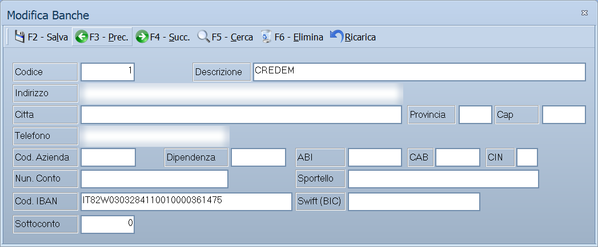

# Banche

Da questa maschera si inseriscono e si aggiornano le banche: quelle
dell'azienda, su cui si incassa e si paga, e quelle d'appoggio di clienti e
fornitori. È una tabella di base: una volta compilata, le altre maschere la
richiamano per codice.

!!! info "In sintesi"

    - **Percorso:** Menu ▸ Archivi ▸ Banche ▸ Inserimento *(oppure* Modifica*)*
    - **Scorciatoia:** nessuna; la maschera si apre dal menu o dal pulsante corrispondente nella barra degli strumenti
    - **Permessi richiesti:** nessun profilo predefinito; **Inserimento** e **Modifica** si abilitano separatamente per ogni utente da [Archivi ▸ Utenti](../anagrafiche/utenti.md)

---

## A cosa serve

La banca serve in tre punti del lavoro: come banca d'appoggio nell'anagrafica
di un cliente o di un fornitore, come banca di presentazione nelle scadenze e
negli effetti, e come conto dell'azienda in contabilità, attraverso il campo
**Sottoconto**.

Esempio: se registri qui la banca su cui presenti le RI.BA. e ne compili
**ABI**, **CAB** e **Num. Conto**, il flusso RI.BA. esce già con le coordinate
giuste, senza doverle riscrivere a ogni presentazione.

## Prerequisiti

Prima di inserire la prima banca conviene aver definito:

- il **piano dei conti**, se vuoi collegare le banche dell'azienda alla
  contabilità con il campo **Sottoconto**;
- l'archivio dei **comuni**, da cui si compilano in automatico provincia e CAP.

Nessuno dei due è obbligatorio per salvare.

## La maschera

È una maschera a finestra unica, senza schede: in alto la **barra dei
comandi**, sotto i campi, disposti su sette righe — anagrafica della banca,
recapiti, coordinate bancarie e collegamento contabile.

## Campi

| Campo | Obbl. | Descrizione | Valori ammessi |
|---|:---:|---|---|
| Codice | ● | Identificativo della banca. In inserimento il programma propone il primo codice libero; puoi sostituirlo. | Numero |
| Descrizione | ● | Denominazione della banca, come compare nelle altre maschere e nelle stampe. | Fino a 84 caratteri |
| Indirizzo | | Via e numero civico della filiale. | Fino a 30 caratteri |
| Città | | Comune della filiale. Digitando un comune presente in archivio, provincia e CAP si compilano da soli. | Fino a 30 caratteri |
| Provincia | | Sigla della provincia. | 2 caratteri |
| Cap | | Codice di avviamento postale. | Solo cifre, fino a 5 |
| Telefono | | Numero di telefono della filiale. | Fino a 13 cifre |
| Cod. Azienda | | Codice con cui la banca identifica l'azienda nei flussi telematici. | Fino a 5 caratteri |
| Dipendenza | | Codice della dipendenza presso cui è acceso il conto. | Fino a 5 caratteri |
| ABI | | Codice ABI dell'istituto. | Solo cifre, fino a 5 |
| CAB | | Codice CAB della filiale. | Solo cifre, fino a 5 |
| CIN | | Carattere di controllo delle coordinate. | 1 carattere |
| Num. Conto | | Numero di conto corrente. | Fino a 12 caratteri |
| Sportello | | Denominazione dello sportello o della filiale. | Fino a 30 caratteri |
| Cod. IBAN | | Coordinata bancaria internazionale. | Fino a 34 caratteri |
| Swift (BIC) | | Codice identificativo dell'istituto per i pagamenti esteri. | Fino a 11 caratteri |
| Sottoconto | | Sottoconto di contabilità che rappresenta questa banca. Vale per le banche dell'azienda; sulle banche d'appoggio dei clienti si lascia a zero. | Sottoconto del mastro e conto banche definiti nei dati dell'azienda |

{: .campi }

!!! note "Nota"

    Il campo **Num. Conto** accetta 12 caratteri, non 15: il limite è stato
    ridotto per rispettare il tracciato del flusso RI.BA.

## Pulsanti e comandi

| Comando | Scorciatoia | Effetto |
|---|---|---|
| **F2 - Salva** | ++f2++ | Registra la banca. In inserimento la maschera si svuota per la successiva. |
| **F3 - Prec.** | ++f3++ | Passa alla banca precedente. |
| **F4 - Succ.** | ++f4++ | Passa alla banca successiva. |
| **F5 - Cerca** | ++f5++ | Apre la finestra **Cerca Banche**. |
| **F6 - Elimina** | ++f6++ | Cancella la banca, previa conferma. |
| **Ricarica** | | Rilegge la banca dall'archivio, abbandonando le modifiche non salvate. |

Valgono inoltre:

| Comando | Scorciatoia | Effetto |
|---|---|---|
| Guida | ++f1++ | Apre la pagina di guida dell'operazione in corso. |
| Consultazione | ++f11++ | Apre la finestra **Consultazione**. |
| Calcolatrice | ++f12++ | Apre la calcolatrice. |
| Campo successivo | ++enter++ o ++down++ | Sposta il cursore sul campo seguente. |
| Campo precedente | ++up++ | Sposta il cursore sul campo precedente. |
| Chiusura | ++esc++ | Chiude la maschera. |

## Come si fa

### Inserire una nuova banca

1. Apri **Menu ▸ Archivi ▸ Banche ▸ Inserimento**.
2. Lascia il **Codice** proposto, oppure digitane uno diverso.
3. Scrivi la **Descrizione**: è l'unico altro dato che il programma pretende.
4. Compila **Città**: alla conferma del comune, **Provincia** e **Cap** si
   compilano da soli.
5. Inserisci le coordinate: **ABI**, **CAB**, **CIN**, **Num. Conto** e
   **Cod. IBAN**.
6. Premi **F2 - Salva**. La maschera si svuota per la banca successiva.

### Collegare una banca dell'azienda alla contabilità

1. Carica la banca.
2. Compila **Sottoconto** con il conto che la rappresenta nel piano dei conti.
3. Premi **F2 - Salva**. Se il sottoconto non appartiene al mastro e al conto
   delle banche impostati nei dati dell'azienda, il salvataggio si ferma con un
   messaggio.

### Ritrovare una banca

1. Premi **F5 - Cerca**.
2. Nella finestra **Cerca Banche** digita il **Codice**, il **Codice Abi-Cab**
   oppure la **Descrizione**.
3. Scegli la riga dall'elenco, che mostra codice, descrizione, indirizzo,
   città, ABI e CAB, e conferma.

## Controlli e messaggi

| Messaggio | Causa | Cosa fare |
|---|---|---|
| *(nessun messaggio, solo un segnale acustico)* | Manca il **Codice** o la **Descrizione**. | Guarda dove si è posizionato il cursore: è il campo da compilare. |
| *L' IBAN non supera il controllo del carattere di verifica: potrebbe esserci un errore di battitura. Vuoi salvare lo stesso ?* | L' **IBAN** è compilato ma non torna: quasi sempre è una cifra sbagliata o persa. Il controllo non viene fatto se il campo è vuoto. | Rileggi l' IBAN. Se sei certo che sia giusto - può capitare con banche estere - rispondi **Sì**: il salvataggio non viene impedito. |
| *Il codice del Sottoconto non è valido o disponibile.* | Il sottoconto indicato non esiste, o non appartiene al mastro e conto delle banche definiti nei dati dell'azienda. | Correggi il sottoconto, oppure lascia il campo a zero se la banca non è dell'azienda. |
| *In archivio è già presente un record con lo stesso codice.* | Il codice digitato è già di un'altra banca. | Cambia codice. |
| *Confermi la Cancellazione....* | Conferma richiesta da **F6 - Elimina**. | Rispondi **Sì** per eliminare la banca. |
| *Non è possibile eliminare il record poiché utilizzato in alcuni record del database.* | La banca è indicata in un cliente, un fornitore, un documento o una scadenza. | Non è eliminabile: lasciala in archivio. |
| *Il record è stato modificato da un altro nodo della rete.* | Un altro utente ha salvato la stessa banca mentre la modificavi. | Premi **Ricarica**, verifica cosa è cambiato e rifai le tue modifiche. |
| *Il record è stato cancellato da un altro nodo della rete.* | Un altro utente ha eliminato la banca mentre la modificavi. | La maschera si chiude: non c'è più nulla da salvare. |

## Note

!!! warning "Attenzione"

    ++esc++ chiude la maschera senza chiedere conferma e senza salvare: le
    modifiche fatte dopo l'ultimo **F2 - Salva** vanno perse.

    Cambiando le coordinate di una banca già usata, i documenti e le scadenze
    già registrati continuano a puntare a questo stesso codice: la modifica si
    riflette anche su di essi.

!!! warning "Le coordinate non vengono controllate: copiale, non ricostruirle"

    Il programma non calcola il **CIN** e non verifica l'**IBAN**: quello che
    scrivi viene registrato così com'è. Un CIN sbagliato o un IBAN a cui manca
    una cifra non fanno scattare nessun avviso qui.

    Il posto dove poi si vede sono i documenti che escono, e lì i controlli
    sono di forma, non di correttezza:

    - sulla **fattura elettronica** l'IBAN viene riportato **solo se supera i
      26 caratteri**. Uno più corto — perché incompleto, o perché è stato
      scritto solo il numero di conto — viene semplicemente **omesso, senza
      dirlo**: la fattura parte priva delle coordinate;
    - se l'IBAN contiene **spazi**, il programma avverte con *Presenza di spazi
      nell'IBAN : devono essere rimossi!* e lascia scegliere se proseguire;
    - **ABI** e **CAB** vengono riportati **solo se sono esattamente di cinque
      cifre**. Con quattro cifre, o con uno zero iniziale perso, non compaiono;
    - il **CIN** sulla fattura elettronica non viene riportato mai: serve solo
      dentro Facile.

    La regola pratica è una sola: prendere le coordinate dall'estratto conto o
    dal sito della banca e incollarle, senza spazi. Ricostruirle a memoria è il
    modo più facile per mandare fuori una fattura senza IBAN e accorgersene
    quando il cliente non paga.

!!! tip "Il controllo dell' IBAN, e cosa non controlla"

    Al salvataggio l' IBAN viene verificato con il calcolo previsto dallo
    standard (ISO 7064): prende praticamente ogni errore di battitura e
    ogni cifra persa. Il controllo vale per gli IBAN di qualunque paese,
    che hanno lunghezze diverse.

    Dice che il **numero è scritto bene**, non che sia il conto giusto:
    un IBAN valido ma di un' altra banca passa il controllo senza
    obiezioni.

!!! warning "Un IBAN incompleto non finisce nella fattura elettronica"

    Nella fattura elettronica l' IBAN viene scritto solo se è lungo almeno
    27 caratteri, che è la misura di quelli italiani. Se è più corto
    l' esportazione lo segnala e la fattura parte **senza IBAN**.

    Riguarda anche gli IBAN esteri più corti di 27 caratteri, che sono
    validi ma non vengono inseriti lo stesso.

!!! note "Il CIN e il codice SWIFT non li usa nessuno"

    **CIN** e **SWIFT** vengono salvati e rimostrati, ma nessuna parte del
    programma li consulta. Della banca si usano davvero la
    **descrizione**, **ABI**, **CAB**, il **numero di conto** e
    l' **IBAN**.

## Vedi anche

- [Tipi di pagamento](tipi-di-pagamento.md)
- [Anagrafica clienti](../anagrafiche/anagrafica-clienti.md)
- [Anagrafica fornitori](../anagrafiche/anagrafica-fornitori.md)
