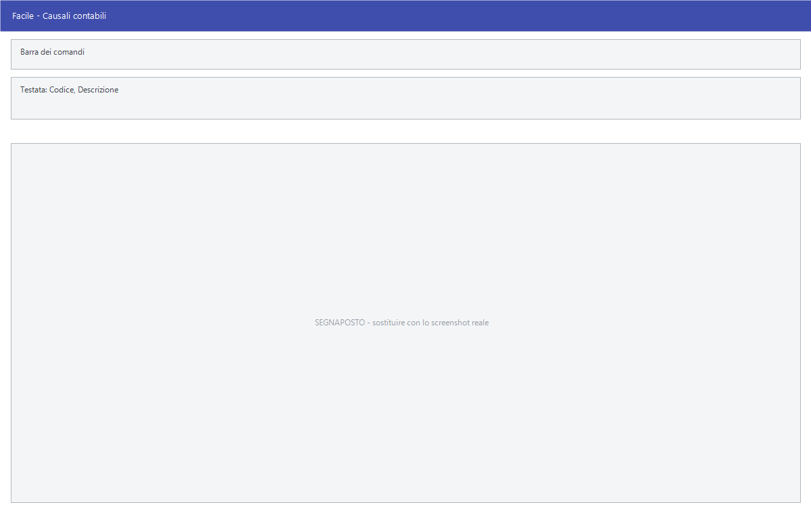

# Causali contabili

Da questa maschera si definiscono le causali contabili: la regola con cui una
registrazione di prima nota nasce. Ogni causale dice su quale registro fiscale
va l'operazione, se è soggetta a IVA, con chi ha a che fare, e quali conti
movimenta.

!!! info "In sintesi"

    **Percorso:** Menu ▸ Archivi ▸ Contabilità ▸ Causali Contabili ▸ Inserimento *(oppure* Modifica*)*
    **Scorciatoia:** nessuna; la maschera si apre dal menu
    **Permessi richiesti:** nessun profilo predefinito; **Inserimento** e **Modifica** si abilitano separatamente per ogni utente da [Archivi ▸ Utenti](../anagrafiche/utenti.md)

---

## A cosa serve

La causale contabile è la maschera che decide come si registra. Da qui
dipendono il registro IVA su cui l'operazione finisce, se il programma chiede
un cliente o un fornitore, il tipo di documento trasmesso in fattura
elettronica, e lo schema dei conti che la registrazione propone.

Esempio: la causale *FATTURA DI ACQUISTO* ha **Registro Fiscale** =
*2 - REG. ACQUISTI*, **Relazione** = *FORNITORI* e **Causale IVA** = *SI*: da
lì il programma sa che deve chiedere un fornitore, registrare l'IVA a credito e
stampare l'operazione sul registro acquisti.

È una tabella che si compila all'avvio e si tocca di rado, ma è quella su cui
poggia tutta la contabilità: una causale sbagliata manda le operazioni sul
registro sbagliato.

## Prerequisiti

Prima di definire le causali occorre aver compilato il **piano dei conti** —
[mastri](mastri.md), [conti](conti.md) e [sottoconti](sottoconti.md) — perché
lo schema di registrazione li richiama, e le **[sezioni](sezioni.md)**.

## La maschera

È una maschera a finestra unica, senza schede: in alto la **barra dei
comandi**, poi quattro righe di impostazioni, e in basso la griglia con lo
schema di registrazione.

## Campi

### Identificazione

| Campo | Obbl. | Descrizione | Valori ammessi |
|---|:---:|---|---|
| Codice | ● | Identificativo della causale. In modifica non è modificabile. | Numero |
| Descrizione | ● | Nome della causale, come compare in prima nota e nelle stampe. | Fino a 30 caratteri |
| Cod. Aggancio | | Codice con cui la causale viene riconosciuta nei tracciati esterni. | Testo breve |

{: .campi }

### Registro e relazione

| Campo | Obbl. | Descrizione | Valori ammessi |
|---|:---:|---|---|
| Registro Fiscale | | Il registro IVA su cui l'operazione viene stampata. | 1 - SOLO LIBRO GIORNALE, 2 - REG. ACQUISTI, 3 - REG. FATTURE EMESSE, 4 - REG. CORRISPETTIVI, 5 - REG. FATTURE IN SOSPENSIONE, 6 - REG. ACQUISTI CEE, 7 - REG. FATTURE EMESSE CEE |
| Codice Sezione | | Sezione contabile su cui la causale registra. | Codice dall'archivio sezioni |
| Relazione | | Con chi ha a che fare l'operazione: determina se il programma chiede un cliente, un fornitore o nessuno dei due. | CLIENTI, FORNITORI, NESSUNO |
| Richiesta Allegati su Registrazone | | Chiede di allegare un documento alla registrazione. | Casella |

{: .campi }

### Trattamento IVA

| Campo | Obbl. | Descrizione | Valori ammessi |
|---|:---:|---|---|
| Causale Libera | | La registrazione non segue lo schema fisso e i conti si scelgono di volta in volta. | NO, SI |
| Causale IVA | | L'operazione movimenta l'IVA. | NO, SI |
| Bene Dest.to Rivendita | | L'acquisto riguarda beni destinati alla rivendita. | NO, SI |
| Nota Variazione | | L'operazione è una nota di variazione. | NO, SI |
| Iva di Cassa D.L 185/2008 | | Applica il regime dell'IVA di cassa secondo il D.L. 185/2008. | Casella |
| Iva di Cassa D.L 83/2012 | | Applica il regime dell'IVA di cassa secondo il D.L. 83/2012. | Casella |
| Inc./ Pag. con Esigibilita' IVA | | L'incasso o il pagamento determina l'esigibilità dell'IVA. | Casella |
| Split Payment - IVA versata dal committente art. 17-ter D.P.R. 633/72 | | L'IVA è versata dal committente. | Casella |
| Disabilita Gestione Scadenze | | La registrazione non genera scadenze. | Casella |
| Tipo Documento | | Tipo di documento trasmesso in fattura elettronica. | (vuoto), FATTURA, NOTA DI CREDITO, NOTA DI DEBITO, FATTURA SEMPLIFICATA, NOTA DI CREDITO SEMPLIFICATA, FATTURA DI ACQUISTO INTRACOMUNITARIO BENI, FATTURA DI ACQUISTO INTRACOMUNITARIO SERVIZI e le altre voci previste dalla normativa |

{: .campi }

### Contabilità analitica

| Campo | Obbl. | Descrizione | Valori ammessi |
|---|:---:|---|---|
| Centro di Costo | | Se il centro di costo va chiesto sulla registrazione. | INVISIBILE, FACOLTATIVO, OBBLIGATORIO |
| Commessa | | Se la commessa va chiesta sulla registrazione. | INVISIBILE, FACOLTATIVO, OBBLIGATORIO |
| Dettagli | | Se il dettaglio va chiesto sulla registrazione. | INVISIBILE, FACOLTATIVO, OBBLIGATORIO |

{: .campi }

### Schema di registrazione

La griglia in basso contiene lo schema dei conti che la causale propone in
prima nota, con le colonne **Codice**, **Descrizione**, **Registro**,
**Imputazione** e **D/A** — dare o avere.

## Pulsanti e comandi

| Comando | Scorciatoia | Effetto |
|---|---|---|
| **F2 - Salva** | ++f2++ | Registra la causale. |
| **F3 - Prec.** | ++f3++ | Passa alla causale precedente. |
| **F4 - Succ.** | ++f4++ | Passa alla causale successiva. |
| **F5 - Cerca** | ++f5++ | Apre l'elenco delle causali. |
| **F6 - Elimina** | ++f6++ | Cancella la causale, previa conferma. |
| **Ricarica** | | Rilegge la causale dall'archivio, abbandonando le modifiche non salvate. |

Valgono inoltre:

| Comando | Scorciatoia | Effetto |
|---|---|---|
| Consultazione | ++f11++ | Apre la finestra **Consultazione**. |
| Calcolatrice | ++f12++ | Apre la calcolatrice. |
| Campo successivo | ++enter++ | Sposta il cursore sul campo seguente. |
| Chiusura | ++esc++ | Chiude la maschera. |

## Come si fa

### Creare una causale di acquisto

1. Apri **Menu ▸ Archivi ▸ Contabilità ▸ Causali Contabili ▸ Inserimento**.
2. Digita **Codice** e **Descrizione**, per esempio *FATTURA DI ACQUISTO*.
3. Imposta **Registro Fiscale** = *2 - REG. ACQUISTI* e **Relazione** =
   *FORNITORI*.
4. Metti **Causale IVA** = *SI*.
5. Scegli il **Tipo Documento** che corrisponde, per la fattura elettronica.
6. Compila lo schema dei conti nella griglia in basso.
7. Premi **F2 - Salva**.

### Rendere obbligatorio il centro di costo

1. Carica la causale.
2. Porta **Centro di Costo** su *OBBLIGATORIO*.
3. Premi **F2 - Salva**. Da quel momento le registrazioni con questa causale
   non si salvano senza centro di costo.

### Collegare la causale a un fornitore

Le causali di acquisto si possono indicare nell'anagrafica del fornitore, così
che le sue registrazioni nascano già con quella giusta: vedi il campo **Causale
Contab.** dell'[anagrafica fornitori](../anagrafiche/anagrafica-fornitori.md).
Il programma controlla che la causale sia di acquisto e in relazione con i
fornitori.

## Controlli e messaggi

| Messaggio | Causa | Cosa fare |
|---|---|---|
| *(nessun messaggio, solo un segnale acustico)* | Manca il **Codice** o la **Descrizione**. | Guarda dove si è posizionato il cursore: è il campo da compilare. |
| *In archivio è già presente un record con lo stesso codice.* | Il codice digitato è già di un'altra causale. | Cambia codice. |
| *Confermi la Cancellazione....* | Conferma richiesta da **F6 - Elimina**. | Rispondi **Sì** per eliminare la causale. |
| *Non è possibile eliminare il record pochè utilizzato in alcuni record del database.* | La causale è stata usata in prima nota, su documenti, o è indicata nell'anagrafica di un fornitore. | Non è eliminabile: lasciala in archivio. |
| *Il record è stato modificato da un altro nodo della rete.* | Un altro utente ha salvato la stessa causale mentre la modificavi. | Premi **Ricarica**, verifica cosa è cambiato e rifai le tue modifiche. |
| *Il record è stato cancellato da un altro nodo della rete.* | Un altro utente ha eliminato la causale mentre la modificavi. | La maschera si chiude: non c'è più nulla da salvare. |

## Note

!!! warning "Attenzione"

    Cambiare il **Registro Fiscale** di una causale già usata **non sposta le
    registrazioni già fatte**: quelle restano sul registro su cui sono nate. Se
    serve una regola diversa, conviene creare una causale nuova.

    ++esc++ chiude la maschera senza chiedere conferma e senza salvare: le
    modifiche fatte dopo l'ultimo **F2 - Salva** vanno perse.

<!-- DA VERIFICARE: la griglia dello schema di registrazione. Le colonne sono Codice, Descrizione, Registro, Imputazione e D/A, ma non è chiaro come si compilano le righe né cosa contenga Imputazione. Serve una prova sulla maschera. -->

<!-- DA VERIFICARE: la differenza fra le due caselle di IVA di cassa (D.L. 185/2008 e D.L. 83/2012) — quando si usa l'una e quando l'altra? -->

<!-- DA VERIFICARE: l'etichetta "Richiesta Allegati su Registrazone" ha un refuso (manca la "i" di Registrazione). Va corretta nel programma? -->

## Vedi anche

- [Sottoconti](sottoconti.md)
- [Sezioni](sezioni.md)
- [Anagrafica fornitori](../anagrafiche/anagrafica-fornitori.md)
