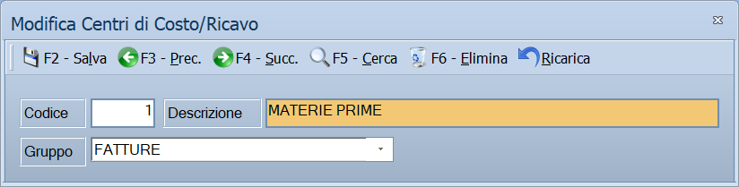

# Centri di costo/ricavo

Da questa maschera si definiscono i centri di costo e di ricavo: le voci su cui
la contabilità analitica imputa quello che si spende e quello che si guadagna.

!!! info "In sintesi"

    - **Percorso:** Menu ▸ Archivi ▸ Contabilità ▸ Centri di Costo/Ricavo ▸ Inserimento *(oppure* Modifica*)*
    - **Scorciatoia:** nessuna; la maschera si apre dal menu
    - **Permessi richiesti:** nessun profilo predefinito; **Inserimento** e **Modifica** si abilitano separatamente per ogni utente da [Archivi ▸ Utenti](../anagrafiche/utenti.md)

---

## A cosa serve

La contabilità generale dice quanto hai speso; quella analitica dice **dove**.
Il centro di costo è la voce che risponde a quel «dove»: un reparto, un
negozio, un mezzo, una linea di prodotto.

Le registrazioni di prima nota e i documenti lo richiamano; sulle causali
contabili e sui sottoconti si può stabilire che sia obbligatorio, così nessuna
spesa resta senza imputazione.

Esempio: se dividi l'azienda in *PRODUZIONE*, *COMMERCIALE* e *AMMINISTRAZIONE*
e rendi obbligatorio il centro di costo sul sottoconto delle utenze, ogni
bolletta finisce su uno dei tre.

## Prerequisiti

*Nessuno.*

## La maschera

È una maschera a finestra unica, senza schede: la **barra dei comandi** e tre
campi.

## Campi

| Campo | Obbl. | Descrizione | Valori ammessi |
|---|:---:|---|---|
| Codice | ● | Identificativo del centro. In modifica non è modificabile. | Numero |
| Descrizione | ● | Nome del centro, come compare in prima nota e nelle stampe analitiche. | Fino a 30 caratteri |
| Gruppo | | In quale delle tre voci di costo far confluire quello che passa da questo centro. | `FATTURE`, `MANODOPERA`, `ALTRO` |

{: .campi }

## Pulsanti e comandi

| Comando | Scorciatoia | Effetto |
|---|---|---|
| **F2 - Salva** | ++f2++ | Registra il centro. In inserimento la maschera si svuota per il successivo. |
| **F3 - Prec.** | ++f3++ | Passa al centro precedente. |
| **F4 - Succ.** | ++f4++ | Passa al centro successivo. |
| **F5 - Cerca** | ++f5++ | Apre l'elenco dei centri di costo. |
| **F6 - Elimina** | ++f6++ | Cancella il centro, previa conferma. |
| **Ricarica** | | Rilegge il centro dall'archivio, abbandonando le modifiche non salvate. |

Valgono inoltre:

| Comando | Scorciatoia | Effetto |
|---|---|---|
| Consultazione | ++f11++ | Apre la finestra **Consultazione**. |
| Calcolatrice | ++f12++ | Apre la calcolatrice. |
| Campo successivo | ++enter++ | Sposta il cursore sul campo seguente. |
| Chiusura | ++esc++ | Chiude la maschera. |

## Come si fa

### Creare un centro di costo

1. Apri **Menu ▸ Archivi ▸ Contabilità ▸ Centri di Costo/Ricavo ▸
   Inserimento**.
2. Digita il **Codice** e la **Descrizione**.
3. Premi **F2 - Salva**.

### Rendere obbligatorio il centro di costo su un sottoconto

1. Apri i [sottoconti](sottoconti.md) e carica quello che ti interessa.
2. Spunta **Centro di Costo Obbligatorio** e, se vuoi proporne uno, indica il
   **Cen.Costo Preferenziale**.
3. Premi **F2 - Salva**.

## Controlli e messaggi

| Messaggio | Causa | Cosa fare |
|---|---|---|
| *(nessun messaggio, solo un segnale acustico)* | Manca il **Codice** o la **Descrizione**. | Guarda dove si è posizionato il cursore: è il campo da compilare. |
| *In archivio è già presente un record con lo stesso codice.* | Il codice digitato è già di un altro centro. | Cambia codice. |
| *Confermi la Cancellazione....* | Conferma richiesta da **F6 - Elimina**. | Rispondi **Sì** per eliminare il centro. |
| *Non è possibile eliminare il record poiché utilizzato in alcuni record del database.* | Il centro è indicato su documenti, su testate o su un sottoconto. | Non è eliminabile: lascialo in archivio. |
| *Il record è stato modificato da un altro nodo della rete.* | Un altro utente ha salvato lo stesso centro mentre lo modificavi. | Premi **Ricarica**, verifica cosa è cambiato e rifai le tue modifiche. |
| *Il record è stato cancellato da un altro nodo della rete.* | Un altro utente ha eliminato il centro mentre lo modificavi. | La maschera si chiude: non c'è più nulla da salvare. |

## Note

!!! warning "Attenzione"

    Rendere obbligatorio il centro di costo vale **da quel momento in avanti**:
    le registrazioni già fatte senza imputazione restano come sono, e nelle
    stampe analitiche risulteranno non attribuite.

    ++esc++ chiude la maschera senza chiedere conferma e senza salvare: le
    modifiche fatte dopo l'ultimo **F2 - Salva** vanno perse.

!!! info "A che cosa serve il Gruppo"

    L'elenco non si può estendere: le voci sono **tre e fisse** — `FATTURE`,
    `MANODOPERA`, `ALTRO`.

    Servono al **monitoraggio della commessa**. Lì i costi presi dalla prima
    nota vengono sommati mese per mese e divisi in quelle tre voci, secondo il
    gruppo del centro di costo indicato sulla registrazione: così si legge a
    colpo d'occhio quanto di una commessa è merce e prestazioni fatturate da
    terzi, quanto è manodopera propria e quanto il resto.

    Un centro di costo a cui non è stato dato un gruppo viene conteggiato come
    **ALTRO**.

!!! note "La distinzione fra costo e ricavo non sta qui"

    Il centro di costo è solo un'etichetta: dice **a che cosa** si riferisce un
    importo, non se è un'entrata o un'uscita.

    A dirlo è il **sottoconto** movimentato nella stessa riga, che ha un suo
    tipo: *Costi* o *Ricavi*. Il monitoraggio della commessa prende i costi
    dalle righe sui sottoconti di tipo Costi e i ricavi da quelle sui
    sottoconti di tipo Ricavi.

    Per questo lo stesso centro può comparire su una riga di costo e su una di
    ricavo senza contraddizione, e per questo la maschera si chiama *Centri di
    Costo/Ricavo*.

## Vedi anche

- [Sottoconti](sottoconti.md)
- [Causali contabili](causali-contabili.md)
