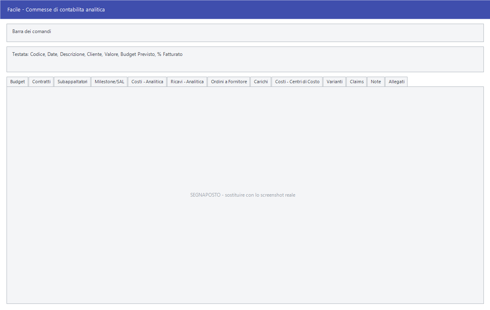

# Commesse di contabilità analitica

Da questa maschera si gestiscono le commesse: il lavoro venduto a un cliente,
con il suo valore, il budget previsto, i contratti che lo compongono, gli
avanzamenti fatturati e tutti i costi che vi si attribuiscono.

!!! info "In sintesi"

    **Percorso:** Menu ▸ Archivi ▸ Commesse di Contabilità Analitica ▸ Inserimento *(oppure* Modifica*)*
    **Scorciatoia:** nessuna; la maschera si apre dal menu
    **Permessi richiesti:** nessun profilo predefinito; **Inserimento** e **Modifica** si abilitano separatamente per ogni utente da [Archivi ▸ Utenti](../anagrafiche/utenti.md)

---

## A cosa serve

La commessa è il contenitore di un lavoro: da una parte quanto vale e quanto si
prevede di spendere, dall'altra quanto si è davvero speso e quanto si è
fatturato. È la maschera da cui si risponde alla domanda «questo lavoro sta
andando bene?».

Ci arrivano da soli, senza reinserirli, i costi registrati altrove: le
registrazioni di prima nota che portano il codice della commessa, gli ordini a
fornitore, i carichi di merce. Dal lato dei ricavi ci sono i contratti e gli
avanzamenti — i SAL — con quanto è già stato fatturato.

Esempio: una commessa da 100.000 euro con due contratti; man mano che si
emettono i SAL, la **% Fatturato** in testata dice a che punto si è, e le
schede dei costi dicono quanto è stato consumato del budget.

## Prerequisiti

Prima di aprire la prima commessa occorre l'[anagrafica del
cliente](../anagrafiche/anagrafica-clienti.md) per cui si lavora.

Servono inoltre, per le schede dei costi: i [centri di
costo](centri-di-costo.md), le [causali contabili](causali-contabili.md) su cui
la commessa sia stata resa richiedibile, e l'anagrafica dei
[fornitori](../anagrafiche/anagrafica-fornitori.md) per subappalti e ordini.

## La maschera

La maschera è divisa in tre parti:

- in alto la **barra dei comandi**, con due pulsanti in più rispetto alle altre
  maschere;
- sotto la **testata**, sempre visibile, con i dati della commessa e i tre
  totali calcolati;
- al centro le **schede**.

Le schede sono queste:

| Scheda | Contenuto |
|---|---|
| **Budget** | Le voci di budget previsto, con **Codice**, **Descrizione**, **Importo** e **Previsione**. La somma alimenta il **Budget Previsto** in testata. |
| **Contratti** | I contratti che compongono la commessa: **Codice**, **Nome Contratto**, **Importo**, **Tipo Pag.** La somma degli importi è il **Valore** della commessa. |
| **Subappaltatori** | I subappalti affidati: **Codice**, **Fornitore**, **Importo**, **Data Contratto**, **Num. Contratto**, **Data Ord.**, **Num.- Ord.**, **Attività**. |
| **Milestone/SAL** | Gli avanzamenti da fatturare, per contratto: **Codice**, **N. SAL**, **Descrizione SAL**, **Importo Fat.**, **Importo Iva**, **Importo Rit.**, **Tot. Fattura**, **Fatture**, **Data Fattura**. |
| **Costi - Analitica** | Le registrazioni di prima nota di costo attribuite alla commessa. |
| **Ricavi - Analitica** | Le registrazioni di prima nota di ricavo attribuite alla commessa. |
| **Ordini a Fornitore** | Gli ordini emessi per la commessa: **Anno**, **Numero**, **Data**, **Fornitore**, **Centro di Costo**, **Importo**, **Stato**. |
| **Carichi** | I carichi di merce sulla commessa, con deposito, documento di trasporto e fattura. |
| **Costi - Centri di Costo** | I costi raggruppati per centro di costo: **Codice**, **Descrizione**, **Importo**. |
| **Varianti** | Le varianti concordate: **Codice**, **Data**, **Descrizione**, **Importo**, **Giorni**. |
| **Claims** | Le riserve, con le stesse colonne delle varianti. |
| **Note** | Una nota libera, di lunghezza non prefissata. |
| **Allegati** | I file collegati alla commessa. |

Le schede *Contratti*, *Subappaltatori*, *Milestone/SAL*, *Varianti* e *Claims*
hanno i propri pulsanti **Nuovo**, **Modifica** ed **Elimina**; su
*Subappaltatori* c'è in più **SAL...**, e su *Costi - Centri di Costo* un
pulsante **Stampa**. Le altre schede sono di sola consultazione: raccolgono
quello che è stato registrato altrove.

## Campi

### Testata

| Campo | Obbl. | Descrizione | Valori ammessi |
|---|:---:|---|---|
| Codice | ● | Identificativo della commessa. | Numero |
| Data Apertura | ● | Data di apertura della commessa. | Data |
| Data Chiusura | | Data di chiusura. | Data |
| Data Consegna | | Data di consegna prevista o effettiva. | Data |
| Descrizione | ● | Nome della commessa, come compare nelle registrazioni e nelle stampe. | Testo |
| Cliente | | Cliente per cui si lavora. Accanto compare la ragione sociale. | Codice dall'archivio clienti |
| Valore | | **Sola lettura.** La somma degli importi dei contratti della scheda *Contratti*: non si scrive a mano. | Calcolato |
| Budget Previsto | | **Sola lettura.** La somma delle voci della scheda *Budget*. | Calcolato |
| % Fatturato | | **Sola lettura.** Quanto è stato fatturato rispetto al **Valore**. Vedi la nota qui sotto. | Calcolato |
| CIG | | Codice identificativo di gara, per i lavori pubblici. | Testo |
| CUP | | Codice unico di progetto. | Testo |
| Tecnico | | Il tecnico che segue la commessa. | Testo |
| Contatto Email | | Indirizzo di posta del referente. | Testo |

{: .campi }

!!! note "Come si calcola la % Fatturato"

    È la somma degli **Importo Fat.** degli avanzamenti, divisa per il
    **Valore** della commessa. Contano però solo gli avanzamenti legati a
    contratti con importo diverso da zero: un contratto a importo zero non
    entra nel valore, e per coerenza i suoi avanzamenti non entrano nel
    fatturato. Se il **Valore** è zero, la percentuale resta a zero.

## Pulsanti e comandi

| Comando | Scorciatoia | Effetto |
|---|---|---|
| **F2 - Salva** | ++f2++ | Registra la commessa. |
| **F3 - Prec.** | ++f3++ | Passa alla commessa precedente. |
| **F4 - Succ.** | ++f4++ | Passa alla commessa successiva. |
| **F5 - Cerca** | ++f5++ | Apre l'elenco delle commesse. |
| **F6 - Elimina** | ++f6++ | Cancella la commessa, previa conferma. |
| **Ricarica** | | Rilegge la commessa dall'archivio, abbandonando le modifiche non salvate. |
| **Piano Fatt.** | | Produce in Excel il piano di fatturazione della commessa. |
| **Monitoraggio** | | Produce in Excel il monitoraggio della commessa. |

I due pulsanti Excel sono spenti finché la commessa non è stata salvata, e
restano spenti per tutta la durata dell'elaborazione: mentre uno lavora, il
puntatore diventa una clessidra e quel pulsante non risponde. L'altro resta
disponibile.

Valgono inoltre:

| Comando | Scorciatoia | Effetto |
|---|---|---|
| Elenco valori | ++f10++, ++space++ o doppio clic su **Cliente** | Apre l'elenco dei clienti. |
| Consultazione | ++f11++ | Apre la finestra **Consultazione**. |
| Calcolatrice | ++f12++ | Apre la calcolatrice. |
| Campo successivo | ++enter++ | Sposta il cursore sul campo seguente. |
| Chiusura | ++esc++ | Chiude la maschera. |

## Come si fa

### Aprire una commessa

1. Apri **Menu ▸ Archivi ▸ Commesse di Contabilità Analitica ▸ Inserimento**.
2. Digita il **Codice**, la **Data Apertura** e la **Descrizione**: sono i tre
   dati che il programma pretende.
3. Indica il **Cliente** con ++f10++.
4. Se è un lavoro pubblico, compila **CIG** e **CUP**.
5. Premi **F2 - Salva**. Ora la commessa esiste e le schede si possono
   riempire.

### Stabilire il valore e il budget

1. Carica la commessa e apri la scheda *Contratti*.
2. Con **Nuovo** inserisci un contratto per volta, con il suo **Importo**: il
   campo **Valore** in testata si aggiorna da solo mentre lavori.
3. Passa alla scheda *Budget* e inserisci le voci di costo previste: la loro
   somma diventa il **Budget Previsto** in testata.
4. Premi **F2 - Salva**.

### Registrare un avanzamento

1. Carica la commessa e apri la scheda *Milestone/SAL*.
2. Premi **Nuovo** e compila il SAL, indicando il contratto a cui appartiene e
   l'**Importo Fat.**
3. Alla conferma, la **% Fatturato** in testata si aggiorna da sola.

### Vedere come sta andando la commessa

1. Carica la commessa.
2. Leggi in testata **Valore**, **Budget Previsto** e **% Fatturato**.
3. Apri le schede dei costi — *Costi - Analitica*, *Ordini a Fornitore*,
   *Carichi*, *Costi - Centri di Costo* — per vedere dove il budget si sta
   consumando.
4. Premi **Monitoraggio** per averne il quadro in Excel.

### Produrre il piano di fatturazione

1. Carica la commessa: dev'essere già salvata, altrimenti il pulsante è spento.
2. Premi **Piano Fatt.**
3. Attendi che la clessidra sparisca: l'elaborazione produce il file Excel.

## Controlli e messaggi

| Messaggio | Causa | Cosa fare |
|---|---|---|
| *(nessun messaggio, solo un segnale acustico)* | Manca il **Codice**, la **Data Apertura** o la **Descrizione**. | Guarda dove si è posizionato il cursore: è il campo da compilare. |
| *In archivio è già presente un record con lo stesso codice.* | Il codice digitato è già di un'altra commessa. | Cambia codice. |
| *Confermi la Cancellazione....* | Conferma richiesta da **F6 - Elimina**. | Rispondi **Sì** per eliminare la commessa. |
| *Non è possibile eliminare il record pochè utilizzato in alcuni record del database.* | La commessa compare su documenti, righe di documento, movimenti di magazzino o nello storico. | Non è eliminabile: lasciala in archivio. |
| *Il record è stato modificato da un altro nodo della rete.* | Un altro utente ha salvato la stessa commessa mentre la modificavi. | Premi **Ricarica**, verifica cosa è cambiato e rifai le tue modifiche. |
| *Il record è stato cancellato da un altro nodo della rete.* | Un altro utente ha eliminato la commessa mentre la modificavi. | La maschera si chiude: non c'è più nulla da salvare. |

## Note

!!! warning "Attenzione"

    **Valore**, **Budget Previsto** e **% Fatturato** non si scrivono: sono
    calcolati dalle schede *Contratti* e *Budget* e dagli avanzamenti. Per
    cambiare il valore della commessa si interviene sui contratti, non sulla
    testata.

    Le schede dei costi raccolgono quello che è stato registrato **altrove**
    indicando il codice della commessa: se un costo non compare, non è la
    commessa a essere sbagliata, è la registrazione che non le è stata
    attribuita.

    ++esc++ chiude la maschera senza chiedere conferma e senza salvare: le
    modifiche fatte dopo l'ultimo **F2 - Salva** vanno perse.

<!-- DA VERIFICARE: dove finiscono i due file Excel di Piano Fatt. e Monitoraggio — cartella, nome del file, e se si aprono da soli. Dal codice non risulta alcun messaggio a fine elaborazione. -->

<!-- DA VERIFICARE: il pulsante SAL... sulla scheda Subappaltatori apre una maschera a sé (avanzamenti del subappalto). Va documentata separatamente? -->

<!-- DA VERIFICARE: la differenza operativa fra Varianti e Claims. Le due schede hanno le stesse colonne e la stessa maschera: cosa distingue le une dagli altri nell'uso. -->

<!-- DA VERIFICARE: nella scheda Carichi una colonna si legge "Nnum. Fat." (refuso per "Num. Fat."). Va corretta nel programma? -->

## Vedi anche

- [Centri di costo/ricavo](centri-di-costo.md)
- [Causali contabili](causali-contabili.md)
- [Anagrafica clienti](../anagrafiche/anagrafica-clienti.md)
