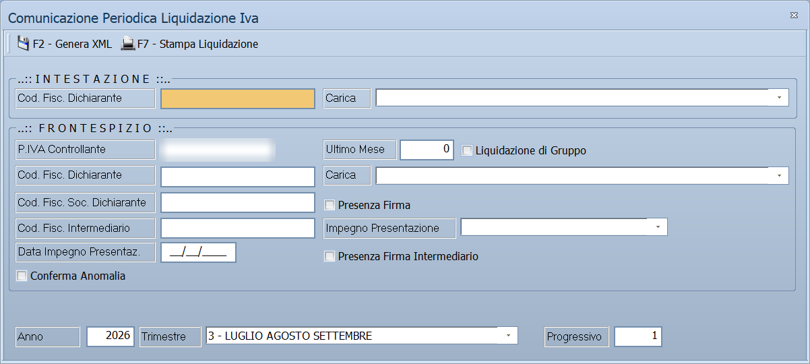

# Comunicazioni IVA

Il sottomenu **Comunicazione Operazioni IVA** produce i file da trasmettere
all'Agenzia delle Entrate, più la tabella delle aggregazioni che serve a
raggruppare le operazioni sotto soglia.

!!! info "In sintesi"

    - **Percorso:** Menu ▸ Contabilità ▸ Comunicazione Operazioni IVA ▸ Comunicazione Trimestrale Operazioni IVA *(oppure* Comunicazioni Fatture Emesse(DTE) / Ricevute (DTR)*,* Spesometro*,* Gestione Aggregazioni*)*
    - **Scorciatoia:** ++f2++ avvia, ++esc++ esce
    - **Permessi richiesti:** nessun profilo predefinito; le singole voci di menu si abilitano per ogni utente da [Archivi ▸ Utenti](../anagrafiche/utenti.md)

---

## A cosa serve

| Voce di menu | A cosa serve |
|---|---|
| **Comunicazione Trimestrale Operazioni IVA** | Produce il file della comunicazione trimestrale delle liquidazioni. |
| **Comunicazioni Fatture Emesse(DTE) / Ricevute (DTR)** | Produce il file dei dati delle fatture emesse e ricevute. La finestra si chiama *Trasmisione Dati Fatture Emesse/Ricevute*. |
| **Spesometro** | La comunicazione delle operazioni rilevanti. |
| **Gestione Aggregazioni** | La tabella con cui si raggruppano le operazioni di uno stesso soggetto per il controllo delle soglie. |

## Prerequisiti

Prima di usare queste maschere occorre:

- avere registrato tutta la [prima nota](registrazione-prima-nota.md) del
  periodo, e aver chiuso le
  [liquidazioni](liquidazione-iva.md);
- avere **partita IVA e codice fiscale completi** su clienti e fornitori: sono
  i dati che la comunicazione trasmette, e quelli mancanti diventano
  segnalazioni di errore;
- avere il codice fiscale di chi firma la comunicazione.

## La maschera

Sono finestre di selezione che producono un file. **Spesometro** e **Gestione
Aggregazioni** hanno una forma propria.

## Campi

### Comunicazioni Fatture Emesse (DTE) / Ricevute (DTR)

| Campo | Obbl. | Descrizione | Valori ammessi |
|---|:---:|---|---|
| **Cod. Fisc. Dichiarante** | ● | Il codice fiscale di chi trasmette. | codice fiscale |
| **Carica** | | La carica rivestita dal dichiarante, secondo la codifica dell'Agenzia. Quindici voci, da `01 - Rappresentante legale, negoziale o di fatto, socio amministratore` a `15 - Commissario liquidatore di una pubblica amministrazione`, più la voce vuota. | vedi elenco |
| **Anno** | ● | L'anno di riferimento. | anno |
| **Periodo** | ● | Il periodo da comunicare. | periodo |
| *(elenco senza etichetta)* | ● | Quali fatture comunicare. | `EMESSE`, `RICEVUTE` |

{: .campi }

### Gestione Aggregazioni

| Campo | Obbl. | Descrizione | Valori ammessi |
|---|:---:|---|---|
| **Codice** | ● | Identificativo dell'aggregazione. | numero |
| **Descrizione** | ● | Nome dell'aggregazione. | testo |
| **Anno Apertura**, **Anno Chiusura** | | Il periodo di validità. | anni |
| **Cliente / Fornitore** | ● | Il soggetto a cui l'aggregazione si riferisce. | codice |
| **Controllo Soglia** | | Se sottoporre l'aggregazione al controllo della soglia. | attivo/non attivo |

{: .campi }

## Pulsanti e comandi

| Comando | Scorciatoia | Effetto |
|---|---|---|
| **F2 - Salva** o **F2 - OK** | ++f2++ | Registra, oppure avvia la produzione del file. |
| **Esci** | ++esc++ | Chiude senza fare nulla. |
| Elenco di scelta | ++f10++ o ++space++ | Sul campo con il codice, apre l'elenco da cui scegliere. |
| **Calcolatrice** | ++f12++ | Apre la calcolatrice. |
| **Consultazione** | ++f11++ | Apre la consultazione. |

## Come si fa

### Produrre il file dei dati fatture

1. Chiudi le [liquidazioni](liquidazione-iva.md) del periodo.
2. Apri **Menu ▸ Contabilità ▸ Comunicazione Operazioni IVA ▸ Comunicazioni
   Fatture Emesse(DTE) / Ricevute (DTR)**.
3. Compila **Cod. Fisc. Dichiarante**, **Anno** e **Periodo**.
4. Scegli se comunicare le fatture `EMESSE` o `RICEVUTE`.
5. Premi **F2 - OK**. Se compaiono segnalazioni di errore, guardale: sono
   nominativi con dati fiscali incompleti.

### Escludere una registrazione dalla comunicazione

Sulla [registrazione di prima nota](registrazione-prima-nota.md) attiva la
casella **Escludi da Spesometro**.

## Controlli e messaggi

| Messaggio | Causa | Cosa fare |
|---|---|---|
| *Ci sono segnalazioni di errore!* / *Le vuoi visualizzare ?* | La comunicazione ha trovato dati incompleti. | **Sì** per vedere quali nominativi vanno corretti. |
| *Ci sono ancora segnalazioni di errore!* / *Vuoi continuare ?* | Restano errori non corretti. | **No** e correggi prima i dati. |

## Note

!!! warning "I dati fiscali incompleti fermano la comunicazione"

    Un cliente senza partita IVA o senza codice fiscale è una segnalazione di
    errore. Conviene passarli in rassegna prima, con la stampa
    `RICHIESTA DATI FISCALI` delle
    [stampe clienti](../anagrafiche/stampe-clienti.md) e
    [fornitori](../anagrafiche/stampe-fornitori.md).

!!! note "Adempimenti che cambiano nel tempo"

    Queste comunicazioni seguono la normativa, che negli anni è cambiata più
    volte: alcune delle voci di menu possono riferirsi ad adempimenti non più
    in vigore. Verifica con il commercialista quale ti serve davvero.

<!-- DA CHIEDERE ALL'AUTORE: quali di questi adempimenti siano ancora in vigore e quali restino solo per gli anni pregressi. Non e' deducibile dal codice: e' materia fiscale. Quello che il codice dice e' nella nota qui sotto. -->

!!! note "Quello che il programma sa degli anni"

    La **Comunicazione Dati Fatture** parte dal **2017**: su un esercizio
    precedente la maschera avverte e si chiude.

    Il **periodo** cambia forma con l'anno: per il 2017 sono due semestri, dal
    2018 quattro trimestri più i due semestri.

    Lo **Spesometro** porta le soglie di ogni annata: **25.000 € nel 2010**,
    **3.000 € dal 2011** (con **3.600 €** per i corrispettivi), e **dal 2012 in
    poi nessuna soglia sulle fatture**, restando 3.600 € sui corrispettivi.

!!! warning "L'elenco *Carica* si riempie all'apertura"

    Non è scritto nelle risorse, quindi non si vede aprendo la maschera nel
    designer: il programma lo costruisce ogni volta. Sono le quindici cariche
    della codifica dell'Agenzia — rappresentante legale, curatore fallimentare,
    commissario liquidatore, erede, amministratore di condominio e le altre —
    più una voce vuota, che è quella giusta quando dichiara il titolare stesso.

!!! tip "Dove finisce il file"

    Nella cartella **`out`** dell'utente — la stessa da cui parte la finestra di
    salvataggio quando si esporta. È l'unica cartella coinvolta: da lì il file si
    prende per darlo all'intermediario o caricarlo sul sito dell'Agenzia.

!!! info "La soglia, e a che cosa servono le aggregazioni"

    La soglia è quella dell'annata: **25.000 € per il 2010**, **3.000 € dal
    2011**, **nessuna dal 2012**; per i **corrispettivi** resta **3.600 €**.

    Le aggregazioni servono quando lo stesso soggetto è in archivio più volte —
    come cliente e come fornitore, o con più codici. Raggruppandolo, le sue
    operazioni si sommano **prima** del confronto con la soglia, invece di
    restare sotto ciascuna per conto propria. La casella **Controllo Soglia**
    decide se quell'aggregazione partecipa al confronto.

### Spesometro

La finestra è fatta di una **griglia sola**, riempita premendo *Calcola*:
non ha campi di selezione propri. Ogni riga è un soggetto con le sue
operazioni, e porta:

- la **spunta** con cui si sceglie che cosa comunicare;
- **codice**, **descrizione**, **indirizzo**, **nazione**, **partita IVA** e
  **codice fiscale** del soggetto, e se è **persona fisica**;
- **imponibile**, **imposta** e **totale**;
- **data**, **numero** e **data** del documento, il **tipo**, il **pagamento**
  e lo **stato**;
- numero e data del **documento accompagnatorio**, quando c'è.

| Comando | Scorciatoia | Effetto |
|---|---|---|
| **F2 - Calcola** | ++f2++ | Riempie la griglia con le operazioni del periodo. |
| **F3 - File Agenzia** | ++f3++ | Produce il file da trasmettere. |
| **F4 - Esporta** | ++f4++ | Esporta la griglia su foglio. |
| **F5 - Cliente** | ++f5++ | Apre il cliente della riga. |
| **F6 - Prima Nota** | ++f6++ | Apre la registrazione da cui la riga viene. |
| **F7 - Aggregaz.** | ++f7++ | Apre l'aggregazione del soggetto. |
| **F8 - Accoppia** | ++f8++ | Accoppia le operazioni fra loro. |

!!! note "Senza periodo non calcola"

    Premendo *Calcola* senza aver scelto il periodo risponde *« Selezionare il
    periodo! »*.

## Vedi anche

- [Liquidazione IVA e ventilazione](liquidazione-iva.md)
- [Registrazione di prima nota](registrazione-prima-nota.md)
- [Fatture elettroniche passive](fatture-elettroniche-passive.md)
