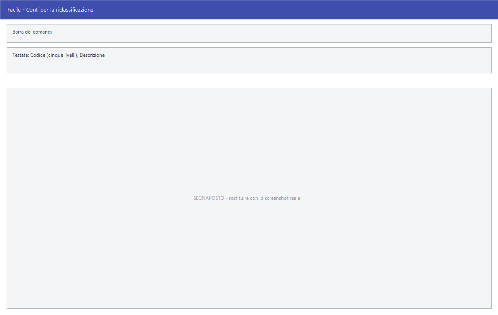

# Conti per la riclassificazione

Da questa maschera si definiscono i conti di riclassificazione: le voci con cui
si raggruppano i sottoconti per ottenere un bilancio riclassificato, diverso da
come il piano dei conti è organizzato.

!!! info "In sintesi"

    - **Percorso:** Menu ▸ Archivi ▸ Contabilità ▸ Conti per la Riclassificazione ▸ Inserimento *(oppure* Modifica *o* Riclassificazione*)*
    - **Scorciatoia:** nessuna; la maschera si apre dal menu
    - **Permessi richiesti:** nessun profilo predefinito; **Inserimento** e **Modifica** si abilitano separatamente per ogni utente da [Archivi ▸ Utenti](../anagrafiche/utenti.md)

---

## A cosa serve

Il piano dei conti è organizzato come serve alla registrazione quotidiana; il
bilancio riclassificato è organizzato come serve a leggere l'andamento
dell'azienda. Le due cose raramente coincidono.

I conti di riclassificazione sono lo schema alternativo: si definiscono qui, si
agganciano ai [sottoconti](sottoconti.md) nel campo **Riclassificazione**, e da
lì le stampe riclassificate leggono i saldi.

Il codice è composto da **cinque numeri**, che formano i livelli dello schema.

## Prerequisiti

*Nessuno.* Conviene però avere già il piano dei conti, perché lo schema va
disegnato sapendo cosa ci si aggancerà.

## La maschera

È una maschera a finestra unica, senza schede: la **barra dei comandi**, le
cinque caselle del codice affiancate e la descrizione.

## Campi

| Campo | Obbl. | Descrizione | Valori ammessi |
|---|:---:|---|---|
| Codice | ● | Il codice del conto riclassificato, su cinque caselle affiancate: sono i livelli dello schema, dal più generale al più particolare. | Cinque numeri |
| Descrizione | ● | Nome della voce, come compare nelle stampe riclassificate. | Testo |

{: .campi }

## Pulsanti e comandi

| Comando | Scorciatoia | Effetto |
|---|---|---|
| **F2 - Salva** | ++f2++ | Registra la voce. In inserimento la maschera si svuota per la successiva. |
| **F3 - Prec.** | ++f3++ | Passa alla voce precedente. |
| **F4 - Succ.** | ++f4++ | Passa alla voce successiva. |
| **F5 - Cerca** | ++f5++ | Apre l'elenco dei conti di riclassificazione. |
| **F6 - Elimina** | ++f6++ | Cancella la voce, previa conferma. |
| **Ricarica** | | Rilegge la voce dall'archivio, abbandonando le modifiche non salvate. |

Valgono inoltre:

| Comando | Scorciatoia | Effetto |
|---|---|---|
| Consultazione | ++f11++ | Apre la finestra **Consultazione**. |
| Calcolatrice | ++f12++ | Apre la calcolatrice. |
| Campo successivo | ++enter++ | Sposta il cursore sulla casella seguente. |
| Chiusura | ++esc++ | Chiude la maschera. |

## Come si fa

### Creare una voce di riclassificazione

1. Apri **Menu ▸ Archivi ▸ Contabilità ▸ Conti per la Riclassificazione ▸
   Inserimento**.
2. Compila le cinque caselle del **Codice**, dal livello più generale al più
   particolare.
3. Scrivi la **Descrizione**.
4. Premi **F2 - Salva**.

### Ritrovare e modificare una voce

1. Apri **Menu ▸ Archivi ▸ Contabilità ▸ Conti per la Riclassificazione ▸
   Modifica**. La maschera non si apre vuota: mostra già la **prima voce** in
   ordine di codice.
2. Premi **F5 - Cerca** e scegli la voce dall'elenco, oppure scorri con **F3 -
   Prec.** e **F4 - Succ.**.
3. Correggi i campi e premi **F2 - Salva**. La scheda resta a video su quello
   appena registrato; in inserimento invece si svuota per il successivo.

Finché non salvi puoi tornare indietro con **Ricarica**, che rilegge la voce
dall'archivio e abbandona le modifiche non salvate. Se l'archivio è ancora
vuoto la voce **Modifica** non apre nulla e non dà alcun messaggio.

### Agganciare un sottoconto alla riclassificazione

1. Apri i [sottoconti](sottoconti.md) e carica quello che ti interessa.
2. Compila i codici di **Riclassificazione**: accanto compare la descrizione
   della voce, che conferma la scelta.
3. Premi **F2 - Salva**.

### Agganciare molti conti in una volta

La terza voce di menu, **Riclassificazione**, apre la finestra
*Riclassificazione Conti*: una griglia con tutto il piano dei conti —
**Mas**, **Con**, **Sot**, **Descrizione**, **Tipo** — e accanto le cinque
caselle **Cod-1** … **Cod-5** della voce di riclassificazione.

1. Apri **Menu ▸ Archivi ▸ Contabilità ▸ Conti per la Riclassificazione ▸
   Riclassificazione**.
2. Scorri la griglia e compila i cinque codici sulle righe da agganciare.
3. È l'alternativa più rapida ad aprire i sottoconti uno per uno.

## Controlli e messaggi

| Messaggio | Causa | Cosa fare |
|---|---|---|
| *(nessun messaggio, solo un segnale acustico)* | Manca il **Codice** o la **Descrizione**. | Guarda dove si è posizionato il cursore: è il campo da compilare. |
| *In archivio è già presente un record con lo stesso codice.* | La combinazione di cinque numeri digitata esiste già. | Cambia uno dei cinque livelli. |
| *Confermi la Cancellazione....* | Conferma richiesta da **F6 - Elimina**. | Rispondi **Sì** per eliminare la voce. |
| *Non è possibile eliminare il record pochè utilizzato in alcuni record del database.* | La voce è agganciata a dei sottoconti. | Non è eliminabile: prima togli l'aggancio dai sottoconti che la usano. |
| *Il record è stato modificato da un altro nodo della rete.* | Un altro utente ha salvato la stessa voce mentre la modificavi. | Premi **Ricarica**, verifica cosa è cambiato e rifai le tue modifiche. |
| *Il record è stato cancellato da un altro nodo della rete.* | Un altro utente ha eliminato la voce mentre la modificavi. | La maschera si chiude: non c'è più nulla da salvare. |

## Note

!!! warning "Attenzione"

    Lo schema di riclassificazione è indipendente dal piano dei conti: cambiarlo
    non tocca le registrazioni, cambia solo come i saldi vengono raggruppati
    nelle stampe riclassificate.

    ++esc++ chiude la maschera senza chiedere conferma e senza salvare: le
    modifiche fatte dopo l'ultimo **F2 - Salva** vanno perse.

<!-- DA VERIFICARE: le cinque caselle del codice vanno compilate tutte, o si lasciano a zero i livelli non usati? E come si costruisce un livello intermedio che raggruppa quelli sotto? -->

<!-- DA VERIFICARE: se la griglia della finestra Riclassificazione Conti salvi a ogni cella confermata, come le altre griglie del programma. -->

## Vedi anche

- [Sottoconti](sottoconti.md)
- [Mastri](mastri.md)
