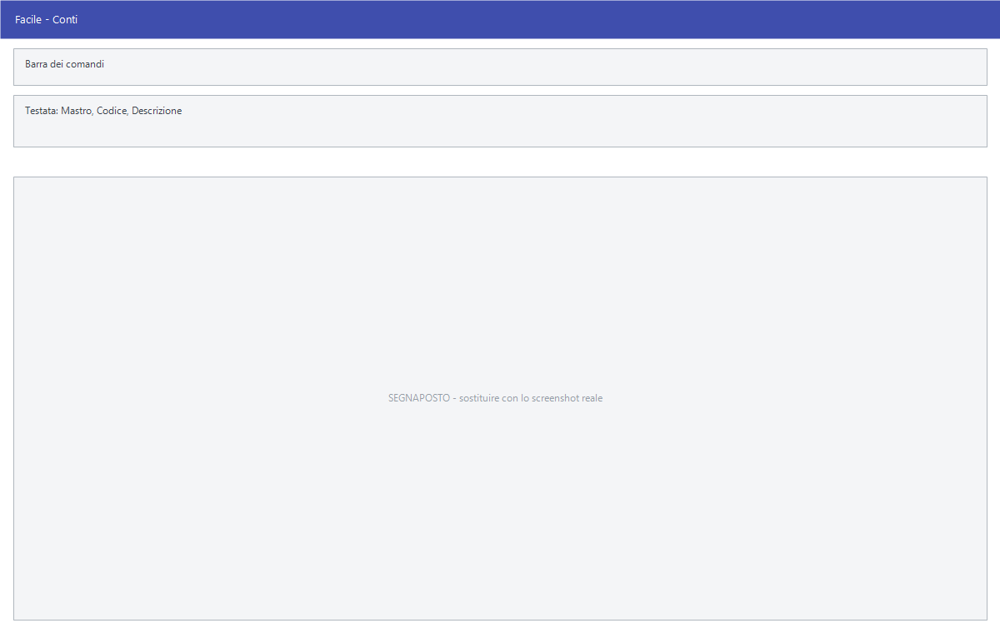

# Conti

Da questa maschera si definiscono i conti: il secondo dei tre livelli del piano
dei conti. Ogni conto appartiene a un [mastro](mastri.md) e raccoglie dei
[sottoconti](sottoconti.md).

!!! info "In sintesi"

    **Percorso:** Menu ▸ Archivi ▸ Contabilità ▸ Conti ▸ Inserimento *(oppure* Modifica*)*
    **Scorciatoia:** nessuna; la maschera si apre dal menu
    **Permessi richiesti:** nessun profilo predefinito; **Inserimento** e **Modifica** si abilitano separatamente per ogni utente da [Archivi ▸ Utenti](../anagrafiche/utenti.md)

---

## A cosa serve

Il conto è il livello intermedio del piano dei conti: sotto il mastro
*FORNITORI* stanno i conti che dividono i fornitori per tipo, e sotto ciascun
conto i singoli sottoconti.

Il codice di un conto è unico **dentro il suo mastro**: due mastri diversi
possono avere conti con lo stesso numero.

## Prerequisiti

Prima di creare un conto occorre aver definito il **[mastro](mastri.md)** a cui
appartiene.

## La maschera

È una maschera a finestra unica: in alto la **barra dei comandi**, poi il
mastro di appartenenza, il codice e la descrizione del conto, e sotto la
griglia dei saldi.

## Campi

| Campo | Obbl. | Descrizione | Valori ammessi |
|---|:---:|---|---|
| Mastro | ● | Mastro a cui il conto appartiene. Accanto compare la sua descrizione. | Codice dall'archivio mastri |
| Codice | ● | Identificativo del conto dentro il mastro. In modifica non è modificabile. | Numero |
| Descrizione | ● | Nome del conto, come compare nel piano dei conti e nelle stampe. | Fino a 30 caratteri |

{: .campi }

La griglia in basso non si compila: mostra i saldi del conto con le colonne
**Sezione**, **Anno**, **Dare**, **Avere** e **Saldo**.

## Pulsanti e comandi

| Comando | Scorciatoia | Effetto |
|---|---|---|
| **F2 - Salva** | ++f2++ | Registra il conto. In inserimento la maschera si svuota per il successivo. |
| **F3 - Prec.** | ++f3++ | Passa al conto precedente. |
| **F4 - Succ.** | ++f4++ | Passa al conto successivo. |
| **F5 - Cerca** | ++f5++ | Apre l'elenco dei conti. |
| **F6 - Elimina** | ++f6++ | Cancella il conto, previa conferma. |
| **Ricarica** | | Rilegge il conto dall'archivio, abbandonando le modifiche non salvate. |

Valgono inoltre:

| Comando | Scorciatoia | Effetto |
|---|---|---|
| Consultazione | ++f11++ | Apre la finestra **Consultazione**. |
| Calcolatrice | ++f12++ | Apre la calcolatrice. |
| Campo successivo | ++enter++ | Sposta il cursore sul campo seguente. |
| Chiusura | ++esc++ | Chiude la maschera. |

## Come si fa

### Creare un conto

1. Apri **Menu ▸ Archivi ▸ Contabilità ▸ Conti ▸ Inserimento**.
2. Indica il **Mastro** a cui il conto appartiene: accanto compare la sua
   descrizione, così controlli di non aver sbagliato.
3. Digita il **Codice** e la **Descrizione** del conto.
4. Premi **F2 - Salva**.

### Controllare il saldo di un conto

1. Premi **F5 - Cerca** e carica il conto.
2. Leggi la griglia in basso: una riga per sezione e per anno.

## Controlli e messaggi

| Messaggio | Causa | Cosa fare |
|---|---|---|
| *(nessun messaggio, solo un segnale acustico)* | Manca il **Mastro**, il **Codice** o la **Descrizione**. | Guarda dove si è posizionato il cursore: è il campo da compilare. |
| *In archivio è già presente un record con lo stesso codice.* | Nel mastro indicato c'è già un conto con quel codice. | Cambia codice, oppure verifica di aver indicato il mastro giusto. |
| *Confermi la Cancellazione....* | Conferma richiesta da **F6 - Elimina**. | Rispondi **Sì** per eliminare il conto. |
| *Non è possibile eliminare il record pochè utilizzato in alcuni record del database.* | Sotto il conto ci sono dei sottoconti, oppure il conto è indicato in una causale contabile. | Non è eliminabile: prima svuotalo. |
| *Il record è stato modificato da un altro nodo della rete.* | Un altro utente ha salvato lo stesso conto mentre lo modificavi. | Premi **Ricarica**, verifica cosa è cambiato e rifai le tue modifiche. |
| *Il record è stato cancellato da un altro nodo della rete.* | Un altro utente ha eliminato il conto mentre lo modificavi. | La maschera si chiude: non c'è più nulla da salvare. |

## Note

!!! warning "Attenzione"

    Il codice di un conto vale **dentro il suo mastro**: per identificarlo
    servono sempre due numeri, mastro e conto. Nelle altre maschere di Facile
    i conti si indicano sempre in coppia.

    ++esc++ chiude la maschera senza chiedere conferma e senza salvare: le
    modifiche fatte dopo l'ultimo **F2 - Salva** vanno perse.

## Vedi anche

- [Mastri](mastri.md)
- [Sottoconti](sottoconti.md)
- [Causali contabili](causali-contabili.md)
