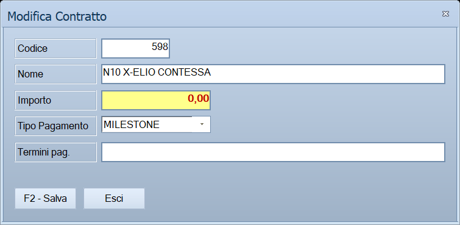

# Contratto

Registra **un contratto della commessa**: come si chiama, quanto vale, se si
incassa a milestone o a stati avanzamento, e con quali termini di pagamento.
Si apre dalla scheda *Contratti* della commessa.

!!! info "In sintesi"

    - **Percorso:** Menu ▸ Archivi ▸ Commesse di Contabilità Analitica ▸ scheda **Contratti** ▸ **Nuovo** *(oppure* **Modifica***)*
    - **Scorciatoia:** ++f2++ salva, ++esc++ esce
    - **Permessi richiesti:** quelli della [commessa](commesse.md) da cui si apre; non ha un profilo suo

---

## A cosa serve

Una commessa può essere venduta con più contratti. La somma dei loro importi
è il **Valore** della commessa, quello che compare in testata e su cui si
calcola la percentuale fatturato.

Il contratto decide anche **come** si fattura: scegliendo *MILESTONE* gli
avanzamenti si registrano a stati concordati, con una percentuale del
contratto ciascuno; scegliendo *SAL* si registrano a stato avanzamento lavori.
La scelta cambia il nome dei comandi e dei campi nella scheda *Milestone/SAL*,
quindi conviene farla subito e non cambiarla a lavoro avviato.

## Prerequisiti

Prima di usare questa maschera occorre avere la **commessa** già salvata: la
finestra si apre dalla sua scheda.

## La maschera

Una finestra sola, piccola, senza schede: cinque campi incolonnati e i due
pulsanti in fondo.

## Campi

| Campo | Obbl. | Descrizione | Valori ammessi |
|---|:---:|---|---|
| **Codice** | | **Sola lettura.** Lo assegna il programma. | Numero |
| **Nome** | ● | Come si chiama il contratto. Viene portato **in maiuscolo** mentre lo scrivi. | Fino a 255 caratteri |
| **Importo** | | Il valore del contratto, in evidenza su fondo colorato. Entra nel **Valore** della commessa. | Numero con decimali |
| **Tipo Pagamento** | | Come si fattura il contratto. | **MILESTONE** o **SAL** |
| **Termini pag.** | | I termini di pagamento concordati, in forma libera. Viene portato **in maiuscolo**. | Fino a 100 caratteri |

La colonna **Obbl.** segna con ● i campi che il programma richiede per
salvare: qui è **solo il nome**.

## Pulsanti e comandi

| Comando | Scorciatoia | Effetto |
|---|---|---|
| **F2 - Salva** | ++f2++ | Registra il contratto e chiude la finestra. La riga compare — o si aggiorna — nella scheda *Contratti*. |
| **Esci** | ++esc++ | Chiude senza salvare niente. |
| Consultazione | ++f11++ | Apre la finestra **Consultazione**. |
| Calcolatrice | ++f12++ | Apre la calcolatrice. |
| Campo successivo | ++enter++ o ++down++ | Sposta il cursore sul campo seguente. |
| Campo precedente | ++up++ | Torna al campo precedente. |

## Come si fa

### Registrare un contratto

1. Apri la commessa e vai sulla scheda **Contratti**.
2. Premi **Nuovo**: si apre la finestra con il **Codice** già assegnato e il
   cursore sul nome.
3. Scrivi il **Nome** e l'**Importo**.
4. Scegli il **Tipo Pagamento**: *MILESTONE* o *SAL*.
5. Se servono, scrivi i **Termini pag.**
6. Premi **F2 - Salva**. La finestra si chiude, la riga è nell'elenco e il
   **Valore** in testata alla commessa si aggiorna.

### Correggere un contratto

1. Sulla scheda **Contratti** seleziona la riga e premi **Modifica**.
2. Si apre la stessa finestra, con i dati compilati e il **Codice** che non
   cambia.
3. Correggi quello che serve e premi **F2 - Salva**.

## Controlli e messaggi

Non applicabile: la maschera non mostra messaggi. Gli unici controlli sono
silenziosi e si segnalano con un segnale acustico — vedi le note.

## Note

!!! warning "Senza nome il salvataggio non avviene, e non lo dice"

    Premendo **F2 - Salva** con il campo **Nome** vuoto, il programma emette
    un **segnale acustico** e riporta il cursore su quel campo: non compare
    nessun messaggio e la finestra resta aperta.

!!! note "Il tipo di pagamento cambia il nome di quello che viene dopo"

    Sulla scheda *Milestone/SAL* gli avanzamenti di un contratto a
    **MILESTONE** si chiamano *Milestone* e hanno in più il campo
    **Percentuale**; quelli di un contratto a **SAL** si chiamano *SAL* e la
    percentuale non compare.

    È la sola differenza fra i due, ma cambia le finestre che vedrai: deciderlo
    dopo aver già registrato degli avanzamenti crea solo confusione.

## Vedi anche

- [Commesse di Contabilità Analitica](commesse.md)
- [Avanzamento lavori](avanzamento.md)
