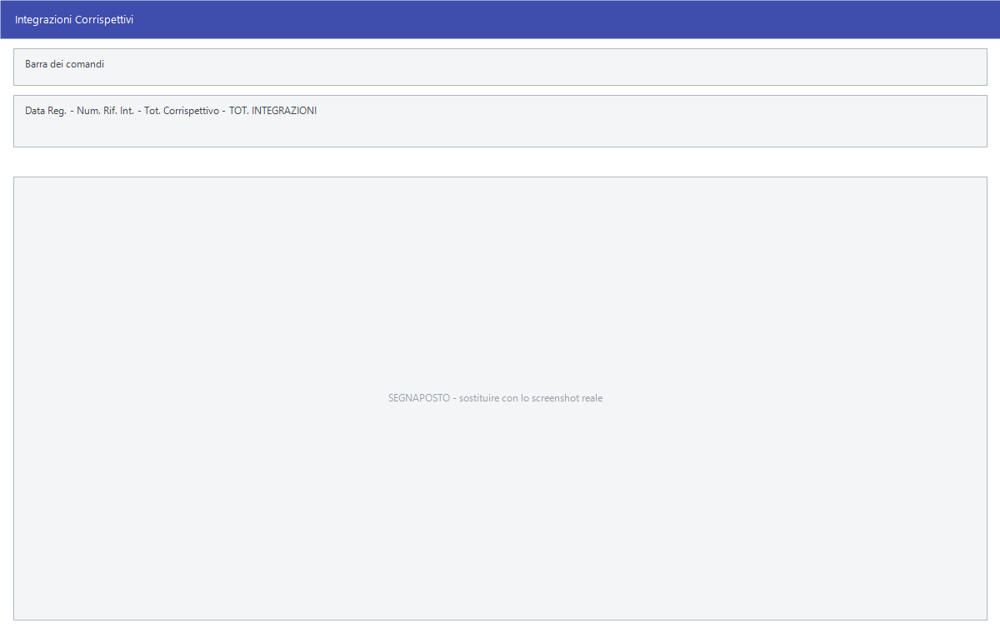

# Integrazioni, operazioni speciali e cointestatari

Tre gestioni che servono a completare quello che la prima nota da sola non
registra: chi ha pagato un corrispettivo sopra soglia, le operazioni che non
passano dai registri ordinari, e i soggetti cointestatari di una fattura.

!!! info "In sintesi"

    - **Percorso:**
        - Menu ▸ Contabilità ▸ Dettagli Corrispettivi ▸ Integrazioni *(oppure* Stampa*)*
        - Menu ▸ Contabilità ▸ Operazioni Speciali ▸ Inserimento *(oppure* Modifica *o* Stampa*)*
        - Menu ▸ Contabilità ▸ Cointestatari Fatture ▸ Gestione *(oppure* Stampa*)*
    - **Scorciatoia:** ++f2++ salva o avvia, ++esc++ esce
    - **Permessi richiesti:** nessun profilo predefinito; le singole voci di menu si abilitano per ogni utente da [Archivi ▸ Utenti](../anagrafiche/utenti.md)

---

## A cosa serve

| Voce di menu | A cosa serve |
|---|---|
| **Dettagli Corrispettivi ▸ Integrazioni** | Un corrispettivo è anonimo per sua natura; quando supera la soglia va però indicato chi ha comprato. Qui si aggiunge quel dettaglio al corrispettivo già registrato. |
| **Dettagli Corrispettivi ▸ Stampa** | Stampa le integrazioni inserite. |
| **Operazioni Speciali** | Le operazioni che vanno comunicate ma non nascono da una registrazione ordinaria: si inseriscono a mano con i dati del soggetto. |
| **Cointestatari Fatture** | I soggetti cointestatari di una fattura, oltre all'intestatario principale. |

## Prerequisiti

Prima di usare queste maschere occorre avere registrato in
[prima nota](registrazione-prima-nota.md) i corrispettivi e le fatture a cui i
dettagli si riferiscono.

## La maschera

**Integrazioni Corrispettivi** e **Cointestatari** hanno la stessa forma: in
alto la registrazione a cui ci si riferisce, sotto l'elenco dei soggetti che vi
si aggiungono. **Operazioni Speciali** è una scheda a sé.

## Campi

### Integrazioni Corrispettivi

| Campo | Obbl. | Descrizione | Valori ammessi |
|---|:---:|---|---|
| **Data Reg.** | ● | Data della registrazione del corrispettivo. | data |
| **Num. Rif. Int.** | ● | Il riferimento interno della registrazione. | numero |
| **Tot. Corrispettivo** | | Il totale del corrispettivo registrato. Solo lettura. | — |
| **TOT. INTEGRAZIONI** | | La somma delle integrazioni inserite. Solo lettura. | — |

{: .campi }

Per ogni integrazione si compilano:

| Campo | Obbl. | Descrizione | Valori ammessi |
|---|:---:|---|---|
| **Codice** | | Il codice del soggetto. | codice |
| **Cod. Fiscale** | ● | Il codice fiscale di chi ha comprato. | codice fiscale |
| **Importo** | ● | Quanto di quel corrispettivo gli si attribuisce. | importo |
| **Noleggio/Leasing** | | Segna le operazioni di noleggio o leasing. | attivo/non attivo |

{: .campi }

### Operazioni Speciali

| Campo | Obbl. | Descrizione | Valori ammessi |
|---|:---:|---|---|
| **Codice** | ● | Identificativo dell'operazione. | numero |
| **Cliente / Fornitore** | ● | Se l'operazione è attiva o passiva, e il soggetto. | codice |
| **Nazione** | | La nazione del soggetto. | codice |
| **Partita IVA**, **Cod. Fiscale** | | I dati fiscali del soggetto. | testo |
| **Data Registraz.** | ● | La data dell'operazione. | data |

{: .campi }

### Cointestatari Fatture

| Campo | Obbl. | Descrizione | Valori ammessi |
|---|:---:|---|---|
| **Num. Rif. Int.** | ● | Il riferimento interno della registrazione della fattura. | numero |
| **Data Reg.** | ● | Data della registrazione. | data |
| **Num. Fattura**, **Data Fattura.** | | Gli estremi della fattura. | numero e data |

{: .campi }

Per ogni cointestatario si compilano **Codice**, **Cod. Fiscale**, **Partita
IVA** e **Persona**.

### Le stampe

| Campo | Obbl. | Descrizione | Valori ammessi |
|---|:---:|---|---|
| **Data Iniziale**, **Data Finale** | ● | Il periodo da stampare. | date |
| **Codice Iniziale**, **Codica Finale** | | Nella stampa delle operazioni speciali, l'intervallo di codici. La seconda etichetta contiene un refuso. | numeri |

{: .campi }

## Pulsanti e comandi

| Comando | Scorciatoia | Effetto |
|---|---|---|
| **F2 - Salva** o **F2 - OK** | ++f2++ | Registra, oppure avvia la stampa. |
| **Esci** | ++esc++ | Chiude senza salvare. |
| Elenco di scelta | ++f10++ o ++space++ | Sul campo con il codice, apre l'elenco da cui scegliere. |
| **Calcolatrice** | ++f12++ | Apre la calcolatrice. |
| **Consultazione** | ++f11++ | Apre la consultazione. |

## Come si fa

### Integrare un corrispettivo sopra soglia

1. Registra il corrispettivo in [prima nota](registrazione-prima-nota.md) e
   annota il riferimento interno.
2. Apri **Menu ▸ Contabilità ▸ Dettagli Corrispettivi ▸ Integrazioni**.
3. Indica **Data Reg.** e **Num. Rif. Int.**.
4. Aggiungi il soggetto con **Cod. Fiscale** e **Importo**.
5. Controlla che **TOT. INTEGRAZIONI** non superi **Tot. Corrispettivo**.
6. Premi **F2 - Salva**.

### Registrare i cointestatari di una fattura

1. Apri **Menu ▸ Contabilità ▸ Cointestatari Fatture ▸ Gestione**.
2. Indica **Num. Rif. Int.** e **Data Reg.** della fattura.
3. Aggiungi i cointestatari con i loro dati fiscali.
4. Premi **F2 - Salva**.

## Controlli e messaggi

| Messaggio | Causa | Cosa fare |
|---|---|---|
| *(nessun messaggio, solo un segnale acustico)* | Manca un campo obbligatorio. | Compila il campo su cui si è posizionato il cursore. |

## Note

!!! note "Servono alle comunicazioni, non alla contabilità"

    Questi dati non entrano nei saldi né nei registri: servono alle
    [comunicazioni IVA](comunicazioni-iva.md). Se non si è tenuti a quelle
    comunicazioni, le tre gestioni si lasciano vuote.

<!-- DA VERIFICARE: qual è la soglia oltre la quale un corrispettivo va integrato, e se il programma la controlli. -->

<!-- DA VERIFICARE: cosa contiene il campo "Persona" dei cointestatari. -->

<!-- DA VERIFICARE: come le operazioni speciali entrano nelle comunicazioni IVA. -->

<!-- DA VERIFICARE: se le due stampe di Operazioni Speciali e Cointestatari usino davvero la stessa maschera, come sembra dal codice. -->

## Vedi anche

- [Comunicazioni IVA](comunicazioni-iva.md)
- [Registrazione di prima nota](registrazione-prima-nota.md)
