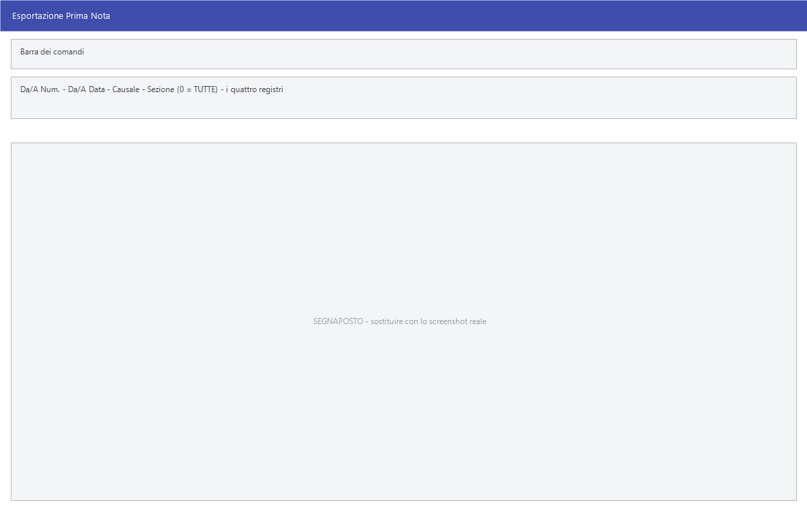

# Esportazione movimenti

Quattro voci di menu che aprono **la stessa maschera**, dal titolo
*Esportazione Prima Nota*: cambia solo il tracciato con cui il file viene
scritto, secondo il programma che il commercialista usa.

!!! info "In sintesi"

    **Percorso:** Menu ▸ Contabilità ▸ Esportazione Movimenti per SISPAC *(oppure per* TeamSystem*, per* IPSOA *o per* PROFIS SQL*)*
    **Scorciatoia:** ++f2++ esporta, ++esc++ esce
    **Permessi richiesti:** nessun profilo predefinito; le singole voci di menu si abilitano per ogni utente da [Archivi ▸ Utenti](../anagrafiche/utenti.md)

---

## A cosa serve

Chi tiene la contabilità in azienda e la fa controllare fuori manda
periodicamente al consulente i movimenti registrati, invece di consegnargli i
documenti. Il file va scritto nel formato che il suo programma legge: da qui le
quattro voci.

| Voce di menu | Tracciato |
|---|---|
| **Esportazione Movimenti per SISPAC** | SISPAC. |
| **Esportazione Movimenti per TeamSystem** | TeamSystem. |
| **Esportazione Movimenti per IPSOA** | IPSOA. |
| **Esportazione Movimenti per PROFIS SQL** | PROFIS SQL. |

Il programma **tiene traccia di quello che è già stato esportato**: la volta
dopo manda solo il nuovo, salvo che non gli si chieda diversamente.

## Prerequisiti

Prima di esportare occorre:

- avere registrato tutta la [prima nota](registrazione-prima-nota.md) del
  periodo;
- **aver azzerato le [squadrature](statistiche-e-controlli.md)**: al consulente
  arriverebbero registrazioni sbilanciate;
- sapere dal consulente quale dei quattro tracciati gli serve.

## La maschera

Una finestra sola: l'intervallo delle registrazioni, i filtri, le quattro
caselle dei registri e i pulsanti **F2 - OK** ed **Esci**.

## Campi

| Campo | Obbl. | Descrizione | Valori ammessi |
|---|:---:|---|---|
| **Da Num.**, **A Num.** | | Intervallo di numeri di registrazione. | numeri |
| **Da Data**, **A Data** | | Il periodo da esportare. | date |
| **Causale** | | Restringe a una [causale](causali-contabili.md). | codice |
| **Sezione (0 = TUTTE)** | | La [sezione](sezioni.md) contabile. | codice, `0` per tutte |
| **Registro Acquisti** | | Include le registrazioni del registro acquisti. | attivo/non attivo |
| **Registro Vendite** | | Include quelle del registro vendite. | attivo/non attivo |
| **Registro Corrispettivi** | | Include i corrispettivi. | attivo/non attivo |
| **Giornale** | | Include le registrazioni di solo giornale. | attivo/non attivo |
| **Includi Movimenti già esportati** | | Rimanda anche quello che era già stato esportato in precedenza. | attivo/non attivo |

{: .campi }

## Pulsanti e comandi

| Comando | Scorciatoia | Effetto |
|---|---|---|
| **F2 - OK** | ++f2++ | Produce il file da consegnare al consulente. |
| **Esci** | ++esc++ | Chiude senza esportare. |
| Elenco di scelta | ++f10++ o ++space++ | Sul campo con il codice, apre l'elenco da cui scegliere. |
| **Calcolatrice** | ++f12++ | Apre la calcolatrice. |
| **Consultazione** | ++f11++ | Apre la consultazione. |

## Come si fa

### Mandare al commercialista i movimenti del mese

1. Controlla le [squadrature](statistiche-e-controlli.md).
2. Apri la voce corrispondente al programma del consulente, per esempio
   **Menu ▸ Contabilità ▸ Esportazione Movimenti per TeamSystem**.
3. Indica il periodo in **Da Data** e **A Data**.
4. Spunta i registri da mandare.
5. Lascia spenta **Includi Movimenti già esportati**: partirà solo quello che
   non è ancora stato mandato.
6. Premi **F2 - OK** e consegna il file.

### Rimandare un periodo già esportato

1. Apri la stessa voce e indica di nuovo il periodo.
2. **Attiva Includi Movimenti già esportati**, altrimenti il file esce vuoto.
3. Premi **F2 - OK** e avverti il consulente che si tratta di un rinvio.

## Controlli e messaggi

| Messaggio | Causa | Cosa fare |
|---|---|---|
| *(nessun messaggio, solo un segnale acustico)* | Un campo del filtro non è valido. | Compila il campo su cui si è posizionato il cursore. |

## Note

!!! warning "Le registrazioni esportate non vanno più toccate"

    Dopo l'esportazione, aprendo in modifica una di quelle registrazioni il
    programma avvisa: *«Il movimento risulta esportato al consulente. Prendere
    nota delle modifiche apportate»*. Il consulente ha già la versione
    precedente: se la si corregge, va avvertito.

!!! note "Il file esce vuoto se è già stato tutto esportato"

    Senza **Includi Movimenti già esportati** l'esportazione manda solo il
    nuovo. Un file vuoto, dopo un'esportazione appena fatta, è il
    comportamento normale.

<!-- DA VERIFICARE: in quale cartella e con quale nome viene prodotto il file, per ciascuno dei quattro tracciati. -->

<!-- DA VERIFICARE: se il titolo della finestra cambi secondo il tracciato scelto o resti sempre "Esportazione Prima Nota". -->

<!-- DA VERIFICARE: come si annulla il segno di "già esportato" su una registrazione, se serve rifare l'esportazione da zero. -->

## Vedi anche

- [Registrazione di prima nota](registrazione-prima-nota.md)
- [Statistiche e controlli contabili](statistiche-e-controlli.md)
