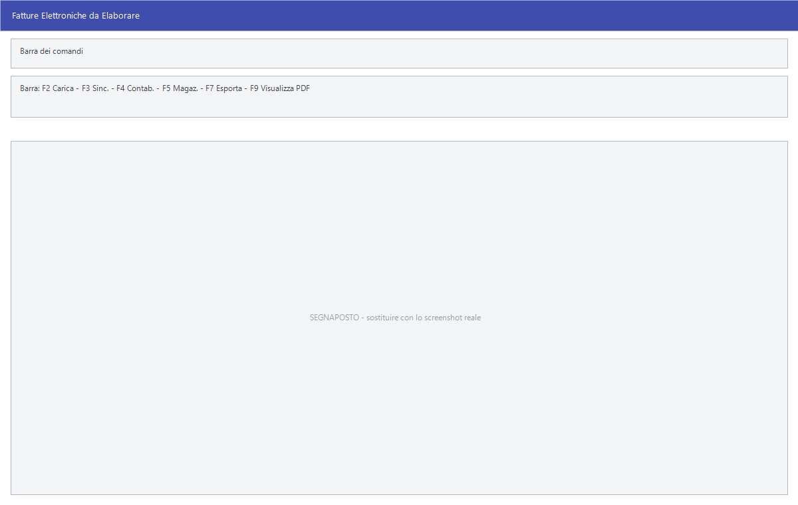

# Fatture elettroniche passive

Le fatture che i fornitori mandano per via elettronica arrivano qui: si
scaricano, si guardano, e da lì si generano la registrazione contabile e il
carico di magazzino senza ribattere nulla.

!!! info "In sintesi"

    - **Percorso:** Menu ▸ Contabilità ▸ Fatture Elettroniche Passive
    - **Scorciatoia:** ++f2++ carica, ++f3++ sincronizza, ++f4++ contabilizza, ++f5++ magazzino
    - **Permessi richiesti:** nessun profilo predefinito; la voce di menu si abilita per ogni utente da [Archivi ▸ Utenti](../anagrafiche/utenti.md); lo scarico e la ricezione richiedono anche le abilitazioni **Abilita download Fatture Passive** e **Abilita download Stati Fatture Attive** sull'utente

---

## A cosa serve

È il punto in cui la fattura elettronica ricevuta smette di essere un file e
diventa un documento contabile. La finestra si chiama *Fatture Elettroniche da
Elaborare*: elenca quello che è arrivato e non è ancora stato lavorato.

Da ogni fattura si può:

- generare la [registrazione di prima nota](registrazione-prima-nota.md);
- generare il carico di magazzino;
- vedere il PDF di cortesia;
- archiviarla, quando è stata lavorata.

## Prerequisiti

Prima di usare questa maschera occorre:

- avere in archivio i [fornitori](../anagrafiche/anagrafica-fornitori.md) che
  fatturano, con la partita IVA corretta: è da quella che il programma li
  riconosce;
- avere impostato sulla [ditta](../anagrafiche/ditte.md) l'identificativo di
  nazione in due caratteri;
- avere una [causale contabile](causali-contabili.md) predefinita valida per il
  registro acquisti;
- avere **credito** sul servizio di ricezione;
- avere l'utente abilitato al download nella maschera
  [Utenti](../anagrafiche/utenti.md).

## La maschera

Si apre a tutto schermo e si ridimensiona. In alto la barra dei comandi, sotto
l'elenco delle fatture ricevute; selezionandone una, la parte bassa mostra il
dettaglio su cinque schede:

| Scheda | Cosa contiene |
|---|---|
| **Fornitore** | I dati del fornitore come stanno nella fattura. |
| **Dettaglio Iva** | Il riepilogo per aliquota. |
| **Dettaglio Linee** | Le righe dei beni e dei servizi. |
| **Pagamenti** | Le condizioni e le scadenze indicate in fattura. |
| **Allegati** | Gli allegati trasmessi insieme alla fattura. |

## Campi

I dati non si digitano: arrivano dalla fattura. La maschera serve a
consultarli e a decidere cosa farne.

Non applicabile.

## Pulsanti e comandi

| Comando | Scorciatoia | Effetto |
|---|---|---|
| **F2 - Carica** | ++f2++ | Carica le fatture da file. |
| **F3 - Sinc.** | ++f3++ | Si collega al servizio e scarica le fatture nuove. |
| **Filtra** | | Restringe l'elenco a un periodo. |
| **F4 - Contab.** | ++f4++ | Genera la [registrazione di prima nota](registrazione-prima-nota.md) dalla fattura selezionata. |
| **F5 - Magaz.** | ++f5++ | Genera il carico di magazzino dalle righe della fattura. |
| **F6 - Elimina** | ++f6++ | Toglie la fattura dall'elenco. |
| **F7 - Esporta** | ++f7++ | Esporta il file XML della fattura. |
| **F9 - Visualizza PDF** | ++f9++ | Apre il PDF di cortesia. |
| **Elimina PDF** | | Cancella il PDF di cortesia dall'archivio. |
| **Credito** | | Mostra il credito residuo sul servizio. |
| **Sel.**, **Desel.** | | Spuntano e despuntano tutte le righe. |
| **Archivia** | | Archivia le fatture lavorate, togliendole da quelle da elaborare. |

## Come si fa

### Scaricare e contabilizzare le fatture ricevute

1. Apri **Menu ▸ Contabilità ▸ Fatture Elettroniche Passive**.
2. Premi **F3 - Sinc.**: il programma si collega e scarica quello che è
   arrivato.
3. Seleziona una fattura e controlla le schede **Fornitore**, **Dettaglio Iva**
   e **Dettaglio Linee**.
4. Premi **F9 - Visualizza PDF** se vuoi vedere il documento come lo vede il
   fornitore.
5. Premi **F4 - Contab.** per generare la registrazione.
6. Se la merce va caricata a magazzino, premi anche **F5 - Magaz.**.
7. Quando la fattura è lavorata, premi **Archivia**.

### Caricare una fattura ricevuta per altra via

1. Salva il file XML sul computer.
2. Premi **F2 - Carica** e scegli il file.

## Controlli e messaggi

| Messaggio | Causa | Cosa fare |
|---|---|---|
| *Credito Esaurito!* / *E' necessario acquistare del credito per poter effettuare la ricezione.* | Il credito sul servizio è finito. | Acquista il credito; il pulsante **Credito** mostra il residuo. |
| *Credito Esaurito!* / *E' necessario acquistare del credito per poter effettuare l' invio.* | Come sopra, per l'invio. | Come sopra. |
| *Errore di comunicazione!* / *Impossibile contattare l'Authorization Server.* / *Attendere qualche minuto* | Il servizio non risponde. | Attendi e riprova; se il problema resta, contatta l'assistenza. |
| *Continuando l'operazione imposterai questo computer come l'unico abilitato allo scarico...* | Lo scarico si lega a una sola postazione. | Prosegui solo se è la postazione da cui si scaricheranno sempre le fatture. |
| *Identificativo Nazione (ISO alpha-2) non impostato su ditta!* | Manca il codice nazione nei dati della ditta. | Impostalo nella [ditta](../anagrafiche/ditte.md). |
| *Il codice nazione impostato sulla ditta deve essere di due caratteri!* | Il codice nazione non è nel formato ISO a due lettere. | Correggilo, per esempio `IT`. |
| *Il registro della causale contabile preimpostata non e' valido!* | La causale predefinita non è del registro acquisti. | Correggi la [causale](causali-contabili.md) o indicane un'altra. |
| *Il documento non contiene righe di dettaglio dei beni/servizi!* | La fattura non ha righe da cui generare il carico. | Non si può caricare a magazzino: registrala solo in contabilità. |
| *File in PDF del documento non trovato in archivio!* | Il PDF di cortesia non c'è. | Non tutte le fatture ne hanno uno: consulta il **Dettaglio Linee**. |
| *Impossibile caricare i dati del documento!* | Il file non si legge. | Verifica che sia una fattura elettronica valida. |
| *Impossibile esportare il file!* / *Formato file non corretto.* | L'esportazione non riesce. | Verifica il file di partenza. |
| *Impossibile convertire il file!* / *Impossibile contattare il servizio di conversione!* | La conversione del file non riesce. | Riprova; se il problema resta, contatta l'assistenza. |
| *Impossibile accoppiare il file!* | Il programma non riesce ad abbinare la fattura. | Verifica che il fornitore sia in archivio con la partita IVA giusta. |
| *Impossibile inizializzare Crypt Component!* | Il componente di cifratura non si avvia. | Segnala all'assistenza. |

## Note

!!! warning "Lo scarico si lega a una sola postazione"

    Il messaggio che compare al primo scarico avvisa che **quel computer
    diventa l'unico abilitato** a scaricare le fatture. Scegli con cura la
    postazione prima di confermare.

!!! note "Contabilizzare e caricare sono due gesti distinti"

    **F4 - Contab.** genera la registrazione contabile, **F5 - Magaz.** il
    carico di magazzino. Per una fattura di merce servono entrambi; per una
    fattura di servizi basta il primo.

!!! info "Il credito si controlla qui, non si compra qui"

    Il pulsante **Credito** mostra tre numeri: **credito acquistato**,
    **credito utilizzato** e **credito residuo**. Se il residuo è a zero
    risponde *« Credito Esaurito! »* e non fa proseguire.

    **Acquistarlo non si fa dal programma**: il credito si ricarica tramite
    l'assistenza o dal portale del servizio — lo stesso che il
    [cruscotto delle fatture attive](../vendite/fatture-elettroniche-attive.md)
    apre con il suo pulsante.

    Il controllo ha senso **prima** di una sessione di scarico, non dopo:
    scoprire il credito esaurito a metà del lavoro costa una seconda passata.

!!! tip "Le archiviate non spariscono: si nascondono"

    **Archivia** agisce sulle **righe spuntate** — senza spunte risponde
    *« Non è stata selezionata nessuna riga per l'archiviazione! »*. Le fatture
    archiviate escono dall'elenco di lavoro, che così resta corto.

    Per rivederle si usa **Filtra**, che oltre al periodo ha la scelta di
    mostrare anche gli **archiviati**. Non c'è una seconda maschera da cercare:
    è sempre questa, con il filtro allargato.

La griglia è costruita dal programma, non dalle risorse. Ogni riga è una
fattura ricevuta e porta:

- la **spunta**, con cui si scelgono le righe su cui agire;
- due segnalini di stato: se è già andata in **prima nota** e se è già andata
  in **carico merci**;
- **numero** e **data** del documento, e la **data SDI**, cioè quella in cui il
  Sistema di Interscambio l'ha consegnata;
- **fornitore** con la sua **partita IVA**, e la **descrizione**;
- **tipo** documento, **divisa**, **imponibile**, **IVA** e **totale**;
- l'**anno** di competenza e se il file è già stato **caricato**.

!!! note "Le due date non coincidono quasi mai"

    La **data del documento** è quella che il fornitore ha messo in fattura; la
    **data SDI** è quella della consegna. È la seconda che conta per capire
    quando è arrivata, ed è su quella che lavora il filtro del periodo.

!!! info "Contabilizza apre la prima nota, non registra da sé"

    **F4 - Contab.** prepara la registrazione e apre la
    [prima nota](registrazione-prima-nota.md) **già compilata**: la si controlla
    e si salva. Niente viene scritto senza passare di lì.

    Prima di aprirla il programma cerca il **fornitore** — creandolo se non
    c'è — e controlla che ci sia il **PDF** allegato: se manca avverte che
    conviene scaricarlo con *F9 - Visualizza PDF*, così resta allegato alla
    registrazione. Durante la compilazione può chiedere la **causale contabile**
    e il **codice IVA** quando non riesce a dedurli.

!!! tip "Filtra decide che cosa si vede, non che cosa si scarica"

    Apre *Seleziona Periodo Acquisizione*: due date e la scelta se mostrare
    anche gli **archiviati**. L'icona è un calendario perché il filtro è
    anzitutto sul periodo.

    Non tocca né lo scarico né l'archivio: cambia soltanto l'elenco a video. È
    il comando da usare quando una fattura « non si trova »: quasi sempre è
    fuori periodo o è stata archiviata.

## Vedi anche

- [Registrazione di prima nota](registrazione-prima-nota.md)
- [Anagrafica fornitori](../anagrafiche/anagrafica-fornitori.md)
- [Causali contabili](causali-contabili.md)
- [Utenti](../anagrafiche/utenti.md)
