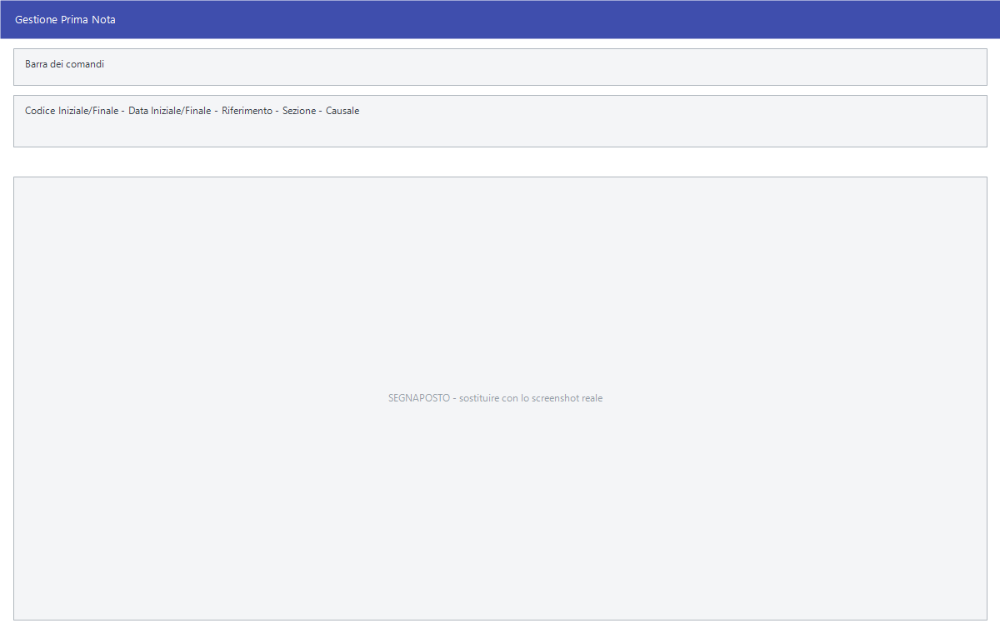

# Gestione prima nota

L'elenco delle registrazioni contabili: si filtra per periodo, sezione o
causale, si trova quella che serve e la si apre. È il punto da cui si entra
nella contabilità tutti i giorni.

!!! info "In sintesi"

    **Percorso:** Menu ▸ Contabilità ▸ Gestione Prima Nota
    **Scorciatoia:** ++f2++ apre la registrazione, ++f3++ ne crea una nuova
    **Permessi richiesti:** nessun profilo predefinito; la voce di menu si abilita per ogni utente da [Archivi ▸ Utenti](../anagrafiche/utenti.md)

---

## A cosa serve

Le voci **Inserimento** e **Modifica** aprono direttamente la
[registrazione](registrazione-prima-nota.md); questa invece mostra **quello che
c'è già**, e da lì si lavora.

Serve per ritrovare una fattura registrata, per controllare cosa è stato
registrato in un periodo, per allegare a una registrazione il documento
scansionato, e per stampare l'elenco.

## Prerequisiti

Prima di usare questa maschera occorre avere il piano dei conti — [mastri](mastri.md),
[conti](conti.md), [sottoconti](sottoconti.md) — e le
[causali contabili](causali-contabili.md) con cui si registra.

## La maschera

In alto la barra dei comandi, sotto i campi del filtro, e nel resto della
finestra la griglia delle registrazioni trovate.

La griglia ha queste colonne:

| Colonna | Contenuto |
|---|---|
| **Codice** | Numero della registrazione. |
| **Data** | Data di registrazione. |
| **Numero Doc.**, **Data Doc.** | Gli estremi del documento registrato. |
| **Totale Doc.** | Totale del documento. |
| **Sez.** | La [sezione](sezioni.md) contabile. |
| **Cau.** | La [causale](causali-contabili.md) usata. |
| **Analitica** | Se la registrazione ha imputazioni di contabilità analitica. |
| **Registro** | Il registro IVA su cui è finita. |
| **Verif.** | Segna le registrazioni marcate come da verificare. |
| **Descrizione** | La descrizione della registrazione. |
| **Rel.** | La relazione: cliente, fornitore o conto. |
| **Cliente/Fornitore** | Il nominativo. |
| **Dare**, **Avere** | Gli importi. |

## Campi

| Campo | Obbl. | Descrizione | Valori ammessi |
|---|:---:|---|---|
| **Codice Iniziale**, **Codice Finale** | | Intervallo di numeri di registrazione. | numeri |
| **Data Iniziale**, **Data Finale** | | Il periodo da mostrare. | date |
| **Riferimento** | | Quale data usare per il filtro del periodo. | `DATA REGISTRAZIONE`, `DATA DOCUMENTO` |
| **Sezione** | | Restringe a una [sezione](sezioni.md) contabile. | codice |
| **Causale** | | Restringe a una [causale](causali-contabili.md). | codice |

{: .campi }

## Pulsanti e comandi

| Comando | Scorciatoia | Effetto |
|---|---|---|
| **F2 - Modifica** | ++f2++ | Apre in [modifica](registrazione-prima-nota.md) la registrazione selezionata. |
| **F3 - Nuova** | ++f3++ | Apre una [registrazione nuova](registrazione-prima-nota.md). |
| **F7 - Allegati** | ++f7++ | Allega alla registrazione un documento — tipicamente la scansione della fattura — o apre quelli già allegati. |
| **F9 - Stampa** | ++f9++ | Stampa l'elenco delle registrazioni trovate. |
| **Trova** | | Cerca un testo nella griglia. |
| **Calcolatrice** | ++f12++ | Apre la calcolatrice. |
| **Consultazione** | ++f11++ | Apre la consultazione. |

## Come si fa

### Ritrovare una fattura registrata

1. Apri **Menu ▸ Contabilità ▸ Gestione Prima Nota**.
2. Metti **Riferimento** su `DATA DOCUMENTO` e indica il periodo in cui la
   fattura è datata.
3. Se sai la causale, indicala per stringere l'elenco.
4. Trova la riga e premi **F2 - Modifica**.

### Allegare la scansione di una fattura

1. Trova la registrazione nella griglia.
2. Premi **F7 - Allegati** e scegli il file.

### Controllare le registrazioni da verificare

1. Imposta il periodo.
2. Guarda la colonna **Verif.**: sono le registrazioni marcate come da
   ricontrollare al momento in cui sono state fatte.

## Controlli e messaggi

| Messaggio | Causa | Cosa fare |
|---|---|---|
| *(nessun messaggio, solo un segnale acustico)* | Un campo del filtro non è valido. | Guarda dove si è posizionato il cursore: è il campo da correggere. |

## Note

!!! note "Due date diverse"

    **Riferimento** decide se il periodo si applica alla data di registrazione
    o a quella del documento. Le due raramente coincidono: una fattura di
    dicembre registrata a gennaio si trova con `DATA DOCUMENTO` cercando in
    dicembre, e con `DATA REGISTRAZIONE` cercando in gennaio.

<!-- DA VERIFICARE: dove vengono salvati i file allegati con F7 - Allegati e se ci sia un limite di dimensione. -->

<!-- DA VERIFICARE: come si marca una registrazione come "da verificare" e chi toglie poi la spunta. -->

<!-- DA VERIFICARE: cosa stampa esattamente F9 - Stampa: l'elenco a video o un brogliaccio completo. -->

## Vedi anche

- [Registrazione di prima nota](registrazione-prima-nota.md)
- [Causali contabili](causali-contabili.md)
- [Stampe contabili](stampe-contabili.md)
