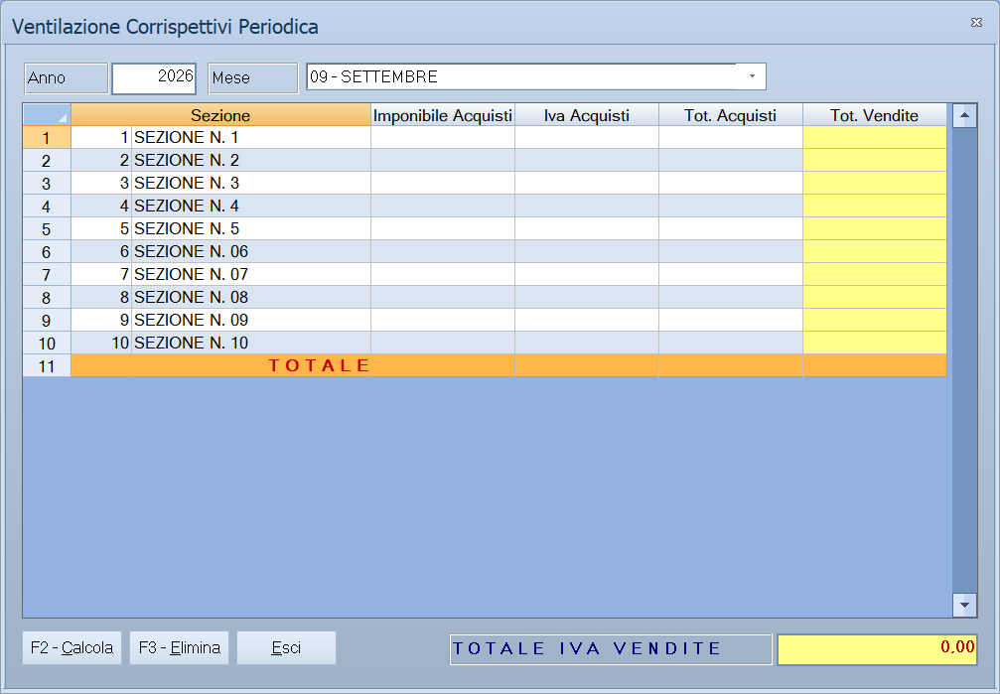

# Liquidazione IVA e ventilazione

Le quattro voci con cui si chiude l'IVA: si ventilano i corrispettivi, si
liquida il periodo, si liquida l'anno e si produce l'elenco clienti e
fornitori.

!!! info "In sintesi"

    - **Percorso:**
        - Menu ▸ Contabilità ▸ Ventilazione Corrispettivi
        - Menu ▸ Contabilità ▸ Liquidazione IVA Periodica
        - Menu ▸ Contabilità ▸ Liquidazione IVA Annuale
        - Menu ▸ Contabilità ▸ Elenco Clienti e Fornitori
    - **Scorciatoia:** ++f2++ calcola, ++f3++ elimina, ++esc++ esce
    - **Permessi richiesti:** nessun profilo predefinito; le singole voci di menu si abilitano per ogni utente da [Archivi ▸ Utenti](../anagrafiche/utenti.md)

---

## A cosa serve

| Voce di menu | A cosa serve |
|---|---|
| **Ventilazione Corrispettivi** | Ripartisce i corrispettivi incassati fra le aliquote IVA, in proporzione agli acquisti del periodo. Serve al commercio al dettaglio, che incassa senza distinguere l'aliquota. La finestra si chiama *Ventilazione Corrispettivi Periodica*. |
| **Liquidazione IVA Periodica** | Calcola l'IVA del mese o del trimestre: quanto se n'è incassata, quanta se n'è pagata, quanto si deve versare. |
| **Liquidazione IVA Annuale** | Lo stesso conto riferito all'anno, con i righi della dichiarazione. |
| **Elenco Clienti e Fornitori** | Produce il file dell'elenco clienti e fornitori da trasmettere. |

## Prerequisiti

Prima di usare queste maschere occorre:

- avere registrato tutta la [prima nota](registrazione-prima-nota.md) del
  periodo;
- **aver azzerato le
  [squadrature](statistiche-e-controlli.md)**: una registrazione squadrata
  falsa la liquidazione;
- per la ventilazione, aver registrato gli acquisti del periodo, perché è da
  quelli che si ricavano le proporzioni.

## La maschera

**Ventilazione** e **Liquidazione Periodica** hanno la stessa forma: in alto
**Anno** e il periodo, sotto il prospetto dei calcoli. **Liquidazione Annuale**
è il prospetto dei righi VP. **Elenco Clienti e Fornitori** produce un file.

## Campi

### Ventilazione Corrispettivi e Liquidazione IVA Periodica

| Campo | Obbl. | Descrizione | Valori ammessi |
|---|:---:|---|---|
| **Anno** | ● | L'anno di riferimento. | anno |
| **Mese** / **Trimestre** | ● | Il periodo da liquidare. L'etichetta e il contenuto dipendono dalla periodicità della ditta: mensile, i dodici mesi da `01 - GENNAIO` a `12 - DICEMBRE`; trimestrale, i quattro trimestri da `I° TRIMESTRE` a `IV° TRIMESTRE`. I due elenchi non convivono. | voce dell'elenco |
| **Subforniture** | | Segnala la presenza di subforniture. | attivo/non attivo |
| **Operazioni Straordinarie** | | Segnala operazioni straordinarie nel periodo. | attivo/non attivo |
| *(elenco senza etichetta accanto a Subforniture)* | | Il codice degli eventi eccezionali previsto dalla normativa. | codice |

Il prospetto sotto è di sola lettura tranne i riporti dal periodo precedente:

| Campo | Descrizione |
|---|---|
| **Tot. Operazioni Attive**, **Tot. Operazioni Passive** | I totali del periodo. Solo lettura. |
| **IVA Esigibile**, **IVA Detratta** | L'IVA a debito e a credito del periodo. Solo lettura. |
| **IVA Dovuta**, **IVA a Credito** | Il risultato del periodo. Solo lettura. |
| **Debito Periodo Preced.**, **Credito Periodo Preced.**, **Credito Anno Preced.** | I riporti: si possono correggere a mano. |

### Liquidazione IVA Annuale

Il prospetto ricalca i righi della dichiarazione:

| Rigo | Contenuto |
|---|---|
| **VP2 - Tot. Operazioni Attive** | Totale delle operazioni attive. |
| **VP3 - Tot. Operazioni Passive** | Totale delle operazioni passive. |
| **VP4 - IVA Esigibile** | IVA a debito. |
| **VP5 - IVA Detratta** | IVA a credito. |
| **VP6 - IVA Dovuta** / **VP6 - IVA a Credito** | Il risultato. |
| **VP7 - Debito Periodo Preced.** | Debito riportato. |
| **VP8 - Credito Periodo Preced.** | Credito riportato dal periodo precedente. |
| **VP9 - Credito Anno Preced.** | Credito riportato dall'anno precedente. |
| **VP10 - Versamenti auto UE** | Versamenti per acquisti di autoveicoli UE. |
| **VP11 - Crediti d'imposta** | Crediti d'imposta utilizzati. |
| **VP12 - Interessi Liq. Trimestr.** | Interessi per la liquidazione trimestrale. |
| **VP13 - Acconto Dovuto** | L'acconto. |
| **VP14 - IVA DA VERSARE** / **VP14 - IVA A CREDITO** | Il risultato finale. |

## Pulsanti e comandi

| Comando | Scorciatoia | Effetto |
|---|---|---|
| **F2 - Calcola** | ++f2++ | Esegue il calcolo del periodo. |
| **F3 - Elimina** | ++f3++ | Annulla la ventilazione già calcolata per quel periodo. |
| **Esci** | ++esc++ | Chiude senza calcolare. |
| **Calcolatrice** | ++f12++ | Apre la calcolatrice. |
| **Consultazione** | ++f11++ | Apre la consultazione. |

## Come si fa

### Ventilare i corrispettivi del mese

1. Registra tutti gli acquisti e i corrispettivi del mese.
2. Apri **Menu ▸ Contabilità ▸ Ventilazione Corrispettivi**.
3. Indica **Anno** e il mese.
4. Premi **F2 - Calcola** e attendi il messaggio *«La Ventilazione dei
   corrispettivi è stata conclusa regolarmente!»*.

### Rifare una ventilazione sbagliata

1. Apri la maschera sullo stesso periodo.
2. Premi **F3 - Elimina** e attendi *«L'annullamento della Ventilazione dei
   corrispettivi è stata conclusa regolarmente!»*.
3. Correggi le registrazioni e ricalcola con **F2 - Calcola**.

### Liquidare l'IVA del mese

1. Controlla le [squadrature](statistiche-e-controlli.md).
2. Se sei un dettagliante, ventila prima i corrispettivi.
3. Apri **Menu ▸ Contabilità ▸ Liquidazione IVA Periodica**.
4. Indica **Anno** e periodo, controlla i riporti dal periodo precedente.
5. Premi **F2 - Calcola**.

## Controlli e messaggi

| Messaggio | Causa | Cosa fare |
|---|---|---|
| *La Ventilazione dei corrispettivi è stata conclusa regolarmente!* | La ventilazione è andata a buon fine. | Nulla: è una conferma. |
| *La Ventilazione dei corrispettivi è stata conclusa in modo errato!* / *Ripetere l'operazione* | La ventilazione non è riuscita. | Ripeti; se il problema resta, segnala all'assistenza. |
| *L'annullamento della Ventilazione dei corrispettivi è stata conclusa regolarmente!* | L'annullamento è riuscito. | Nulla: è una conferma. |
| *L'annullamento della Ventilazione dei corrispettivi è stata conclusa in modo errato!* | L'annullamento non è riuscito. | Ripeti; se il problema resta, segnala all'assistenza. |
| *Indicare il Metodo solo se acconto diverso da Zero!* | Si è indicato il metodo di calcolo dell'acconto senza avere un acconto. | Azzera il metodo, oppure indica l'acconto. |
| *Ci sono segnalazioni di errore!* / *Le vuoi visualizzare ?* | L'elenco clienti e fornitori ha trovato dati incompleti. | **Sì** per vedere quali nominativi vanno corretti. |
| *Ci sono ancora segnalazioni di errore!* / *Vuoi continuare ?* | Restano errori non corretti. | **No** e correggi prima i dati, salvo che tu sappia che sono ininfluenti. |
| *Nel file deve essere presente almeno un cliente o un fornitore !* | La selezione non ha prodotto alcun nominativo. | Allarga la selezione. |
| *Il file non può superare i 3MB di dimensione.* / *Rivolgersi all' assistenza. !* | Il file dell'elenco supera il limite. | Contatta l'assistenza per spezzarlo. |
| *Impossibile aprire il file !* | Il file non si apre. | Verifica che non sia aperto altrove. |
| *Impossibile Creare la tabella* | Il programma non riesce a preparare l'area di lavoro. | Segnala all'assistenza. |

## Note

!!! warning "Attenzione"

    **La ventilazione va rifatta se si tocca il periodo.** Se dopo averla
    calcolata si registra o si corregge un acquisto o un corrispettivo di quel
    mese, il calcolo non è più valido: annullalo con **F3 - Elimina** e
    ricalcolalo.

    **I riporti sono modificabili a mano.** **Debito** e **Credito Periodo
    Preced.** e **Credito Anno Preced.** si possono scrivere: comodo il primo
    anno, pericoloso dopo, perché sovrascrive quello che il programma avrebbe
    calcolato.

!!! note "Il metodo dell'acconto sta accanto all'acconto"

    È l'elenco **Metodo**, nella stessa maschera, di fianco alla riga
    **VP13 - Acconto Dovuto**. Le voci sono quelle previste dalla
    dichiarazione:

    - `1 - STORICO`
    - `2 - PREVISIONALE`
    - `3 - ANALITICO - EFFETTIVO`
    - `4 - SOGGETTI OPERANTI NEI SETTORI`

    Si lascia vuoto quando l'acconto non c'è. Il messaggio *Indicare il
    Metodo solo se acconto diverso da Zero!* compare proprio quando hai
    scelto un metodo ma l'acconto è rimasto a zero.

!!! info "Dove esce l'Elenco Clienti e Fornitori"

    Sempre nella cartella **`out`** dell'installazione, e il nome porta
    l'anno e il codice della ditta:

    - il file **telematico** è `CLIFORaaaa-nnnnn.TXT`;
    - l'esportazione in **Excel** produce due fogli,
      `eleclifor<anno>_<ditta>.xls` con l'elenco vero e proprio e
      `rsaclifor<anno>_<ditta>.xls` con il dettaglio.

    A differenza di altre esportazioni, qui il programma **dice dove ha
    scritto**: a fine elaborazione mostra *Esportazione conclusa
    regolarmente !* con i due percorsi per intero.

!!! warning "La liquidazione non scrive in prima nota"

    Quello che salvi qui è **solo il prospetto**: la liquidazione registra
    il proprio quadro, periodo per periodo, e niente altro.

    Il **giroconto dell'IVA** — la scrittura che chiude IVA vendite e IVA
    acquisti e apre il debito o il credito verso l'erario — **va
    registrata a mano** in [prima nota](registrazione-prima-nota.md), come
    qualunque altra scrittura. Lo stesso vale per il versamento.

## Vedi anche

- [Registrazione di prima nota](registrazione-prima-nota.md)
- [Statistiche e controlli contabili](statistiche-e-controlli.md)
- [Comunicazioni IVA](comunicazioni-iva.md)
- [Stampe contabili](stampe-contabili.md)
