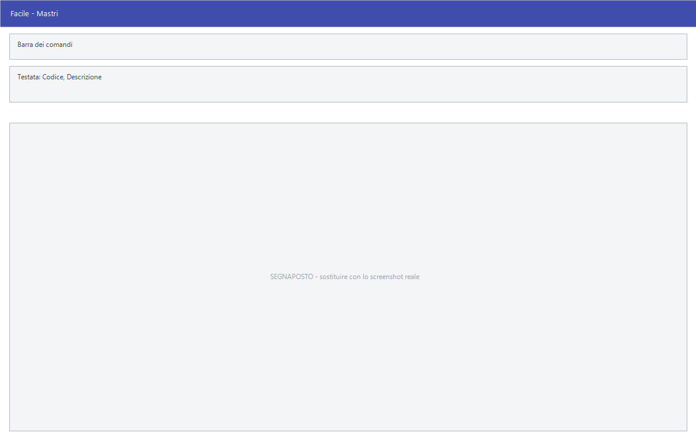

# Mastri

Da questa maschera si definiscono i mastri: il primo dei tre livelli del piano
dei conti. Sotto ogni mastro stanno i [conti](conti.md), e sotto ogni conto i
[sottoconti](sottoconti.md).

!!! info "In sintesi"

    **Percorso:** Menu ▸ Archivi ▸ Contabilità ▸ Mastri ▸ Inserimento *(oppure* Modifica*)*
    **Scorciatoia:** nessuna; la maschera si apre dal menu
    **Permessi richiesti:** nessun profilo predefinito; **Inserimento** e **Modifica** si abilitano separatamente per ogni utente da [Archivi ▸ Utenti](../anagrafiche/utenti.md)

---

## A cosa serve

Il piano dei conti di Facile ha tre livelli: **mastro**, **conto**,
**sottoconto**. Il mastro è il raggruppamento più largo — *CLIENTI*,
*FORNITORI*, *BANCHE*, *COSTI DI ESERCIZIO* — e ogni registrazione di prima
nota finisce su un sottoconto che appartiene a un conto, che appartiene a un
mastro.

I saldi che vedi in questa maschera sono la somma di tutto ciò che sta sotto,
divisi per sezione e per anno.

## Prerequisiti

*Nessuno.* È il primo livello: si compila prima dei conti e dei sottoconti.

## La maschera

È una maschera a finestra unica: in alto la **barra dei comandi**, poi codice e
descrizione del mastro, e sotto la griglia dei saldi.

## Campi

| Campo | Obbl. | Descrizione | Valori ammessi |
|---|:---:|---|---|
| Codice | ● | Identificativo del mastro. In modifica non è modificabile. | Numero |
| Descrizione | ● | Nome del mastro, come compare nel piano dei conti e nelle stampe. | Fino a 30 caratteri |
| Iva Esente | | Segnala che il mastro raccoglie operazioni esenti da IVA. | Casella |

{: .campi }

La griglia in basso non si compila: mostra i saldi del mastro con le colonne
**Sezione**, **Anno**, **Dare**, **Avere** e **Saldo**.

## Pulsanti e comandi

| Comando | Scorciatoia | Effetto |
|---|---|---|
| **F2 - Salva** | ++f2++ | Registra il mastro. In inserimento la maschera si svuota per il successivo. |
| **F3 - Prec.** | ++f3++ | Passa al mastro precedente. |
| **F4 - Succ.** | ++f4++ | Passa al mastro successivo. |
| **F5 - Cerca** | ++f5++ | Apre l'elenco dei mastri. |
| **F6 - Elimina** | ++f6++ | Cancella il mastro, previa conferma. |
| **Ricarica** | | Rilegge il mastro dall'archivio, abbandonando le modifiche non salvate. |

Valgono inoltre:

| Comando | Scorciatoia | Effetto |
|---|---|---|
| Consultazione | ++f11++ | Apre la finestra **Consultazione**. |
| Calcolatrice | ++f12++ | Apre la calcolatrice. |
| Campo successivo | ++enter++ | Sposta il cursore sul campo seguente. |
| Chiusura | ++esc++ | Chiude la maschera. |

## Come si fa

### Creare un mastro

1. Apri **Menu ▸ Archivi ▸ Contabilità ▸ Mastri ▸ Inserimento**.
2. Digita il **Codice** e la **Descrizione**.
3. Premi **F2 - Salva**. La maschera si svuota per il mastro successivo.

### Controllare il saldo di un mastro

1. Premi **F5 - Cerca** e carica il mastro.
2. Leggi la griglia in basso: una riga per sezione e per anno, con dare, avere
   e saldo.

## Controlli e messaggi

| Messaggio | Causa | Cosa fare |
|---|---|---|
| *(nessun messaggio, solo un segnale acustico)* | Manca il **Codice** o la **Descrizione**. | Guarda dove si è posizionato il cursore: è il campo da compilare. |
| *In archivio è già presente un record con lo stesso codice.* | Il codice digitato è già di un altro mastro. | Cambia codice. |
| *Confermi la Cancellazione....* | Conferma richiesta da **F6 - Elimina**. | Rispondi **Sì** per eliminare il mastro. |
| *Non è possibile eliminare il record pochè utilizzato in alcuni record del database.* | Sotto il mastro ci sono conti o sottoconti, oppure il mastro è indicato in una causale contabile. | Non è eliminabile: prima svuotalo. |
| *Il record è stato modificato da un altro nodo della rete.* | Un altro utente ha salvato lo stesso mastro mentre lo modificavi. | Premi **Ricarica**, verifica cosa è cambiato e rifai le tue modifiche. |
| *Il record è stato cancellato da un altro nodo della rete.* | Un altro utente ha eliminato il mastro mentre lo modificavi. | La maschera si chiude: non c'è più nulla da salvare. |

## Note

!!! warning "Attenzione"

    Il piano dei conti si costruisce dall'alto: prima i mastri, poi i conti,
    poi i sottoconti. Un mastro non si elimina finché ha qualcosa sotto.

    ++esc++ chiude la maschera senza chiedere conferma e senza salvare: le
    modifiche fatte dopo l'ultimo **F2 - Salva** vanno perse.

<!-- DA VERIFICARE: la casella Iva Esente. Che effetto ha sulle registrazioni e sui registri IVA? -->

## Vedi anche

- [Conti](conti.md)
- [Sottoconti](sottoconti.md)
- [Causali contabili](causali-contabili.md)
