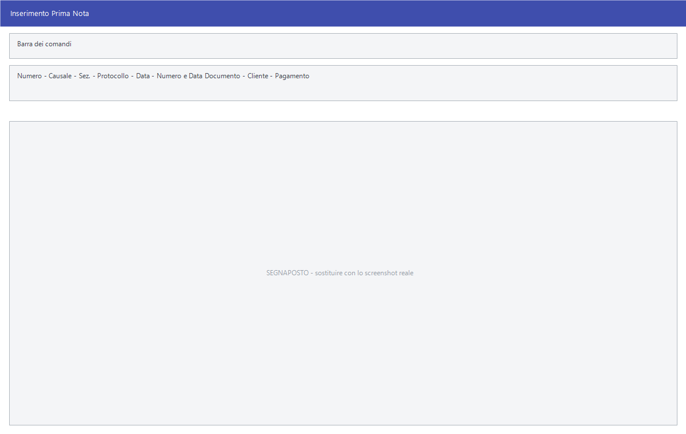

# Registrazione di prima nota

La maschera con cui una fattura, un corrispettivo o un movimento di banca
entrano in contabilità. La causale scelta decide quasi tutto: quali campi
compaiono, su quale registro IVA finisce il documento e quali conti vengono
proposti.

!!! info "In sintesi"

    **Percorso:** Menu ▸ Contabilità ▸ Inserimento *(oppure* Modifica*)*, o **F3 - Nuova** dalla [gestione prima nota](gestione-prima-nota.md)
    **Scorciatoia:** ++f6++ elimina, ++f7++ allegati, ++f8++ causale, ++f9++ integrazioni
    **Permessi richiesti:** nessun profilo predefinito; **Inserimento** e **Modifica** si abilitano separatamente per ogni utente da [Archivi ▸ Utenti](../anagrafiche/utenti.md)

---

## A cosa serve

È il gesto contabile quotidiano: si sceglie la causale, si indica il
cliente o il fornitore, si spezza l'imponibile per aliquota IVA e si controlla
che dare e avere quadrino.

Il programma fa gran parte del lavoro: dalla causale ricava il registro IVA e i
conti da usare, dal cliente o dal fornitore ricava il sottoconto e le
condizioni di pagamento, dalle righe IVA calcola l'imposta.

## Prerequisiti

Prima di usare questa maschera occorre:

- avere le [causali contabili](causali-contabili.md) impostate, perché sono
  loro a governare la registrazione;
- avere il piano dei conti — [mastri](mastri.md), [conti](conti.md),
  [sottoconti](sottoconti.md);
- avere le [aliquote IVA](aliquote-iva.md) e i
  [tipi di pagamento](tipi-di-pagamento.md);
- avere in archivio il [cliente](../anagrafiche/anagrafica-clienti.md) o il
  [fornitore](../anagrafiche/anagrafica-fornitori.md) del documento.

## La maschera

La finestra si chiama *Inserimento Prima Nota* — in modifica *Modifica Prima
Nota* — ed è divisa in quattro fasce, dall'alto in basso:

1. la **testata**: numero, causale, sezione, protocollo, date, cliente o
   fornitore, pagamento;
2. la **griglia IVA**: una riga per aliquota;
3. i **totali** del documento;
4. la **griglia contabile**: le righe in dare e avere, con in fondo **Totale
   Dare** e **Totale Avere**.

## Campi

### Testata

| Campo | Obbl. | Descrizione | Valori ammessi |
|---|:---:|---|---|
| **Numero** | | Numero della registrazione. Lo assegna il programma. | numero |
| **Causale** | ● | La [causale contabile](causali-contabili.md): decide registro IVA, conti proposti e quali campi compaiono. | codice |
| **Sez.** | | La [sezione](sezioni.md) contabile. | codice |
| **Protocollo** | | Il numero di protocollo sul registro IVA. | numero |
| **Data** | ● | Data di registrazione. | data |
| **Numero Documento**, **Data Documento** | | Gli estremi del documento che si sta registrando. | numero e data |
| **Cliente** | ● | Il nominativo. L'etichetta diventa **Fornitore** o **Conto** secondo la causale. | codice |
| **Pagamento** | | Il [tipo di pagamento](tipi-di-pagamento.md), da cui nascono le scadenze. | codice |
| **Data Decorrenza Pagamento** | | Da quando decorrono le scadenze. | data |
| **Data Competenza** | | La data a cui il costo o il ricavo compete, se diversa da quella di registrazione. | data |
| **Registrazione da Verificare** | | Marca la registrazione come da ricontrollare: si ritrova nella colonna **Verif.** della [gestione prima nota](gestione-prima-nota.md). | attivo/non attivo |
| **Escludi da Spesometro** | | Tiene la registrazione fuori dalla [comunicazione delle operazioni IVA](comunicazioni-iva.md). | attivo/non attivo |

{: .campi }

### Griglia IVA

| Colonna | Contenuto |
|---|---|
| **Cod. IVA** | L'[aliquota](aliquote-iva.md) della riga. |
| **Imponibile** | L'imponibile di quell'aliquota. |
| **Aliquota** | La percentuale, proposta dal codice IVA. |
| **Imposta** | L'imposta calcolata. |
| **% Inded.** | La quota di IVA indetraibile. |

### Totali

| Campo | Descrizione |
|---|---|
| **TOTALE DOCUMENTO** | Il totale che deve corrispondere a quello del documento in mano. |
| **TOTALE ARROTOND.** | L'eventuale arrotondamento. |
| **SQUADRATURA** | La differenza fra dare e avere: **deve essere zero**. |
| **IMPORTO VALUTA**, **DESC. VALUTA** | Importo e valuta, per i documenti in valuta estera. |

### Griglia contabile

| Colonna | Contenuto |
|---|---|
| **Conto**, **Sottoconto**, **Descrizione** | Il conto movimentato. |
| **Cau** | La causale della riga. |
| **N. Doc.** | Il numero del documento a cui la riga si riferisce. |
| **Importo**, **D/A** | L'importo e se va in dare o in avere. |
| **Comp.** | La data di competenza della riga. |
| **Ana.** | Segna la riga come oggetto di contabilità analitica. |
| **C.Cos/Ric** | Il [centro di costo o ricavo](centri-di-costo.md). |
| **Commessa** | La [commessa](commesse.md) a cui imputare. |

### Ratei e risconti

Dalla registrazione si aprono le **competenze**, con cui si spalma un costo o
un ricavo su più esercizi:

| Campo | Obbl. | Descrizione | Valori ammessi |
|---|:---:|---|---|
| **Descrizione** | | Cosa si sta ripartendo. | testo |
| **Importo** | ● | L'importo da ripartire. | importo |
| **Inizio**, **Fine** | ● | Il periodo di competenza. | date |
| **Tipologia** | ● | Che genere di scrittura. | `RATEO ATTIVO`, `RATEO PASSIVO`, `RISCONTO ATTIVO`, `RISCONTO PASSIVO` |
| **Calcolo** | ● | Come ripartire. | `GIORNI`, `MESI` |

{: .campi }

Sotto compare la ripartizione calcolata, **Anno** per **Importo**.

## Pulsanti e comandi

| Comando | Scorciatoia | Effetto |
|---|---|---|
| **F6 - Elimina** | ++f6++ | Cancella la registrazione, previa conferma. |
| **F7 - Allegati** | ++f7++ | Allega il documento scansionato alla registrazione. |
| **F8 - Causale** | ++f8++ | Apre la [causale contabile](causali-contabili.md) in uso, per controllarne le impostazioni. |
| **F9 - Integr.** | ++f9++ | Apre le integrazioni della registrazione. |
| **Fatture Elettroniche** | | Apre le [fatture elettroniche passive](fatture-elettroniche-passive.md) da cui prelevare il documento. |
| Elenco di scelta | ++f10++ o ++space++ | Sul campo con il codice, apre l'elenco da cui scegliere. |
| **Calcolatrice** | ++f12++ | Apre la calcolatrice. |
| **Consultazione** | ++f11++ | Apre la consultazione. |

## Come si fa

### Registrare una fattura di acquisto

1. Apri **Menu ▸ Contabilità ▸ Inserimento**.
2. Indica la **Causale** degli acquisti: da lì il programma sa su quale
   registro IVA mettere il documento.
3. Compila **Data**, **Numero Documento** e **Data Documento**.
4. Indica il **Fornitore**: il programma propone il suo sottoconto e il
   pagamento.
5. Nella griglia IVA scrivi una riga per ogni aliquota del documento, con
   **Imponibile** e **Cod. IVA**.
6. Controlla che **TOTALE DOCUMENTO** corrisponda alla fattura e che
   **SQUADRATURA** sia zero.
7. Salva. Se il programma chiede *«Vuoi Inserire adesso il pagamento?»*,
   rispondi **Sì** per generare subito la scadenza.

### Registrare un costo di competenza dell'anno prossimo

1. Registra il documento come sopra.
2. Sulla riga contabile del costo indica la **Comp.** diversa, oppure apri le
   competenze e imposta **Tipologia** `RISCONTO ATTIVO`, il periodo e il
   **Calcolo** a `GIORNI`.

### Imputare una registrazione a una commessa

1. Sulla riga contabile attiva **Ana.**.
2. Compila **C.Cos/Ric** e **Commessa**.

## Controlli e messaggi

| Messaggio | Causa | Cosa fare |
|---|---|---|
| *Data esterna all' esercizio corrente !* / *Vuoi Continuare ?* | La data di registrazione cade fuori dall'esercizio aperto. | **No** e correggi la data, salvo che tu voglia davvero registrare fuori esercizio. |
| *Attenzione la data indicata ricade in un esercizio con chiusura effettuata!* / *Vuoi Continuare?* | L'esercizio di quella data è già stato chiuso. | **No**, salvo casi particolari: registrare in un esercizio chiuso ne altera i saldi. |
| *Il cliente selezionato risulta cessato !* / *Vuoi Continuare ?* | Il cliente è marcato come cessato. | Verifica di aver scelto il nominativo giusto. |
| *Attenzione!* / *I movimenti di apertura e di chiusura non possono essere modificati.* | Si è aperta una registrazione di apertura o chiusura dell'esercizio. | Non è modificabile: le scritture di apertura e chiusura si rifanno con le procedure di fine anno. |
| *Attenzione!* / *Il movimento contiene incassi/rettifiche e non può essere modificato.* | Alla registrazione sono già agganciati incassi o rettifiche. | Vanno tolti prima quelli, poi si può modificare. |
| *Attenzione!* / *Il movimento risulta esportato al consulente.* / *Prendere nota delle modifiche apportate* | La registrazione è già stata mandata al commercialista con l'[esportazione movimenti](esportazione-movimenti.md). | Annota la modifica: il consulente ha già la versione precedente. |
| *Vuoi Inserire adesso il pagamento?* | La causale prevede la scadenza e il pagamento non è ancora stato generato. | **Sì** genera subito la scadenza. |
| *Vuoi inserire allegati ?* | Il programma propone di allegare il documento. | **Sì** apre la scelta del file. |

## Note

!!! warning "Attenzione"

    **La squadratura deve essere zero.** Il campo **SQUADRATURA** è il
    controllo che dare e avere coincidano: una registrazione squadrata sporca
    il bilancio e si ritrova poi con
    [Squadrature Movimenti](statistiche-e-controlli.md).

    **La causale comanda.** Cambiarla dopo aver compilato la registrazione può
    cambiare registro IVA, conti e campi visibili. Sceglila per prima.

<!-- DA VERIFICARE: quali campi della testata compaiono o spariscono secondo la causale scelta. -->

<!-- DA VERIFICARE: cosa apre esattamente "F9 - Integr." e a cosa servono le integrazioni. -->

<!-- DA VERIFICARE: da dove si aprono le competenze (ratei e risconti): non ho individuato il comando nella maschera. -->

<!-- DA VERIFICARE: cosa fa il pulsante "Fatture Elettroniche" nella registrazione: se prelevi i dati dalla fattura ricevuta o apra solo l'elenco. -->

## Vedi anche

- [Gestione prima nota](gestione-prima-nota.md)
- [Causali contabili](causali-contabili.md)
- [Fatture elettroniche passive](fatture-elettroniche-passive.md)
- [Stampe contabili](stampe-contabili.md)
