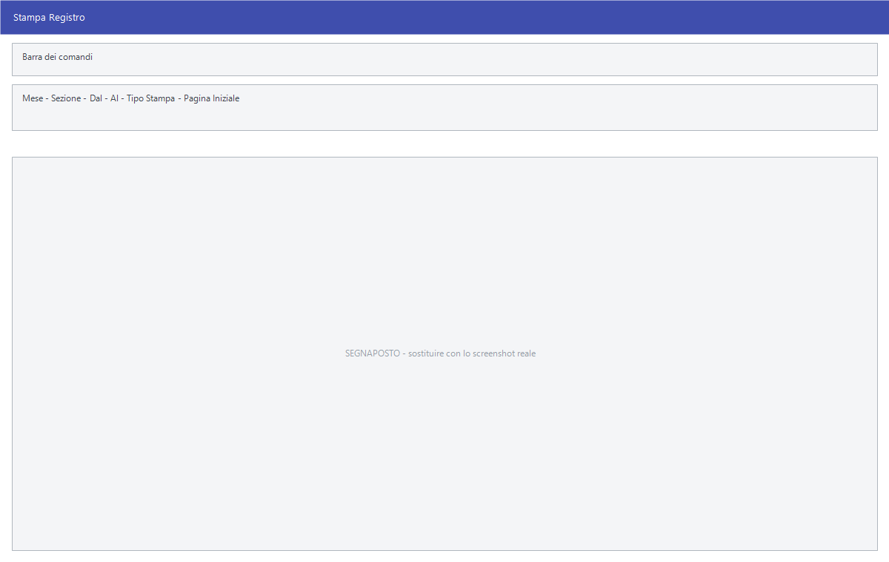

# Registri IVA

Sei voci di menu che aprono **la stessa maschera**, dal titolo *Stampa
Registro*: cambia solo quale registro viene stampato. Sono stampe bollate: le
caselle «Aggiorna» fanno avanzare i progressivi.

!!! info "In sintesi"

    **Percorso:** Menu ▸ Contabilità ▸ Stampe Contabili ▸ Stampa Registro Acquisti *(oppure una delle altre cinque)*
    **Scorciatoia:** ++f2++ avvia la stampa, ++esc++ esce
    **Permessi richiesti:** nessun profilo predefinito; le singole voci di menu si abilitano per ogni utente da [Archivi ▸ Utenti](../anagrafiche/utenti.md)

---

## A cosa serve

Sono i registri IVA obbligatori. Il registro su cui una registrazione finisce
lo decide la [causale contabile](causali-contabili.md) con cui è stata fatta.

| Voce di menu | Registro |
|---|---|
| **Stampa Registro Acquisti** | Le fatture ricevute. |
| **Stampa Registro Fatture Emesse** | Le fatture emesse. |
| **Stampa Registro Corrispettivi** | I corrispettivi del commercio al dettaglio. |
| **Stampa Registro Fatture in Sospensione** | Le fatture a esigibilità differita. |
| **Stampa Registro Acquisti CEE** | Gli acquisti intracomunitari. |
| **Stampa Registro Fatture Emesse CEE** | Le cessioni intracomunitarie. |

## Prerequisiti

Prima di stampare i registri occorre:

- avere registrato tutta la [prima nota](registrazione-prima-nota.md) del
  periodo;
- **aver azzerato le [squadrature](statistiche-e-controlli.md)**;
- aver controllato il periodo con il **Brogliaccio Movimenti**, filtrato sul
  registro che si sta per stampare (vedi
  [Stampe contabili](stampe-contabili.md));
- per i dettaglianti, aver
  [ventilato i corrispettivi](liquidazione-iva.md);
- avere i fogli numerati con **Intestazione Fogli**.

## La maschera

Una finestra sola, uguale per tutti e sei i registri: il periodo, le opzioni di
stampa, le caselle e i pulsanti **F2 - OK** ed **Esci**.

## Campi

| Campo | Obbl. | Descrizione | Valori ammessi |
|---|:---:|---|---|
| **Mese** | ● | Il mese da stampare. | mese |
| **Dal**, **Al** | ● | Il periodo da stampare. | date |
| **Sezione** | | La [sezione](sezioni.md) contabile. | codice |
| **Pagina Iniziale** | ● | Da quale pagina riprendere: è così che la stampa si aggancia alla precedente. | numero |
| **Tipo Stampa** | | `GRAFICA` stampa impaginato sulla stampante di sistema, `TESTO` produce la stampa a caratteri per le stampanti ad aghi. | `GRAFICA`, `TESTO` |
| **Aggiorna Progressivo Pagine** | | Riporta negli archivi il numero di pagina raggiunto. | attivo/non attivo |
| **Aggiorna Data Stampa Bollato** | | Registra che il bollato è stato stampato fino a quella data. | attivo/non attivo |
| **Stampa Riferimento Interno** | | Aggiunge il riferimento interno della registrazione. | attivo/non attivo |
| **Stampa Intestazione** | | Stampa l'intestazione in testa ai fogli. | attivo/non attivo |
| **Stampa Compatta** | | Riduce l'ingombro. | attivo/non attivo |

{: .campi }

## Pulsanti e comandi

| Comando | Scorciatoia | Effetto |
|---|---|---|
| **F2 - OK** | ++f2++ | Prepara e avvia la stampa. |
| **Esci** | ++esc++ | Chiude senza stampare. |
| Elenco di scelta | ++f10++ o ++space++ | Sul campo **Sezione**, apre l'elenco delle sezioni. |
| **Calcolatrice** | ++f12++ | Apre la calcolatrice. |
| **Consultazione** | ++f11++ | Apre la consultazione. |

## Come si fa

### Stampare il registro acquisti del mese

1. Controlla le [squadrature](statistiche-e-controlli.md).
2. Stampa il **Brogliaccio Movimenti** con **Registro** su `REG. ACQUISTI` e
   controllalo.
3. Apri **Stampe Contabili ▸ Stampa Registro Acquisti**.
4. Indica **Mese**, **Dal**, **Al** e la **Pagina Iniziale** ripresa dalla
   stampa precedente.
5. **Fai una prova con le due caselle «Aggiorna» spente** e controlla.
6. Quando è giusta, rifalla con le caselle accese.

### Ristampare un registro già stampato

1. Apri la maschera sullo stesso periodo.
2. Indica la **Pagina Iniziale** da cui quella stampa era partita.
3. **Lascia spente le caselle «Aggiorna»**, altrimenti i progressivi avanzano
   una seconda volta.

## Controlli e messaggi

| Messaggio | Causa | Cosa fare |
|---|---|---|
| *(nessun messaggio, solo un segnale acustico)* | Manca il mese, una delle date o la pagina iniziale. | Compila il campo su cui si è posizionato il cursore. |

## Note

!!! warning "Sono stampe bollate"

    Con **Aggiorna Progressivo Pagine** e **Aggiorna Data Stampa Bollato**
    accese la stampa **non è ripetibile**: il programma registra dove è
    arrivata e la volta dopo riparte da lì. Prima la prova con le caselle
    spente, poi la stampa buona.

!!! note "Il registro dipende dalla causale"

    Una registrazione finisce sul registro che la sua
    [causale contabile](causali-contabili.md) indica. Se una fattura non compare
    sul registro atteso, il posto dove guardare è la causale con cui è stata
    registrata.

<!-- DA VERIFICARE: che rapporto c'è fra il campo Mese e i campi Dal/Al: se il mese sia solo l'intestazione o filtri anch'esso. -->

<!-- DA VERIFICARE: se il titolo della finestra cambi secondo il registro scelto o resti sempre "Stampa Registro". -->

## Vedi anche

- [Stampe contabili](stampe-contabili.md)
- [Causali contabili](causali-contabili.md)
- [Liquidazione IVA e ventilazione](liquidazione-iva.md)
