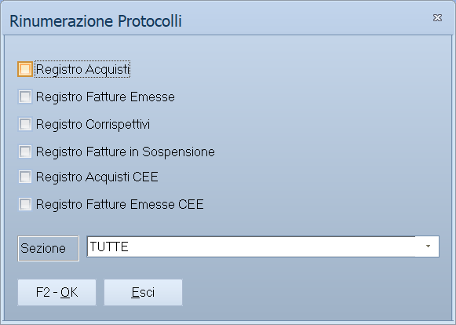

# Rinumerazione protocolli

Rinumera da capo i protocolli dei registri IVA scelti. Serve quando la
numerazione si è sporcata — un buco, un doppione, registrazioni inserite fuori
ordine — e va rimessa in fila.

!!! info "In sintesi"

    - **Percorso:** Menu ▸ Contabilità ▸ Rinumerazione Protocolli
    - **Scorciatoia:** ++f2++ avvia, ++esc++ esce
    - **Permessi richiesti:** nessun profilo predefinito; la voce di menu si abilita per ogni utente da [Archivi ▸ Utenti](../anagrafiche/utenti.md)

---

## A cosa serve

Il protocollo è il numero progressivo con cui una registrazione compare sul
registro IVA. Se si inserisce una fattura dimenticata, o se ne cancella una,
la sequenza non è più continua — e un registro con dei buchi non va bene.

Questa elaborazione ripercorre le registrazioni dei registri scelti e riassegna
i protocolli in ordine.

## Prerequisiti

Prima di lanciarla occorre:

- **avere una copia di sicurezza recente degli archivi**;
- avere finito di registrare il periodo: rinumerare e poi inserire altre
  fatture rimette il problema da capo;
- **non aver ancora stampato i registri sul bollato**, o averlo fatto sapendo
  che i numeri cambieranno.

## La maschera

Una finestra sola: l'elenco della **Sezione**, sei caselle — una per registro —
e i pulsanti **F2 - OK** ed **Esci**.

## Campi

| Campo | Obbl. | Descrizione | Valori ammessi |
|---|:---:|---|---|
| **Sezione** | ● | Su quale [sezione](sezioni.md) contabile intervenire. | codice, oppure `TUTTE` |
| **Registro Acquisti** | | Rinumera il registro acquisti. | attivo/non attivo |
| **Registro Fatture Emesse** | | Rinumera il registro delle fatture emesse. | attivo/non attivo |
| **Registro Corrispettivi** | | Rinumera il registro dei corrispettivi. | attivo/non attivo |
| **Registro Fatture in Sospensione** | | Rinumera il registro delle fatture a esigibilità differita. | attivo/non attivo |
| **Registro Acquisti CEE** | | Rinumera il registro degli acquisti intracomunitari. | attivo/non attivo |
| **Registro Fatture Emesse CEE** | | Rinumera il registro delle cessioni intracomunitarie. | attivo/non attivo |

{: .campi }

Almeno una casella dev'essere spuntata.

## Pulsanti e comandi

| Comando | Scorciatoia | Effetto |
|---|---|---|
| **F2 - OK** | ++f2++ | Avvia la rinumerazione dei registri spuntati. |
| **Esci** | ++esc++ | Chiude senza fare nulla. |
| Elenco di scelta | ++f10++ o ++space++ | Sul campo **Sezione**, apre l'elenco delle sezioni. |
| **Calcolatrice** | ++f12++ | Apre la calcolatrice. |
| **Consultazione** | ++f11++ | Apre la consultazione. |

## Come si fa

### Rimettere in ordine i protocolli del registro acquisti

1. **Fai una copia di sicurezza degli archivi.**
2. Verifica di aver registrato tutte le fatture del periodo.
3. Apri **Menu ▸ Contabilità ▸ Rinumerazione Protocolli**.
4. Scegli la **Sezione**, o lascia `TUTTE`.
5. Spunta **Registro Acquisti** e lascia spente le altre.
6. Premi **F2 - OK**.
7. Ristampa il **Brogliaccio Movimenti** filtrato su quel registro e controlla
   che la sequenza sia continua.

## Controlli e messaggi

| Messaggio | Causa | Cosa fare |
|---|---|---|
| *Selezionare almeno un registro !* | Nessuna delle sei caselle è spuntata. | Spunta il registro o i registri da rinumerare. |

## Note

!!! warning "Attenzione"

    **I numeri di protocollo cambiano, e non si torna indietro.** Se i registri
    sono già stati stampati sul bollato, i numeri sulla carta non
    corrisponderanno più a quelli in archivio. Non esiste un annullamento:
    l'unico rimedio è ricaricare una copia di sicurezza.

    **Rinumera per ultimo.** Registra tutto il periodo, controlla le
    [squadrature](statistiche-e-controlli.md), poi rinumera, poi stampa.

!!! info "Con quale ordine vengono riassegnati"

    Non c'è un criterio solo: i registri d'acquisto e quelli di vendita
    vengono trattati in due passate diverse.

    | Registri | Ordine con cui si rinumera |
    |---|---|
    | Acquisti, Corrispettivi, Acquisti CEE | **Data di registrazione.** |
    | Fatture Emesse, Fatture in Sospensione, Fatture Emesse CEE | **Data di registrazione**, e a parità di data il **numero del documento**, poi la **data del documento**, poi il numero interno della registrazione. |

    In tutti e due i casi ogni **sezione** ha la sua numerazione: le sezioni
    non si mescolano.

!!! warning "Riparte da 1, e non chiede conferma"

    Prima di cominciare il programma **azzera i contatori** dei registri che
    hai spuntato, per ogni sezione interessata. Quindi la numerazione riparte
    da **1**, non dal primo protocollo già in uso.

    E non c'è nessuna rete di sicurezza: l'unico messaggio che questa
    finestra sa dare è *Selezionare almeno un registro !* quando non hai
    spuntato niente. Premendo il comando l'elaborazione parte e basta.

    In particolare **il programma non sa, e non chiede, se i registri siano
    già stati stampati sul bollato**. Rinumerare dopo la stampa significa
    ritrovarsi l'archivio che non corrisponde più alla carta, senza modo di
    tornare indietro.

    Prima di lanciarla: una **copia di sicurezza**, e la certezza che nessuno
    stia registrando.

<!-- DA VERIFICARE: questa elaborazione riscrive i protocolli di tutto l'anno e non chiede nessuna conferma: basta un clic per distruggere la corrispondenza con i registri gia' stampati. Vale la pena metterci davanti una richiesta di conferma, o un avviso quando le Date Bollati della ditta dicono che il registro e' gia' stato stampato? -->

## Vedi anche

- [Registri IVA](registri-iva.md)
- [Stampe contabili](stampe-contabili.md)
- [Registrazione di prima nota](registrazione-prima-nota.md)
