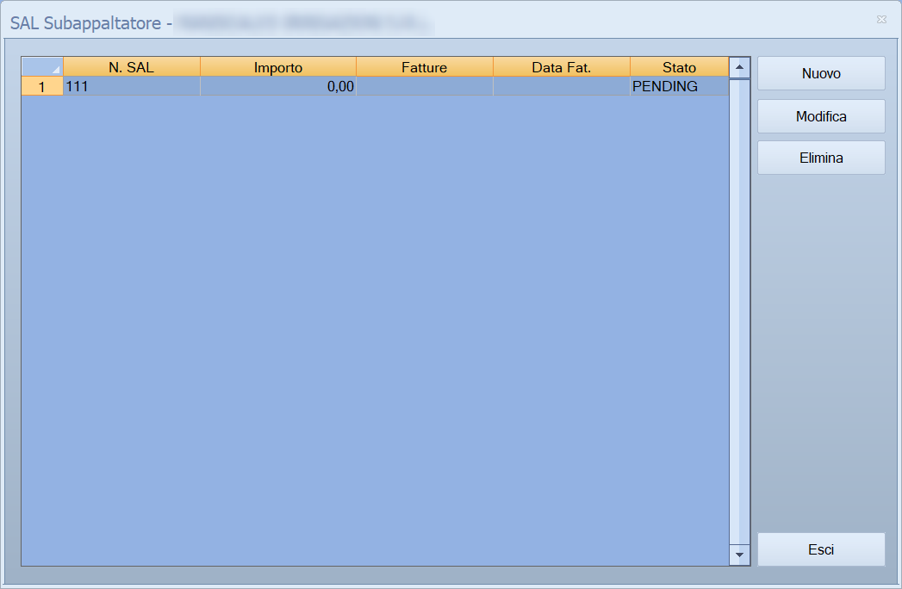
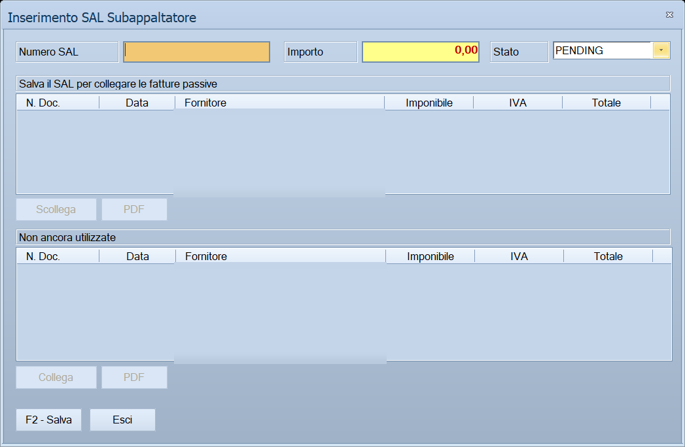

# SAL Subappaltatore

Tiene il conto di **quanto del subappalto è stato eseguito**, un avanzamento
alla volta, e lega ogni avanzamento alle **fatture di acquisto** con cui il
subappaltatore lo ha fatturato. Si apre dalla scheda *Subappaltatori* della
commessa.

!!! info "In sintesi"

    - **Percorso:** Menu ▸ Contabilità ▸ Commesse di Contabilità Analitica ▸ scheda **Subappaltatori** ▸ riga del subappaltatore ▸ **SAL...**
    - **Scorciatoia:** ++enter++ o doppio clic aprono la riga, ++esc++ esce
    - **Permessi richiesti:** quelli della [commessa](commesse.md) da cui si apre; non ha un profilo suo

---

## A cosa serve

Il [subappalto](subappaltatore.md) fissa l'importo pattuito. Il lavoro però
arriva a pezzi, e a pezzi viene fatturato: qui si registra ogni **SAL** —
stato avanzamento lavori — e gli si collegano le fatture del fornitore che lo
coprono.

Due cose che ne derivano, e che sono il motivo per cui conviene tenerli
aggiornati:

- l'**importo di ogni SAL non si digita**: è la somma degli imponibili delle
  fatture che gli hai collegato, quindi non può discostarsi da quanto hai in
  contabilità;
- una fattura può essere collegata **a un solo SAL**, quindi l'elenco delle
  fatture ancora libere ti dice a colpo d'occhio che cosa il subappaltatore ha
  fatturato e tu non hai ancora attribuito.

## Prerequisiti

Prima di usare questa maschera occorre:

- avere il [subappalto](subappaltatore.md) già registrato sulla commessa, con
  il suo fornitore;
- per collegare le fatture, averle **registrate in prima nota** sul registro
  acquisti, intestate a quel fornitore e con almeno una riga imputata a questa
  commessa. Finché non ci sono, l'elenco delle fatture disponibili resta vuoto:
  il SAL si registra lo stesso, ma con importo zero.

## La maschera

Sono **due finestre**. La prima è l'elenco dei SAL di quel subappalto, con i
comandi sulla destra; il titolo porta la ragione sociale del subappaltatore,
perché i SAL sono suoi e non della commessa.

La seconda si apre con **Nuovo** o **Modifica** e si sovrappone esattamente
alla prima, nascondendola: in alto i tre dati del SAL, al centro le **fatture
collegate**, in basso quelle **non ancora utilizzate**, e fra i due elenchi i
comandi per spostare una fattura dall'uno all'altro.

Appena aperta è come nell'immagine: i due elenchi sono spenti e al posto
dell'intestazione si legge l'invito a salvare.

## Campi

### L'elenco dei SAL

| Colonna | Descrizione |
|---|---|
| **N. SAL** | Il numero che hai dato all'avanzamento. È libero: *SAL 1*, *M1*, *2° stato*. L'elenco è ordinato su questa colonna. |
| **Importo** | L'imponibile complessivo delle fatture collegate. **Non si digita.** Senza fatture collegate resta a zero. |
| **Fatture** | I numeri dei documenti collegati, separati da virgola, dal più vecchio al più recente. |
| **Data Fat.** | La data del **primo** documento collegato. Vuota finché non ce n'è nessuno. |
| **Stato** | **PENDING** o **OK**: lo decidi tu, non cambia da solo. |

{: .campi }

### La finestra di inserimento

| Campo | Obbl. | Descrizione | Valori ammessi |
|---|:---:|---|---|
| **Numero SAL** | ● | Come chiami questo avanzamento. Viene portato **in maiuscolo** mentre lo scrivi. | Fino a 15 caratteri |
| **Importo** | | **Sola lettura**, in evidenza su fondo colorato. È l'imponibile delle fatture collegate — totale del documento meno l'IVA — e si aggiorna da solo a ogni collegamento. | Calcolato |
| **Stato** | | A che punto è la verifica dell'avanzamento. | **PENDING** o **OK** |
| **Fatture collegate (fatture passive)** | | Le fatture attribuite a questo SAL: **N. Doc.**, **Data**, **Fornitore**, **Imponibile**, **IVA**, **Totale**. | Elenco |
| **Non ancora utilizzate** | | Le fatture del subappaltatore imputate a questa commessa che **non sono collegate a nessun SAL**, nemmeno a un altro. Stesse colonne. | Elenco |

{: .campi }

La colonna **Obbl.** segna con ● i campi che il programma richiede per
salvare: qui è **solo il numero**.

Nei due elenchi, una riga il cui **Totale** è negativo — una nota di credito —
viene scritta in **rosso**.

## Pulsanti e comandi

### Nell'elenco dei SAL

| Comando | Scorciatoia | Effetto |
|---|---|---|
| **Nuovo** | | Apre la finestra per registrare un nuovo avanzamento. |
| **Modifica** | doppio clic o ++enter++ sulla riga | Apre l'avanzamento selezionato. |
| **Elimina** | | Cancella l'avanzamento selezionato, **senza chiedere conferma**. |
| **Esci** | ++esc++ | Chiude l'elenco e torna alla scheda *Subappaltatori*. |

Senza una riga selezionata, **Modifica** ed **Elimina** non fanno niente.

### Nella finestra di inserimento

| Comando | Scorciatoia | Effetto |
|---|---|---|
| **F2 - Salva** | ++f2++ | Registra il SAL. Se lo stai creando, la finestra **resta aperta** e passa in modifica, così puoi collegare subito le fatture. |
| **Esci** | ++esc++ | Chiude la finestra. I collegamenti già fatti restano: non dipendono dal salvataggio. |
| **Collega** | doppio clic sulla riga dell'elenco in basso | Attribuisce a questo SAL la fattura selezionata fra quelle non ancora utilizzate. L'importo si ricalcola. |
| **Scollega** | doppio clic sulla riga dell'elenco in alto | Toglie il collegamento: la fattura torna fra quelle disponibili e l'importo si ricalcola. |
| **PDF** | | Apre il primo PDF allegato alla registrazione selezionata, ciascuno per il proprio elenco. |
| Consultazione | ++f11++ | Apre la finestra **Consultazione**. |
| Calcolatrice | ++f12++ | Apre la calcolatrice. |
| Campo successivo | ++enter++ o ++down++ | Sposta il cursore sul campo seguente. |
| Campo precedente | ++up++ | Torna al campo precedente. |

## Come si fa

### Registrare un avanzamento e collegargli le fatture

1. Sulla scheda **Subappaltatori** della commessa, mettiti sulla riga del
   subappaltatore e premi **SAL...**.
2. Premi **Nuovo**.
3. Scrivi il **Numero SAL**. I due elenchi in basso sono ancora spenti e al
   posto dell'intestazione leggi *Salva il SAL per collegare le fatture
   passive*: è normale, il collegamento ha bisogno di un SAL già registrato.
4. Premi **F2 - Salva**. La finestra **non si chiude**: cambia titolo, gli
   elenchi si accendono e il cursore si mette su quello in basso.
5. Nell'elenco **Non ancora utilizzate** seleziona una fattura e premi
   **Collega**, oppure falle doppio clic. Sale nell'elenco di sopra e
   l'**Importo** in alto si aggiorna.
6. Ripeti per tutte le fatture che coprono questo avanzamento.
7. Quando la verifica è conclusa, porta lo **Stato** a **OK** e premi
   **F2 - Salva**: la finestra si chiude e la riga è aggiornata nell'elenco.

### Correggere un collegamento sbagliato

1. Apri il SAL con **Modifica**.
2. Seleziona la fattura nell'elenco **Fatture collegate** e premi
   **Scollega**, oppure falle doppio clic.
3. La fattura torna nell'elenco in basso, disponibile per un altro SAL, e
   l'importo si riduce di conseguenza.

### Controllare una fattura prima di collegarla

1. Seleziona la riga nell'elenco in cui si trova.
2. Premi il **PDF** che sta sotto a quell'elenco: si apre il documento
   allegato alla registrazione di prima nota.

## Controlli e messaggi

| Messaggio | Causa | Cosa fare |
|---|---|---|
| *Nessun PDF allegato a questa registrazione.* | Hai premuto **PDF** su una fattura che in prima nota non ha allegati in formato PDF. | Nessun rimedio dalla maschera: l'allegato va aggiunto alla registrazione di prima nota. |

## Note

!!! warning "Elimina non chiede conferma"

    Nell'elenco, **Elimina** cancella subito l'avanzamento selezionato: niente
    domanda, niente possibilità di annullare. Spariscono anche i collegamenti
    alle sue fatture — che però **non vengono toccate**: tornano semplicemente
    disponibili per un altro SAL.

    Prima di premerlo, controlla di essere sulla riga giusta.

!!! warning "Collega e Scollega agiscono subito"

    I due comandi **non aspettano il salvataggio**: il collegamento viene
    registrato nel momento in cui lo fai, e **Esci** non lo annulla. Per
    tornare indietro devi usare **Scollega**.

!!! note "L'importo non si scrive, si costruisce"

    Il campo **Importo** è di sola lettura in entrambe le finestre. Vale
    l'imponibile delle fatture collegate — il totale del documento meno
    l'IVA — quindi un SAL senza fatture vale zero anche se il lavoro è stato
    fatto.

    È voluto: l'avanzamento di un subappalto vale quello che il
    subappaltatore ha fatturato, e il confronto con l'importo pattuito nella
    finestra [Subappaltatore](subappaltatore.md) dice quanto resta.

!!! note "Perché una fattura non compare fra quelle disponibili"

    L'elenco in basso mostra solo le fatture che soddisfano **tutte** queste
    condizioni: sono registrazioni del **registro acquisti**, sono intestate
    al **fornitore di questo subappalto**, hanno almeno una riga imputata a
    **questa commessa** e non sono ancora collegate a **nessun** SAL.

    Se una fattura che ti aspetti non c'è, è quasi sempre perché è già
    collegata a un altro avanzamento, oppure perché in prima nota nessuna sua
    riga porta il numero di questa commessa.

!!! note "Senza numero il salvataggio non avviene, e non lo dice"

    Premendo **F2 - Salva** con il **Numero SAL** vuoto, il programma emette
    un **segnale acustico** e riporta il cursore su quel campo: non compare
    nessun messaggio e la finestra resta aperta. Lo stesso accade premendo
    **Collega**, **Scollega** o **PDF** senza aver selezionato una riga.

## Vedi anche

- [Subappaltatore](subappaltatore.md)
- [Commesse di Contabilità Analitica](commesse.md)
- [Registrazione di prima nota](registrazione-prima-nota.md)
