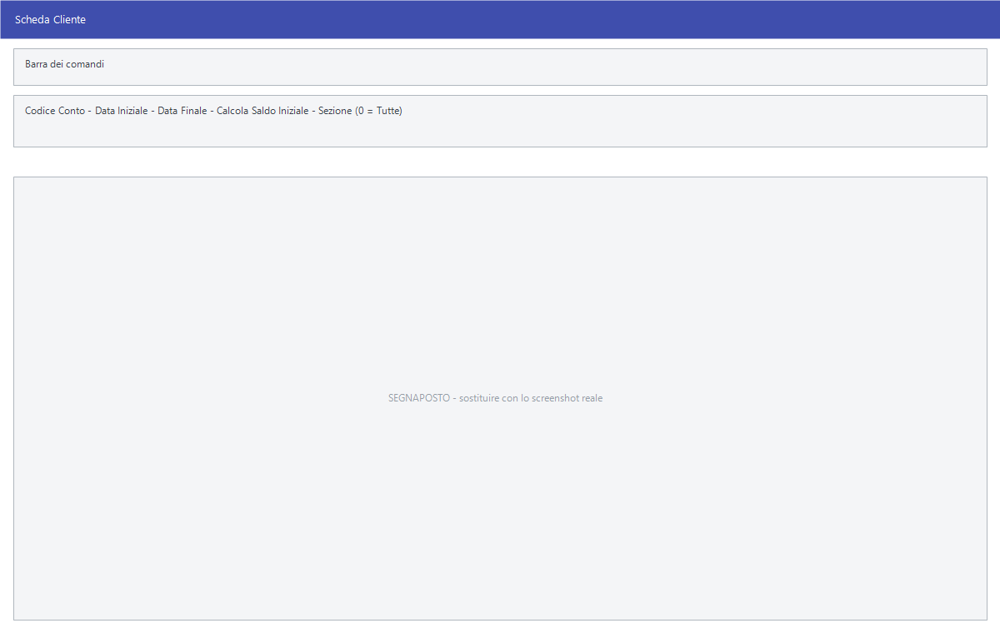

# Scheda cliente, fornitore e conto

La stessa maschera vista da tre voci di menu: mostra a video tutte le
registrazioni di un cliente, di un fornitore o di un conto in un periodo, con
il saldo che si accumula riga per riga. Da lì si apre la registrazione che non
torna.

!!! info "In sintesi"

    - **Percorso:** Menu ▸ Contabilità ▸ Scheda Cliente *(oppure* Scheda Fornitore *o* Scheda Conto*)*
    - **Scorciatoia:** ++f2++ apre la registrazione, ++f3++ stampa, ++f4++ aggiorna
    - **Permessi richiesti:** nessun profilo predefinito; le singole voci di menu si abilitano per ogni utente da [Archivi ▸ Utenti](../anagrafiche/utenti.md)

---

## A cosa serve

È la domanda «quanto mi deve questo cliente, e da cosa viene fuori». La stampa
delle [schede](../anagrafiche/stampe-clienti.md) dà lo stesso contenuto su
carta; questa lo dà a video, e permette di aprire la registrazione sbagliata e
correggerla senza cambiare maschera.

Il titolo della finestra dice quale delle tre si sta usando: *Scheda Cliente*,
*Scheda Fornitore* o *Scheda Conto*.

## Prerequisiti

Prima di usare questa maschera occorre avere le registrazioni di
[prima nota](registrazione-prima-nota.md) del periodo.

## La maschera

In alto la barra dei comandi e i campi della selezione; sotto la griglia delle
registrazioni; in fondo i totali **SALDO**, **DARE** e **AVERE**.

La griglia ha queste colonne:

| Colonna | Contenuto |
|---|---|
| **Sel.** | La spunta, che serve alla stampa e ai comandi di selezione. |
| **Data** | Data di registrazione. |
| **Numero Doc.**, **Data Doc.** | Gli estremi del documento. |
| **Sez.** | La [sezione](sezioni.md) contabile. |
| **Descrizione** | La descrizione della registrazione. |
| **Verific.** | Segna le registrazioni marcate come da verificare. |
| **Dare**, **Avere** | Gli importi. |
| **Saldo** | Il saldo progressivo riga per riga. |
| **Codice** | Numero della registrazione. |
| **Commessa** | La [commessa](commesse.md) a cui la riga è imputata. |

## Campi

| Campo | Obbl. | Descrizione | Valori ammessi |
|---|:---:|---|---|
| **Codice Conto** | ● | Il cliente, il fornitore o il conto di cui vedere la scheda. | codice |
| **Data Iniziale**, **Data Finale** | ● | Il periodo da mostrare. | date |
| **Calcola Saldo Iniziale** | | Se calcolare il saldo che il conto aveva prima della **Data Iniziale**, così il progressivo parte da lì invece che da zero. | attivo/non attivo |
| **Sezione (0 = Tutte)** | | Restringe a una [sezione](sezioni.md). L'etichetta ricorda che `0` le prende tutte. | codice, `0` per tutte |

## Pulsanti e comandi

| Comando | Scorciatoia | Effetto |
|---|---|---|
| **F2 - Modifica** | ++f2++ | Apre in [modifica](registrazione-prima-nota.md) la registrazione della riga. |
| **F3 - Stampa** | ++f3++ | Stampa la scheda. |
| **F4 - Aggiorna** | ++f4++ | Rilegge le registrazioni, per vedere le modifiche appena fatte. |
| **F5 - Sel.** | ++f5++ | Spunta tutte le righe. |
| **F6 - Desel.** | ++f6++ | Toglie la spunta a tutte le righe. |
| **F9 - Trova** | ++f9++ | Cerca un testo nella griglia. |
| **Calcolatrice** | ++f12++ | Apre la calcolatrice. |
| **Consultazione** | ++f11++ | Apre la consultazione. |

## Come si fa

### Capire da cosa viene il saldo di un cliente

1. Apri **Menu ▸ Contabilità ▸ Scheda Cliente**.
2. Indica il **Codice Conto** del cliente.
3. Metti **Data Iniziale** all'inizio dell'esercizio e **Data Finale** a oggi.
4. Attiva **Calcola Saldo Iniziale** se vuoi partire dal saldo dell'anno
   precedente.
5. Scorri la colonna **Saldo**: dice come il debito si è formato.

### Correggere una registrazione sbagliata trovata nella scheda

1. Trova la riga e premi **F2 - Modifica**.
2. Correggi la registrazione e salva.
3. Torna alla scheda e premi **F4 - Aggiorna** per rivedere i saldi.

## Controlli e messaggi

| Messaggio | Causa | Cosa fare |
|---|---|---|
| *(nessun messaggio, solo un segnale acustico)* | Manca il **Codice Conto** o una delle date. | Compila il campo su cui si è posizionato il cursore. |

## Note

!!! note "Con Calcola Saldo Iniziale spento il saldo parte da zero"

    Senza quella casella il progressivo della colonna **Saldo** conta solo le
    righe del periodo scelto: è utile per leggere il movimentato del mese, ma
    non è il saldo vero del conto.

!!! note "La Sezione filtra tutto, saldo iniziale compreso"

    Indicando una sezione la scheda diventa per intero la scheda di quella
    sezione: non solo le righe del periodo, ma anche il **saldo iniziale**
    viene calcolato sui soli movimenti di quella sezione.

    La scheda torna quindi quadrata in sé, e non c'è il rischio di leggere un
    saldo d'apertura di tutta la ditta con un movimentato di una sola
    sezione.

    Se l'utente con cui sei entrato ha una sezione assegnata, il campo è già
    compilato con quella e **non si può cambiare**.

!!! info "La colonna Sel. non serve solo a stampare"

    Togliendo la spunta a una riga, i tre totali in fondo alla scheda —
    **Dare**, **Avere** e **Saldo** — si **ricalcolano subito** sulle sole
    righe rimaste spuntate, sempre a partire dal saldo iniziale.

    È il modo pratico per rispondere a *«quanto sarebbe il saldo se questa
    fattura non ci fosse?»*: si toglie la spunta, si legge il saldo, si
    rimette. Niente viene modificato in archivio.

    Le righe non spuntate restano fuori anche dalla **stampa** della scheda,
    e i comandi che spuntano o tolgono la spunta a tutte servono a partire
    dall'uno o dall'altro estremo.

## Vedi anche

- [Gestione prima nota](gestione-prima-nota.md)
- [Stampe clienti](../anagrafiche/stampe-clienti.md)
- [Stampe del piano dei conti](stampe-piano-dei-conti.md)
