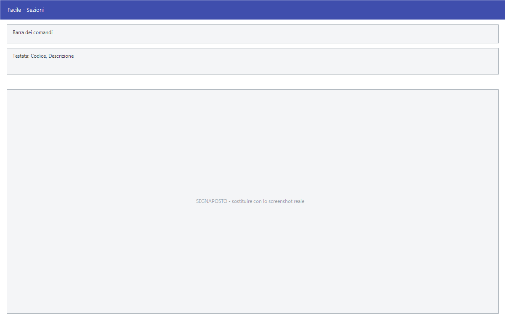

# Sezioni

Da questa maschera si definiscono le sezioni contabili: le partizioni in cui si
divide la contabilità dell'azienda. Per ciascuna si può stabilire che resti
fuori da certe elaborazioni fiscali.

!!! info "In sintesi"

    - **Percorso:** Menu ▸ Archivi ▸ Contabilità ▸ Sezioni ▸ Inserimento *(oppure* Modifica*)*
    - **Scorciatoia:** nessuna; la maschera si apre dal menu
    - **Permessi richiesti:** nessun profilo predefinito; **Inserimento** e **Modifica** si abilitano separatamente per ogni utente da [Archivi ▸ Utenti](../anagrafiche/utenti.md)

---

## A cosa serve

La sezione è la partizione con cui si tengono separate contabilità che
convivono nella stessa azienda. Ogni registrazione di prima nota ne indica una,
le causali contabili ne propongono una, e i saldi di mastri, conti e sottoconti
si leggono per sezione.

Le quattro caselle in basso servono a tenere una sezione fuori da elaborazioni
che non la riguardano: una sezione usata per registrazioni interne, per
esempio, si può escludere dalle liquidazioni IVA e dalle stampe contabili.

## Prerequisiti

*Nessuno.* È una delle prime tabelle da compilare, perché le causali contabili
la richiamano.

## La maschera

È una maschera a finestra unica, senza schede: la **barra dei comandi**, codice
e descrizione, e il riquadro **Escludi da** con quattro caselle.

## Campi

| Campo | Obbl. | Descrizione | Valori ammessi |
|---|:---:|---|---|
| Codice | ● | Identificativo della sezione. In modifica non è modificabile. | Numero |
| Descrizione | ● | Nome della sezione, come compare in prima nota e nelle stampe. | Fino a 30 caratteri |
| Liquidazioni IVA | | La sezione non entra nelle liquidazioni IVA. | Casella |
| Ventilazione Corrispettivi | | La sezione non entra nella ventilazione dei corrispettivi. | Casella |
| Stampe Contabili | | La sezione non entra nelle stampe contabili. | Casella |
| Spesometro | | La sezione non entra nello spesometro. | Casella |

{: .campi }

Le quattro caselle stanno nel riquadro **Escludi da**: spuntarle **toglie** la
sezione da quell'elaborazione, non la aggiunge.

## Pulsanti e comandi

| Comando | Scorciatoia | Effetto |
|---|---|---|
| **F2 - Salva** | ++f2++ | Registra la sezione. In inserimento la maschera si svuota per la successiva. |
| **F3 - Prec.** | ++f3++ | Passa alla sezione precedente. |
| **F4 - Succ.** | ++f4++ | Passa alla sezione successiva. |
| **F5 - Cerca** | ++f5++ | Apre l'elenco delle sezioni. |
| **F6 - Elimina** | ++f6++ | Cancella la sezione, previa conferma. |
| **Ricarica** | | Rilegge la sezione dall'archivio, abbandonando le modifiche non salvate. |

Valgono inoltre:

| Comando | Scorciatoia | Effetto |
|---|---|---|
| Consultazione | ++f11++ | Apre la finestra **Consultazione**. |
| Calcolatrice | ++f12++ | Apre la calcolatrice. |
| Campo successivo | ++enter++ | Sposta il cursore sul campo seguente. |
| Chiusura | ++esc++ | Chiude la maschera. |

## Come si fa

### Creare una sezione

1. Apri **Menu ▸ Archivi ▸ Contabilità ▸ Sezioni ▸ Inserimento**.
2. Digita il **Codice** e la **Descrizione**.
3. Lascia le quattro caselle vuote se la sezione deve entrare in tutte le
   elaborazioni.
4. Premi **F2 - Salva**.

### Tenere una sezione fuori dalle liquidazioni IVA

1. Premi **F5 - Cerca** e carica la sezione.
2. Nel riquadro *Escludi da* spunta **Liquidazioni IVA**.
3. Premi **F2 - Salva**.

## Controlli e messaggi

| Messaggio | Causa | Cosa fare |
|---|---|---|
| *(nessun messaggio, solo un segnale acustico)* | Manca il **Codice** o la **Descrizione**. | Guarda dove si è posizionato il cursore: è il campo da compilare. |
| *In archivio è già presente un record con lo stesso codice.* | Il codice digitato è già di un'altra sezione. | Cambia codice. |
| *Confermi la Cancellazione....* | Conferma richiesta da **F6 - Elimina**. | Rispondi **Sì** per eliminare la sezione. |
| *Non è possibile eliminare il record poiché utilizzato in alcuni record del database.* | La sezione compare in registrazioni di prima nota, su documenti o in scadenze. | Non è eliminabile: lasciala in archivio. |
| *Il record è stato modificato da un altro nodo della rete.* | Un altro utente ha salvato la stessa sezione mentre la modificavi. | Premi **Ricarica**, verifica cosa è cambiato e rifai le tue modifiche. |
| *Il record è stato cancellato da un altro nodo della rete.* | Un altro utente ha eliminato la sezione mentre la modificavi. | La maschera si chiude: non c'è più nulla da salvare. |

## Note

!!! warning "Attenzione"

    Le quattro caselle escludono **da quel momento in avanti**: spuntando
    *Liquidazioni IVA* su una sezione già usata, le liquidazioni già stampate
    non cambiano, ma le successive non la conteranno più.

    ++esc++ chiude la maschera senza chiedere conferma e senza salvare: le
    modifiche fatte dopo l'ultimo **F2 - Salva** vanno perse.

!!! info "Perché tenere più di una sezione"

    La ragione pratica è **la numerazione dei registri IVA**. I progressivi dei
    sei registri — acquisti, fatture emesse, corrispettivi, fatture in
    sospensione, acquisti CEE, fatture emesse CEE — sono tenuti **per sezione e
    per anno**, ciascuno con il suo contatore.

    Vuol dire che due sezioni hanno due numerazioni di protocollo che corrono
    in parallelo: la prima fattura d'acquisto della sezione 2 prende il
    protocollo 1 anche se la sezione 1 è già arrivata a trecento.

    Da qui i casi in cui servono davvero:

    - **attività con contabilità separate** dentro la stessa partita IVA, che
      per legge devono tenere registri distinti;
    - **più punti vendita o più rami d'azienda** che vogliono registri e
      liquidazioni leggibili separatamente;
    - un'attività che **ventila i corrispettivi** accanto a una che non li
      ventila: si separano, e sulla seconda si spunta *Ventilazione
      Corrispettivi*;
    - una sezione di **comodo per le scritture interne** — giroconti,
      assestamenti, riclassificazioni — che non deve sporcare né le
      liquidazioni né lo spesometro. È il caso in cui si spuntano quasi tutte
      e quattro le caselle.

    Se l'azienda ha una contabilità sola, **una sezione basta** e non c'è
    nessun vantaggio ad aggiungerne.

!!! warning "La sezione si sceglie quando si registra, non dopo"

    Il protocollo viene assegnato dal contatore della sezione al momento della
    registrazione. Spostare dopo una registrazione da una sezione all'altra
    lascia un buco nella numerazione di partenza e un protocollo fuori sequenza
    in quella d'arrivo: se i registri sono già stati stampati sul bollato, non
    si rimedia.

## Vedi anche

- [Causali contabili](causali-contabili.md)
- [Mastri](mastri.md)
