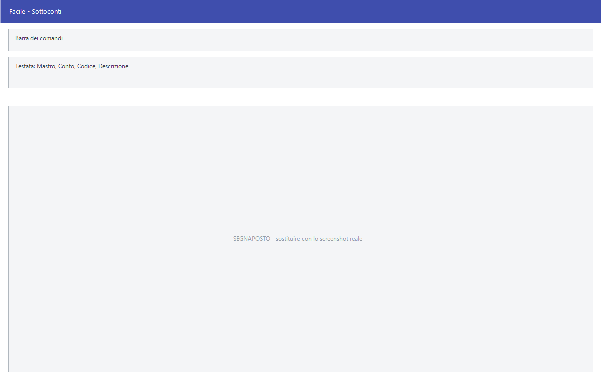

# Sottoconti

Da questa maschera si definiscono i sottoconti: il terzo e ultimo livello del
piano dei conti, quello su cui le registrazioni di prima nota si appoggiano
davvero.

!!! info "In sintesi"

    - **Percorso:** Menu ▸ Archivi ▸ Contabilità ▸ Sottoconti ▸ Inserimento *(oppure* Modifica*)*
    - **Scorciatoia:** nessuna; la maschera si apre dal menu
    - **Permessi richiesti:** nessun profilo predefinito; **Inserimento** e **Modifica** si abilitano separatamente per ogni utente da [Archivi ▸ Utenti](../anagrafiche/utenti.md)

---

## A cosa serve

Il sottoconto è il conto vero e proprio: quando registri una fattura in prima
nota, l'importo va a finire su un sottoconto. Mastro e conto servono solo a
raggrupparli.

Da qui si stabilisce anche la natura del sottoconto — attività, passività,
costo, ricavo — che è quella che decide da che parte del bilancio finisce, e se
la contabilità analitica deve chiedere centro di costo, commessa o dettaglio.

Esempio: il sottoconto *ENERGIA ELETTRICA* di tipo *COSTI*, con **Centro di
Costo Obbligatorio** spuntato, non si può registrare senza dire a quale centro
di costo la bolletta appartiene.

## Prerequisiti

Prima di creare un sottoconto occorre aver definito il **[mastro](mastri.md)**
e il **[conto](conti.md)** a cui appartiene.

Sono facoltativi, ma se li usi devono esistere prima: i
[conti per la riclassificazione](conti-riclassificazione.md), i
[centri di costo](centri-di-costo.md) e le [aliquote IVA](aliquote-iva.md).

## La maschera

È una maschera a finestra unica: in alto la **barra dei comandi**, poi le tre
righe che identificano il sottoconto — mastro, conto e sottoconto, ciascuno con
la sua descrizione — quindi la riclassificazione, il riquadro della contabilità
analitica, il codice IVA e i codici per il trasferimento; in fondo la griglia
dei saldi.

## Campi

| Campo | Obbl. | Descrizione | Valori ammessi |
|---|:---:|---|---|
| Mastro | ● | Mastro a cui il sottoconto appartiene. Accanto compare la descrizione. | Codice dall'archivio mastri |
| Conto | ● | Conto a cui il sottoconto appartiene. Accanto compare la descrizione. | Codice dall'archivio conti |
| Codice | ● | Identificativo del sottoconto dentro il conto. In modifica non è modificabile. | Numero |
| Descrizione | ● | Nome del sottoconto, come compare in prima nota e nelle stampe. | Fino a 30 caratteri |
| Tipo | | Natura del sottoconto: decide dove finisce nel bilancio. | ATTIVITA, PASSIVITA, COSTI, RICAVI, TRANSITORI |
| Riclassificazione | | I cinque codici della riclassificazione a cui il sottoconto è agganciato. Accanto compare la descrizione. | Codici dall'archivio conti per la riclassificazione |
| Centro di Costo Obbligatorio | | La registrazione non si salva senza centro di costo. | Casella |
| Commessa Obbligatoria | | La registrazione non si salva senza commessa. | Casella |
| Dettaglio Obbligatorio | | La registrazione non si salva senza dettaglio. | Casella |
| Cen.Costo Preferenziale | | Centro di costo proposto sulle registrazioni di questo sottoconto. | Codice dall'archivio centri di costo |
| Codice IVA | | Aliquota IVA proposta sulle registrazioni. Accanto compare la descrizione. | Codice dall'archivio aliquote IVA |
| Codici per Trasferimento | | I tre codici — mastro, conto e sottoconto — con cui il sottoconto viene riconosciuto nei trasferimenti verso altre sedi. | Codici |

{: .campi }

La griglia in basso non si compila: mostra i saldi del sottoconto con le
colonne **Sezione**, **Anno**, **Dare**, **Avere** e **Saldo**.

## Pulsanti e comandi

| Comando | Scorciatoia | Effetto |
|---|---|---|
| **F2 - Salva** | ++f2++ | Registra il sottoconto. In inserimento la maschera si svuota per il successivo. |
| **F3 - Prec.** | ++f3++ | Passa al sottoconto precedente. |
| **F4 - Succ.** | ++f4++ | Passa al sottoconto successivo. |
| **F5 - Cerca** | ++f5++ | Apre l'elenco dei sottoconti. |
| **F6 - Elimina** | ++f6++ | Cancella il sottoconto, previa conferma. |
| **Ricarica** | | Rilegge il sottoconto dall'archivio, abbandonando le modifiche non salvate. |

Valgono inoltre:

| Comando | Scorciatoia | Effetto |
|---|---|---|
| Consultazione | ++f11++ | Apre la finestra **Consultazione**. |
| Calcolatrice | ++f12++ | Apre la calcolatrice. |
| Campo successivo | ++enter++ | Sposta il cursore sul campo seguente. |
| Chiusura | ++esc++ | Chiude la maschera. |

## Come si fa

### Creare un sottoconto di costo

1. Apri **Menu ▸ Archivi ▸ Contabilità ▸ Sottoconti ▸ Inserimento**.
2. Indica **Mastro** e **Conto**: accanto compaiono le descrizioni, così
   controlli di essere nel ramo giusto.
3. Digita **Codice** e **Descrizione**.
4. Imposta **Tipo** = *COSTI*.
5. Se il costo va sempre imputato a un centro di costo, spunta **Centro di
   Costo Obbligatorio** e indica il **Cen.Costo Preferenziale**.
6. Premi **F2 - Salva**.

### Agganciare un sottoconto alla riclassificazione

1. Carica il sottoconto.
2. Compila i codici di **Riclassificazione**: accanto compare la descrizione
   del conto riclassificato, che conferma la scelta.
3. Premi **F2 - Salva**.

### Controllare il saldo di un sottoconto

1. Premi **F5 - Cerca** e carica il sottoconto.
2. Leggi la griglia in basso: una riga per sezione e per anno.

## Controlli e messaggi

| Messaggio | Causa | Cosa fare |
|---|---|---|
| *(nessun messaggio, solo un segnale acustico)* | Manca uno fra **Mastro**, **Conto**, **Codice** e **Descrizione**. | Guarda dove si è posizionato il cursore: è il campo da compilare. |
| *In archivio è già presente un record con lo stesso codice.* | Nel conto indicato c'è già un sottoconto con quel codice. | Cambia codice, o verifica di essere nel conto giusto. |
| *Confermi la Cancellazione....* | Conferma richiesta da **F6 - Elimina**. | Rispondi **Sì** per eliminare il sottoconto. |
| *Non è possibile eliminare il record pochè utilizzato in alcuni record del database.* | Il sottoconto compare in righe di prima nota, in scadenze pagate o in una causale contabile. | Non è eliminabile: lascialo in archivio. |
| *Il record è stato modificato da un altro nodo della rete.* | Un altro utente ha salvato lo stesso sottoconto mentre lo modificavi. | Premi **Ricarica**, verifica cosa è cambiato e rifai le tue modifiche. |
| *Il record è stato cancellato da un altro nodo della rete.* | Un altro utente ha eliminato il sottoconto mentre lo modificavi. | La maschera si chiude: non c'è più nulla da salvare. |

## Note

!!! warning "Attenzione"

    Il **Tipo** decide da che parte del bilancio finisce il sottoconto:
    sbagliarlo non dà nessun errore, ma sposta l'importo dal conto economico
    allo stato patrimoniale o viceversa. Va controllato prima di cominciare a
    registrare.

    Le tre caselle di obbligatorietà valgono **da quel momento in avanti**: le
    registrazioni già fatte senza centro di costo restano come sono.

    ++esc++ chiude la maschera senza chiedere conferma e senza salvare: le
    modifiche fatte dopo l'ultimo **F2 - Salva** vanno perse.

<!-- DA VERIFICARE: la Riclassificazione ha cinque caselle affiancate. Corrispondono ai cinque livelli del codice di riclassificazione? Vanno compilate tutte o solo le prime? -->

<!-- DA VERIFICARE: il tipo TRANSITORI. In quali casi si usa? -->

## Vedi anche

- [Mastri](mastri.md)
- [Conti](conti.md)
- [Centri di costo/ricavo](centri-di-costo.md)
- [Conti per la riclassificazione](conti-riclassificazione.md)
