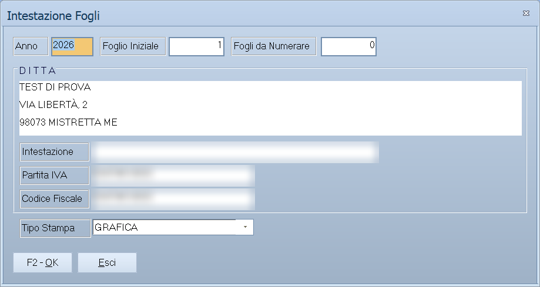

# Stampe contabili

Il sottomenu **Stampe Contabili** raccoglie le stampe della contabilità: quelle
di controllo, che si rifanno quante volte si vuole, e quelle **bollate**, che
aggiornano i progressivi e vanno fatte una volta sola.

!!! info "In sintesi"

    - **Percorso:** Menu ▸ Contabilità ▸ Stampe Contabili ▸ Intestazione Fogli *(oppure* Brogliaccio Movimenti*,* Libro Mastro*,* Stampa Libro Giornale*,* Bilancio di Verifica*)*
    - **Scorciatoia:** ++f2++ avvia la stampa, ++esc++ esce
    - **Permessi richiesti:** nessun profilo predefinito; le singole voci di menu si abilitano per ogni utente da [Archivi ▸ Utenti](../anagrafiche/utenti.md)

---

## A cosa serve

| Voce di menu | Cosa stampa |
|---|---|
| **Intestazione Fogli** | Numera e intesta i fogli da usare per le stampe bollate. |
| **Brogliaccio Movimenti** | L'elenco delle registrazioni di un periodo, per controllo. Non è una stampa fiscale e si può rifare a piacere. |
| **Libro Mastro** | I movimenti conto per conto. |
| **Stampa Libro Giornale** | Il libro giornale, in ordine cronologico. È una stampa bollata. |
| **Bilancio di Verifica** | Il bilancio a una data, per mastri o per contabilità analitica. |

Le altre due voci del sottomenu aprono stampe già descritte altrove:
**Elenco IVA Clienti** è in
[Stampe clienti](../anagrafiche/stampe-clienti.md), **Elenco IVA Fornitori** in
[Stampe fornitori](../anagrafiche/stampe-fornitori.md). I
[registri IVA](registri-iva.md) hanno una pagina propria.

## Prerequisiti

Prima di usare queste maschere occorre:

- avere registrato tutta la [prima nota](registrazione-prima-nota.md) del
  periodo;
- **aver azzerato le [squadrature](statistiche-e-controlli.md)**;
- per le stampe bollate, avere i fogli numerati con **Intestazione Fogli**.

## La maschera

Sono finestre di selezione con i campi del periodo, le opzioni della stampa e
i pulsanti **F2 - OK** ed **Esci**.

Quasi tutte hanno un campo **Tipo Stampa** con due valori: `GRAFICA` stampa
impaginato sulla stampante di sistema, `TESTO` produce la stampa a caratteri
per le stampanti ad aghi dei moduli continui.

## Campi

### Intestazione Fogli

| Campo | Obbl. | Descrizione | Valori ammessi |
|---|:---:|---|---|
| **Anno** | ● | L'anno da stampare sui fogli. | anno |
| **Foglio Iniziale** | ● | Il numero da cui partire. | numero |
| **Fogli da Numerare** | ● | Quanti fogli intestare. | numero |
| **Intestazione** | | La ragione sociale da stampare. | testo |
| **Partita IVA**, **Codice Fiscale** | | I dati fiscali da stampare. | testo |
| **Tipo Stampa** | | Come stampare. | `TESTO`, `GRAFICA` |
| **Stampa Compatta** | | Riduce l'ingombro. | attivo/non attivo |

{: .campi }

### Brogliaccio Movimenti

| Campo | Obbl. | Descrizione | Valori ammessi |
|---|:---:|---|---|
| **Da Num. Reg.**, **A Num. Reg.** | | Intervallo di numeri di registrazione. | numeri |
| **Da Data Reg.**, **A Data Reg.** | | Intervallo di date. | date |
| **Sezione** | | La [sezione](sezioni.md) contabile. | codice |
| **Causale** | | Restringe a una [causale](causali-contabili.md). | codice |
| **Registro** | | Quale registro esaminare. | `TUTTI`, `LIBRO GIORNALE`, `REG. ACQUISTI`, `REG. FATTURE EMESSE`, `REG. CORRISPETTIVI`, `REG. FATTURE IN SOSPENSIONE`, `REG. ACQUISTI CEE`, `REG. FATTURE EMESSE CEE` |

{: .campi }

### Libro Mastro

| Campo | Obbl. | Descrizione | Valori ammessi |
|---|:---:|---|---|
| **Da Conto**, **A Conto** | | Intervallo di conti. | codici |
| **Dal**, **Al** | ● | Il periodo. | date |
| **Sezione** | | La [sezione](sezioni.md) contabile. | codice |
| **Tipo Stampa** | | Come stampare. | `GRAFICA`, `TESTO` |
| **Stampa Intestazione** | | Stampa l'intestazione in testa ai fogli. | attivo/non attivo |

{: .campi }

### Stampa Libro Giornale

| Campo | Obbl. | Descrizione | Valori ammessi |
|---|:---:|---|---|
| **Dal**, **Al** | ● | Il periodo da stampare. | date |
| **Da Numero**, **A Numero** | | Intervallo di numeri di registrazione. | numeri |
| **Pagina Iniziale**, **Rigo Iniziale** | ● | Da quale pagina e riga riprendere: è così che la stampa si aggancia a quella precedente. | numeri |
| **DARE**, **AVERE** | | I progressivi riportati dalla stampa precedente. | importi |
| **Sezione** | | La [sezione](sezioni.md) contabile. | codice |
| **Tipo Stampa** | | Come stampare. | `GRAFICA`, `TESTO` |
| **Aggiorna Data Stampa Bollato** | | Registra che il bollato è stato stampato fino a quella data. | attivo/non attivo |
| **Aggiorna Progressivo Pagine** | | Riporta il numero di pagina raggiunto. | attivo/non attivo |
| **Aggiorna Progressivo Righi** | | Riporta il numero di riga raggiunto. | attivo/non attivo |
| **Aggiorna Totali Libro Giornale** | | Riporta i totali dare e avere raggiunti. | attivo/non attivo |
| **Stampa Compatta** | | Riduce l'ingombro. | attivo/non attivo |
| **Stampa Riferimento Interno** | | Aggiunge il riferimento interno della registrazione. | attivo/non attivo |
| **Stampa Intestazione** | | Stampa l'intestazione in testa ai fogli. | attivo/non attivo |

{: .campi }

### Bilancio di Verifica

| Campo | Obbl. | Descrizione | Valori ammessi |
|---|:---:|---|---|
| **Data Inizio Calcolo**, **Data Fine Calcolo** | ● | Il periodo su cui calcolare i saldi. | date |
| **Data Stampa Bilancio** | | La data da stampare in testa. | data |
| **Mastri - Analitica** | | Se raggruppare per mastri o per contabilità analitica. | `MASTRI`, `ANALITICA` |
| **Dettaglio Clienti/Fornitori** | | Se scendere al singolo cliente o fornitore. | `NO`, `SI` |
| **Sezione (0 = TUTTE)** | | La [sezione](sezioni.md) contabile. | codice, `0` per tutte |
| **Formato Stampa** | | L'impaginazione. | `NORMALE`, `SEZIONI CONTRAPPOSTE` |

{: .campi }

## Pulsanti e comandi

| Comando | Scorciatoia | Effetto |
|---|---|---|
| **F2 - OK** | ++f2++ | Prepara e avvia la stampa. |
| **Esci** | ++esc++ | Chiude senza stampare. |
| Elenco di scelta | ++f10++ o ++space++ | Sul campo con il codice, apre l'elenco da cui scegliere. |
| **Calcolatrice** | ++f12++ | Apre la calcolatrice. |
| **Consultazione** | ++f11++ | Apre la consultazione. |

## Come si fa

### Controllare le registrazioni del mese prima delle stampe fiscali

1. Apri **Menu ▸ Contabilità ▸ Stampe Contabili ▸ Brogliaccio Movimenti**.
2. Indica il periodo in **Da Data Reg.** e **A Data Reg.**.
3. Premi **F2 - OK** e controlla la stampa: è il momento per correggere.

### Stampare il libro giornale sul bollato

1. Fai girare le [squadrature](statistiche-e-controlli.md) e sistemale.
2. Stampa prima il **Brogliaccio Movimenti** e controllalo.
3. Apri **Stampe Contabili ▸ Stampa Libro Giornale**.
4. Indica il periodo e riprendi **Pagina Iniziale**, **Rigo Iniziale**,
   **DARE** e **AVERE** dalla stampa precedente.
5. **Fai una prova con tutte e quattro le caselle «Aggiorna» spente**, e
   controlla il risultato.
6. Quando la stampa è giusta, rifalla con le caselle «Aggiorna» accese: solo
   allora i progressivi avanzano.

### Stampare il bilancio di verifica

1. Apri **Stampe Contabili ▸ Bilancio di Verifica**.
2. Indica **Data Inizio Calcolo** e **Data Fine Calcolo**.
3. Metti **Dettaglio Clienti/Fornitori** su `NO` per un bilancio leggibile.
4. Premi **F2 - OK**.

## Controlli e messaggi

| Messaggio | Causa | Cosa fare |
|---|---|---|
| *Impossibile Inizializzare la Stampa!* | Il programma non riesce ad avviare la stampa del libro giornale. | Verifica che la stampante sia disponibile; se il problema resta, segnala all'assistenza. |
| *Impossibile Inizializzare la stampa!* | Come sopra, nell'intestazione fogli. | Come sopra. |
| *Troppe sezioni selezionate.* / *Le ultime saranno scartate !* | Si sono indicate più sezioni di quante la stampa ne gestisca. | Riduci le sezioni e ripeti la stampa per gruppi. |

## Note

!!! warning "Le caselle «Aggiorna» fanno avanzare i progressivi"

    **Aggiorna Data Stampa Bollato**, **Aggiorna Progressivo Pagine**,
    **Aggiorna Progressivo Righi** e **Aggiorna Totali Libro Giornale**
    scrivono negli archivi il punto a cui la stampa è arrivata. Con quelle
    accese la stampa **non è ripetibile**: la volta dopo riparte da dove si è
    fermata.

    La regola è: prima una prova con le caselle spente, poi la stampa buona con
    le caselle accese.

<!-- DA VERIFICARE: dove si leggono i progressivi (pagina, rigo, dare, avere) da riportare nella stampa successiva: presumibilmente nelle Date Bollati della ditta. -->

<!-- DA VERIFICARE: cosa cambia fra "Tipo Stampa" GRAFICA e TESTO in termini di stampanti supportate. -->

<!-- DA VERIFICARE: come si indicano più sezioni nel libro giornale, visto che il messaggio parla di "troppe sezioni selezionate". -->

## Vedi anche

- [Registri IVA](registri-iva.md)
- [Statistiche e controlli contabili](statistiche-e-controlli.md)
- [Liquidazione IVA e ventilazione](liquidazione-iva.md)
- [Stampe del piano dei conti](stampe-piano-dei-conti.md)
