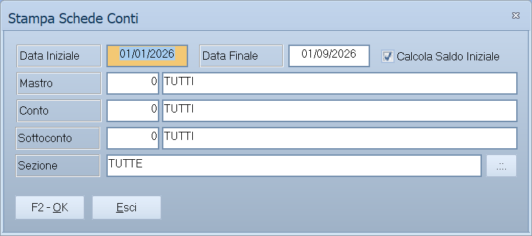

# Stampe del piano dei conti

Le tre voci in fondo a **Archivi ▸ Contabilità**: la scheda di un conto, il
piano dei conti nudo e il piano dei conti con i saldi.

!!! info "In sintesi"

    - **Percorso:**
        - Menu ▸ Archivi ▸ Contabilità ▸ Stampa Schede Conti
        - Menu ▸ Archivi ▸ Contabilità ▸ Stampa Piano dei Conti
        - Menu ▸ Archivi ▸ Contabilità ▸ Stampa Piano dei Conti con Totali
    - **Scorciatoia:** ++f2++ avvia la stampa, ++esc++ esce
    - **Permessi richiesti:** nessun profilo predefinito; le singole voci di menu si abilitano per ogni utente da [Archivi ▸ Utenti](../anagrafiche/utenti.md)

---

## A cosa serve

| Voce di menu | Cosa stampa |
|---|---|
| **Stampa Schede Conti** | Le registrazioni di un conto in un periodo, con il saldo progressivo. È la scheda contabile, l'equivalente per i conti di quella di clienti e fornitori. |
| **Stampa Piano dei Conti** | L'elenco della struttura: mastri, conti e sottoconti. Serve a controllare come il piano è fatto. |
| **Stampa Piano dei Conti con Totali** | Lo stesso elenco, ma con i saldi del periodo accanto a ogni voce. |

## Prerequisiti

Prima di usare queste maschere occorre avere costruito il piano dei conti —
[mastri](mastri.md), [conti](conti.md) e [sottoconti](sottoconti.md) — e, per
le stampe con i saldi, avere le registrazioni del periodo.

## La maschera

Sono tre finestrelle con pochi campi e i pulsanti **F2 - OK** ed **Esci**.

## Campi

### Stampa Schede Conti

| Campo | Obbl. | Descrizione | Valori ammessi |
|---|:---:|---|---|
| **Data Iniziale** | ● | Primo giorno del periodo. | data |
| **Data Finale** | ● | Ultimo giorno del periodo. | data |
| **Mastro** | | Restringe a un [mastro](mastri.md). | codice |
| **Conto** | | Restringe a un [conto](conti.md). | codice |
| **Sottoconto** | | Restringe a un [sottoconto](sottoconti.md). | codice |
| **Sezione** | | Restringe a una [sezione](sezioni.md) contabile. | codice |

### Stampa Piano dei Conti

| Campo | Obbl. | Descrizione | Valori ammessi |
|---|:---:|---|---|
| **Solo Mastri** | | Ferma la stampa al primo livello, senza scendere a conti e sottoconti. | `SI`, `NO` |
| **Includi Clienti** | | Se stampare anche i sottoconti dei clienti, che sono molti. | `SI`, `NO` |
| **Includi Fornitori** | | Se stampare anche i sottoconti dei fornitori. | `SI`, `NO` |

### Stampa Piano dei Conti con Totali

Gli stessi tre campi della stampa precedente, più:

| Campo | Obbl. | Descrizione | Valori ammessi |
|---|:---:|---|---|
| **Data Iniziale**, **Data Finale** | ● | Il periodo su cui calcolare i totali. | date |
| **Mastro Iniziale**, **Mastro Finale** | | L'intervallo di mastri da stampare. | codici |

## Pulsanti e comandi

| Comando | Scorciatoia | Effetto |
|---|---|---|
| **F2 - OK** | ++f2++ | Prepara e mostra l'anteprima della stampa. |
| **Esci** | ++esc++ | Chiude senza stampare. |
| Elenco di scelta | ++f10++ o ++space++ | Sul campo con il codice, apre l'elenco da cui scegliere. |
| **Calcolatrice** | ++f12++ | Apre la calcolatrice. |
| **Consultazione** | ++f11++ | Apre la consultazione. |

## Come si fa

### Stampare la scheda di un conto

1. Apri **Menu ▸ Archivi ▸ Contabilità ▸ Stampa Schede Conti**.
2. Indica **Data Iniziale** e **Data Finale**.
3. Indica **Mastro**, **Conto** e **Sottoconto** del conto che ti interessa.
4. Premi **F2 - OK**.

### Controllare com'è fatto il piano dei conti

1. Apri **Menu ▸ Archivi ▸ Contabilità ▸ Stampa Piano dei Conti**.
2. Metti **Includi Clienti** e **Includi Fornitori** su `NO`: la struttura si
   legge, senza le migliaia di sottoconti delle anagrafiche.
3. Premi **F2 - OK**.

### Vedere i saldi di tutti i conti

1. Apri **Menu ▸ Archivi ▸ Contabilità ▸ Stampa Piano dei Conti con Totali**.
2. Indica il periodo e l'intervallo di mastri.
3. Premi **F2 - OK**.

## Controlli e messaggi

| Messaggio | Causa | Cosa fare |
|---|---|---|
| *(nessun messaggio, solo un segnale acustico)* | Manca una delle date obbligatorie. | Compila il campo su cui si è posizionato il cursore. |

## Note

!!! note "Clienti e fornitori sono sottoconti"

    In Facile ogni cliente e ogni fornitore è anche un sottoconto: per questo
    le due stampe del piano dei conti chiedono se includerli. Con **Includi
    Clienti** su `SI` la stampa può diventare di centinaia di pagine.

!!! info "I totali sono il movimentato del periodo, non il saldo a fine periodo"

    **Stampa Piano dei Conti con Totali** somma **solo le registrazioni che
    cadono fra Dal e Al**. Non parte da nessun saldo d'apertura.

    Non ci si accorge della differenza perché all'apertura la finestra propone
    **dal 1° gennaio dell'anno di lavoro a oggi**, e su quel periodo il
    movimentato coincide con il progressivo. Ma restringendo le date — per
    esempio a un solo mese — si ottiene quello che è successo **in quel mese**,
    non il saldo alla fine del mese.

    I sottoconti di tipo *transitorio* restano fuori dal conteggio.

!!! info "Stampa Schede Conti con i codici vuoti"

    I tre campi sono filtri indipendenti, e ognuno lasciato vuoto toglie il
    suo livello di selezione:

    - **Sottoconto** vuoto: tutti i sottoconti del conto indicato;
    - **Conto** vuoto: tutti i conti del mastro indicato;
    - **Mastro** vuoto: **tutti i mastri tranne quelli di clienti e
      fornitori**, che restano sempre esclusi da questa stampa.

    Lasciandoli vuoti tutti e tre si ottiene quindi la scheda di **ogni conto
    della contabilità generale**, uno dopo l'altro. Su un archivio di qualche
    anno sono parecchie pagine: conviene guardarla in anteprima prima di
    mandarla in stampa.

    Per clienti e fornitori ci sono le loro stampe dedicate.

## Vedi anche

- [Mastri](mastri.md)
- [Conti](conti.md)
- [Sottoconti](sottoconti.md)
- [Conti per la riclassificazione](conti-riclassificazione.md)
