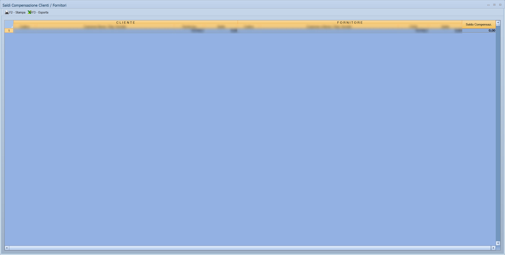

# Statistiche e controlli contabili

Cinque voci che non registrano nulla: leggono quello che è stato registrato e
lo raccontano — quanto si è venduto e comprato, chi è insieme cliente e
fornitore, e dove la contabilità non quadra.

!!! info "In sintesi"

    - **Percorso:**
        - Menu ▸ Contabilità ▸ Saldi Compensazione Clienti/Fornitori
        - Menu ▸ Contabilità ▸ Statistica Vendite
        - Menu ▸ Contabilità ▸ Statistica Acquisti
        - Menu ▸ Contabilità ▸ Statistica Acquisti su Conto
        - Menu ▸ Contabilità ▸ Squadrature Movimenti
        - Menu ▸ Contabilità ▸ Stampa Rapporti
    - **Scorciatoia:** ++f2++ avvia, ++esc++ esce
    - **Permessi richiesti:** nessun profilo predefinito; le singole voci di menu si abilitano per ogni utente da [Archivi ▸ Utenti](../anagrafiche/utenti.md)

---

## A cosa serve

| Voce di menu | A cosa serve |
|---|---|
| **Statistica Vendite** | Quanto si è venduto a ciascun cliente in un periodo. La finestra si chiama *Statistica Vendite*. |
| **Statistica Acquisti** | Quanto si è comprato da ciascun fornitore. Apre la stessa maschera, con il campo intestato **Fornitore**. |
| **Statistica Acquisti su Conto** | Gli acquisti raggruppati per conto invece che per fornitore: dice **su cosa** si è speso. |
| **Saldi Compensazione Clienti/Fornitori** | I soggetti che sono insieme clienti e fornitori, con i due saldi affiancati: quanto ti devono e quanto devi. |
| **Squadrature Movimenti** | Le registrazioni in cui dare e avere non coincidono. È il controllo da fare prima di ogni stampa fiscale. |
| **Stampa Rapporti** | I rapporti contabili a una data. |

## Prerequisiti

Prima di usare queste maschere occorre avere le registrazioni di
[prima nota](registrazione-prima-nota.md) del periodo.

## La maschera

Sono finestre di selezione con pochi campi e i pulsanti **F2 - OK** ed
**Esci**. **Saldi Compensazione Clienti / Fornitori** si apre invece a tutto
schermo, con la griglia dei soggetti.

## Campi

### Statistica Vendite e Statistica Acquisti

| Campo | Obbl. | Descrizione | Valori ammessi |
|---|:---:|---|---|
| **Data Iniziale**, **Data Finale** | ● | Il periodo da esaminare. | date |
| **Sezione (0 = Tutte)** | | Restringe a una [sezione](sezioni.md). | codice, `0` per tutte |
| **Cliente** | | Restringe a un nominativo. Nella statistica acquisti l'etichetta è **Fornitore**. | codice |

### Statistica Acquisti su Conto

Gli stessi campi, più:

| Campo | Obbl. | Descrizione | Valori ammessi |
|---|:---:|---|---|
| **Conto** | | Restringe a un [conto](conti.md). | codice |
| **Ordinamento** | | Come ordinare la stampa. | `CODICE`, `ALFABETICO` |

### Squadrature Movimenti

| Campo | Obbl. | Descrizione | Valori ammessi |
|---|:---:|---|---|
| **Sezione** | | La [sezione](sezioni.md) da controllare. A fianco l'etichetta ricorda **( 0 Tutte le Sezioni )**. | codice, `0` per tutte |
| **Da Num. Reg.**, **A Num. Reg.** | | Intervallo di numeri di registrazione. | numeri |
| **Da Data Reg.**, **A Data Reg.** | | Intervallo di date di registrazione. | date |
| **Causale** | | Restringe a una [causale](causali-contabili.md). | codice |

### Stampa Rapporti

| Campo | Obbl. | Descrizione | Valori ammessi |
|---|:---:|---|---|
| **Data** | ● | La data a cui riferire i rapporti. Dev'essere dentro l'anno di lavoro. | data |
| **Mostra Anteprima di Stampa** | | Fa vedere ogni rapporto a video prima di mandarlo alla stampante. | attivo/non attivo |
| **Includi nella stampa** | | Le caselle dei rapporti da produrre: vedi sotto. | una o più caselle |

## Pulsanti e comandi

| Comando | Scorciatoia | Effetto |
|---|---|---|
| **F2 - OK** | ++f2++ | Avvia l'elaborazione e mostra il risultato. |
| **Esci** | ++esc++ | Chiude senza fare nulla. |
| Elenco di scelta | ++f10++ o ++space++ | Sul campo con il codice, apre l'elenco da cui scegliere. |
| **Calcolatrice** | ++f12++ | Apre la calcolatrice. |
| **Consultazione** | ++f11++ | Apre la consultazione. |

## Come si fa

### Controllare che la contabilità quadri

1. Apri **Menu ▸ Contabilità ▸ Squadrature Movimenti**.
2. Lascia **Sezione** a `0` e indica il periodo in **Da Data Reg.** e **A Data
   Reg.**.
3. Premi **F2 - OK**. **Ogni riga che esce è una registrazione da
   correggere**: aprila dalla [gestione prima nota](gestione-prima-nota.md) e
   sistema la squadratura.
4. Ripeti finché la stampa esce vuota, poi procedi con le
   [stampe contabili](stampe-contabili.md).

### Sapere quanto si è venduto a un cliente

1. Apri **Menu ▸ Contabilità ▸ Statistica Vendite**.
2. Indica il periodo e il **Cliente**.
3. Premi **F2 - OK**.

### Vedere chi è insieme cliente e fornitore

1. Apri **Menu ▸ Contabilità ▸ Saldi Compensazione Clienti/Fornitori**.
2. La griglia elenca i soggetti presenti in entrambi gli archivi con i due
   saldi: è da lì che si decide se compensare.

## Controlli e messaggi

| Messaggio | Causa | Cosa fare |
|---|---|---|
| *(nessun messaggio, solo un segnale acustico)* | Manca una delle date obbligatorie. | Compila il campo su cui si è posizionato il cursore. |

## Note

!!! warning "Le squadrature vanno azzerate prima delle stampe fiscali"

    Una registrazione squadrata falsa il bilancio e i registri. Fai girare
    **Squadrature Movimenti** prima di stampare il libro giornale, i registri
    IVA e il bilancio di verifica.

!!! info "Quali rapporti produce Stampa Rapporti"

    Non è un rapporto solo: nel riquadro **Includi nella stampa** si spunta
    quello che serve, e premendo **F2 - OK** escono uno dopo l'altro.

    | Casella | Che cosa stampa |
    |---|---|
    | **Movimenti Cassa** | La scheda contabile dei conti di cassa. |
    | **Movimenti Banche** | La scheda contabile dei conti di banca. |
    | **Saldi Clienti** | La sintesi delle scadenze dei clienti. |
    | **Saldi Fornitori** | La sintesi delle scadenze dei fornitori. |
    | **Credito Generato** | Il credito maturato verso i clienti. |
    | **Debito Generato** | Il debito maturato verso i fornitori. |

    C'è anche una casella **Documenti Emessi**, ma è **spenta**: compare
    nella finestra e non si può spuntare.

    Spuntandole tutte si ottiene la fotografia della situazione a quella
    data in sei stampe, che è il modo veloce di preparare il fascicolo per
    il titolare o per il consulente.

!!! info "Le colonne dei Saldi Compensazione"

    Nove colonne, in tre gruppi:

    | Gruppo | Colonne |
    |---|---|
    | Il cliente | **Codice**, **Descrizione**, **P. IVA**, **Saldo** |
    | Il fornitore | **Codice**, **Descrizione**, **P. IVA**, **Saldo** |
    | La differenza | **Saldo**, cioè quanto resta dopo aver compensato i due |

    L'ultima riga è il **TOTALE** delle tre colonne di saldo.

    Quando allo stesso cliente corrispondono **più fornitori**, al posto del
    nome compare *MULTIPLI FORNITORI* e al posto della partita IVA una fila
    di `X`: il saldo è la somma di tutti.

!!! warning "L'abbinamento lo fai tu, e la compensazione la registri tu"

    La finestra mette insieme cliente e fornitore **solo se sono stati
    collegati a mano**: sull'anagrafica del cliente c'è il campo con il
    codice del fornitore corrispondente, e viceversa. Senza quel
    collegamento il soggetto non compare qui, per quanto la partita IVA sia
    la stessa.

    E la finestra **non registra niente**: mostra i due saldi e la
    differenza, e li stampa. La scrittura che compensa il credito con il
    debito va fatta a mano in
    [prima nota](registrazione-prima-nota.md).

## Vedi anche

- [Gestione prima nota](gestione-prima-nota.md)
- [Stampe contabili](stampe-contabili.md)
- [Liquidazione IVA](liquidazione-iva.md)
