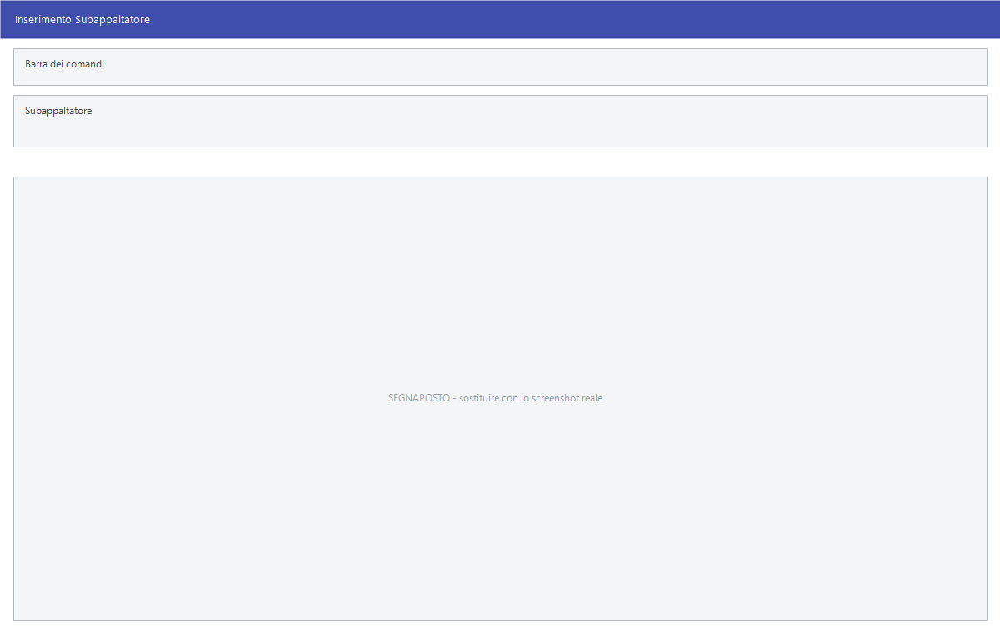

# Subappaltatore

Registra **un subappalto affidato su una commessa**: chi lo esegue, per quanto,
con quale contratto e quale ordine, e che cosa comprende. È la finestra che si
apre dalla scheda *Subappaltatori* della commessa.

!!! info "In sintesi"

    - **Percorso:** Menu ▸ Contabilità ▸ Commesse di Contabilità Analitica ▸ scheda **Subappaltatori** ▸ **Nuovo**
    - **Scorciatoia:** ++f2++ salva, ++esc++ esce, ++f1++ apre questa pagina
    - **Permessi richiesti:** quelli della [commessa](commesse.md) da cui si apre; non ha un profilo suo

---

## A cosa serve

Su una commessa una parte dei lavori si affida a terzi. Qui si annota ogni
affidamento — il fornitore, l'importo pattuito, gli estremi del contratto e
dell'ordine, l'attività — così che la commessa sappia quanto è stato dato
fuori e a chi.

È l'anagrafica del subappalto, non il suo avanzamento: quanto è stato
riconosciuto al subappaltatore si registra con i
[SAL](sal-subappaltatore.md), che si raggiungono dal pulsante **SAL...**
della stessa scheda.

## Prerequisiti

Prima di usare questa maschera occorre:

- avere la **commessa** già salvata: la finestra si apre dalla sua scheda;
- avere in archivio il [fornitore](../anagrafiche/anagrafica-fornitori.md) a
  cui il lavoro è affidato.

## La maschera

Una finestra sola, senza schede. In alto il **Codice** e il **Fornitore**, al
centro l'**Importo** e gli estremi di contratto e ordine appaiati su due
righe, in basso la descrizione dell'attività su più righe. I due pulsanti
stanno in fondo a sinistra.

## Campi

| Campo | Obbl. | Descrizione | Valori ammessi |
|---|:---:|---|---|
| **Codice** | | **Sola lettura.** Lo assegna il programma; non si digita. | Numero |
| **Fornitore** | ● | Chi esegue il subappalto. Si digita il codice, oppure si sceglie dall'elenco con un doppio clic o con ++space++ sul campo. Accanto compare la ragione sociale, anch'essa di sola lettura. | Codice dall'archivio fornitori |
| **Importo** | | L'importo pattuito per il subappalto. | Numero con decimali |
| **Numero Contratto** | | Il numero del contratto di subappalto. | Testo |
| **Data Contratto** | | La data del contratto. | Data |
| **Numero Ordine** | | Il numero dell'ordine emesso al subappaltatore. | Testo |
| **Data Ordine** | | La data dell'ordine. | Data |
| **Descr. Attivita'** | | Che cosa comprende il subappalto. È un campo **su più righe**: ci sta una descrizione distesa, non una sigla. | Testo |

{: .campi }

La colonna **Obbl.** segna con ● i campi che il programma richiede
obbligatoriamente per salvare. Qui è **solo il fornitore**: tutto il resto si
può lasciare in bianco e completare più avanti.

## Pulsanti e comandi

| Comando | Scorciatoia | Effetto |
|---|---|---|
| **F2 - Salva** | ++f2++ | Registra il subappalto e chiude la finestra. La riga compare — o si aggiorna — nell'elenco della scheda. |
| **Esci** | ++esc++ | Chiude senza salvare niente. |
| Elenco fornitori | doppio clic o ++space++ sul campo **Fornitore** | Apre la ricerca dei fornitori; scegliendone uno, codice e ragione sociale si compilano da soli e il cursore passa al campo seguente. |
| Guida | ++f1++ | Apre questa pagina del manuale. |
| Consultazione | ++f11++ | Apre la finestra **Consultazione**. |
| Calcolatrice | ++f12++ | Apre la calcolatrice. |
| Campo successivo | ++enter++ o ++down++ | Sposta il cursore sul campo seguente. |
| Campo precedente | ++up++ | Torna al campo precedente. |

## Come si fa

### Registrare un subappalto

1. Apri la commessa e vai sulla scheda **Subappaltatori**.
2. Premi **Nuovo**: si apre la finestra, con il **Codice** già assegnato.
3. Digita il codice del **Fornitore**, oppure fai doppio clic sul campo e
   scegli dall'elenco. Controlla che accanto compaia la ragione sociale
   giusta.
4. Compila **Importo**, gli estremi del **contratto** e dell'**ordine**, e la
   **Descr. Attivita'** per quanto ti serve.
5. Premi **F2 - Salva**. La finestra si chiude e la riga è nell'elenco.

### Correggere un subappalto già registrato

1. Sulla scheda **Subappaltatori** seleziona la riga e premi **Modifica**.
2. Si apre la stessa finestra, con i dati compilati e il **Codice** che non
   cambia.
3. Correggi quello che serve e premi **F2 - Salva**.

## Controlli e messaggi

| Messaggio | Causa | Cosa fare |
|---|---|---|
| *\*\*\* INESISTENTE \*\*\** al posto della ragione sociale | Il codice fornitore digitato non è in archivio. Il programma emette anche un segnale acustico. | Controlla il codice, oppure apri l'elenco con un doppio clic sul campo e scegli il fornitore. |

## Note

!!! warning "Senza fornitore il salvataggio non avviene, e non lo dice"

    Premendo **F2 - Salva** con il campo **Fornitore** vuoto, il programma
    emette un **segnale acustico** e riporta il cursore su quel campo: non
    compare nessun messaggio e la finestra resta aperta.

    Se sembra che il salvataggio «non faccia niente», è quasi sempre questo:
    guarda se il cursore è saltato sul fornitore.

!!! note "Nel campo Attivita' l'Invio va a capo, non avanza"

    **Descr. Attivita'** è su più righe, quindi lì ++enter++ inserisce un
    a-capo e le frecce ++up++ e ++down++ scorrono il testo, invece di passare
    al campo seguente. Per uscirne usa ++tab++, oppure ++ctrl+enter++ e
    ++ctrl+down++.

!!! note "Il subappalto è una cosa, il suo avanzamento un'altra"

    Qui si registra l'affidamento. Quanto è stato via via riconosciuto al
    subappaltatore si annota nei [SAL](sal-subappaltatore.md), dal pulsante **SAL...** della scheda
    *Subappaltatori*: sono due elenchi distinti, e l'importo scritto qui è
    quello pattuito, non quello già maturato.

## Vedi anche

- [Commesse di Contabilità Analitica](commesse.md)
- [SAL Subappaltatore](sal-subappaltatore.md)
- [Anagrafica fornitori](../anagrafiche/anagrafica-fornitori.md)
