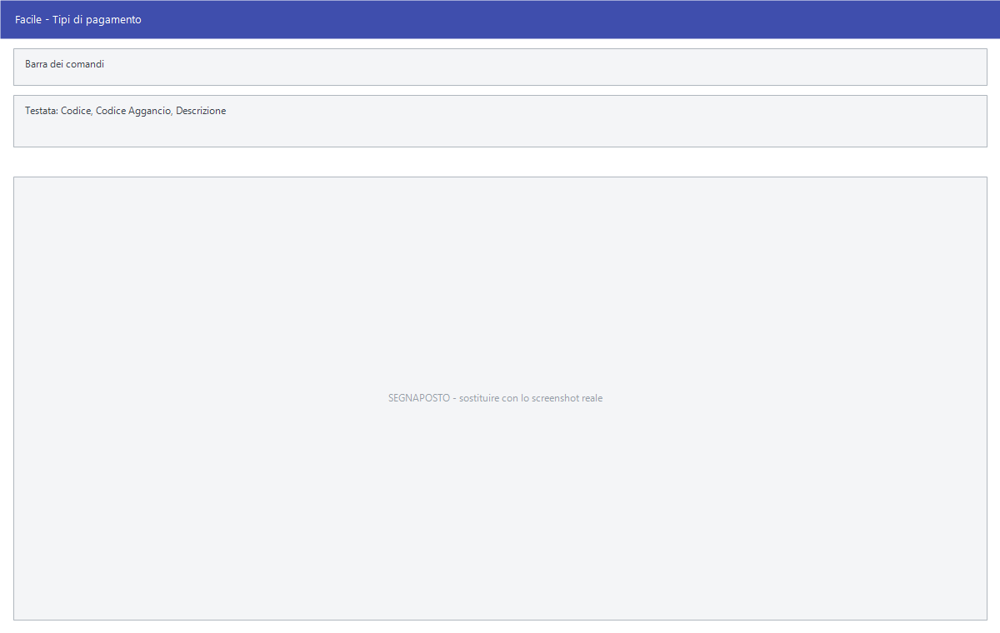

# Tipi di pagamento

Da questa maschera si definiscono i tipi di pagamento: quante rate, a che
distanza, da quale data si contano, quali mesi saltare e quali spese
addebitare. È la regola con cui Facile costruisce le scadenze di ogni
documento.

!!! info "In sintesi"

    - **Percorso:** Menu ▸ Archivi ▸ Tipi di Pagamento ▸ Inserimento *(oppure* Modifica*)*
    - **Scorciatoia:** nessuna; la maschera si apre dal menu
    - **Permessi richiesti:** nessun profilo predefinito; **Inserimento** e **Modifica** si abilitano separatamente per ogni utente da [Archivi ▸ Utenti](../anagrafiche/utenti.md)

---

## A cosa serve

Il tipo di pagamento è ciò che trasforma un totale fattura in una o più
scadenze. Ogni cliente e ogni fornitore ne indica uno nella propria anagrafica,
i documenti lo ereditano, e da lì nascono le partite aperte.

Esempio: *Bonifico 60 giorni fine mese in due rate* si costruisce con **Tipo
Pagamento** = *BONIFICO*, **Tipo Scadenza** = *FINE MESE*, **Inizio Scadenza**
= 60, **Rate** = 2 e **Periodicità** = 30.

È una tabella che si compila una volta e si tocca di rado, ma è anche quella
che si sbaglia più facilmente: le tre voci **Inizio Scadenza**, **Rate** e
**Periodicità** vanno lette insieme.

## Prerequisiti

*Nessuno.* È una delle prime tabelle da compilare: le anagrafiche di clienti e
fornitori la richiamano, e su un cliente nuovo Facile propone il tipo di
pagamento di codice 1.

## La maschera

È una maschera a finestra unica, senza schede. Dall'alto in basso:

- la **barra dei comandi**;
- l'anagrafica del pagamento: codice, descrizione e tipo;
- le regole di calcolo delle scadenze: rate, inizio, periodicità e mesi da
  escludere;
- la casella della nota per i prodotti alimentari;
- i due riquadri **Tratta IVA** e **Spese di Rivalsa**.

## Campi

### Anagrafica

| Campo | Obbl. | Descrizione | Valori ammessi |
|---|:---:|---|---|
| Codice | ● | Identificativo del tipo di pagamento. In inserimento il programma propone il primo codice libero. In modifica non è modificabile. | Numero |
| Codice Aggancio | | Codice con cui il pagamento viene riconosciuto nei tracciati esterni. | Fino a 6 caratteri |
| Descrizione | ● | Denominazione del pagamento, come compare nelle anagrafiche e sui documenti. | Fino a 30 caratteri |
| Tipo Pagamento | | Modalità di pagamento, nella codifica usata anche dalla fattura elettronica. | RIMESSA DIRETTA, RI.BA., RID, TRATTA, ASSEGNO, CONTRASSEGNO, CONTANTI, ASSEGNO CIRCOLARE, CONTANTI PRESSO TESORERIA, BONIFICO, VAGLIA CAMBIARIO, BOLLETTINO BANCARIO, CARTA DI PAGAMENTO, RID UTENZE, RID VELOCE, MAV, QUIETANZA ERARIO, GIROCONTO CONTI SPECIALI, DOMICILIAZIONE BANCARIA, DOMICILIAZIONE POSTALE, BOLLETTINO DI C/C POSTALE, SEPA DIRECT DEBIT, SEPA DIRECT DEBIT CORE, SEPA DIRECT DEBIT B2B, TRATTENUTA SOMME RISCOSSE, PAGO PA |

{: .campi }

### Calcolo delle scadenze

| Campo | Obbl. | Descrizione | Valori ammessi |
|---|:---:|---|---|
| Tipo Scadenza | | Da quale data si contano i giorni. *DATA FATTURA*: dalla data del documento. *FINE MESE*: dall'ultimo giorno del mese del documento. *DATA DIVERSA*: dalla data indicata sul singolo documento, e se manca dalla data del documento. | DATA FATTURA, FINE MESE, DATA DIVERSA |
| Rate | | In quante rate si divide l'importo. | Numero, minimo 1 |
| Inizio Scadenza | | Giorni da aggiungere alla data di partenza per ottenere la **prima** scadenza. | Numero di giorni |
| Periodicità | | Giorni fra una rata e la successiva. | Numero di giorni |
| Esclusione Mesi | | Fino a tre mesi in cui le scadenze non devono cadere. Una rata che finirebbe in un mese escluso viene spostata in avanti di una periodicità — o di un giorno, se la periodicità è zero — finché non esce dal mese. | Tre elenchi: NESSUNO, GENNAIO … DICEMBRE |

{: .campi }

### Nota, tratta e spese

| Campo | Obbl. | Descrizione | Valori ammessi |
|---|:---:|---|---|
| Stampa nota "Assolve agli obblighi di cui all' art. 62 co.1 D.L. 24/1/2012 n. 1, convertito con...." | | Fa comparire la nota di legge sui DDT e sulle fatture che usano questo pagamento. Riguarda la cessione di prodotti alimentari. | Casella |
| **Tratta IVA** | | Come trattare l'IVA sulle tratte: *No Tratta*, *Si Tratta*, oppure *Prima Rata* per addebitarla tutta sulla prima. | Una sola delle tre |
| Spese Bolli | | Addebita l'importo indicato a fianco come spese di bollo. | Casella più importo |
| Commissioni Bancarie | | Addebita l'importo indicato a fianco come commissioni bancarie. | Casella più importo |

{: .campi }

## Pulsanti e comandi

| Comando | Scorciatoia | Effetto |
|---|---|---|
| **F2 - Salva** | ++f2++ | Registra il tipo di pagamento. In inserimento la maschera si svuota per il successivo. |
| **F3 - Prec.** | ++f3++ | Passa al pagamento precedente. |
| **F4 - Succ.** | ++f4++ | Passa al pagamento successivo. |
| **F5 - Cerca** | ++f5++ | Apre la finestra **Cerca Tipi di Pagamento**, che elenca codice, descrizione, tipo e numero di rate. |
| **F6 - Elimina** | ++f6++ | Cancella il tipo di pagamento, previa conferma. |
| **Ricarica** | | Rilegge il pagamento dall'archivio, abbandonando le modifiche non salvate. |

Valgono inoltre:

| Comando | Scorciatoia | Effetto |
|---|---|---|
| Guida | ++f1++ | Apre la pagina di guida dell'operazione in corso. |
| Consultazione | ++f11++ | Apre la finestra **Consultazione**. |
| Calcolatrice | ++f12++ | Apre la calcolatrice. |
| Campo successivo | ++enter++ | Sposta il cursore sul campo seguente. |
| Chiusura | ++esc++ | Chiude la maschera. |

## Come si fa

### Creare un pagamento a rimessa diretta

1. Apri **Menu ▸ Archivi ▸ Tipi di Pagamento ▸ Inserimento**.
2. Lascia il **Codice** proposto e scrivi la **Descrizione**, per esempio
   *RIMESSA DIRETTA*.
3. Imposta **Tipo Pagamento** = *RIMESSA DIRETTA* e **Tipo Scadenza** =
   *DATA FATTURA*.
4. Lascia **Rate** a 1, **Inizio Scadenza** e **Periodicità** a zero.
5. Premi **F2 - Salva**: la scadenza cadrà lo stesso giorno della fattura.

### Ritrovare e modificare un tipo di pagamento

1. Apri **Menu ▸ Archivi ▸ Tipi di Pagamento ▸ Modifica**. La maschera non si
   apre vuota: mostra già il pagamento con il **codice più alto**.
2. Premi **F5 - Cerca** e scegli il pagamento dall'elenco — che riporta anche
   tipo e numero di rate — oppure scorri con **F3 - Prec.** e **F4 - Succ.**.
3. Correggi i campi e premi **F2 - Salva**. La scheda resta a video su quello
   appena registrato; in inserimento invece si svuota per il successivo.

Finché non salvi puoi tornare indietro con **Ricarica**, che rilegge il
pagamento dall'archivio e abbandona le modifiche non salvate. Se l'archivio è
ancora vuoto la voce **Modifica** non apre nulla e non dà alcun messaggio.

### Creare un 60 giorni fine mese in due rate

1. Scrivi la **Descrizione**, per esempio *BONIFICO 60/90 GG F.M.*
2. Imposta **Tipo Pagamento** = *BONIFICO* e **Tipo Scadenza** = *FINE MESE*.
3. Metti **Inizio Scadenza** = 60: la prima rata cade 60 giorni dopo la fine
   del mese della fattura.
4. Metti **Rate** = 2 e **Periodicità** = 30: la seconda rata cade 30 giorni
   dopo la prima.
5. Premi **F2 - Salva**.

### Saltare agosto e dicembre

1. Carica il tipo di pagamento.
2. Nel primo elenco di **Esclusione Mesi** scegli *AGOSTO*, nel secondo
   *DICEMBRE*, lascia il terzo su *NESSUNO*.
3. Premi **F2 - Salva**. Le rate che cadrebbero in quei mesi vengono spostate
   in avanti.

### Addebitare bolli e commissioni

1. Carica il tipo di pagamento.
2. Nel riquadro *Spese di Rivalsa* spunta **Spese Bolli** e scrivi l'importo a
   fianco; fai lo stesso con **Commissioni Bancarie** se servono.
3. Premi **F2 - Salva**. Gli importi verranno addebitati sui documenti che
   usano questo pagamento.

## Controlli e messaggi

| Messaggio | Causa | Cosa fare |
|---|---|---|
| *(nessun messaggio, solo un segnale acustico)* | Manca il **Codice** o la **Descrizione**. | Guarda dove si è posizionato il cursore: è il campo da compilare. |
| *In archivio è già presente un record con lo stesso codice.* | Il codice digitato è già di un altro tipo di pagamento. | Cambia codice. |
| *Confermi la Cancellazione....* | Conferma richiesta da **F6 - Elimina**. | Rispondi **Sì** per eliminare il tipo di pagamento. |
| *Non è possibile eliminare il record pochè utilizzato in alcuni record del database.* | Il pagamento è indicato in un cliente, un fornitore, un documento, una registrazione di prima nota o una scadenza. | Non è eliminabile: lascialo in archivio. |
| *Il record è stato modificato da un altro nodo della rete.* | Un altro utente ha salvato lo stesso pagamento mentre lo modificavi. | Premi **Ricarica**, verifica cosa è cambiato e rifai le tue modifiche. |
| *Il record è stato cancellato da un altro nodo della rete.* | Un altro utente ha eliminato il pagamento mentre lo modificavi. | La maschera si chiude: non c'è più nulla da salvare. |

## Note

!!! warning "Attenzione"

    Il programma **non controlla** che rate, inizio e periodicità abbiano senso
    fra loro: **Rate** = 3 con **Periodicità** = 0 produce tre scadenze tutte
    nello stesso giorno. Rileggi le tre voci insieme prima di salvare.

    Modificare un tipo di pagamento **non ricalcola le scadenze già generate**:
    la nuova regola vale solo sui documenti emessi da lì in avanti.

    ++esc++ chiude la maschera senza chiedere conferma e senza salvare: le
    modifiche fatte dopo l'ultimo **F2 - Salva** vanno perse.

<!-- DA VERIFICARE: il riquadro Tratta IVA. Le tre scelte sono chiare come etichette, ma l'effetto sul documento va spiegato con un esempio: quando conviene "Prima Rata"? -->

<!-- DA VERIFICARE: gli importi di Spese Bolli e Commissioni Bancarie sono per documento o per rata? -->

<!-- DA VERIFICARE: questa pagina sostituisce la vecchia "Condizioni di pagamento", che portava un nome non presente a video. Se il nome "condizioni di pagamento" è quello che usano i clienti a voce, conviene aggiungerlo come sinonimo nel glossario. -->

## Vedi anche

- [Banche](banche.md)
- [Anagrafica clienti](../anagrafiche/anagrafica-clienti.md)
- [Anagrafica fornitori](../anagrafiche/anagrafica-fornitori.md)
