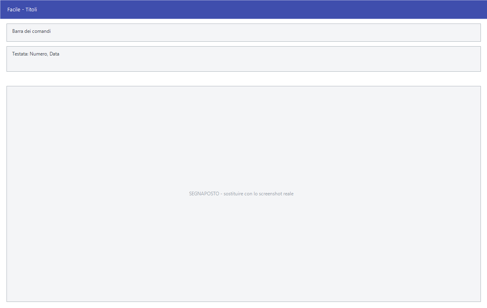

# Titoli

**Solo Studio.** Da questa maschera si acquisiscono i titoli di credito —
cambiali, tratte e ricevute bancarie — con la loro scadenza, il cliente che li
ha emessi e la banca su cui sono appoggiati.

!!! info "In sintesi"

    **Percorso:** Menu ▸ Archivi ▸ Contabilità ▸ Titoli ▸ Inserimento *(oppure* Modifica*)*
    **Scorciatoia:** nessuna; la maschera si apre dal menu
    **Versione:** **solo Studio.** Nelle altre versioni la voce di menu c'è ma non apre nulla
    **Permessi richiesti:** nessun profilo predefinito; **Inserimento** e **Modifica** si abilitano separatamente per ogni utente da [Archivi ▸ Utenti](../anagrafiche/utenti.md)

---

## A cosa serve

Il titolo è il pezzo di carta che il cliente consegna a garanzia o a
pagamento. Registrandolo qui si sa che cosa si ha in portafoglio, quando
scade, su quale banca è appoggiato e quando è stato versato.

Lo stesso menu contiene anche **Gestione Titoli Scaduti** e **Gestione Titoli
Attivi**, che sono le due viste da cui si lavora sul portafoglio.

!!! warning "Attenzione"

    Questa maschera esiste **solo nella versione Studio**. Nelle altre versioni
    la voce di menu è presente ma non apre nulla: premendola non succede
    niente e non compare alcun messaggio.

## Prerequisiti

Prima di registrare un titolo occorrono l'[anagrafica del
cliente](../anagrafiche/anagrafica-clienti.md) che lo ha emesso e la
[banca](banche.md) su cui appoggiarlo.

## La maschera

È una maschera a finestra unica, senza schede: la **barra dei comandi**, il
numero e la data del titolo, il riquadro **Tipo** con le tre scelte, e i dati
del titolo.

## Campi

| Campo | Obbl. | Descrizione | Valori ammessi |
|---|:---:|---|---|
| Numero | | Numero del titolo. Lo assegna il programma e non si modifica. | Sola lettura |
| Data | | Data di acquisizione del titolo. | Data |
| **Tipo** | | Che titolo è. Si sceglie fra le tre voci del riquadro. | Cambiali, Tratte, Ric. Bancarie |
| Scadenza | | Data di scadenza del titolo. | Data |
| Importo | | Valore del titolo. | Importo |
| Cliente | | Cliente che ha emesso il titolo. Accanto compare la ragione sociale. | Codice dall'archivio clienti |
| Banca | | Banca su cui il titolo è appoggiato. Accanto compare la descrizione. | Codice dall'archivio banche |
| Versato il | | Data in cui il titolo è stato versato. | Data |
| Cod. Rinnovo | | Numero del titolo che sostituisce questo, quando viene rinnovato. | Numero di un altro titolo |

{: .campi }

## Pulsanti e comandi

| Comando | Scorciatoia | Effetto |
|---|---|---|
| **F2 - Salva** | ++f2++ | Registra il titolo. |
| **F3 - Prec.** | ++f3++ | Passa al titolo precedente. |
| **F4 - Succ.** | ++f4++ | Passa al titolo successivo. |
| **F5 - Cerca** | ++f5++ | Apre l'elenco dei titoli. |
| **F6 - Elimina** | ++f6++ | Cancella il titolo, previa conferma. |
| **Ricarica** | | Rilegge il titolo dall'archivio, abbandonando le modifiche non salvate. |

Valgono inoltre:

| Comando | Scorciatoia | Effetto |
|---|---|---|
| Elenco valori | ++f10++, ++space++ o doppio clic su **Cliente** e **Banca** | Apre l'elenco da cui scegliere. |
| Consultazione | ++f11++ | Apre la finestra **Consultazione**. |
| Calcolatrice | ++f12++ | Apre la calcolatrice. |
| Campo successivo | ++enter++ | Sposta il cursore sul campo seguente. |
| Chiusura | ++esc++ | Chiude la maschera. |

## Come si fa

### Acquisire un titolo

1. Apri **Menu ▸ Archivi ▸ Contabilità ▸ Titoli ▸ Inserimento**. Il **Numero**
   viene assegnato dal programma.
2. Indica la **Data** di acquisizione.
3. Scegli il **Tipo**: *Cambiali*, *Tratte* o *Ric. Bancarie*.
4. Compila **Scadenza** e **Importo**.
5. Indica il **Cliente** e la **Banca** con ++f10++.
6. Premi **F2 - Salva**.

### Registrare il versamento

1. Premi **F5 - Cerca** e carica il titolo.
2. Compila **Versato il** con la data del versamento.
3. Premi **F2 - Salva**.

### Registrare un rinnovo

1. Acquisisci il titolo nuovo con la procedura sopra e prendi nota del suo
   **Numero**.
2. Carica il titolo vecchio e scrivi quel numero in **Cod. Rinnovo**.
3. Premi **F2 - Salva**.

## Controlli e messaggi

| Messaggio | Causa | Cosa fare |
|---|---|---|
| *Confermi la Cancellazione....* | Conferma richiesta da **F6 - Elimina**. | Rispondi **Sì** per eliminare il titolo. |
| *Il record è stato modificato da un altro nodo della rete.* | Un altro utente ha salvato lo stesso titolo mentre lo modificavi. | Premi **Ricarica**, verifica cosa è cambiato e rifai le tue modifiche. |
| *Il record è stato cancellato da un altro nodo della rete.* | Un altro utente ha eliminato il titolo mentre lo modificavi. | La maschera si chiude: non c'è più nulla da salvare. |

## Note

!!! warning "Attenzione"

    ++esc++ chiude la maschera senza chiedere conferma e senza salvare: le
    modifiche fatte dopo l'ultimo **F2 - Salva** vanno perse.

<!-- DA VERIFICARE: quali campi sono obbligatori. La maschera non fa i controlli tipici delle altre tabelle, e il numero è assegnato dal programma: va provata per capire cosa succede salvando un titolo incompleto. -->

<!-- DA VERIFICARE: le voci di menu Gestione Titoli Scaduti e Gestione Titoli Attivi sono due maschere a sé, da documentare separatamente. -->

<!-- DA VERIFICARE: il titolo della finestra è "Acquisizione Titoli", mentre la voce di menu dice "Titoli ▸ Inserimento". Quale nome usare nel manuale? -->

## Vedi anche

- [Banche ditta](banche-ditta.md)
- [Anagrafica clienti](../anagrafiche/anagrafica-clienti.md)
