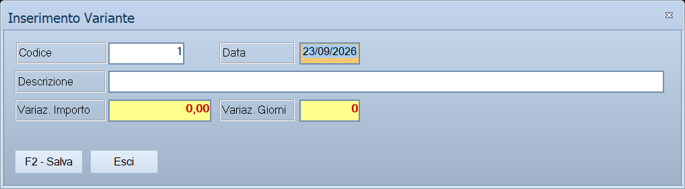

# Variante / Claim

Registra **uno scostamento dal contratto**: di quanto cambia l'importo, di
quanti giorni si allunga il lavoro, e perché. Si apre dalle schede *Varianti*
e *Claims* della commessa.

!!! info "In sintesi"

    - **Percorso:** Menu ▸ Contabilità ▸ Commesse di Contabilità Analitica ▸ scheda **Varianti** *(oppure* **Claims***)* ▸ **Nuovo** *(oppure* **Modifica***)*
    - **Scorciatoia:** ++f2++ salva, ++esc++ esce
    - **Permessi richiesti:** quelli della [commessa](commesse.md) da cui si apre; non ha un profilo suo

---

## A cosa serve

È **la stessa finestra per le due schede**: cambia solo il titolo, che dice
*Variante* o *Claim* secondo la scheda da cui l'hai aperta. Quello che
distingue i due non è il programma ma il loro significato — una variante è
concordata prima, un claim è una tua rivendicazione che arriva dopo — e la
distinzione la fai tu scegliendo la scheda.

Serve a tenere il conto di quanto il lavoro si è allontanato dal contratto
iniziale: nell'importo e nel tempo.

## Prerequisiti

Prima di usare questa maschera occorre avere la **commessa** già salvata: la
finestra si apre dalla sua scheda.

## La maschera

Una finestra sola, piccola, senza schede: la data e il codice sulla prima
riga, la descrizione sulla seconda, le due variazioni sulla terza, e i due
pulsanti in fondo.

## Campi

| Campo | Obbl. | Descrizione | Valori ammessi |
|---|:---:|---|---|
| **Codice** | | **Sola lettura.** Lo assegna il programma. | Numero |
| **Data** | ● | La data della variante o del claim. È il primo campo su cui si mette il cursore. | Data |
| **Descrizione** | ● | Che cosa comporta lo scostamento. Viene portata **in maiuscolo** mentre la scrivi. | Fino a 100 caratteri |
| **Variaz. Importo** | | Di quanto cambia il valore del lavoro, in evidenza su fondo colorato. | Numero con decimali, anche negativo |
| **Variaz. Giorni** | | Di quanti giorni si allunga — o si accorcia — il lavoro. | Numero intero |

{: .campi }

La colonna **Obbl.** segna con ● i campi che il programma richiede per
salvare: qui sono **la data e la descrizione**.

## Pulsanti e comandi

| Comando | Scorciatoia | Effetto |
|---|---|---|
| **F2 - Salva** | ++f2++ | Registra e chiude la finestra. La riga compare — o si aggiorna — nella scheda da cui sei partito. |
| **Esci** | ++esc++ | Chiude senza salvare niente. |
| Consultazione | ++f11++ | Apre la finestra **Consultazione**. |
| Calcolatrice | ++f12++ | Apre la calcolatrice. |
| Campo successivo | ++enter++ o ++down++ | Sposta il cursore sul campo seguente. |
| Campo precedente | ++up++ | Torna al campo precedente. |

## Come si fa

### Registrare una variante o un claim

1. Apri la commessa e vai sulla scheda **Varianti** o **Claims**, secondo
   quello che stai registrando.
2. Premi **Nuovo**: si apre la finestra, con il cursore sulla **Data**.
3. Scrivi la data e la **Descrizione**.
4. Scrivi la **Variaz. Importo** e la **Variaz. Giorni**: una delle due può
   restare a zero, se lo scostamento è solo economico o solo di tempo.
5. Premi **F2 - Salva**.

### Correggere una registrazione

1. Seleziona la riga sulla scheda e premi **Modifica**.
2. Si apre la stessa finestra, con i dati compilati e il **Codice** che non
   cambia.
3. Correggi quello che serve e premi **F2 - Salva**.

## Controlli e messaggi

Non applicabile: la maschera non mostra messaggi. I controlli sono silenziosi
e si segnalano con un segnale acustico — vedi le note.

## Note

!!! warning "Senza data o senza descrizione il salvataggio non avviene, e non lo dice"

    Premendo **F2 - Salva** con la **Data** o la **Descrizione** vuote, il
    programma emette un **segnale acustico** e riporta il cursore sul campo
    che manca: non compare nessun messaggio e la finestra resta aperta.

    Controlla prima la data, che è il campo verificato per primo.

!!! note "La variazione può essere in meno"

    **Variaz. Importo** e **Variaz. Giorni** accettano valori negativi: una
    variante che riduce l'opera si registra con il segno meno, non va messa
    fra i claim.

!!! abstract "Quando è una variante e quando è un claim"

    Una **variante** è concordata prima e nasce da un accordo formale con il
    committente. Un **claim** è unilaterale e arriva dopo: lo apri tu a fronte
    di un imprevisto, di un ritardo o di un'inadempienza, e alle spalle ha una
    trattativa, non un accordo.

    Per il programma sono la stessa cosa e si registrano con questa stessa
    finestra: a separarli è solo la scheda su cui li metti, quindi la scelta
    va fatta con criterio perché nessun controllo la verificherà.

## Vedi anche

- [Commesse di Contabilità Analitica](commesse.md)
- [Contratto](contratto.md)
