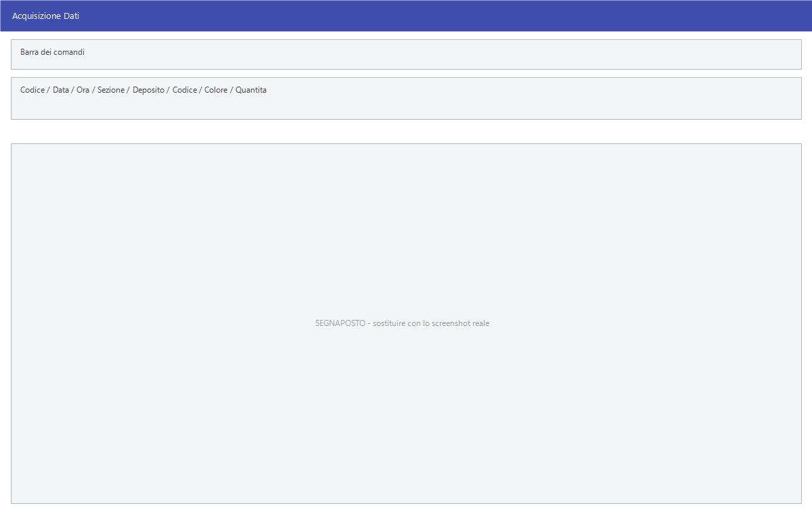

# Acquisizione delle letture

L'inventario comincia contando. Le quantità contate — le *letture* — entrano in
Facile in quattro modi diversi, e finiscono tutte nello stesso archivio, dove si
possono rileggere e correggere prima di chiudere.

!!! info "In sintesi"

    - **Percorso:**
        - Menu ▸ Inventario ▸ Acquisizione Manuale Dati
        - Menu ▸ Inventario ▸ Acquisizione Dati da Lettori Portatili o Files
        - Menu ▸ Inventario ▸ Acquisizione Dati da Carico Merci
        - Menu ▸ Inventario ▸ Acquisizione Dati da File Excel
        - Menu ▸ Inventario ▸ Modifica Dati Acquisiti
        - Menu ▸ Inventario ▸ Esporta Dati Acquisiti in File Excel
    - **Scorciatoia:** ++f2++ salva, ++f3++ precedente, ++f4++ successivo, ++f5++ cerca, ++f6++ elimina, ++esc++ esce
    - **Permessi richiesti:** nessun profilo predefinito; le singole voci di menu si abilitano per ogni utente da [Archivi ▸ Utenti](../anagrafiche/utenti.md)

---

## A cosa serve

| Voce di menu | Come entrano le quantità |
|---|---|
| **Acquisizione Manuale Dati** | Si battono a mano, una riga per volta. La finestra si chiama *Acquisizione Dati*. |
| **Acquisizione Dati da Lettori Portatili o Files** | Si scaricano dal terminalino con cui si è girato il magazzino. La finestra si chiama *Acquisizione Letture per Inventario*. |
| **Acquisizione Dati da Carico Merci** | Si copiano da un [carico merci](../magazzino/carico-merci.md) già registrato: utile quando la merce appena arrivata è ancora sul bancale. |
| **Acquisizione Dati da File Excel** | Si importano da un foglio con le colonne `CODICE` e `QUANTITA`. |
| **Modifica Dati Acquisiti** | Riapre l'ultima lettura registrata per correggerla o cancellarla. |
| **Esporta Dati Acquisiti in File Excel** | Fa il contrario: porta fuori le letture già acquisite in un foglio Excel. |

## Prerequisiti

Prima di acquisire le letture occorre:

- **essere sull'anno corrente**: tutte le voci di questo menu lavorano solo
  sugli archivi dell'anno di lavoro in corso;
- avere gli [articoli](../anagrafiche/anagrafica-articoli.md) e i
  [depositi](../magazzino/depositi.md) in archivio;
- se si riparte da zero, aver fatto **Azzeramento Letture** (vedi
  [Chiusura dell'inventario](chiusura-inventario.md)).

## La maschera

**Acquisizione Dati** è una scheda a campi singoli con la barra dei comandi
standard: si compila una riga, si salva, si passa alla successiva.
L'**Acquisizione Letture per Inventario** ha invece tre soli campi e un
pulsante: dice da dove leggere e dove mettere quello che arriva.

## Campi

### Acquisizione Dati

| Campo | Obbl. | Descrizione | Valori ammessi |
|---|:---:|---|---|
| **Codice** *(in alto)* | | Il numero progressivo della lettura. Lo assegna il programma. | numero |
| **Data**, **Ora** | | Quando la lettura è stata registrata. | data, ora |
| **Sezione** | | La [sezione](../contabilita/sezioni.md) a cui riferire la lettura. Se l'utente ne ha una assegnata, arriva già compilata e non si cambia. | codice |
| **Deposito** | ● | Il [deposito](../magazzino/depositi.md) in cui si è contato. | codice |
| **Codice** *(articolo)* | ● | L'articolo contato. A fianco compare la descrizione. | codice |
| **Colore** | | Il colore, nelle versioni con taglie e colori. Con la gestione delle matricole attiva l'etichetta diventa **Matricola** e il campo è obbligatorio. | codice |
| **Quantità** | ● | Quanto se n'è contato. Con le matricole deve essere **uno**. | quantità |
| **Data Ultimo Inventario** | | Quando quell'articolo era stato inventariato l'ultima volta, in quel deposito. Di sola lettura. | data |
| **Codice su Stampa (se Diverso)** | | Il codice da far comparire in stampa al posto di quello dell'articolo. | codice |

{: .campi }

### Acquisizione Letture per Inventario

| Campo | Obbl. | Descrizione | Valori ammessi |
|---|:---:|---|---|
| **Deposito** | ● | Dove mettere le letture che arrivano. | codice |
| **Sezione** | | La sezione a cui riferirle. Se l'utente ne ha una assegnata, arriva già compilata e bloccata. | codice |
| **Origine** | ● | Da dove leggere. | `PALMARE ANDROID`, `DATALOGIC FORMULA 734`, `METEOR ECO 486`, `UNITECH PT630D`, `METEOR PT10`, `ZEBEX 2030`, `EIA THUNDER`, `EIA SOLARIS`, `SYMBOL PDT3100`, `TYSSO BCP8000 - ET8000`, `DENSO N661`, `PALMARE WINDOWS MOBILE` |

{: .campi }

## Pulsanti e comandi

### Acquisizione Dati

| Comando | Scorciatoia | Effetto |
|---|---|---|
| **F2 - Salva** | ++f2++ | Registra la lettura. |
| **F3 - Prec.** | ++f3++ | Passa alla lettura precedente. |
| **F4 - Succ.** | ++f4++ | Passa alla successiva. |
| **F5 - Cerca** | ++f5++ | Cerca fra le letture registrate. |
| **F6 - Elimina** | ++f6++ | Cancella la lettura, previa conferma. |
| **Ricarica** | | Rilegge la lettura dall'archivio, abbandonando le modifiche. |
| **Matricola** | | Solo con la gestione delle matricole attiva: apre l'elenco delle matricole. |

Valgono inoltre in tutta la maschera:

| Comando | Scorciatoia | Effetto |
|---|---|---|
| Elenco valori | ++f10++, ++space++ o doppio clic | Su **Deposito** e sul codice articolo, apre l'elenco. |
| Calcolatrice | ++f12++ | Apre la calcolatrice. |
| Chiusura | ++esc++ | Chiude la maschera. |

### Acquisizione Letture per Inventario

| Comando | Scorciatoia | Effetto |
|---|---|---|
| **F2 - OK** | ++f2++ | Avvia lo scarico dal terminalino o dal file. |
| **Esci** | ++esc++ | Chiude senza fare nulla. |

## Come si fa

### Contare con il terminalino

1. Gira il magazzino leggendo i codici a barre con il terminalino.
2. Apri **Menu ▸ Inventario ▸ Acquisizione Dati da Lettori Portatili o
   Files**.
3. Indica il **Deposito** e scegli l'**Origine** che corrisponde al tuo
   terminalino.
4. Premi **F2 - OK**: le letture entrano in archivio, e alla fine Facile dice
   quante ne ha caricate.
5. Se ci sono codici che non ha riconosciuto, te lo dice e propone di
   stamparli.

### Battere a mano poche quantità

1. Apri **Menu ▸ Inventario ▸ Acquisizione Manuale Dati**.
2. Indica **Deposito**, **Codice** dell'articolo e **Quantità**.
3. Premi **F2 - Salva**: la maschera si ripresenta vuota per la riga
   successiva.

### Prendere le quantità da un carico merci

1. Apri **Menu ▸ Inventario ▸ Acquisizione Dati da Carico Merci**.
2. Indica il numero del carico.
3. Ogni riga del carico diventa una lettura, con deposito, articolo e
   quantità del movimento.

### Importare da Excel

1. Prepara un foglio con le colonne `CODICE` e `QUANTITA` — nelle versioni con
   taglie e colori serve anche `IDXTAG` o `COLORE`.
2. Apri **Menu ▸ Inventario ▸ Acquisizione Dati da File Excel** e rispondi
   **Sì** alla domanda.
3. Scegli il file.

### Esportare le letture in Excel

1. Apri **Menu ▸ Inventario ▸ Esporta Dati Acquisiti in File Excel**.
2. Il programma chiede l'intervallo da esportare in **Intervallo Letture da
   Esportare**: **Lettura Iniziale** e **Lettura Finale** arrivano già
   compilate con la prima e l'ultima lettura in archivio. Restringile se ti
   serve solo una parte.
3. Scegli dove salvare. Il programma propone la cartella **out** sotto la
   cartella dell'utente e il nome **letture**; il formato può essere `.xlsx` o
   `.xls`.
4. A scrittura finita **il file si apre da solo**.

Il foglio si chiama **Letture** e ha una riga di intestazione con le colonne
**DEPOSITO**, **CODICE**, **DESCRIZIONE**, **QUANTITA** e **SEZIONE**. Nella
versione con taglie e colori si aggiungono **IDXTAG** e **COLORE**.

### Correggere una lettura sbagliata

1. Apri **Menu ▸ Inventario ▸ Modifica Dati Acquisiti**: si apre l'ultima
   lettura registrata, e il titolo della finestra diventa *Modifica Dati
   Acquisiti*.
2. Con **F3 - Prec.** e **F4 - Succ.**, o con **F5 - Cerca**, raggiungi quella
   da correggere.
3. Correggi e premi **F2 - Salva**, oppure **F6 - Elimina** per toglierla.

## Controlli e messaggi

| Messaggio | Causa | Cosa fare |
|---|---|---|
| *Operazione disponibile solo su archivi anno corrente.* | Si sta lavorando su un anno diverso da quello in corso. | Cambia anno di lavoro e riprova. |
| *Codice Articolo non trovato in archivio !* | Il codice battuto non esiste. | Controlla il codice, o inserisci l'articolo in anagrafica. |
| *Carico Merci non trovato in archivio !* | Il numero di carico indicato non esiste. | Controlla il numero: vedi la nota qui sotto. |
| *Acquisizione dati conclusa regolarmente !* | L'acquisizione da carico merci è finita. | Controlla le letture da **Modifica Dati Acquisiti**. |
| *E' obbligatorio indicare la matricola!* | Con la gestione matricole attiva il campo è vuoto. | Compila la **Matricola**. |
| *La quantità indicata deve essere obbligatoriamente pari a uno!* | Con le matricole ogni lettura vale un pezzo. | Metti `1` e registra una lettura per matricola. |
| *Le funzionalità per i lettori Formula sono fornite a richiesta. Contattare la R.S.A. per l' installazione dei componenti necessari.* | Manca il componente per i lettori Datalogic Formula. | Chiedi all'assistenza l'installazione. |
| *Impossibile Caricare RAPI.DLL ! Controllare presenza installazione ActiveSync.* | Manca ActiveSync per i palmari Windows Mobile. | Installa ActiveSync sulla postazione. |
| *File SCARICA.BAT non trovato !* — anche nelle forme *File C:\\symbol\\RICEZWIN.BAT non trovato !* e *File C:\\ptcomm\\SCARICA.BAT non trovato !* | Manca il programma di scarico del terminalino. | Chiedi all'assistenza: sono componenti installati a parte. |
| *Tipo terminale non conosciuto !* | L'**Origine** scelta non ha una procedura di scarico. | Scegli il modello giusto. |
| *Colonna CODICE non trovata nel documento !* | Il foglio Excel non ha la colonna attesa. | Correggi le intestazioni. |
| *Colonna QUANTITA non trovata nel documento!* | Idem. | Aggiungi la colonna. |
| *Nessuna tra le Colonne IDXTAG o COLORE e' stata trovata nel documento !* | Nelle versioni con taglie e colori serve una delle due. | Aggiungila. |
| *Deposito principale non impostato o non valido !* | L'importazione da Excel non sa dove mettere le letture. | Imposta il deposito attivo nei [parametri della ditta](../anagrafiche/ditte.md). |
| *Non ci sono dati da esportare!* | Si è chiesta l'esportazione ma in archivio non c'è nessuna lettura. | Acquisisci le letture prima di esportarle. |
| *Impossibile inizializzare il file excel!* | Il programma non è riuscito a creare il foglio. | Riprova; se insiste, avvisa l'assistenza. |
| *Vuoi eliminare le letture?* | Dopo un'acquisizione da terminalino. | **Sì** svuota il terminalino, **No** le lascia. |

## Note

!!! warning "Il carico merci inesistente non ferma la procedura"

    Se il numero indicato in **Acquisizione Dati da Carico Merci** non esiste,
    Facile avvisa con *Carico Merci non trovato in archivio !* ma **prosegue lo
    stesso**, non acquisisce nulla e conclude con *Acquisizione dati conclusa
    regolarmente !*. I due messaggi insieme vogliono dire che non è stato
    caricato niente: ricontrolla il numero e ripeti.

!!! note "Le letture si sommano"

    Ogni acquisizione **aggiunge** righe a quelle già presenti: contare due
    volte lo stesso scaffale raddoppia le quantità. Per ripartire da zero c'è
    **Azzeramento Letture**, in [Chiusura dell'inventario](chiusura-inventario.md).

<!-- DA VERIFICARE: se le letture dello stesso articolo e deposito vengano sommate in chiusura o se contino come righe distinte. -->

<!-- DA VERIFICARE: le voci "EIA THUNDER" e "EIA SOLARIS" dell'elenco Origine puntano allo stesso tipo di terminale: verificare se è voluto. -->

<!-- DA VERIFICARE: quali sono i nomi esatti delle colonne facoltative del foglio Excel di importazione. -->

## Vedi anche

- [Stampe dell'inventario](stampe-inventario.md)
- [Chiusura dell'inventario](chiusura-inventario.md)
- [Carico merci](../magazzino/carico-merci.md)
- [Anagrafica articoli](../anagrafiche/anagrafica-articoli.md)
