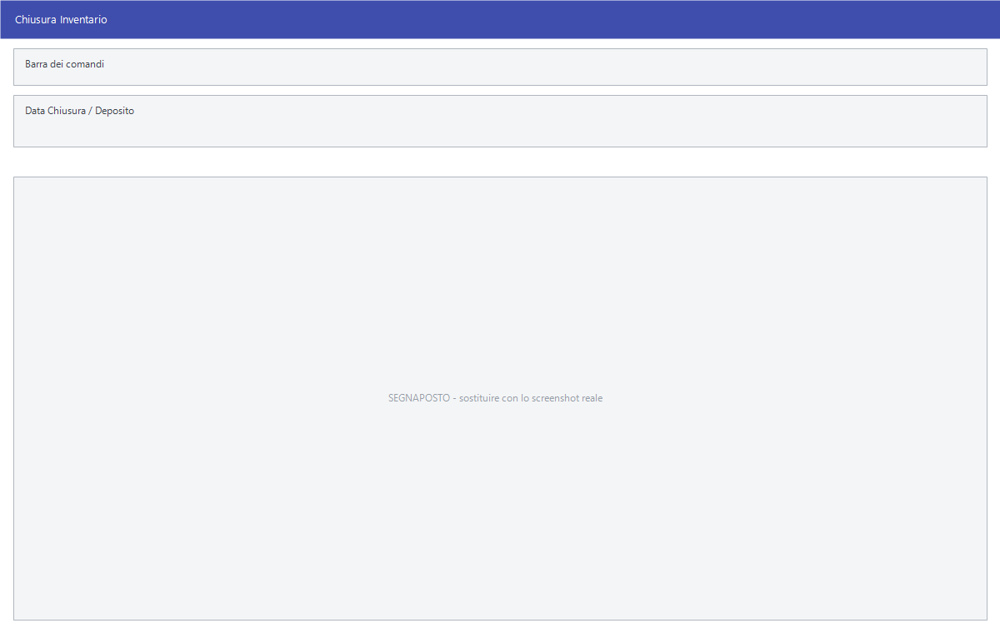

# Chiusura dell'inventario

La chiusura è il momento in cui quello che è stato contato diventa quello che
c'è: Facile confronta le letture con le esistenze e scrive i movimenti di
rettifica che colmano la differenza. È irreversibile, e tutte le altre voci di
questa pagina servono a prepararla o a rimediare.

!!! info "In sintesi"

    - **Percorso:**
        - Menu ▸ Inventario ▸ Chiusura Inventario
        - Menu ▸ Inventario ▸ Azzeramento Articoli non Inventariati
        - Menu ▸ Inventario ▸ Azzeramento Letture
        - Menu ▸ Inventario ▸ Azzeramento Data Ultimo Inventario
        - Menu ▸ Inventario ▸ Azzeramento Articoli con Esistenza Negativa
    - **Scorciatoia:** ++f2++ avvia, ++esc++ esce
    - **Permessi richiesti:** nessun profilo predefinito; le singole voci di menu si abilitano per ogni utente da [Archivi ▸ Utenti](../anagrafiche/utenti.md)

---

## A cosa serve

| Voce di menu | A cosa serve |
|---|---|
| **Chiusura Inventario** | Confronta le letture con le esistenze e scrive i movimenti di rettifica. Lavora in tre fasi: calcola le rettifiche, le scrive, poi verifica esistenze e letture. |
| **Azzeramento Articoli non Inventariati** | Porta a zero l'esistenza degli articoli che non sono stati contati. |
| **Azzeramento Letture** | Cancella **tutte** le letture acquisite. È il modo di ripartire da zero prima di cominciare a contare. |
| **Azzeramento Data Ultimo Inventario** | Toglie dagli articoli la data dell'ultimo inventario, per tutti i depositi o per uno solo. |
| **Azzeramento Articoli con Esistenza Negativa** | Porta a zero gli articoli che risultano in negativo. |

## Prerequisiti

Prima di chiudere l'inventario occorre:

- **essere sull'anno corrente**;
- avere in archivio tutte le letture (vedi
  [Acquisizione delle letture](acquisizione-letture.md));
- aver stampato e controllato il
  [Tabulato Rettifiche](stampe-inventario.md);
- **una copia di sicurezza degli archivi**;
- avere impostata nei [parametri della ditta](../anagrafiche/ditte.md) la
  **causale di magazzino per l'inventario**, che deve rispettare tre
  condizioni:
    - se è di tipo *scarico*, l'esistenza deve essere impostata a `-`;
    - se è di tipo *carico*, l'esistenza deve essere impostata a `+`;
    - deve avere attivo il flag **Aggiorna Data Inventario**.

  Con la gestione delle matricole attiva, la causale deve inoltre avere la
  gestione matricole su `OPZIONALE`. Le causali si impostano da
  [Archivi ▸ Magazzino ▸ Causali Magazzino](../magazzino/causali-magazzino.md).

## La maschera

**Chiusura Inventario** è una finestra con due campi e i pulsanti **F2 - OK**
ed **Esci**. Gli azzeramenti non hanno maschera propria: chiedono conferma e
poi, se serve, il deposito. **Azzeramento Articoli non Inventariati** e
**Azzeramento Articoli con Esistenza Negativa** usano invece la maschera delle
[stampe articoli](../anagrafiche/stampe-articoli.md).

## Campi

### Chiusura Inventario

| Campo | Obbl. | Descrizione | Valori ammessi |
|---|:---:|---|---|
| **Data Chiusura** | ● | La data con cui vengono scritti i movimenti di rettifica. | data |
| **Deposito** | | Il [deposito](../magazzino/depositi.md) da chiudere. Lasciandolo a zero si chiudono tutti. | codice |

{: .campi }

## Pulsanti e comandi

| Comando | Scorciatoia | Effetto |
|---|---|---|
| **F2 - OK** | ++f2++ | Avvia la chiusura, previa conferma. |
| **Esci** | ++esc++ | Chiude senza fare nulla. |
| Elenco valori | ++f10++ o ++space++ | Sul **Deposito**, apre l'elenco. |

## Come si fa

### Chiudere l'inventario

1. **Fai una copia di sicurezza degli archivi.**
2. Stampa il [Tabulato Rettifiche](stampe-inventario.md) e controllalo riga
   per riga: è quello che sta per essere scritto.
3. Stampa gli [articoli non inventariati](stampe-inventario.md) e decidi cosa
   farne: se non li conti, in chiusura restano con l'esistenza che hanno.
4. Apri **Menu ▸ Inventario ▸ Chiusura Inventario**.
5. Indica la **Data Chiusura** e, se lavori un magazzino per volta, il
   **Deposito**.
6. Premi **F2 - OK** e conferma.
7. La chiusura procede in tre fasi — *Calcolo Movimenti di Rettifica*,
   *Scrittura Movimenti di Rettifica*, *Verifica Esistenze <--> Letture
   Rilevate* — e alla fine dice com'è andata.
8. Alla domanda *Vuoi eliminare le letture ?* rispondi **Sì** solo se hai già
   stampato tutto quello che ti serve.

### Cominciare un inventario nuovo

1. Stampa i [dati acquisiti](stampe-inventario.md) dell'inventario precedente,
   se non l'hai già fatto.
2. Apri **Menu ▸ Inventario ▸ Azzeramento Letture**.
3. Rispondi **Sì** alle due domande di conferma.
4. Comincia a contare.

### Azzerare la data dell'ultimo inventario

1. Apri **Menu ▸ Inventario ▸ Azzeramento Data Ultimo Inventario**.
2. Conferma.
3. Alla domanda *Vuoi effettuare l' azzeramento per tutti i Depositi ?*
   rispondi **Sì** per tutti, oppure **No** e scegli il deposito.

## Controlli e messaggi

| Messaggio | Causa | Cosa fare |
|---|---|---|
| *Operazione disponibile solo su archivi anno corrente.* | Si sta lavorando su un anno diverso da quello in corso. | Cambia anno di lavoro. |
| *La Causale per l' inventario non é impostata o non é valida.* | Manca la causale di magazzino per l'inventario nei parametri della ditta. | Impostala prima di chiudere. |
| *Se il movimento e di tipo SCARICO impostare ESITENZA -* | La causale è di scarico ma non sottrae dall'esistenza. | Correggi la [causale](../magazzino/causali-magazzino.md). |
| *Se il movimento e di tipo CARICO impostare ESITENZA +* | La causale è di carico ma non somma all'esistenza. | Correggi la causale. |
| *Attivare il Flag Aggiorna Data Inventario sulla Causale.* | La causale non aggiorna la data di inventario. | Attiva il flag sulla causale. |
| *Impostare la gestione delle matricola a OPZIONALE sulla Causale N* | Con le matricole attive la causale è impostata su `NO`. | Mettila su `OPZIONALE`. |
| *Confermi la Chiusura dell' Inventario ?* | Conferma prima di scrivere le rettifiche. | **Sì** procede. La risposta preimpostata è **No**. |
| *Chiusura inventario completata con successo! Vuoi eliminare le letture ?* | La chiusura è andata a buon fine. | **Sì** cancella le letture, **No** le lascia in archivio. |
| *Chiusura Inventario terminata con N errori! File log : …* | Qualche riga non è stata elaborata. | Facile apre da solo il file di log: leggilo e sistema le righe segnalate. |
| *Con questa procedura vengono azzerati i dati delle letture acquisite. Tutti i dati andranno persi. Continuare?* poi *Confermi l'inizializzazione?* | Hai avviato **Azzeramento Letture**. | Rispondi **Sì** a entrambe solo se hai già stampato quello che ti serve. |
| *Vuoi Azzerare la Data Ultimo Inventario sugli Articoli ?* | Hai avviato **Azzeramento Data Ultimo Inventario**. | **Sì** procede. |
| *Vuoi effettuare l' azzeramento per tutti i Depositi ?* | Segue la conferma precedente. | **Sì** per tutti, **No** per sceglierne uno. |

## Note

!!! warning "La chiusura scrive movimenti veri"

    Le rettifiche sono movimenti di magazzino a tutti gli effetti: entrano nel
    [giornale di magazzino](../magazzino/stampe-movimenti-magazzino.md), pesano
    sulla valorizzazione e non si annullano con un comando. L'unico modo per
    tornare indietro è ripristinare la copia degli archivi.

!!! warning "«Azzeramento Letture» cancella tutto senza filtri"

    Non si sceglie il deposito né il periodo: sparisce **l'intero archivio
    delle letture**. Le due domande di conferma arrivano con **No** già
    scelto, ed è voluto.

!!! note "Gli articoli non contati non vanno a zero da soli"

    La chiusura rettifica quello che ha una lettura. Gli articoli mai contati
    restano con l'esistenza che avevano: per portarli a zero c'è la voce
    apposita, **Azzeramento Articoli non Inventariati**, da usare solo dopo
    aver stampato l'elenco e averlo controllato.

<!-- DA VERIFICARE: cosa contiene il file di log della chiusura e dove viene scritto. -->

<!-- DA VERIFICARE: se la chiusura sommi le letture ripetute dello stesso articolo o consideri solo l'ultima. -->

<!-- DA VERIFICARE: quali sono i campi delle maschere di "Azzeramento Articoli non Inventariati" e "Azzeramento Articoli con Esistenza Negativa" nella versione con taglie e colori, dove il percorso è diverso. -->

## Vedi anche

- [Acquisizione delle letture](acquisizione-letture.md)
- [Stampe dell'inventario](stampe-inventario.md)
- [Causali di magazzino](../magazzino/causali-magazzino.md)
- [Movimenti di magazzino](../magazzino/movimenti-magazzino.md)
