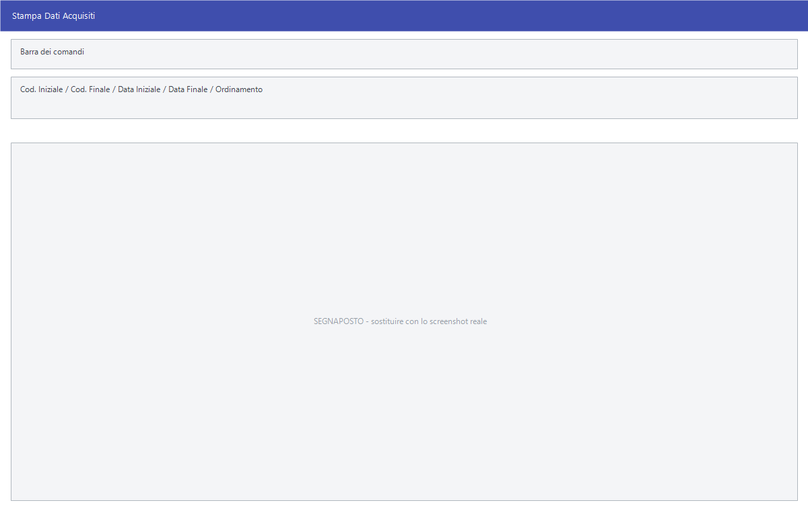

# Stampe dell'inventario

Fra il conteggio e la chiusura c'è il controllo, e il controllo si fa su carta.
Queste quattro stampe dicono cosa è stato contato, cosa manca all'appello e
quali rettifiche la chiusura andrebbe a scrivere.

!!! info "In sintesi"

    - **Percorso:**
        - Menu ▸ Inventario ▸ Stampa Dati Acquisiti
        - Menu ▸ Inventario ▸ Stampa Tabulato Rettifiche
        - Menu ▸ Inventario ▸ Stampa Articoli Inventariati
        - Menu ▸ Inventario ▸ Stampa Articoli non Inventariati
    - **Scorciatoia:** ++f2++ avvia la stampa, ++esc++ esce
    - **Permessi richiesti:** nessun profilo predefinito; le singole voci di menu si abilitano per ogni utente da [Archivi ▸ Utenti](../anagrafiche/utenti.md)

---

## A cosa serve

| Voce di menu | Cosa stampa |
|---|---|
| **Stampa Dati Acquisiti** | Le letture registrate, riga per riga: è la prova di quello che è stato contato. |
| **Stampa Tabulato Rettifiche** | La differenza fra l'esistenza a sistema e quella contata, articolo per articolo. La finestra si chiama *Stampa Rettifiche*. **È la stampa da guardare prima di chiudere**: dice esattamente quali movimenti la chiusura andrà a scrivere. |
| **Stampa Articoli Inventariati** | Gli articoli che risultano contati. |
| **Stampa Articoli non Inventariati** | Gli articoli che **non** sono stati contati: quelli dimenticati, o quelli che non ci sono più. Usa la maschera delle [stampe articoli](../anagrafiche/stampe-articoli.md). |

## Prerequisiti

Prima di stampare occorre avere le letture in archivio: vedi
[Acquisizione delle letture](acquisizione-letture.md).

**Stampa Dati Acquisiti** e **Stampa Tabulato Rettifiche** lavorano solo
sull'anno corrente.

## La maschera

Sono finestre di selezione piccole: gli intervalli, il raggruppamento, e i
pulsanti **F2 - OK** ed **Esci**.

## Campi

### Stampa Dati Acquisiti

| Campo | Obbl. | Descrizione | Valori ammessi |
|---|:---:|---|---|
| **Cod. Iniziale**, **Cod. Finale** | | L'intervallo dei numeri di lettura da stampare. | numeri |
| **Data Iniziale**, **Data Finale** | | Il periodo in cui le letture sono state registrate. | date |
| **Ordinamento** | | Come ordinare la stampa. | `DESCRIZIONE ARTICOLO`, `CODICE ARTICOLO`, `CODICE ACQUISIZIONE` |

{: .campi }

### Stampa Rettifiche

| Campo | Obbl. | Descrizione | Valori ammessi |
|---|:---:|---|---|
| **Data** | ● | La data a cui riferire il confronto fra esistenza e letture. | data |
| **Deposito** | | Restringe a un [deposito](../magazzino/depositi.md). | codice |
| **Raggruppamento** | | Come raggruppare le righe. | `NESSUNO`, `GRUPPO`, `SOTTOGRUPPO` |
| **Solo Articoli con Letture** | | Se attivo lascia fuori gli articoli mai contati, che altrimenti compaiono con la rettifica pari a tutta l'esistenza. | attivo/non attivo |

{: .campi }

### Stampa Articoli Inventariati

| Campo | Obbl. | Descrizione | Valori ammessi |
|---|:---:|---|---|
| **Deposito** | | Restringe a un deposito. | codice |

{: .campi }

## Pulsanti e comandi

| Comando | Scorciatoia | Effetto |
|---|---|---|
| **F2 - OK** | ++f2++ | Prepara e mostra l'anteprima della stampa. |
| **Esci** | ++esc++ | Chiude senza stampare. |
| Elenco valori | ++f10++ o ++space++ | Sul **Deposito**, apre l'elenco. |
| Calcolatrice | ++f12++ | Apre la calcolatrice. |

## Come si fa

### Controllare le rettifiche prima di chiudere

1. Apri **Menu ▸ Inventario ▸ Stampa Tabulato Rettifiche**.
2. Indica la **Data** della chiusura e, se lavori un magazzino per volta, il
   **Deposito**.
3. Attiva **Solo Articoli con Letture** se vuoi vedere soltanto quello che è
   stato contato davvero.
4. Premi **F2 - OK** e leggi le differenze: sono esattamente i movimenti che
   la [chiusura](chiusura-inventario.md) scriverà.

### Trovare quello che non è stato contato

1. Apri **Menu ▸ Inventario ▸ Stampa Articoli non Inventariati**.
2. Premi **F2 - OK**: quello che esce è la lista degli scaffali da rivedere,
   perché in chiusura quegli articoli verrebbero portati a zero.

### Avere la prova di quello che è stato contato

1. Apri **Menu ▸ Inventario ▸ Stampa Dati Acquisiti**.
2. Metti **Ordinamento** su `CODICE ACQUISIZIONE` per seguire l'ordine in cui
   si è girato il magazzino, oppure su `CODICE ARTICOLO` per controllare per
   articolo.
3. Premi **F2 - OK**.

## Controlli e messaggi

| Messaggio | Causa | Cosa fare |
|---|---|---|
| *Operazione disponibile solo su archivi anno corrente.* | Si sta lavorando su un anno diverso da quello in corso. | Cambia anno di lavoro e riprova. |
| *(nessun messaggio, solo un segnale acustico)* | Un campo del filtro non è valido. | Guarda dove si è posizionato il cursore. |

## Note

!!! note "Il tabulato rettifiche è il documento da conservare"

    È la sola stampa che mette a confronto quello che il sistema credeva di
    avere e quello che è stato trovato. Stampalo **prima** della chiusura: dopo,
    le esistenze sono già state allineate e la differenza non si vede più.

<!-- DA VERIFICARE: se "Stampa Articoli Inventariati" consideri inventariato l'articolo per la data ultimo inventario o per la presenza di una lettura. -->

<!-- DA VERIFICARE: su quale criterio il "Raggruppamento" per GRUPPO e SOTTOGRUPPO aggrega le righe. -->

## Vedi anche

- [Acquisizione delle letture](acquisizione-letture.md)
- [Chiusura dell'inventario](chiusura-inventario.md)
- [Stampe articoli](../anagrafiche/stampe-articoli.md)
- [Stampe dei movimenti di magazzino](../magazzino/stampe-movimenti-magazzino.md)
