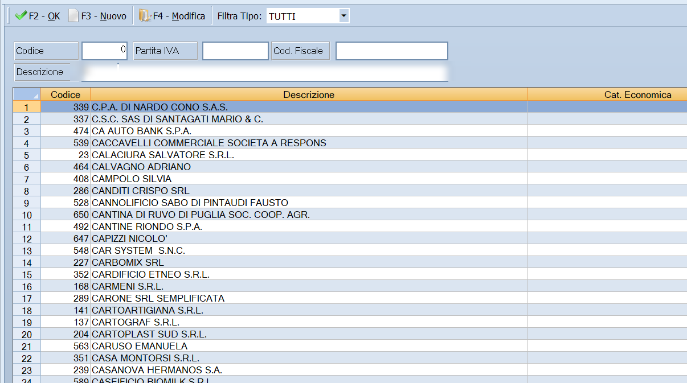

# Analisi fornitore

Prende un fornitore e mostra, per ogni articolo, quanto chiede lui, quanto si è
pagato l'ultima volta e chi lo fa al prezzo migliore — con lo scostamento in
percentuale. È la maschera che dice **dove si sta comprando male**.

!!! info "In sintesi"

    - **Percorso:** Menu ▸ Archivi ▸ Listini Fornitori ▸ Analisi Fornitore
    - **Scorciatoia:** ++f2++ esporta su Excel, ++f3++ cerca nella griglia
    - **Permessi richiesti:** nessun profilo predefinito; la voce di menu si abilita per ogni utente da [Archivi ▸ Utenti](../anagrafiche/utenti.md)

---

## A cosa serve

Con più fornitori per gli stessi articoli, la domanda ricorrente è se convenga
continuare a comprare da chi si compra. Questa maschera la risolve a colpo
d'occhio: si sceglie il fornitore e si guarda la colonna dello scostamento
rispetto al miglior listino. Dove il numero è alto, c'è margine per trattare o
per cambiare fornitore.

## Prerequisiti

Prima di usare questa maschera occorre avere caricato i
[listini dei fornitori](gestione-listini-fornitori.md): senza quelli il
confronto non ha termini.

## La maschera

In alto la barra dei comandi e il campo **Fornitore**; sotto, la griglia del
confronto.

La griglia ha queste colonne:

| Colonna | Contenuto |
|---|---|
| **Codice**, **Barcode**, **Descrizione** | L'articolo. |
| **Esistenza** | Quanto ce n'è in magazzino. |
| **Ult. Prezzo Acq.** | L'ultimo prezzo effettivamente pagato. |
| **Ultimo Acq.** | La data dell'ultimo acquisto. |
| **Fornitore Ultimo Acquisto** | Da chi si è comprato l'ultima volta. |
| **Listino For. Sel.** | Il prezzo del fornitore scelto in alto. |
| **% Scostamento Ult. Prezzo / Listino For. Sel** | Di quanto il listino del fornitore scelto si discosta da quanto si è pagato. |
| **Fornitore Miglior Listino** | Chi fa il prezzo più basso su quell'articolo. |
| **Miglior Listino** | Quel prezzo. |
| **% Scostamento For. Sel. / Miglior Listino** | Quanto si perde comprando dal fornitore scelto invece che dal migliore. |

## Campi

| Campo | Obbl. | Descrizione | Valori ammessi |
|---|:---:|---|---|
| **Fornitore** | ● | Il fornitore da mettere a confronto con gli altri. | codice |

{: .campi }

## Pulsanti e comandi

| Comando | Scorciatoia | Effetto |
|---|---|---|
| **F2 - Esporta** | ++f2++ | Salva la griglia in un foglio Excel. |
| **F3 - Trova** | ++f3++ | Cerca un testo nella griglia. |

## Come si fa

### Capire se conviene cambiare fornitore

1. Apri **Menu ▸ Archivi ▸ Listini Fornitori ▸ Analisi Fornitore**.
2. Indica il **Fornitore** con cui lavori abitualmente.
3. Ordina la griglia sulla colonna **% Scostamento For. Sel. / Miglior
   Listino**.
4. Guarda le righe in cima: sono gli articoli su cui stai pagando di più.
5. Per portarti il risultato fuori da Facile, premi **F2 - Esporta**.

## Controlli e messaggi

| Messaggio | Causa | Cosa fare |
|---|---|---|
| *Impossibile inizializzare il file excel!* | Il programma non riesce a preparare il foglio Excel. | Segnala all'assistenza. |

## Note

!!! note "Il confronto vale quanto valgono i listini"

    Il *miglior listino* è calcolato sui listini fornitore caricati in Facile:
    se il listino di un fornitore è vecchio o incompleto, il confronto lo
    riflette. Aggiorna i listini prima di trarne conclusioni.

<!-- DA VERIFICARE: se la maschera consideri tutti gli articoli o solo quelli presenti nel listino del fornitore scelto. -->

<!-- DA VERIFICARE: se il confronto usi il prezzo di listino o il prezzo netto dopo gli sconti. -->

<!-- DA VERIFICARE: su quale deposito è calcolata la colonna Esistenza. -->

## Vedi anche

- [Gestione listini fornitori](gestione-listini-fornitori.md)
- [Conferma e confronto dei listini](../listini-vendita/controllo-listini.md)
