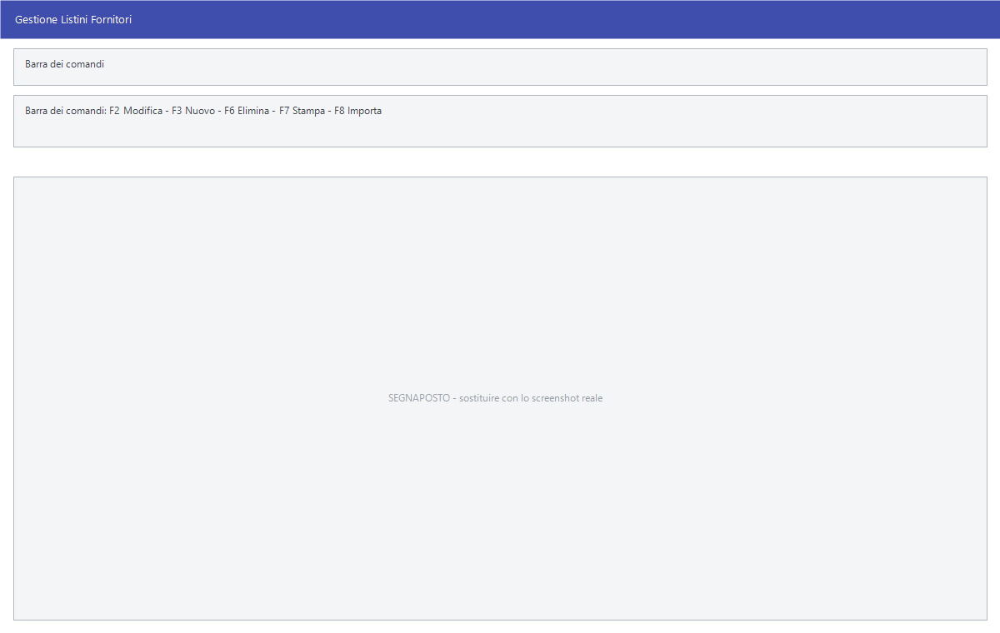

# Gestione listini fornitori

Il listino **di acquisto**: quanto ogni fornitore chiede per i suoi articoli.
Si tiene un listino per fornitore, lo si importa dai fogli che il fornitore
manda e lo si confronta poi con
[l'analisi fornitore](analisi-fornitore.md).

!!! info "In sintesi"

    - **Percorso:** Menu ▸ Archivi ▸ Listini Fornitori ▸ Gestione
    - **Scorciatoia:** ++f2++ modifica la riga, ++f3++ ne aggiunge una
    - **Permessi richiesti:** nessun profilo predefinito; la voce di menu si abilita per ogni utente da [Archivi ▸ Utenti](../anagrafiche/utenti.md)

---

## A cosa serve

Sapere quanto costa la merce da ciascun fornitore è il presupposto per due
cose: comprare da chi conviene, e controllare che il prezzo fatturato
corrisponda a quello concordato.

Il listino fornitore è distinto dall'**ultimo prezzo di acquisto**
dell'articolo: quello è il prezzo effettivamente pagato l'ultima volta, questo è
il prezzo che il fornitore dichiara.

## Prerequisiti

Prima di usare questa maschera occorre:

- avere in archivio il [fornitore](../anagrafiche/anagrafica-fornitori.md);
- avere gli [articoli](../anagrafiche/anagrafica-articoli.md), se si vogliono
  collegare le righe del listino all'anagrafica;
- avere impostato il deposito principale nella [ditta](../anagrafiche/ditte.md).

## La maschera

In alto la barra dei comandi e il campo **Fornitore**; sotto, la griglia delle
righe del suo listino.

La griglia ha queste colonne:

| Colonna | Contenuto |
|---|---|
| **Codice Art.For.** | Il codice con cui il fornitore identifica l'articolo. |
| **Cod.Articolo** | Il codice interno, se la riga è collegata all'anagrafica. |
| **Barcode** | Il codice a barre. |
| **Descrizione** | Descrizione dell'articolo. |
| **Prezzo** | Prezzo di listino del fornitore. |
| **%Sc.1** … **%Sc.7** | I sette sconti in cascata concordati. |
| **Prezzo Netto** | Il netto che risulta da prezzo e sconti. |
| **Pezzi x Conf.** | Quanti pezzi contiene la confezione. |

## Campi

| Campo | Obbl. | Descrizione | Valori ammessi |
|---|:---:|---|---|
| **Fornitore** | ● | Di quale fornitore mostrare il listino. | codice |

{: .campi }

I dati delle righe si inseriscono e si correggono con **F2 - Modifica** e
**F3 - Nuovo**.

## Pulsanti e comandi

| Comando | Scorciatoia | Effetto |
|---|---|---|
| **F2 - Modifica** | ++f2++ | Apre in modifica la riga selezionata. |
| **F3 - Nuovo** | ++f3++ | Aggiunge una riga al listino. |
| **F6 - Elimina** | ++f6++ | Cancella l'intero listino del fornitore, previa doppia conferma. |
| **F7 - Stampa** | ++f7++ | Stampa il listino. |
| **F8 - Importa** | ++f8++ | Legge il listino da un foglio Excel. |
| **Articolo** | | Apre l'[anagrafica](../anagrafiche/anagrafica-articoli.md) dell'articolo della riga. |
| **Trova** | | Cerca un testo nella griglia. |

## Come si fa

### Caricare il listino di un fornitore da Excel

1. Apri **Menu ▸ Archivi ▸ Listini Fornitori ▸ Gestione**.
2. Indica il **Fornitore**.
3. Premi **F8 - Importa** e scegli il foglio mandato dal fornitore. Il foglio
   deve avere una colonna intestata `CODICE` **o** `BARCODE`.
4. Rispondi **Sì** a *«Vuoi procedere con l' importazione del listino ?»*.

### Correggere un prezzo a mano

1. Carica il listino indicando il **Fornitore**.
2. Portati sulla riga e premi **F2 - Modifica**.
3. Correggi prezzo o sconti e conferma.

### Rifare da capo il listino di un fornitore

1. Carica il listino del fornitore.
2. Premi **F6 - Elimina** e rispondi **Sì** a *«Confermi la cancellazione dell'
   intero listino ?»*.
3. Alla domanda *«Vuoi interrompere la cancellazione ?»* rispondi **No** per
   proseguire.
4. Reimporta il listino nuovo con **F8 - Importa**.

## Controlli e messaggi

| Messaggio | Causa | Cosa fare |
|---|---|---|
| *Confermi la cancellazione dell' intero listino ?* | Si è premuto **F6 - Elimina**. | **Sì** cancella **tutte** le righe del listino di quel fornitore. |
| *Vuoi interrompere la cancellazione ?* | Seconda domanda, subito dopo la prima. | Rispondi **No** per proseguire con la cancellazione, **Sì** per fermarla. |
| *Deposito principale non impostato!* | Manca il deposito principale nelle impostazioni della [ditta](../anagrafiche/ditte.md). | Impostalo e riprova. |
| *Formato file non compatibile!* | Il file scelto non è nel formato atteso. | Verifica di aver scelto il foglio giusto. |
| *File utilizzato da un' altra applicazione o formato file non compatibile!* | Il foglio è aperto in Excel. | Chiudilo e riprova. |
| *Colonna CODICE non trovata nel documento !* | Il foglio non ha la colonna del codice articolo. | Aggiungi l'intestazione `CODICE`. |
| *Colonna BARCODE non trovata nel documento !* | Il foglio non ha la colonna del codice a barre. | Aggiungi l'intestazione `BARCODE`. |
| *Vuoi procedere con l' importazione del listino ?* | Il foglio è stato letto e il programma sta per scrivere. | **Sì** importa. |
| *Impossibile Creare la tabella* | Il programma non riesce a preparare l'area di lavoro. | Segnala all'assistenza. |

## Note

!!! warning "Attenzione"

    **F6 - Elimina cancella tutto il listino**, non la riga selezionata. Le due
    domande che compaiono sono in sequenza e la seconda è formulata al
    contrario: per cancellare davvero si risponde **Sì** alla prima e **No**
    alla seconda.

!!! danger "Per cancellare il listino si risponde prima Sì e poi No"

    Le due domande sono formulate **al contrario l'una dell'altra**, e
    rispondere d'istinto porta a non cancellare — o, peggio, a cancellare
    senza volerlo.

    | | Domanda | Per cancellare | Risposta preimpostata |
    |---|---|:---:|:---:|
    | 1 | *Confermi la cancellazione dell' intero listino ?* | **Sì** | No |
    | 2 | *Vuoi interrompere la cancellazione ?* | **No** | **Sì** |

    La seconda è una domanda di sicurezza in più, e ha la risposta
    preimpostata su **Sì**, cioè su *fermati*. Premendo Invio due volte non
    si cancella niente — ed è il comportamento voluto.

    Fatto il secondo **No**, il listino del fornitore viene **cancellato
    per intero**, senza altri avvisi e senza modo di tornare indietro.

!!! info "Le colonne del foglio Excel, per esteso"

    Il programma riconosce le intestazioni **in maiuscolo**, in qualsiasi
    ordine. Oltre a `CODICE` e `BARCODE`:

    | Intestazione | Contenuto |
    |---|---|
    | `DESCRIZIONE` | La descrizione dell'articolo sul listino del fornitore. |
    | `PREZZO` | Il prezzo di listino, al lordo degli sconti. |
    | `SCO1` … `SCO7` | I sette sconti in cascata. |
    | `SELL_PRICE` | Il prezzo di vendita al pubblico consigliato, IVA inclusa. |
    | `PEZZICONF` | I pezzi per confezione. |
    | `CODREP`, `CODMER`, `CODMAR`, `CODSTA`, `CODMIS`, `CODIVA` | Reparto, categoria merceologica, marchio, stagione, unità di misura e aliquota IVA. |
    | `CODTA1`, `CODTA2`, `CODTA3` | Le tre tabelle di classificazione libera. |
    | `GRUPPO`, `SOTTOG` | Gruppo e sottogruppo. |
    | `MARCHIO` | Il marchio in chiaro. |

    Le colonne che mancano vengono semplicemente ignorate: non è un errore
    mandare un foglio con il solo codice e il prezzo.

!!! info "Come una riga trova il suo articolo"

    Il programma ci prova **tre volte, in quest'ordine**, e si ferma alla
    prima che riesce:

    1. con il **codice articolo** già scritto sulla riga, se c'è;
    2. con il **codice a barre**: trovato l'articolo, il programma **scrive
       il collegamento sulla riga** e non dovrà più cercarlo;
    3. con il **codice fornitore**, confrontandolo con il campo *Cod.
       Fornitore* dell'anagrafica articoli.

    È il motivo per cui il primo caricamento di un listino nuovo è lento e i
    successivi no: al primo giro gli abbinamenti per codice a barre vengono
    registrati.

    Le righe che **non si agganciano a niente** restano nel listino del
    fornitore ma non hanno articolo: compaiono o spariscono dall'elenco
    secondo la casella che filtra gli articoli non trovati. Per sistemarle si
    aggiunge all'articolo il codice a barre o il codice fornitore che il
    listino usa — e da lì in avanti si agganciano da sole.

## Vedi anche

- [Analisi fornitore](analisi-fornitore.md)
- [Anagrafica fornitori](../anagrafiche/anagrafica-fornitori.md)
- [Gestione listini](../listini-vendita/gestione-listini.md)
