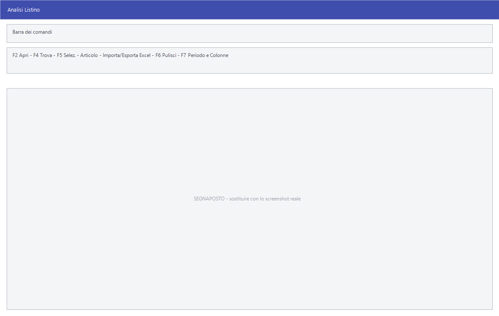

# Analisi listino da vendite ed esistenza

Un foglio di lavoro su cui si radunano gli articoli che interessano e si legge
tutto quello che serve per decidere un prezzo: quanto se n'è venduto, quanto ce
n'è, quanto costa, quanto rende. Dalle stesse celle si correggono prezzi,
scorte, classificazioni ed esistenze.

!!! info "In sintesi"

    **Percorso:** Menu ▸ Archivi ▸ Listini Vendita ▸ Analisi Listino da Vendite/Esistenza
    **Scorciatoia:** ++f2++ apre l'articolo della riga attiva
    **Permessi richiesti:** nessun profilo predefinito; la voce di menu si abilita per ogni utente da [Archivi ▸ Utenti](../anagrafiche/utenti.md)

---

## A cosa serve

È la maschera del ragionamento sull'assortimento: si sceglie un gruppo di
articoli — un reparto, un fornitore, una manciata di codici — e li si guarda
tutti insieme con il venduto del periodo, in promozione e fuori promozione, il
margine in euro e in percentuale, le esistenze e le scorte di ogni deposito, il
prezzo di acquisto e lo scostamento dal miglior listino dei fornitori.

Vista la situazione, si interviene senza cambiare finestra: il nuovo prezzo, la
scorta minima, l'assortimento, la categoria si scrivono direttamente nella
griglia.

## Prerequisiti

Prima di usare questa maschera occorre:

- avere gli [articoli](../anagrafiche/anagrafica-articoli.md) in archivio;
- per poter correggere l'**Esistenza** dalla griglia, avere impostato nelle
  opzioni della ditta la causale di rettifica inventario, e che quella
  [causale di magazzino](../magazzino/causali-magazzino.md) aggiorni la data di
  inventario.

## La maschera

La finestra *Analisi Listino* si apre a tutto schermo, con la barra dei comandi
in alto e la griglia sotto. All'apertura la griglia è vuota: gli articoli si
aggiungono con **F5 - Selez.** o con **Articolo**.

La griglia è larga. A sinistra sta la parte fissa dell'articolo — **Codice**,
**Descrizione**, **Gruppo Mix**, **U.M.**, **EAN**, **Cat. Merceologica**,
**Cod. Rep.**, **Reparto**, **Gruppo**, **Sottogruppo** —, poi si ripete un
blocco di colonne **per ogni deposito**, e in fondo c'è una riga di
**T O T A L I**.

## Campi

Le colonne che si possono scrivere sono queste; le altre sono di sola lettura.

| Campo | Obbl. | Descrizione | Valori ammessi |
|---|:---:|---|---|
| **Descrizione** | | Cambia la descrizione dell'articolo in anagrafica. | testo |
| **Gruppo Mix** | | Assegna l'articolo a un gruppo mix. | codice del gruppo |
| **Cat. Merceologica** | | Cambia la [categoria merceologica](../magazzino/categorie-merceologiche.md). | codice |
| **Cod. Rep.** | | Cambia il [reparto](../magazzino/reparti.md). | codice |
| **Gruppo**, **Sottogruppo** | | Cambiano gruppo e sottogruppo dell'articolo. | testo |
| **Esistenza** | | Scrivendo una quantità diversa da quella in archivio, il programma genera un movimento di rettifica per pareggiare. | quantità |
| **Scorta Minima**, **Scorta Massima** | | Cambiano le scorte dell'articolo su quel deposito. | quantità |
| **Assortimento** | | Include o esclude l'articolo dall'assortimento del deposito. | attivo/non attivo |
| **Nuovo Prezzo** | | Scrive il nuovo prezzo sul listino in esame. | importo |

{: .campi }

Le colonne di sola lettura raccontano la situazione: **Q.tà Venduta in Promo**,
**fuori Promo** e **Totale**, i corrispondenti **Val. Venduto**, il **Margine**
in euro e in percentuale nelle tre versioni, **Q.tà Ordinata Fornitore**,
**Data Ult. Ordine**, **Q.tà Ult. Carico**, **Data Ult. Carico**, **Fornitore
Ult. Carico**, **Giorni dall'ultima Vendita**, **Q.tà Caricata da Inizio
Anno**, **Q.tà Scaricata da Inizio Anno**, **Ultimo Prezzo Acquisto**,
**Miglior Listino Fornitore** con lo **Scostamento %**, il **Listino** in
vigore con il suo **Margine %**, e i dati della **Promozione** in corso
(**Margine Promo %**, **Fine Promo**).

### La finestra Impostazione Filtri

Si apre con **F7 - Periodo e Colonne** e ha due parti.

| Campo | Obbl. | Descrizione | Valori ammessi |
|---|:---:|---|---|
| **Periodo** | | Il periodo su cui calcolare il venduto. | `1 GIORNO`, `3 GIORNI`, `7 GIORNI`, `15 GIORNI`, `30 GIORNI`, `DA INIZIO ANNO`, `LIBERO` |
| **Data Iniziale**, **Data Finale** | | Gli estremi del periodo, da compilare quando **Periodo** è `LIBERO`. | date |

{: .campi }

Sotto, il riquadro **..: N a s c o n d i   C o l o n n e :..** elenca le
colonne che si possono togliere dalla vista, una casella per ciascuna:
**Esistenza**, **Scorta Minima**, **Scorta Massima**, **Differenze Scorta
Minima**, **Differenza Scorta Massima**, **Quantità Venduta in Promo**, **fuori
Promo** e **Totale**, **Valore Venduto** nelle tre versioni, **Margine Euro**
nelle tre versioni, **Margine %** nelle tre versioni, **Quantità Ordinata a
Fornitore**, **Data Ultimo Ordine**, **Quantità Ultimo Acquisto**, **Data
Ultimo Acquisto**, **Fornitore Ultimo Acquisto**, **Assortimento**, **Giorni
Trascorsi Ult. Vendita**, **Quantità Caricata da Inizio Anno**, **Quantità
Scaricata da Inizio Anno**.

## Pulsanti e comandi

| Comando | Scorciatoia | Effetto |
|---|---|---|
| **F2 - Apri** | ++f2++ | Apre l'[anagrafica](../anagrafiche/anagrafica-articoli.md) dell'articolo della riga attiva. |
| **F4 - Trova** | ++f4++ | Cerca un testo nella griglia. |
| **F5 - Selez.** | ++f5++ | Apre la ricerca articoli da cui sceglierne molti in una volta e aggiungerli alla griglia. |
| **Articolo** | | Aggiunge alla griglia un singolo articolo. |
| **Importa da Excel** | | Aggiunge alla griglia gli articoli elencati in un foglio Excel. |
| **Esporta su Excel** | | Salva la griglia in un foglio Excel. |
| **Elimina** | | Toglie dalla griglia la riga attiva. L'articolo **non** viene cancellato dall'archivio. |
| **F6 - Pulisci** | ++f6++ | Svuota la griglia, previa conferma. |
| **F7 - Periodo e Colonne** | ++f7++ | Apre la finestra **Impostazione Filtri**. |

## Come si fa

### Analizzare un gruppo di articoli

1. Apri **Menu ▸ Archivi ▸ Listini Vendita ▸ Analisi Listino da
   Vendite/Esistenza**.
2. Premi **F7 - Periodo e Colonne**, scegli il **Periodo** del venduto e togli
   le colonne che non ti servono, così la griglia resta leggibile.
3. Premi **F5 - Selez.** e scegli gli articoli.
4. Leggi **Margine % Totale** e **Giorni dall'ultima Vendita** per capire dove
   intervenire.

### Ritoccare un prezzo

1. Portati sulla riga dell'articolo.
2. Scrivi il valore nella colonna **Nuovo Prezzo**.
3. Il nuovo prezzo viene registrato subito sul listino; la riga si ricalcola.

### Rettificare un'esistenza

1. Portati sulla colonna **Esistenza** del deposito che ti interessa.
2. Scrivi la quantità rilevata.
3. Il programma genera il movimento di rettifica per la differenza fra la
   quantità scritta e quella in archivio.

### Aggiungere articoli da un foglio Excel

1. Prepara un foglio con una colonna intestata `CODICE` e sotto i codici degli
   articoli.
2. Premi **Importa da Excel** e scegli il file.

## Controlli e messaggi

| Messaggio | Causa | Cosa fare |
|---|---|---|
| *Confermi lo pulizia della griglia?* | Richiesta di conferma di **F6 - Pulisci**. | **Sì** svuota la griglia. Gli articoli restano in archivio. |
| *Impossibile inizializzare il file excel!* | Il programma non riesce a preparare il foglio Excel. | Segnala all'assistenza. |
| *Impossibile aprire il file excel!* | Il file scelto non si apre: è aperto in Excel, spostato o danneggiato. | Chiudi il file in Excel, poi riprova. |
| *Colonna CODICE non trovata nel file excel!* / *Impossibile continuare* | Il foglio da importare non ha l'intestazione `CODICE`. | Aggiungi la riga di intestazione con la colonna `CODICE`. |
| *Se il movimento e di tipo SCARICO impostare ESITENZA -* | La causale di rettifica inventario impostata nella ditta è di tipo scarico ma non abbassa l'esistenza. | Correggi la [causale di magazzino](../magazzino/causali-magazzino.md), oppure indica nella ditta una causale adatta. |
| *Se il movimento e di tipo CARICO impostare ESITENZA +* | La causale di rettifica è di tipo carico ma non alza l'esistenza. | Come sopra. |
| *Attivare il Flag Aggiorna Data Inventario sulla Causale.* | La causale di rettifica non aggiorna la data di inventario. | Attiva l'opzione corrispondente sulla causale. |
| *L'articolo fa parte di un Gruppo Mix!* / *Vuoi inserire tutti gli altri articoli del gruppo ?* | L'articolo aggiunto appartiene a un gruppo mix. | **Sì** porta in griglia tutto il gruppo, così il ragionamento sui prezzi resta coerente. |
| *L'articolo fa parte di un Gruppo Mix!* / *Vuoi aggiornare tutti gli altri articoli del gruppo ?* | Si è cambiato il prezzo di un articolo che appartiene a un gruppo mix. | **Sì** allinea tutto il gruppo. |

## Note

!!! warning "Attenzione"

    **Quello che si scrive nella griglia viene salvato subito.** Non c'è un
    comando di salvataggio e non c'è un annullamento: la cella confermata è già
    registrata in archivio. Vale per il prezzo, per le scorte, per
    l'assortimento e per i dati anagrafici.

    **Scrivere nella colonna Esistenza genera un movimento di magazzino.** Non
    è una correzione di comodo sul foglio: è una rettifica di inventario, che
    resta nei movimenti del deposito e nelle stampe.

    **Scrivendo il Nuovo Prezzo si azzerano gli sconti.** Il prezzo scritto qui
    diventa anche il prezzo netto, e i sette sconti di quel listino vengono
    portati a zero.

<!-- DA VERIFICARE: come si chiama a video, nelle impostazioni della ditta, la causale di rettifica inventario usata dalla colonna Esistenza. -->

<!-- DA VERIFICARE: su quale listino agisce la colonna "Nuovo Prezzo" e come si sceglie: non ho individuato un campo nella maschera che lo indichi. -->

<!-- DA VERIFICARE: quali colonne del foglio Excel di importazione vengono lette oltre a CODICE. -->

## Vedi anche

- [Gestione listini](gestione-listini.md)
- [Conferma e confronto dei listini](controllo-listini.md)
- [Anagrafica articoli](../anagrafiche/anagrafica-articoli.md)
