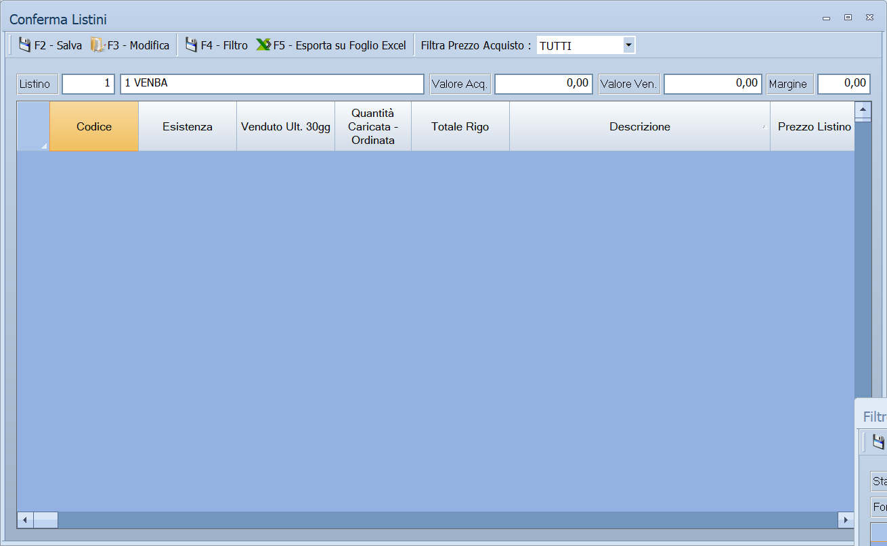

# Conferma e confronto dei listini

Due maschere di controllo. **Conferma Listini** rilegge i prezzi di vendita
alla luce dei carichi e degli ordini arrivati, e li fa confermare uno per uno.
**Confronta Differenze Listini** mette due listini a confronto e permette di
allineare il secondo al primo dove i due non coincidono.

!!! info "In sintesi"

    - **Percorso:**
        - Menu ▸ Archivi ▸ Listini Vendita ▸ Conferma Listini
        - Menu ▸ Archivi ▸ Listini Vendita ▸ Confronto Differenze Listini
    - **Scorciatoia:** ++f2++ salva in entrambe le maschere
    - **Permessi richiesti:** nessun profilo predefinito; le singole voci di menu si abilitano per ogni utente da [Archivi ▸ Utenti](../anagrafiche/utenti.md)

---

## A cosa serve

**Conferma Listini** risponde alla domanda che nasce dopo ogni carico: *«il
fornitore ha alzato i prezzi, il mio prezzo di vendita regge ancora?»*. Si
scelgono i documenti di carico o d'ordine da esaminare e il programma elenca gli
articoli con il vecchio e il nuovo prezzo d'acquisto, il margine di prima e
quello di adesso, e il prezzo che servirebbe per tenere il margine di prima. Si
decide riga per riga, poi si salva.

**Confronta Differenze Listini** serve invece a mantenere allineati due listini
che dovrebbero andare a braccetto: elenca gli articoli il cui prezzo netto è
diverso fra i due e permette di ricopiare, sulle righe scelte, i valori del
listino di riferimento.

## Prerequisiti

Prima di usare queste maschere occorre:

- per **Conferma Listini**, avere in archivio i documenti di carico o gli
  ordini a fornitore da esaminare;
- per **Confronta Differenze Listini**, avere due listini valorizzati.

## La maschera

Entrambe si aprono a tutto schermo, con la barra dei comandi in alto, una riga
di campi sotto e la griglia che occupa il resto della finestra.

In **Conferma Listini** la barra dei comandi porta anche l'etichetta **Filtra
Prezzo Acquisto :** con un elenco a fianco, che restringe la griglia a un tipo
di variazione.

## Campi

### Conferma Listini

| Campo | Obbl. | Descrizione | Valori ammessi |
|---|:---:|---|---|
| **Listino** | ● | Il listino da controllare; a fianco compare il nome. All'apertura è proposto il listino predefinito della ditta. | codice del listino |
| **Valore Acq.** | | Totale del valore d'acquisto delle righe caricate. Solo lettura. | — |
| **Valore Ven.** | | Totale del valore di vendita che risulta dai prezzi in griglia. Solo lettura. | — |
| **Margine** | | Percentuale di margine che risulta dai due totali. Solo lettura. | — |
| **Filtra Prezzo Acquisto :** | | Restringe la griglia agli articoli il cui prezzo d'acquisto si è mosso in un certo modo. | `TUTTI`, `IN AUMENTO`, `IN DIMINUIZIONE`, `NON VARIATI` |

{: .campi }

La griglia mostra, per ogni articolo dei documenti scelti: **Codice**,
**Descrizione**, **Esistenza**, **Venduto Ult. 30gg**, **Quantità Caricata -
Ordinata**, **Totale Rigo**, **Tipo Operaz.**, **Prezzo Acquisto Precedente** e
**Prezzo Acquisto Corrente**, **Prezzo Listino 1 Precedente**, **Nuovo Prezzo
Listino 1** (la colonna da compilare), **Prezzo Listino 1 con Vecchio
Margine** — cioè quanto dovrebbe costare per tenere il margine di prima —,
**Differenza Listino 1**, **Vecchio Margine** e il nuovo margine, **Prezzo
Listino 2** e **Differenza Lis. 1-2**, i dati IVA, quelli della promozione in
corso e il confronto con i listini degli altri fornitori (**Miglior Listino
Fornitore**, **Differenza Miglior Listino**, **Danno in Euro Rispetto Miglior
Listino** e i corrispondenti per il secondo fornitore migliore).

#### La finestra Filtro Listini da Confermare

Si apre con **F4 - Filtro** e sceglie i documenti da esaminare:

| Campo | Obbl. | Descrizione | Valori ammessi |
|---|:---:|---|---|
| **Stato** | | Se mostrare tutti i documenti o solo quelli ancora da controllare. | `TUTTI`, `DA VERIFICARE`, `VERIFICATI` |
| **Tipo** | | Se guardare i carichi, gli ordini o entrambi. | `TUTTI`, `CARICHI`, `ORDINI` |
| **Dal**, **Al** | | Periodo dei documenti. | date |
| **Fornitore** | | Limita ai documenti di un fornitore. | codice, oppure vuoto per tutti |

{: .campi }

Sotto compare l'elenco dei documenti che rispondono ai criteri, con **Sel**,
**Anno**, **Tipo**, **Deposito**, **Numero**, **Data**, **Cod. Doc.**, **Num.
Doc.**, **Data Doc.**, **Cod. Forn.**, **Fornitore**, **Verificato** e
**Stato**: si spuntano quelli da portare in griglia.

### Confronta Differenze Listini

| Campo | Obbl. | Descrizione | Valori ammessi |
|---|:---:|---|---|
| **Listino di Riferimento** | ● | Il listino considerato giusto, quello da cui si copia. | codice del listino |
| **Listino Target** | ● | Il listino da allineare, quello su cui si scrive. | codice del listino |
| **Categoria Merceol.** | | Limita il confronto a una [categoria merceologica](../magazzino/categorie-merceologiche.md). | codice, oppure vuoto per tutte |
| **Reparto** | | Limita il confronto a un [reparto](../magazzino/reparti.md). | codice, oppure vuoto per tutti |

{: .campi }

La griglia elenca gli articoli il cui **prezzo netto** è diverso fra i due
listini, con **Sel**, **Codice**, **Descrizione**, **Ult. Prezzo Acq.**, poi il
blocco **LISTINO DI RIFERIMENTO** (**Prezzo**, **%Sco-1** … **%Sco-7**,
**Netto**, **%Ric.**, **%Mar.**), il blocco **LISTINO TARGET** con gli stessi
dati, e la **Differenza** fra i due.

## Pulsanti e comandi

### Conferma Listini

| Comando | Scorciatoia | Effetto |
|---|---|---|
| **F2 - Salva** | ++f2++ | Scrive sul listino i nuovi prezzi delle righe modificate. |
| **F3 - Modifica** | ++f3++ | Apre l'[anagrafica](../anagrafiche/anagrafica-articoli.md) dell'articolo della riga attiva. |
| **F4 - Filtro** | ++f4++ | Apre la finestra **Filtro Listini da Confermare**. |
| **F5 - Esporta su Foglio Excel** | ++f5++ | Salva la griglia in un foglio Excel. |

### Confronta Differenze Listini

| Comando | Scorciatoia | Effetto |
|---|---|---|
| **F2 - Salva** | ++f2++ | Ricopia sul listino target i valori del listino di riferimento, per le righe spuntate. Le righe salvate spariscono dalla griglia. |
| **F3 - Cerca** | ++f3++ | Cerca le differenze e riempie la griglia. |
| **F4 - Sel. Tutti** | ++f4++ | Spunta tutte le righe. |
| **F5 - Desel. Tutti** | ++f5++ | Toglie la spunta da tutte le righe. |

## Come si fa

### Rivedere i prezzi dopo un carico

1. Apri **Menu ▸ Archivi ▸ Listini Vendita ▸ Conferma Listini**.
2. Controlla il **Listino** proposto.
3. Premi **F4 - Filtro**, scegli **Stato** `DA VERIFICARE` e **Tipo**
   `CARICHI`, indica il periodo e spunta i documenti da esaminare.
4. Nella barra dei comandi porta **Filtra Prezzo Acquisto :** su `IN AUMENTO`
   per vedere solo gli articoli rincarati.
5. Confronta **Prezzo Listino 1 con Vecchio Margine** con quello che hai adesso
   e scrivi il prezzo che decidi nella colonna **Nuovo Prezzo Listino 1**.
6. Premi **F2 - Salva**.

### Allineare il listino 2 al listino 1

1. Apri **Menu ▸ Archivi ▸ Listini Vendita ▸ Confronto Differenze Listini**.
2. In **Listino di Riferimento** indica `1`, in **Listino Target** indica `2`.
3. Premi **F3 - Cerca**.
4. Guarda la colonna **Differenza** e spunta le righe da allineare — oppure
   premi **F4 - Sel. Tutti**.
5. Premi **F2 - Salva**: le righe salvate spariscono dalla griglia, quelle che
   restano sono le differenze che hai deciso di tenere.

## Controlli e messaggi

| Messaggio | Causa | Cosa fare |
|---|---|---|
| *Listino non trovato in archivio!* | Il codice indicato in **Listino di Riferimento** o **Listino Target** non esiste. | Correggi il codice o crea il listino nella tabella dei listini. |

## Note

!!! warning "Attenzione"

    **Confronta Differenze Listini sovrascrive il listino target.** Per le
    righe spuntate, prezzo, sette sconti e netto del listino target vengono
    sostituiti da quelli del listino di riferimento. Non c'è un annullamento:
    controlla la spunta prima di premere **F2 - Salva**, e ricorda che
    **F4 - Sel. Tutti** spunta ogni riga trovata.

    **Il confronto guarda solo il netto.** Due listini con lo stesso prezzo
    netto ma sconti diversi non compaiono fra le differenze.

<!-- DA VERIFICARE: come un documento diventa "VERIFICATO" nel filtro di Conferma Listini — se basta il salvataggio o serve un'azione esplicita. -->

<!-- DA VERIFICARE: se in Conferma Listini il salvataggio scriva sempre sul listino 1 o sul listino indicato nel campo in alto. -->

<!-- DA VERIFICARE: da dove Conferma Listini prende il "Miglior Listino Fornitore": presumibilmente dai listini di acquisto, ma va confermato. -->

## Vedi anche

- [Gestione listini](gestione-listini.md)
- [Copia listini](copia-listini.md)
- [Analisi listino da vendite ed esistenza](analisi-listino.md)
