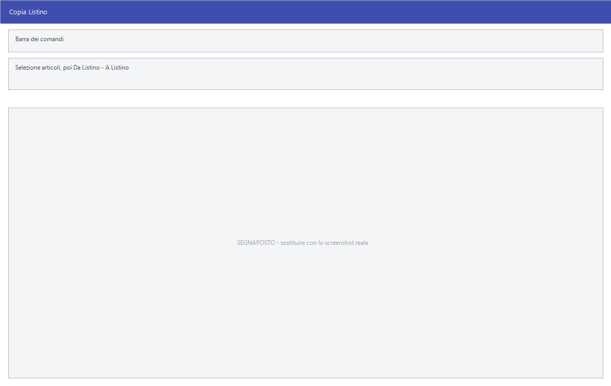

# Copia listini

Ricopia da un listino a un altro tutto quello che sta sulla riga di prezzo:
prezzo, i sette sconti, il netto e le provvigioni. La stessa maschera, aperta
dalla seconda voce di menu, riprende invece un listino dagli archivi di
un'altra ditta.

!!! info "In sintesi"

    **Percorso:** Menu ▸ Archivi ▸ Listini Vendita ▸ Copia Listini
    Menu ▸ Archivi ▸ Listini Vendita ▸ Copia Listino da Altra Ditta
    **Scorciatoia:** ++f2++ avvia la copia, ++esc++ esce
    **Permessi richiesti:** nessun profilo predefinito; le singole voci di menu si abilitano per ogni utente da [Archivi ▸ Utenti](../anagrafiche/utenti.md)

---

## A cosa serve

Serve quando un listino nuovo deve nascere da uno che esiste già: si copia il
listino 1 sul listino 2 e poi si ritocca il 2 con le
[variazioni di massa](variazioni-di-massa.md), invece di ribattere i prezzi
articolo per articolo.

**Copia Listino da Altra Ditta** serve a chi gestisce più ditte nello stesso
programma e vuole allineare i prezzi fra una e l'altra.

## Prerequisiti

Prima di usare questa maschera occorre:

- avere in archivio il listino di partenza, con i prezzi già a posto;
- aver dato un nome al listino di arrivo nella tabella dei listini
  (**Menu ▸ Archivi ▸ Listini Vendita ▸ Inserimento**);
- per la copia da un'altra ditta, sapere il codice della ditta di partenza.

## La maschera

La finestra si chiama *Copia Listino* — oppure *Copia Listino da Altra Ditta* —
ed è divisa in due:

1. in alto il **riquadro di selezione degli articoli** da copiare;
2. in basso, sotto una linea, i due campi che dicono da dove a dove copiare, e i
   pulsanti **F2 - OK** ed **Esci**.

## Campi

### Il riquadro di selezione degli articoli

| Campo | Obbl. | Descrizione | Valori ammessi |
|---|:---:|---|---|
| **Articolo** | | Codice dell'articolo e, di fianco, la descrizione. | codice, oppure `TUTTI` |
| **Cod. Iva** | | Limita agli articoli con quell'[aliquota IVA](../contabilita/aliquote-iva.md). | codice, oppure vuoto per tutte |
| **Reparto** | | Limita agli articoli del [reparto](../magazzino/reparti.md). | codice, oppure vuoto per tutti |
| **Cat. Merc.** | | Limita agli articoli della [categoria merceologica](../magazzino/categorie-merceologiche.md). | codice, oppure vuoto per tutte |
| **Marchio** | | Limita agli articoli del [marchio](../magazzino/marchi.md). | codice, oppure vuoto per tutti |
| **Fornitore** | | Limita agli articoli il cui fornitore abituale è quello indicato. | codice, oppure vuoto per tutti |
| **Stagione** | | Limita agli articoli della [stagione](../magazzino/stagioni.md). | codice, oppure vuoto per tutte |
| **Gruppo** | | Limita agli articoli del gruppo indicato. | testo, oppure `TUTTI` |
| **Sottogruppo** | | Limita agli articoli del sottogruppo indicato. | testo, oppure `TUTTI` |

{: .campi }

Lasciando i campi liberi si copia il listino di **tutti** gli articoli.

### Copia Listini

| Campo | Obbl. | Descrizione | Valori ammessi |
|---|:---:|---|---|
| **Da Listino** | ● | Il listino da cui prendere i prezzi; a fianco compare il nome. | codice del listino |
| **A Listino** | ● | Il listino su cui scriverli. Deve essere diverso da **Da Listino**. | codice del listino |

{: .campi }

### Copia Listino da Altra Ditta

| Campo | Obbl. | Descrizione | Valori ammessi |
|---|:---:|---|---|
| **Da Ditta** | ● | La ditta da cui prendere i prezzi; a fianco compare la ragione sociale. Deve essere diversa dalla ditta in cui si sta lavorando. | codice della ditta |
| **Listino** | ● | Il listino da riprendere. | codice del listino |

{: .campi }

## Pulsanti e comandi

| Comando | Scorciatoia | Effetto |
|---|---|---|
| **F2 - OK** | ++f2++ | Chiede conferma e avvia la copia. |
| **Esci** | ++esc++ | Chiude senza fare nulla. |
| Elenco di scelta | ++f10++ o ++space++ | Sul campo con il codice, apre l'elenco da cui scegliere. |
| **Calcolatrice** | ++f12++ | Apre la calcolatrice. |
| **Consultazione** | ++f11++ | Apre la consultazione. |
| **Guida** | ++f1++ | Apre la guida in linea sulla pagina della maschera. |
| **Interrompi** | | Durante la copia, il pulsante della finestra di avanzamento ferma il lavoro. |

## Come si fa

### Costruire il listino 2 partendo dal listino 1

1. Apri **Menu ▸ Archivi ▸ Listini Vendita ▸ Copia Listini**.
2. Lascia libero il riquadro di selezione, per prendere tutti gli articoli.
3. In **Da Listino** indica `1`, in **A Listino** indica `2`.
4. Premi **F2 - OK** e rispondi **Sì** a *«Confermi la Copia del Listino ?»*.
5. La finestra *Copia Listino in Corso....* mostra l'avanzamento.
6. Ritocca poi il listino 2 con
   [Varia Listini](variazioni-di-massa.md).

### Riprendere i prezzi da un'altra ditta

1. Apri **Menu ▸ Archivi ▸ Listini Vendita ▸ Copia Listino da Altra Ditta**.
2. Restringi eventualmente la selezione degli articoli.
3. In **Da Ditta** indica la ditta di partenza, in **Listino** il listino da
   riprendere.
4. Premi **F2 - OK** e conferma.

## Controlli e messaggi

| Messaggio | Causa | Cosa fare |
|---|---|---|
| *Confermi la Copia del Listino ?* | Richiesta di conferma. | **Sì** avvia la copia sugli articoli selezionati. |
| *(nessun messaggio, solo un segnale acustico e il cursore che torna sul campo)* | Manca uno dei due codici, oppure **A Listino** è uguale a **Da Listino**, oppure **Da Ditta** è la ditta in cui si sta già lavorando. | Correggi il campo su cui si è posizionato il cursore. |
| *Errore Selezione Ditta !* | La ditta indicata in **Da Ditta** non è stata trovata. | Controlla il codice della ditta. |
| *Impossibile Aprire i Files necessari !* | Gli archivi della ditta di partenza non si aprono. | Verifica che la ditta esista e che i suoi archivi siano raggiungibili; se il problema resta, segnala all'assistenza. |
| *Operazione non necessaria per archivi con gestione comune!* | Si è chiesta la copia da un'altra ditta, ma l'installazione tiene gli archivi in comune fra le ditte. | Non c'è nulla da fare: gli articoli e i listini sono già condivisi. |

## Note

!!! warning "Attenzione"

    **La copia sovrascrive.** Sul listino di arrivo, per gli articoli
    selezionati, prezzo, sconti, netto e provvigioni vengono sostituiti da
    quelli del listino di partenza. Quello che c'era prima si perde, e non
    esiste un annullamento.

    **Chi non ha il listino di partenza resta com'è.** Gli articoli che non
    hanno un prezzo sul listino di origine vengono saltati senza avviso: sul
    listino di arrivo restano con i valori che avevano.

<!-- DA VERIFICARE: come si chiama a video l'impostazione che rende gli archivi "a gestione comune" fra le ditte, per poterla citare nel messaggio corrispondente. -->

<!-- DA VERIFICARE: se la copia da altra ditta riporti anche le variazioni di listino programmate, oltre ai prezzi in vigore. -->

## Vedi anche

- [Gestione listini](gestione-listini.md)
- [Variazioni di massa dei listini](variazioni-di-massa.md)
- [Confronto e conferma dei listini](controllo-listini.md)
