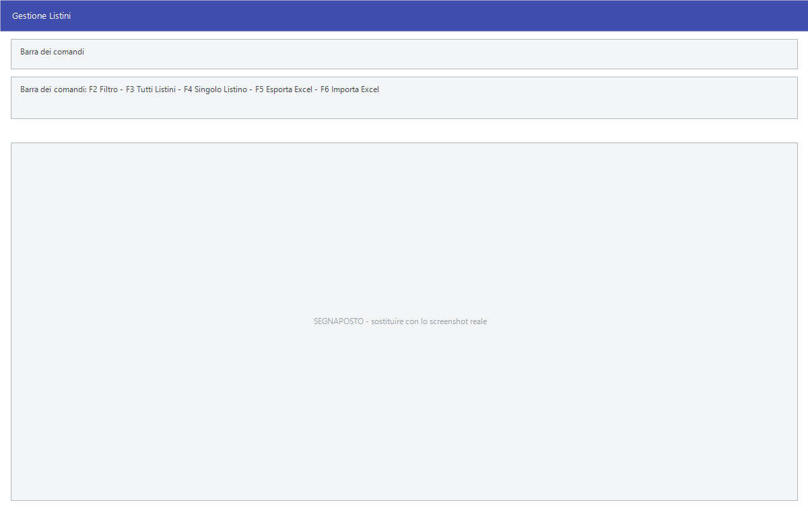

# Gestione listini

Da questa maschera si vedono affiancati i prezzi di tutti gli articoli — i tre
listini, gli sconti, il ricarico e il margine — e li si corregge articolo per
articolo. È la maschera del lavoro quotidiano sui prezzi; per cambiarne molti
in un colpo solo ci sono le [variazioni di massa](variazioni-di-massa.md).

!!! info "In sintesi"

    - **Percorso:** Menu ▸ Archivi ▸ Listini Vendita ▸ Gestione
    - **Scorciatoia:** nessuna; la maschera si apre dal menu
    - **Permessi richiesti:** nessun profilo predefinito; la voce di menu si abilita per ogni utente da [Archivi ▸ Utenti](../anagrafiche/utenti.md)

---

## A cosa serve

Facile tiene per ogni articolo **tre listini di vendita**, ciascuno con il
prezzo, sette sconti in cascata, il prezzo netto che ne risulta, il ricarico,
il margine e la provvigione. Aprire l'anagrafica di un articolo alla volta per
confrontarli è lento: qui stanno tutti in una griglia, con accanto l'ultimo
prezzo di acquisto, così si vede subito dove il margine non torna.

Esempio: si filtra per categoria merceologica, si guarda la colonna
**Ult.Prezzo Acq.** accanto a **1° Listino** e si interviene solo sulle righe
fuori posto.

La stessa maschera serve anche a far viaggiare i prezzi su Excel: si esporta il
foglio, lo si lavora fuori da Facile e lo si rilegge.

## Prerequisiti

Prima di usare questa maschera occorre:

- avere gli [articoli](../anagrafiche/anagrafica-articoli.md) in archivio;
- aver dato un nome ai listini nella tabella dei listini
  (**Menu ▸ Archivi ▸ Listini Vendita ▸ Inserimento**, vedi
  [Tabelle di classificazione](../magazzino/tabelle-di-classificazione.md)).

## La maschera

La finestra ha tre parti: la **barra dei comandi** in alto, la **griglia** degli
articoli al centro e, in basso, la barra di avanzamento che si muove mentre il
programma carica.

All'apertura la griglia è vuota e la finestra **Impostazione Filtro** si apre
da sé, per far scegliere subito quali articoli caricare. Se la si chiude con
**Esci** la griglia resta vuota: si riapre con **F2 - Filtro**.

## Campi

Non c'è un modulo di dettaglio: la griglia mette in fila tutti i dati, ma non
si corregge cella per cella — vedi la nota qui sotto.

| Campo | Obbl. | Descrizione | Valori ammessi |
|---|:---:|---|---|
| **Codice** | | Codice dell'articolo. | — |
| **Cod.Forn.** | | Codice con cui il fornitore identifica l'articolo. Se l'articolo non ne ha uno, la colonna ripete il codice interno. | — |
| **Descrizione** | | Descrizione dell'articolo. | — |
| **Ult.Prezzo Acq.** | | Ultimo prezzo pagato al fornitore: è il termine di paragone per giudicare il listino. | — |
| **1° Listino** | | Prezzo di vendita del primo listino. | importo |
| **%Sc1** … **%Sc7** | | I sette sconti in cascata applicati al prezzo del listino. | da 0 a 100, due decimali |
| **%Ric.** | | Ricarico che risulta dal prezzo netto rispetto al prezzo di acquisto. | percentuale |
| **%Mar.** | | Margine che risulta dal prezzo netto. | percentuale |
| **%Prov.** | | Provvigione riconosciuta all'agente su questo listino. | percentuale |
| **2° Listino**, **3° Listino** | | Le stesse colonne, ripetute per il secondo e il terzo listino. | come sopra |
| **Trovato** | | Si valorizza dopo un'importazione da Excel: dice quali articoli comparivano nel foglio. | — |

{: .campi }

La colonna **Obbl.** segna con ● i campi che il programma richiede
obbligatoriamente per salvare: qui nessun campo è obbligatorio, perché non si
inseriscono nuovi articoli ma si correggono quelli esistenti.

!!! note "La griglia è di sola lettura"

    Nelle celle non si scrive: la griglia serve a guardare e a confrontare. I
    prezzi si cambiano dalle finestre che aprono **F3 - Tutti Listini**,
    **F4 - Singolo Listino** e il doppio clic; chiudendo quelle, la riga si
    aggiorna da sé.

    Per cambiare molti prezzi in un colpo solo ci sono le [variazioni di
    massa](variazioni-di-massa.md) o il giro da [Excel](#lavorare-i-prezzi-su-excel).

!!! note "Colonne che cambiano nome o spariscono"

    - Normalmente si vede la colonna **Codice** e **Cod.Forn.** resta nascosta.
      Si scambiano di posto nelle installazioni avviate con il parametro
      **DGC**: lì sparisce **Codice** e resta **Cod.Forn.**. Non è
      un'impostazione della ditta ma una personalizzazione richiesta da un
      cliente, che si attiva sul collegamento con cui si lancia il programma; si
      riconosce perché la sigla **DGC** compare nella barra di stato di Facile.
    - Se le impostazioni della ditta prevedono i prezzi di acquisto IVA
      inclusa, l'intestazione della colonna diventa **Ult. Prezzo Acq.
      (Imponibile)**.

## Pulsanti e comandi

| Comando | Scorciatoia | Effetto |
|---|---|---|
| **F2 - Filtro** | ++f2++ | Apre la finestra **Impostazione Filtro** e ricarica la griglia con gli articoli scelti. |
| **F3 - Tutti Listini** | ++f3++ | Apre, sull'articolo della riga attiva, la finestra dei ricarichi con i tre listini insieme. |
| **F4 - Singolo Listino** | ++f4++ | Apre, sull'articolo della riga attiva, la finestra di variazione di **un** listino per volta. |
| **F5 - Esporta su Foglio Excel** | ++f5++ | Salva la griglia in un foglio Excel. Disponibile solo a griglia caricata. |
| **F6 - Importa da Foglio Excel** | ++f6++ | Rilegge prezzi e sconti da un foglio Excel. |
| Doppio clic sulla riga | ++enter++ o ++space++ | Come **F3 - Tutti Listini**. Tenendo premuto ++ctrl++ apre invece la finestra del singolo listino. |
| **Calcolatrice** | ++f12++ | Apre la calcolatrice. |
| **Consultazione** | ++f11++ | Apre la consultazione. |
| **Guida** | ++f1++ | Apre la guida in linea sulla pagina della maschera. |

!!! warning "In Taglie e Colori - Calzature il doppio clic è invertito"

    In **Taglie e Colori - Calzature** il doppio clic (e ++enter++ /
    ++space++) apre la finestra del **singolo listino**, e serve ++ctrl++ per
    aprire quella dei ricarichi. Nelle altre versioni vale quanto scritto in
    tabella.

### La finestra Impostazione Filtro

Si apre con **F2 - Filtro** e ha una sola scheda, **Filtri su Articoli**, con i
criteri con cui restringere la griglia: **Articolo** (codice e descrizione),
**Cod. Iva**, **Reparto**, **Cat. Merc.**, **Marchio**, **Stagione**,
**Fornitore**, **Gruppo Mix**, **Gruppo**, **Sottogruppo**, **Web** e le tre
tabelle di classificazione libere della ditta.

Nei campi di testo valgono i caratteri jolly: `*` sostituisce un gruppo
qualsiasi di caratteri e `?` un carattere solo. Lasciando scritto `TUTTI` non si
filtra su quel dato. I campi delle tre tabelle di classificazione prendono a
video il nome che quelle tabelle hanno nella ditta; se la ditta non le usa il
campo resta senza etichetta e non si può compilare.

## Come si fa

### Correggere qualche prezzo a mano

1. Apri **Menu ▸ Archivi ▸ Listini Vendita ▸ Gestione**: la finestra del
   filtro si apre da sé.
2. Restringi agli articoli che ti interessano e conferma.
3. Attendi il caricamento: la barra in basso dice a che punto è.
4. Portati sulla riga dell'articolo e apri la finestra della riga con **F3 -
   Tutti Listini**, **F4 - Singolo Listino** o il doppio clic. È da lì che il
   prezzo si cambia: scriverlo nella cella non serve.

### Lavorare su un singolo articolo

1. Portati sulla riga dell'articolo.
2. Premi **F3 - Tutti Listini** per vedere e rivedere i tre listini con i
   ricarichi, oppure **F4 - Singolo Listino** per cambiare un listino solo,
   indicando anche la data di **Decorrenza**.
3. Chiudendo la finestra la riga della griglia si aggiorna da sola.

### Lavorare i prezzi su Excel

1. Carica gli articoli con **F2 - Filtro**.
2. Premi **F5 - Esporta su Foglio Excel**: il programma propone la cartella
   `out` dei documenti utente, il nome *Listini* e il formato **`.xlsx`**; il
   vecchio `.xls` resta disponibile nell'elenco dei tipi. Nel foglio finiscono
   tutte le colonne che si vedono a video, con le stesse intestazioni, gli
   stessi colori e la griglia dei bordi; restano fuori **Trovato** e le colonne
   nascoste. La griglia non si muove: resta caricata com'era.
3. Modifica il foglio fuori da Facile.
4. Premi **F6 - Importa da Foglio Excel** e scegli il file: il programma parte
   dalla cartella `in` dei documenti utente.
5. Controlla la colonna **Trovato**, poi rispondi alla domanda sugli articoli
   non trovati.

L'importazione aggiorna **solo gli articoli caricati nella griglia**: se nel
frattempo hai cambiato filtro, ricaricala con gli stessi articoli prima di
importare.

### Come dev'essere fatto il foglio da importare

Il programma cerca una riga di intestazione e riconosce le colonne dal nome
(maiuscole e minuscole sono indifferenti). Le colonne riconosciute sono:

| Intestazione | Contenuto |
|---|---|
| `CODICE` | Codice dell'articolo. **È l'unica indispensabile.** |
| `DESCRIZIONE` | Descrizione dell'articolo. |
| `COD_LIS` | Numero del listino da aggiornare (1, 2 o 3). |
| `PREZZO` | Prezzo da mettere su quel listino. |
| `SCONTO1` … `SCONTO7` | I sette sconti. |
| `DATA` | Data di decorrenza del nuovo prezzo. |
| `MINRIORD` | Minimo di riordino dell'articolo. |
| `SCORTAMIN` | Scorta minima sul deposito. |

Se il foglio non ha la colonna `COD_LIS` i prezzi **non vengono toccati**: si
aggiornano solo i dati delle colonne presenti. Se la colonna `DATA` contiene una
data futura, il nuovo prezzo non entra subito in vigore ma viene messo fra le
[variazioni programmate](variazione-listini.md).

Prezzo, sconti, minimo di riordino e scorta minima si importano **con i
decimali**, sia che la cella sia formattata come numero sia che contenga del
testo. Nelle celle di testo la **virgola** va bene come separatore decimale: il
programma la converte da sé.

!!! warning "Il foglio esportato non si reimporta così com'è"

    L'esportazione e l'importazione non sono l'una l'inverso dell'altra.
    L'export scrive **tutti e tre i listini** affiancati, con le intestazioni
    della griglia (`Codice`, `1° Listino`, `%Sc1`…); l'import lavora su **un
    listino per volta** e cerca intestazioni diverse (`CODICE`, `COD_LIS`,
    `PREZZO`, `SCONTO1`…). Reimportando il foglio appena esportato, il
    programma riconosce solo la colonna del codice e i prezzi non si aggiornano.

    Per fare il giro completo, il foglio da importare va preparato con le
    intestazioni della tabella qui sopra, una riga per articolo e per listino.

## Controlli e messaggi

| Messaggio | Causa | Cosa fare |
|---|---|---|
| *Impossibile inizializzare il file excel!* | Il programma non riesce a preparare il foglio Excel. | Segnala all'assistenza. |
| *Impossibile aprire il file excel!* | Il file scelto non si apre: è aperto in Excel, spostato o danneggiato. | Chiudi il file in Excel, poi riprova. |
| *Formato foglio Excel non valido !* | Nel foglio non è stata trovata la colonna `CODICE`. | Aggiungi la riga di intestazione con i nomi di colonna riportati sopra. |
| *Vuoi marcare come Non piu' Ordinabili gli articoli non trovati ?* | Finita l'importazione, alcuni articoli caricati nella griglia non comparivano nel foglio. | Rispondi **Sì** solo se il foglio conteneva davvero tutto l'assortimento aggiornato del fornitore. Vedi l'avvertenza qui sotto. |

## Note

!!! warning "Attenzione"

    **Gli articoli non trovati.** Rispondere **Sì** a *«Vuoi marcare come Non
    piu' Ordinabili gli articoli non trovati ?»* segna come non più ordinabili
    **tutti** gli articoli caricati nella griglia che non erano nel foglio, e
    ne fa precedere la descrizione da un accento circonflesso (`^`). Se il
    filtro era largo e il foglio conteneva solo una parte dell'assortimento, si
    marca molto più del previsto: controlla prima la colonna **Trovato**. La
    domanda propone **No**: è la risposta prudente. Nella versione
    **Ortofrutta** la domanda non compare e nessun articolo viene marcato.

    **Il separatore delle migliaia nelle celle di testo.** In una cella
    formattata come **testo**, un numero scritto `1.234,56` viene letto come
    `1,234`: il programma tratta come decimale il primo separatore che trova.
    Nelle celle **numeriche** il problema non si pone. Se il foglio arriva da
    fuori, conviene formattare come numero le colonne di prezzo e sconti.

## Vedi anche

- [Variazioni di massa dei listini](variazioni-di-massa.md)
- [Variazioni di listino programmate](variazione-listini.md)
- [Copia listini](copia-listini.md)
- [Anagrafica articoli](../anagrafiche/anagrafica-articoli.md)
