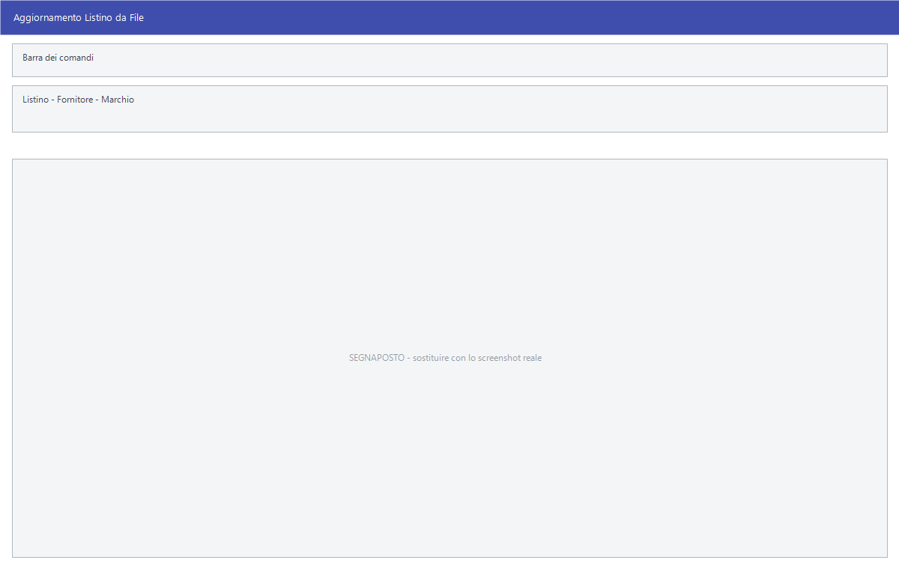

# Importazione listino

Nove voci di menu che leggono il file del listino così come lo manda il
fornitore o il consorzio, e ne riportano i prezzi negli archivi di Facile senza
digitarli.

!!! info "In sintesi"

    - **Percorso:** Menu ▸ Archivi ▸ Listini Vendita ▸ Importazione Listino ▸ *(nome del formato)*
    - **Scorciatoia:** ++f2++ avvia l'importazione, ++esc++ esce
    - **Permessi richiesti:** nessun profilo predefinito; le singole voci di menu si abilitano per ogni utente da [Archivi ▸ Utenti](../anagrafiche/utenti.md)

---

## A cosa serve

Ogni fornitore ha il suo tracciato. Chi lavora con quel fornitore riceve
periodicamente il file dei prezzi aggiornati: invece di ribatterli, si lancia
l'importazione corrispondente.

I formati previsti sono nove:

| Voce di menu | Chi la usa |
|---|---|
| **Angaisa** | Listini del consorzio Angaisa (idrotermosanitari). |
| **Ariete** | Listini in formato Ariete. |
| **Biondan** | Listini Biondan. |
| **Fenapro** | Listini Fenapro, da file `.mrc`. |
| **Flex** | Listini Flex. |
| **Monthblanc** | Listini Monthblanc. |
| **Renault** | Listini ricambi Renault. |
| **Tabacchi formato Logista.it** | Listino generi di monopolio scaricato da Logista.it. |
| **Tabacchi formato Tabaccai.it** | Listino generi di monopolio scaricato da Tabaccai.it. |

## Prerequisiti

Prima di usare queste maschere occorre:

- avere il file del listino, nel formato e con l'estensione che il fornitore
  usa;
- avere impostato nella ditta il **deposito attivo**, l'**aliquota IVA
  predefinita** e, per i formati che creano articoli nuovi, l'**unità di misura
  predefinita** e il **reparto predefinito**;
- avere in archivio il [fornitore](../anagrafiche/anagrafica-fornitori.md) e il
  [marchio](../magazzino/marchi.md) da associare;
- per le due importazioni **Tabacchi**, un canone di assistenza in corso: il
  programma verifica la licenza prima di partire.

## La maschera

Sei formati su nove — **Angaisa**, **Ariete**, **Biondan**, **Flex**,
**Monthblanc** e, con una sola voce, **Fenapro** — aprono la stessa finestrella,
il cui titolo dice quale listino si sta importando: *Aggiornamento Listino da
File ANGAISA*, *Aggiornamento Listini ARIETE*, *Aggiornamento Listini
BIONDAN*, *Aggiornamento Listini FLEX*, *Aggiornamento Listini Monthblanc*,
*Importazioni Listini Fenapro*.

**Renault** non apre nessuna finestra: parte subito e cerca il file in una
posizione fissa. Le due importazioni **Tabacchi** aprono direttamente la
finestra di scelta del file.

## Campi

| Campo | Obbl. | Descrizione | Valori ammessi |
|---|:---:|---|---|
| **Listino** | ● | Su quale dei listini scrivere i prezzi importati; a fianco compare il nome. | da 1 a 3 |
| **Fornitore** | | Il fornitore a cui associare gli articoli importati. | codice, oppure vuoto per tutti |
| **Marchio** | | Il marchio da assegnare agli articoli importati. | codice, oppure vuoto per tutti |

{: .campi }

La finestra di **Fenapro** ha il solo campo **Listino**.

## Pulsanti e comandi

| Comando | Scorciatoia | Effetto |
|---|---|---|
| **F2 - OK** | ++f2++ | Chiede il file da leggere, poi conferma e avvia l'importazione. |
| **Esci** | ++esc++ | Chiude senza importare. |
| Elenco di scelta | ++f10++ o ++space++ | Sul campo con il codice, apre l'elenco da cui scegliere. |
| **Interrompi** | | Durante l'importazione, il pulsante della finestra di avanzamento ferma il lavoro. |

## Come si fa

### Importare un listino Angaisa, Ariete, Biondan, Flex o Monthblanc

1. Salva sul computer il file mandato dal fornitore.
2. Apri **Menu ▸ Archivi ▸ Listini Vendita ▸ Importazione Listino** e scegli il
   formato.
3. Indica il **Listino** su cui scrivere e, se serve, **Fornitore** e
   **Marchio**.
4. Premi **F2 - OK**, scegli il file e conferma.
5. La finestra di avanzamento segue il lavoro fino alla fine.

### Importare un listino Fenapro

1. Apri **Menu ▸ Archivi ▸ Listini Vendita ▸ Importazione Listino ▸ Fenapro**.
2. Indica il **Listino** (da 1 a 3).
3. Premi **F2 - OK** e scegli il file `.mrc`.

### Importare il listino Renault

1. Copia il file dei prezzi nella cartella `in` dell'installazione di Facile,
   con il nome `renault.txt`.
2. Verifica che il listino principale della ditta sia impostato fra 1 e 3.
3. Apri **Menu ▸ Archivi ▸ Listini Vendita ▸ Importazione Listino ▸ Renault**:
   l'importazione parte subito.

### Importare il listino dei tabacchi

1. Scarica da Logista.it o da Tabaccai.it il file del listino.
2. Apri la voce di menu corrispondente al sito da cui hai scaricato.
3. Scegli il file: sono accettati i documenti Excel `.xls` e, per il formato
   Tabaccai.it, anche i file `.rsa`.

## Controlli e messaggi

| Messaggio | Causa | Cosa fare |
|---|---|---|
| *Impostare il listino 1, 2 o 3!* | Il campo **Listino** è vuoto o fuori intervallo. | Indica 1, 2 o 3. |
| *Sono aggiornabili solo i listini da 1 a 3 !* | Come sopra, nell'importazione Fenapro. | Indica 1, 2 o 3. |
| *Impostare il listino principale per eseguire l' operazione* | Nell'importazione Renault, il listino principale della ditta non è impostato fra 1 e 3. | Correggi l'impostazione della ditta. |
| *Deposito attivo non impostato o non valido !* / *Deposito non Inizializzato!* / *Impostare deposito prima dell'importazione!* | Manca il [deposito](../magazzino/depositi.md) attivo. | Imposta il deposito attivo nelle opzioni della ditta. |
| *Codice Iva predefinito non impostato o non valido !* / *Codice Iva non Inizializzata!* / *Impostare aliquota Iva predefinita prima della conversione!* | Manca l'[aliquota IVA](../contabilita/aliquote-iva.md) predefinita. | Impostala nelle opzioni della ditta. |
| *Impostare unita' di misura predefinita prima della conversione!* | Manca l'[unità di misura](../magazzino/unita-di-misura.md) predefinita. | Impostala nelle opzioni della ditta. |
| *Obbligo Selezione Reparto!* / *Impostare reparto predefinito prima della conversione!* | Manca il [reparto](../magazzino/reparti.md) da assegnare agli articoli nuovi. | Scegli il reparto, o impostane uno predefinito nelle opzioni della ditta. |
| *File non trovato o impossibile da aprire!* / *Impossibile aprire il file !* | Il file non c'è, ha un nome diverso da quello atteso, o è aperto in un altro programma. | Controlla nome e posizione del file e chiudilo negli altri programmi. |
| *File utilizzato da un' altra applicazione o formato file non compatibile!* | Il foglio è aperto in Excel, oppure non è nel formato previsto. | Chiudi il file e riprova; se il problema resta, riscarica il listino. |
| *Formato file non compatibile!* | Il file scelto non è del tipo che quell'importazione si aspetta. | Verifica di aver scelto il file giusto per quella voce di menu. |
| *Colonna Categoria non trovata !* / *Importazione non possibile.* | Nel listino tabacchi manca la colonna della categoria. | Riscarica il file dal sito senza modificarne le colonne. |
| *Colonna Codice non trovata !* / *Importazione non possibile.* | Manca la colonna del codice. | Come sopra. |
| *Colonna Denominazione Commerciale non trovata !* / *Importazione non possibile.* | Manca la colonna della denominazione. | Come sopra. |
| *Impossibile Creare la tabella* | Il programma non riesce a preparare l'area di lavoro per l'importazione. | Segnala all'assistenza. |
| *Confermi l'importazione del Listino Flex?* / *Confermi l'importazione del Listino Monthblanc ?* | Richiesta di conferma. | **Sì** avvia l'importazione. |
| *Impossibile trovare il file della licenza.* / *Riattivare il software per accedere al server delle licenze.* | Importazione tabacchi: la licenza non è raggiungibile. | Riattiva il programma o contatta l'assistenza. |
| *Accesso non consentito.* / *Necessario rinnovo canone.* | Importazione tabacchi: il canone di assistenza è scaduto. | Contatta l'assistenza per il rinnovo. |
| *Connessione al server conclusa con errore n N* | Importazione tabacchi: il controllo della licenza non è andato a buon fine. | Verifica il collegamento a Internet e riprova; se il problema resta, contatta l'assistenza. |

## Note

!!! warning "Attenzione"

    **L'importazione sovrascrive i prezzi.** Sul listino indicato, per gli
    articoli presenti nel file, i prezzi vengono sostituiti da quelli del
    fornitore. Non c'è un annullamento: prima di importare un listino nuovo
    conviene avere una copia di sicurezza recente.

    **Alcune importazioni creano articoli nuovi.** I formati che riconoscono
    articoli non ancora in archivio li inseriscono usando il deposito,
    l'aliquota IVA, l'unità di misura e il reparto predefiniti della ditta: se
    quelle impostazioni sono sbagliate, gli articoli nascono sbagliati.

<!-- DA VERIFICARE: per ciascun formato, quale estensione e quale tracciato il file deve avere; ho potuto accertare solo il .mrc di Fenapro, il renault.txt di Renault e i file Excel dei due formati Tabacchi. -->

<!-- DA VERIFICARE: quali importazioni inseriscono articoli nuovi e quali si limitano ad aggiornare i prezzi degli articoli già presenti. -->

<!-- DA VERIFICARE: se le importazioni scrivano i prezzi con effetto immediato o li mettano fra le variazioni programmate. -->

<!-- DA VERIFICARE: se l'importazione Renault possa leggere un file scelto dall'utente invece del solo "in\renault.txt". -->

## Vedi anche

- [Gestione listini](gestione-listini.md)
- [Variazioni di listino programmate](variazione-listini.md)
- [Anagrafica articoli](../anagrafiche/anagrafica-articoli.md)
