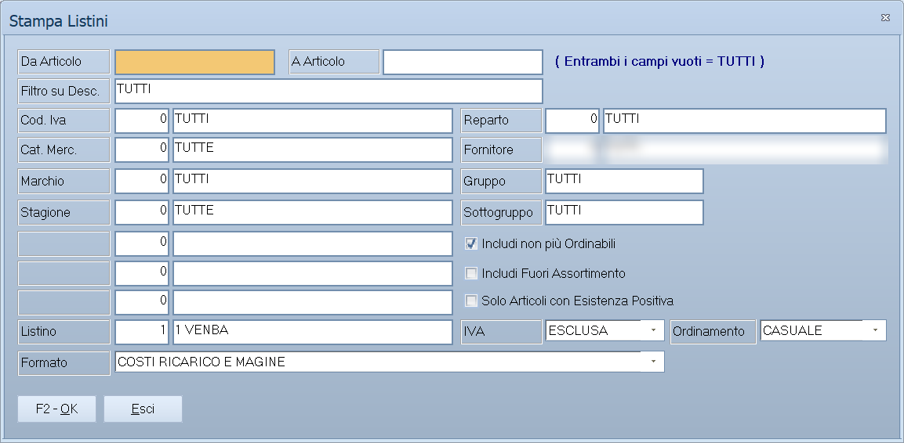

# Stampa listini

Stampa il listino di vendita degli articoli scelti, nel formato che serve: da
consegnare al cliente, da dare all'agente, da usare in magazzino con le
esistenze accanto ai prezzi.

!!! info "In sintesi"

    - **Percorso:** Menu ▸ Archivi ▸ Listini Vendita ▸ Stampa Listino
    - **Scorciatoia:** ++f2++ avvia la stampa, ++esc++ esce
    - **Permessi richiesti:** nessun profilo predefinito; la voce di menu si abilita per ogni utente da [Archivi ▸ Utenti](../anagrafiche/utenti.md)

---

## A cosa serve

È la stampa del listino prezzi. Si sceglie quali articoli includere, quale dei
tre listini stampare, se i prezzi vanno esposti con o senza IVA, e con quale
impaginazione.

La stessa maschera, aperta da **Stampa Variazioni Listini**, stampa invece i
cambi di prezzo programmati: vedi
[Variazioni di listino programmate](variazione-listini.md).

## Prerequisiti

Prima di usare questa maschera occorre:

- avere gli [articoli](../anagrafiche/anagrafica-articoli.md) con i prezzi
  valorizzati sul listino da stampare.

## La maschera

La finestra *Stampa Listini* è divisa in due:

1. in alto la **selezione degli articoli** da includere;
2. in basso le **opzioni di stampa** — listino, IVA, ordinamento, formato — con
   le tre caselle di inclusione e i pulsanti **F2 - OK** ed **Esci**.

## Campi

### Selezione degli articoli

| Campo | Obbl. | Descrizione | Valori ammessi |
|---|:---:|---|---|
| **Da Articolo** | | Primo codice dell'intervallo da stampare. | codice |
| **A Articolo** | | Ultimo codice dell'intervallo. Accanto ai due campi il programma ricorda: **( Entrambi i campi vuoti = TUTTI )**. | codice |
| **Filtro su Desc.** | | Include solo gli articoli la cui descrizione corrisponde a quanto scritto. | testo, anche con i caratteri jolly `*` e `?` |
| **Cod. Iva** | | Limita agli articoli con quell'[aliquota IVA](../contabilita/aliquote-iva.md). | codice, oppure vuoto per tutte |
| **Reparto** | | Limita agli articoli del [reparto](../magazzino/reparti.md). | codice, oppure vuoto per tutti |
| **Cat. Merc.** | | Limita agli articoli della [categoria merceologica](../magazzino/categorie-merceologiche.md). | codice, oppure vuoto per tutte |
| **Fornitore** | | Limita agli articoli il cui fornitore abituale è quello indicato. | codice, oppure vuoto per tutti |
| **Marchio** | | Limita agli articoli del [marchio](../magazzino/marchi.md). | codice, oppure vuoto per tutti |
| **Stagione** | | Limita agli articoli della [stagione](../magazzino/stagioni.md). | codice, oppure vuoto per tutte |
| **Gruppo**, **Sottogruppo** | | Limitano al gruppo e al sottogruppo indicati. | testo |
| **Tabella 1**, **Tabella 2**, **Tabella 3** | | Le tre tabelle di classificazione libere. A video portano il nome che hanno nella ditta; se la ditta non le usa restano senza etichetta e non si possono compilare. | codici |

{: .campi }

### Opzioni di stampa

| Campo | Obbl. | Descrizione | Valori ammessi |
|---|:---:|---|---|
| **Listino** | ● | Quale dei listini stampare; a fianco compare il nome. | codice del listino |
| **IVA** | ● | Se i prezzi vanno stampati con o senza IVA. | `ESCLUSA`, `INCLUSA` |
| **Ordinamento** | ● | Come ordinare gli articoli nella stampa. | `CASUALE`, `CODICE`, `DESCRIZIONE` |
| **Formato** | ● | L'impaginazione della stampa. L'elenco dipende dai formati installati: vedi sotto. | voce dell'elenco |
| **Includi non più Ordinabili** | | Se stampare anche gli articoli marcati come non più ordinabili. All'apertura è attivo. | attivo/non attivo |
| **Includi Fuori Assortimento** | | Se stampare anche gli articoli fuori assortimento. | attivo/non attivo |
| **Solo Articoli con Esistenza Positiva** | | Limita la stampa a quello che c'è davvero in magazzino. | attivo/non attivo |

{: .campi }

### I formati disponibili

L'elenco **Formato** non è fisso: il programma lo costruisce guardando i
modelli di stampa installati, e mostra solo quelli presenti. In
un'installazione completa si trovano, fra gli altri:

| Formato | Cosa contiene |
|---|---|
| `STANDARD` | Il listino essenziale: codice, descrizione, prezzo. |
| `STANDARD PREZZI A PEZZO` | Come lo standard, con il prezzo riferito al pezzo. Stampa in orizzontale. |
| `PRIMI TRE PREZZI` | I tre listini affiancati. Stampa in orizzontale e **richiede che il campo Listino sia impostato a 1**. |
| `COSTI RICARICO E MAGINE` | Prezzo di acquisto, ricarico e margine accanto al prezzo di vendita. |
| `RAGGRUPPATO PER CATEGORIA` | Il listino diviso per categoria merceologica. Ne esistono le varianti con l'esistenza del deposito, con l'esistenza totale e con il margine. |
| `RAGGRUPPATO PER REPARTO` | Il listino diviso per reparto. La variante `IVATO` espone i prezzi con l'IVA. |
| `RAGGRUPPATO PER MARCHIO` | Il listino diviso per marchio, con le varianti sull'esistenza. |
| `RAGGRUPPATO PER STAGIONE` | Il listino diviso per stagione, con le varianti sull'esistenza. |

L'ultimo formato usato viene riproposto la volta successiva. I formati riservati
alla versione **Killin** compaiono solo in quella versione.

## Pulsanti e comandi

| Comando | Scorciatoia | Effetto |
|---|---|---|
| **F2 - OK** | ++f2++ | Prepara e mostra l'anteprima della stampa. |
| **Esci** | ++esc++ | Chiude senza stampare. |
| Elenco di scelta | ++f10++ o ++space++ | Sul campo con il codice, apre l'elenco da cui scegliere. |
| **Calcolatrice** | ++f12++ | Apre la calcolatrice. |
| **Consultazione** | ++f11++ | Apre la consultazione. |
| **Guida** | ++f1++ | Apre la guida in linea sulla pagina della maschera. |

## Come si fa

### Stampare il listino per un cliente

1. Apri **Menu ▸ Archivi ▸ Listini Vendita ▸ Stampa Listino**.
2. Lascia vuoti **Da Articolo** e **A Articolo** per prendere tutto, oppure
   restringi con **Cat. Merc.**, **Marchio** o **Fornitore**.
3. In **Listino** indica il listino del cliente.
4. In **IVA** scegli `INCLUSA` se il cliente è un privato, `ESCLUSA` se è
   un'azienda.
5. In **Ordinamento** scegli `DESCRIZIONE`.
6. In **Formato** scegli `RAGGRUPPATO PER CATEGORIA`.
7. Togli **Includi non più Ordinabili**, così non finiscono in stampa articoli
   che non puoi più fornire.
8. Premi **F2 - OK**.

### Stampare i tre listini affiancati

1. Apri la maschera e seleziona gli articoli.
2. In **Listino** scrivi `1`: il formato lo richiede.
3. In **Formato** scegli `PRIMI TRE PREZZI`.
4. Premi **F2 - OK**.

## Controlli e messaggi

| Messaggio | Causa | Cosa fare |
|---|---|---|
| *Formato non valido !* | Non è stato scelto un formato di stampa. | Scegli una voce dall'elenco **Formato**. |
| *Impostare Listino a 1 per eseguire la stampa !* | Si è scelto il formato `PRIMI TRE PREZZI` con un listino diverso da 1. | Scrivi `1` nel campo **Listino**: quel formato stampa comunque tutti e tre. |

## Note

!!! note "Le stampe con l'esistenza"

    I formati che espongono l'esistenza si comportano in due modi: quelli
    *«con esistenza deposito»* riportano le quantità del deposito attivo,
    quelli *«con esistenza totale»* la somma di tutti i depositi.

<!-- DA VERIFICARE: cosa fa esattamente l'ordinamento "CASUALE": presumibilmente lascia l'ordine dell'archivio, ma va confermato con una prova. -->

<!-- DA VERIFICARE: se "Filtro su Desc." accetti davvero i caratteri jolly come gli altri filtri sugli articoli. -->

<!-- DA VERIFICARE: se il formato "COSTI RICARICO E MAGINE" compaia a video proprio così (il nome del modello di stampa contiene un refuso). -->

## Vedi anche

- [Gestione listini](gestione-listini.md)
- [Variazioni di listino programmate](variazione-listini.md)
- [Anagrafica articoli](../anagrafiche/anagrafica-articoli.md)
