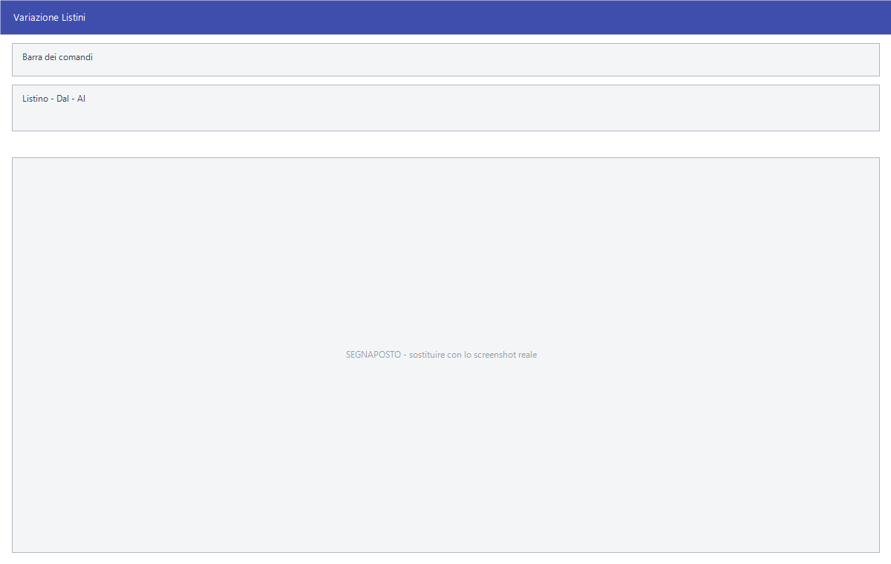

# Variazioni di listino programmate

Un cambio di prezzo può essere preparato con una **data di decorrenza futura**:
resta in attesa e diventa effettivo il giorno stabilito. Questa pagina raccoglie
le quattro voci di menu che governano quelle variazioni in attesa.

!!! info "In sintesi"

    - **Percorso:**
        - Menu ▸ Archivi ▸ Listini Vendita ▸ Variazioni Listini
        - Menu ▸ Archivi ▸ Listini Vendita ▸ Stampa Variazioni Listini
        - Menu ▸ Archivi ▸ Listini Vendita ▸ Apporta Variazioni
        - Menu ▸ Archivi ▸ Listini Vendita ▸ Cancella Variazioni Listini
    - **Scorciatoia:** ++f2++ in tutte e quattro le maschere
    - **Permessi richiesti:** nessun profilo predefinito; le singole voci di menu si abilitano per ogni utente da [Archivi ▸ Utenti](../anagrafiche/utenti.md)

---

## A cosa serve

Il fornitore comunica a ottobre i prezzi che valgono dal primo gennaio: si
caricano subito con decorrenza 1° gennaio e il programma li mette in vigore da
solo quel giorno. Fino ad allora si vendono i prezzi vecchi, ma i nuovi sono già
in archivio, controllabili e stampabili.

Le variazioni in attesa si creano in tre modi:

- dalla finestra del **singolo listino**, aperta con **F4 - Singolo Listino**
  nella [Gestione listini](gestione-listini.md), indicando la **Decorrenza**;
- importando un foglio Excel con la colonna `DATA` valorizzata a una data
  futura;
- dalle [importazioni di listino](importazione-listino.md) dei fornitori che le
  prevedono.

Una volta create, si guardano e si correggono con **Variazioni Listini**, si
stampano con **Stampa Variazioni Listini**, si rendono effettive con **Apporta
Variazioni** e si eliminano con **Cancella Variazioni Listini**.

## Prerequisiti

Nessuno, oltre ad avere le variazioni già caricate: senza variazioni in attesa
le quattro maschere non hanno nulla da mostrare.

## La maschera

Le quattro finestre sono diverse fra loro:

- **Variazioni Listini** è una finestra piena schermo: in alto la barra dei
  comandi e i campi **Listino**, **Dal** e **Al**; sotto la griglia delle
  variazioni trovate.
- **Stampa Variazioni Listini** ha lo stesso riquadro di selezione degli
  articoli della [stampa del listino](stampa-listini.md), senza le opzioni di
  formato.
- **Apporta Variazioni** è una finestrella con la sola data.
- **Cancella Variazioni Listini** ha in alto **Listino**, **Dal** e **Al**, e
  sotto il riquadro di selezione degli articoli.

## Campi

### Variazioni Listini

| Campo | Obbl. | Descrizione | Valori ammessi |
|---|:---:|---|---|
| **Listino** | ● | Il listino di cui vedere le variazioni; a fianco compare il nome. All'apertura è proposto il listino predefinito della ditta. | codice del listino |
| **Dal** | ● | Prima data di decorrenza da mostrare. All'apertura è proposta la data di oggi. | data |
| **Al** | ● | Ultima data di decorrenza da mostrare. | data |

{: .campi }

La griglia mostra una riga per variazione:

| Colonna | Contenuto |
|---|---|
| **Data** | Data in cui la variazione è stata caricata. |
| **Decorrenza** | Giorno dal quale il nuovo prezzo diventa effettivo. |
| **Codice**, **Descrizione** | L'articolo. |
| *(nome del listino)* | Prezzo che entrerà in vigore. La colonna prende il nome del listino scelto. È modificabile. |
| **%Sco-1** … **%Sco-7** | I sette sconti che accompagnano il nuovo prezzo. Sono modificabili. |
| **Prezzo Netto** | Il netto che risulta dal prezzo e dagli sconti. |
| **Vecchio Prezzo Netto** | Il netto in vigore oggi. |
| **Diff.** | Differenza fra il nuovo netto e quello attuale. |
| *(nome del secondo listino)* | Il prezzo dell'articolo sul secondo listino, per confronto. |
| **Diff. 2° Lis.** | Differenza rispetto a quel listino. |
| **Ult. Prezzo Acq.** | Ultimo prezzo pagato al fornitore. |
| **%Mar.**, **%Ric.** | Margine e ricarico che risultano dal nuovo prezzo. |
| **Vecchia %Mar.**, **Vecchia %Ric.** | Margine e ricarico di oggi, per confronto. |

Le variazioni in perdita rispetto al prezzo attuale sono evidenziate a colore.

### Apporta Variazioni

| Campo | Obbl. | Descrizione | Valori ammessi |
|---|:---:|---|---|
| **Data Variazioni** | ● | Il giorno di decorrenza delle variazioni da rendere effettive. | data |

{: .campi }

### Cancella Variazioni Listini

| Campo | Obbl. | Descrizione | Valori ammessi |
|---|:---:|---|---|
| **Listino** | ● | Il listino di cui cancellare le variazioni. | codice del listino |
| **Dal** | ● | Prima data di decorrenza da cancellare. | data |
| **Al** | ● | Ultima data di decorrenza da cancellare, non anteriore a **Dal**. | data |
| **Articolo**, **Cod. Iva**, **Reparto**, **Cat. Merc.**, **Fornitore**, **Stagione**, **Gruppo**, **Marchio**, **Sottogruppo** | | Il riquadro di selezione degli articoli, uguale a quello delle [variazioni di massa](variazioni-di-massa.md). Lasciandolo libero si cancellano le variazioni di tutti gli articoli. | codici, oppure `TUTTI` |

{: .campi }

### Stampa Variazioni Listini

I campi sono quelli della [stampa del listino](stampa-listini.md), meno il
**Formato** e le tre caselle di inclusione, che qui non compaiono.

## Pulsanti e comandi

| Comando | Scorciatoia | Effetto |
|---|---|---|
| **F2 - Cerca** | ++f2++ | In **Variazioni Listini**, carica nella griglia le variazioni del listino e del periodo indicati. |
| **F2 - OK** | ++f2++ | In **Apporta Variazioni**, **Cancella Variazioni Listini** e **Stampa Variazioni Listini**, avvia l'operazione. |
| **Esci** | ++esc++ | Chiude la finestra. |
| Modifica di una cella | ++f10++ o ++space++ | In **Variazioni Listini**, entra in scrittura sulla cella del prezzo o di uno sconto. |
| Elenco di scelta | ++f10++ o ++space++ | Sul campo **Listino**, apre l'elenco dei listini. |
| **Calcolatrice** | ++f12++ | Apre la calcolatrice. |
| **Consultazione** | ++f11++ | Apre la consultazione. |

## Come si fa

### Controllare le variazioni in arrivo

1. Apri **Menu ▸ Archivi ▸ Listini Vendita ▸ Variazioni Listini**.
2. Indica il **Listino** e il periodo in **Dal** e **Al**.
3. Premi **F2 - Cerca**.
4. Scorri la griglia: **Diff.**, **%Mar.** e **Vecchia %Mar.** dicono subito
   dove il margine peggiora.
5. Per correggere, scrivi il valore giusto nella colonna del prezzo o negli
   sconti: la modifica viene registrata subito.

### Rendere effettive le variazioni di un giorno

1. Apri **Menu ▸ Archivi ▸ Listini Vendita ▸ Apporta Variazioni**.
2. Indica la data in **Data Variazioni** e premi **F2 - OK**.
3. Rispondi **Sì** a *«Confermi la variazione dei Listini ?»*.
4. La finestra *Variazioni Listini in Corso....* mostra l'avanzamento.

### Cancellare variazioni caricate per sbaglio

1. Apri **Menu ▸ Archivi ▸ Listini Vendita ▸ Cancella Variazioni Listini**.
2. Indica **Listino**, **Dal** e **Al**.
3. **Restringi la selezione degli articoli**: senza filtro si cancellano le
   variazioni di tutti gli articoli nel periodo.
4. Premi **F2 - OK**. La cancellazione parte subito, senza chiedere conferma.

## Controlli e messaggi

| Messaggio | Causa | Cosa fare |
|---|---|---|
| *Ci sono Variazioni per i Listini in data gg/mm/aaaa* / *Vuoi apportare le Variazioni ?* | All'avvio, il programma ha trovato variazioni in attesa la cui decorrenza è arrivata. | Rispondi **Sì** per metterle in vigore. Rispondendo **No** i prezzi restano quelli vecchi e la domanda tornerà. |
| *Ci sono Variazioni per i Listini dal gg/mm/aaaa al gg/mm/aaaa* / *Vuoi apportare le Variazioni ?* | Come sopra, quando le variazioni scadute sono di più giorni. | Come sopra. |
| *Confermi la variazione dei Listini ?* | Richiesta di conferma di **Apporta Variazioni**. | **Sì** rende effettive le variazioni di quel giorno. |
| *Sono state selezionate troppe variazioni di listino.* / *Estratte le ultime N di M* | In **Variazioni Listini** il periodo contiene più di 5.000 variazioni. | Restringi il periodo: la griglia mostra solo le ultime 5.000. |
| *(nessun messaggio, solo un segnale acustico e il cursore che torna sul campo)* | In **Cancella Variazioni Listini** manca la data **Dal**, oppure **Al** è anteriore a **Dal**. | Correggi la data su cui si è posizionato il cursore. |

## Note

!!! warning "Attenzione"

    **La cancellazione non chiede conferma.** In **Cancella Variazioni
    Listini**, premuto **F2 - OK** le variazioni del listino e del periodo
    indicati vengono eliminate immediatamente, senza domanda e senza
    possibilità di annullare. Controlla due volte listino, date e filtro sugli
    articoli prima di premere.

    **Le correzioni nella griglia sono immediate.** In **Variazioni Listini**
    ogni cella modificata viene salvata appena si esce dalla cella: non c'è un
    comando di salvataggio e non c'è un annullamento.

    **Apporta Variazioni lavora su un giorno solo.** La maschera rende
    effettive le variazioni con decorrenza esattamente alla data indicata. Se
    ne sono rimaste indietro di giorni diversi, va ripetuta per ciascun giorno —
    oppure si lascia fare al programma, che all'avvio propone di applicare tutto
    l'arretrato.

<!-- DA VERIFICARE: se le variazioni già applicate restino consultabili da qualche parte, o spariscano dall'elenco di Variazioni Listini. -->

<!-- DA VERIFICARE: in quale momento esatto il programma propone di apportare le variazioni scadute (all'avvio, al cambio ditta, o entrambi). -->

<!-- DA VERIFICARE: se "Apporta Variazioni" accetti anche una data futura, applicando in anticipo variazioni non ancora scadute. -->

## Vedi anche

- [Gestione listini](gestione-listini.md)
- [Variazioni di massa dei listini](variazioni-di-massa.md)
- [Stampa listini](stampa-listini.md)
- [Importazione listino](importazione-listino.md)
