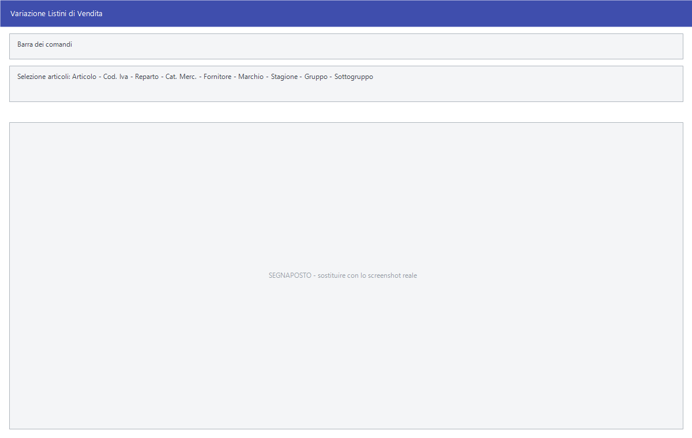

# Variazioni di massa dei listini

Tre elaborazioni che intervengono in un colpo solo su tutti gli articoli scelti:
**Varia Listini** ricalcola i prezzi, **Varia Sconti** riscrive i sette sconti,
**Varia Provvigioni** riscrive le provvigioni degli agenti.

!!! info "In sintesi"

    - **Percorso:**
        - Menu ▸ Archivi ▸ Listini Vendita ▸ Varia Listini
        - Menu ▸ Archivi ▸ Listini Vendita ▸ Varia Sconti
        - Menu ▸ Archivi ▸ Listini Vendita ▸ Varia Provvigioni
    - **Scorciatoia:** ++f2++ avvia l'elaborazione, ++esc++ esce
    - **Permessi richiesti:** nessun profilo predefinito; le singole voci di menu si abilitano per ogni utente da [Archivi ▸ Utenti](../anagrafiche/utenti.md)

---

## A cosa serve

Sono le maschere dei rincari e degli adeguamenti stagionali: *«alzo del 4% il
listino 1 di tutti gli articoli del fornitore X»*, *«porto lo sconto di prima
riga al 12% su tutta la categoria»*, *«riconosco il 3% di provvigione su tutto
il marchio Y»*.

Tutte e tre lavorano allo stesso modo: prima si scelgono gli articoli con un
riquadro di selezione identico, poi si dice cosa fare, poi si conferma. Il
lavoro è **immediato e senza ritorno**: non c'è un annullamento, e per
rimediare bisogna rilanciare l'elaborazione al contrario o ripristinare un
salvataggio.

## Prerequisiti

Prima di usare queste maschere occorre:

- avere gli [articoli](../anagrafiche/anagrafica-articoli.md) in archivio;
- sapere su quale listino intervenire — il codice si legge nella tabella dei
  listini (**Menu ▸ Archivi ▸ Listini Vendita ▸ Modifica**);
- **avere una copia di sicurezza recente degli archivi.**

## La maschera

Tutte e tre le finestre hanno la stessa struttura in tre fasce:

1. in alto il **riquadro di selezione degli articoli**, uguale nelle tre
   maschere;
2. sotto la riga con il **Listino** su cui intervenire;
3. in basso i valori da applicare, che cambiano da un'elaborazione all'altra, e
   i pulsanti **F2 - OK** ed **Esci**.

Il titolo della finestra dice sempre quale delle tre si sta usando:
*Variazione Listini di Vendita*, *Variazione Sconti* o *Variazione
Provvigioni*.

## Campi

### Il riquadro di selezione degli articoli (comune alle tre maschere)

| Campo | Obbl. | Descrizione | Valori ammessi |
|---|:---:|---|---|
| **Articolo** | | Codice dell'articolo e, di fianco, la descrizione. Servono a restringere a un articolo solo o a un gruppo di articoli. | codice, oppure `TUTTI` |
| **Cod. Iva** | | Limita l'elaborazione agli articoli con quell'[aliquota IVA](../contabilita/aliquote-iva.md). | codice, oppure vuoto per tutte |
| **Reparto** | | Limita agli articoli del [reparto](../magazzino/reparti.md). | codice, oppure vuoto per tutti |
| **Cat. Merc.** | | Limita agli articoli della [categoria merceologica](../magazzino/categorie-merceologiche.md). | codice, oppure vuoto per tutte |
| **Fornitore** | | Limita agli articoli il cui fornitore abituale è quello indicato. | codice, oppure vuoto per tutti |
| **Marchio** | | Limita agli articoli del [marchio](../magazzino/marchi.md). | codice, oppure vuoto per tutti |
| **Stagione** | | Limita agli articoli della [stagione](../magazzino/stagioni.md). | codice, oppure vuoto per tutte |
| **Gruppo** | | Limita agli articoli del gruppo indicato. | testo, oppure `TUTTI` |
| **Sottogruppo** | | Limita agli articoli del sottogruppo indicato. | testo, oppure `TUTTI` |

{: .campi }

Lasciando un campo vuoto — o con scritto `TUTTI` — quel criterio non filtra
nulla. **Se non si compila niente l'elaborazione tocca tutti gli articoli in
archivio.** Su ogni campo con codice il tasto ++f10++ (o ++space++, o il doppio
clic) apre l'elenco da cui scegliere.

### Varia Listini

| Campo | Obbl. | Descrizione | Valori ammessi |
|---|:---:|---|---|
| **Listino** | ● | Il listino da ricalcolare; a fianco compare il nome. | codice del listino |
| *(campo senza etichetta, accanto a Tipo)* | ● | Di quanto variare: la percentuale o l'importo, secondo quel che si sceglie in **Tipo**. | numero, anche negativo |
| **Tipo** | ● | Come va letto il valore scritto a fianco. | `PERCENTUALE`, `VALORE` |
| **Riferimento** | ● | Il prezzo di partenza su cui si applica la variazione. | vedi la tabella qui sotto |
| **Arrotondamento** | | A quante cifre arrotondare il prezzo che ne risulta. | `NESSUNO`, `MILLESIMI`, `CENTESIMI`, `DECIMI`, `EURO` |
| **Conferma Manuale** | | Se attivo, il programma si ferma su ogni articolo e mostra il nuovo prezzo prima di scriverlo. | attivo/non attivo |

{: .campi }

Il nuovo prezzo si calcola così:

- con **Tipo** `PERCENTUALE`: *prezzo di riferimento × (1 + variazione ÷ 100)*;
- con **Tipo** `VALORE`: *prezzo di riferimento + variazione*.

Per ridurre un prezzo si scrive la variazione con il segno meno.

Il **Riferimento** decide da quale prezzo si parte:

| Riferimento | Prezzo di partenza |
|---|---|
| `PREZZO ATTUALE` | Il prezzo che l'articolo ha oggi su quel listino. |
| `ULTIMO PREZZO D'ACQUISTO` | L'ultimo prezzo pagato al fornitore. |
| `PREZZO MEDIO D'ACQUISTO` | Il medio di carico dell'anno sul deposito attivo: valore della rimanenza iniziale più il caricato, diviso le quantità corrispondenti. |
| `1° LISTINO`, `2° LISTINO`, `3° LISTINO` | Il **prezzo netto** — cioè al netto degli sconti — di quel listino. |

L'**Arrotondamento** dice a quante cifre fermarsi: `NESSUNO` tiene quattro
decimali, `MILLESIMI` tre, `CENTESIMI` due, `DECIMI` uno, `EURO` nessuno.

Con **Conferma Manuale** attivo, per ogni articolo si apre la finestra
*Conferma Variazione Listini*, che mostra **Deposito**, **Codice**,
**Descrizione**, **Esistenza**, **Listino**, **Vecchio Prezzo**, **Nuovo
Prezzo** e **Ult. Prezzo di Acquisto**, con i pulsanti **F2 - Conferma**,
**F3 - Salta** ed **Esci**: si conferma articolo per articolo, si salta quello
che non si vuole toccare, o si interrompe tutto.

### Varia Sconti

| Campo | Obbl. | Descrizione | Valori ammessi |
|---|:---:|---|---|
| **Listino** | ● | Il listino su cui riscrivere gli sconti. | codice del listino |
| **1° Sconto** … **7° Sconto** | | I sette sconti in cascata, sotto il titolo **% S C O N T O**. | percentuali |

{: .campi }

### Varia Provvigioni

| Campo | Obbl. | Descrizione | Valori ammessi |
|---|:---:|---|---|
| **Listino** | ● | Il listino su cui riscrivere le provvigioni. | codice del listino |
| **Normale** | | Provvigione sulle vendite normali, sotto il titolo **% P R O V V I G I O N I   P E R   T I P O   V E N D I T A**. | percentuale |
| **Trasfert** | | Provvigione sulle vendite in trasfert. | percentuale |
| **C.S. Vendita** | | Provvigione sulle vendite in conto sconto. | percentuale |
| **C.S. Trasfert** | | Provvigione sulle vendite in conto sconto trasfert. | percentuale |

{: .campi }

!!! note "Un solo campo se non si distinguono i tipi di vendita"

    **Trasfert**, **C.S. Vendita** e **C.S. Trasfert** compaiono solo se nelle
    impostazioni del programma è attiva la gestione dei tipi di vendita.
    Altrimenti resta il solo campo **Normale**.

## Pulsanti e comandi

| Comando | Scorciatoia | Effetto |
|---|---|---|
| **F2 - OK** | ++f2++ | Chiede conferma e poi avvia l'elaborazione. |
| **Esci** | ++esc++ | Chiude senza fare nulla. |
| Elenco di scelta | ++f10++ o ++space++ | Sul campo con il codice, apre l'elenco da cui scegliere. |
| **Calcolatrice** | ++f12++ | Apre la calcolatrice. |
| **Consultazione** | ++f11++ | Apre la consultazione. |
| **Guida** | ++f1++ | Apre la guida in linea sulla pagina della maschera. |
| **Interrompi** | | Durante l'elaborazione, il pulsante della finestra di avanzamento ferma il lavoro. |

## Come si fa

### Aumentare del 5% un listino su una categoria

1. Apri **Menu ▸ Archivi ▸ Listini Vendita ▸ Varia Listini**.
2. Nel campo **Cat. Merc.** indica la categoria; lascia gli altri criteri
   liberi.
3. In **Listino** indica il listino da ritoccare.
4. Scrivi `5` nel campo della variazione e scegli **Tipo** `PERCENTUALE`.
5. In **Riferimento** scegli `PREZZO ATTUALE`.
6. In **Arrotondamento** scegli `CENTESIMI`.
7. Premi **F2 - OK** e rispondi **Sì** a *«Confermi la Variazione del
   Listino?»*.
8. La finestra *Variazione Archivi in Corso....* mostra l'avanzamento fino alla
   fine.

### Rifare un listino partendo dal costo

1. Apri **Varia Listini** e seleziona gli articoli.
2. In **Riferimento** scegli `ULTIMO PREZZO D'ACQUISTO`.
3. Indica la percentuale di ricarico in **Tipo** `PERCENTUALE`.
4. Attiva **Conferma Manuale** se vuoi vedere articolo per articolo cosa sta
   per succedere.
5. Premi **F2 - OK** e conferma.

### Azzerare gli sconti di un listino

1. Apri **Menu ▸ Archivi ▸ Listini Vendita ▸ Varia Sconti**.
2. Seleziona gli articoli e indica il **Listino**.
3. Lascia a zero tutti e sette gli sconti.
4. Premi **F2 - OK** e rispondi **Sì** a *«Confermi la Variazione degli
   Sconti ?»*.

## Controlli e messaggi

| Messaggio | Causa | Cosa fare |
|---|---|---|
| *(nessun messaggio, solo un segnale acustico e il cursore che torna sul campo)* | Manca il **Listino**, oppure in **Varia Listini** la variazione è a zero. | Compila il campo su cui si è posizionato il cursore. |
| *Confermi la Variazione del Listino?* | Richiesta di conferma di **Varia Listini**. | **Sì** avvia il ricalcolo su tutti gli articoli selezionati. |
| *Confermi la Variazione degli Sconti ?* | Richiesta di conferma di **Varia Sconti**. | **Sì** riscrive i sette sconti. |
| *Confermi la Variazione delle Provvigioni ?* | Richiesta di conferma di **Varia Provvigioni**. | **Sì** riscrive le provvigioni. |
| *%Provvig. per Vendite Normali Uguale a Zero* / *Confermi la Variazione delle Provvigioni ?* | In **Varia Provvigioni** il campo **Normale** è rimasto a zero. | Rispondi **Sì** solo se vuoi davvero azzerare la provvigione. |
| *%Provvig. per Vendite Trasfert Uguale a Zero* / *Confermi la Variazione delle Provvigioni ?* | Il campo **Trasfert** è rimasto a zero. | Come sopra. |
| *%Provvig. per Vendite Concessionario Uguale a Zero* / *Confermi la Variazione delle Provvigioni ?* | Il campo **C.S. Vendita** è rimasto a zero. | Come sopra. |
| *%Provvig. per Vendite Delivery Uguale a Zero* / *Confermi la Variazione delle Provvigioni ?* | Il campo **C.S. Trasfert** è rimasto a zero. | Come sopra. |

## Note

!!! warning "Attenzione"

    **Non si torna indietro.** Le tre elaborazioni scrivono direttamente sui
    listini e non esiste un annullamento. Prima di lanciarle su molti articoli,
    accertati che ci sia una copia di sicurezza recente e prova su una
    selezione stretta.

    **Un filtro vuoto vuol dire tutti.** Nessun campo di selezione è
    obbligatorio: lasciandoli tutti liberi l'elaborazione tocca l'intero
    archivio articoli.

    **Sconti e provvigioni si riscrivono, non si sommano.** **Varia Sconti**
    sostituisce tutti e sette gli sconti con quello che c'è scritto nei campi:
    i campi lasciati vuoti azzerano lo sconto corrispondente. Lo stesso vale per
    **Varia Provvigioni**.

    **Chi non ha ancora il listino resta fuori.** **Varia Sconti** e **Varia
    Provvigioni** intervengono solo sugli articoli che hanno già un prezzo su
    quel listino; gli altri vengono saltati senza avviso. **Varia Listini**
    invece crea la riga mancante.

<!-- DA VERIFICARE: con Riferimento "PREZZO MEDIO D'ACQUISTO", se il medio è calcolato solo sul deposito attivo o su tutti i depositi. -->

<!-- DA VERIFICARE: se il campo della variazione, in Varia Listini, accetta valori negativi come mi aspetto. -->

<!-- DA VERIFICARE: i nomi esatti con cui i tipi di vendita "C.S. Vendita" e "C.S. Trasfert" sono chiamati altrove nel programma: i messaggi di conferma li chiamano "Concessionario" e "Delivery". -->

<!-- DA VERIFICARE: quale impostazione del programma fa comparire i tipi di vendita oltre a "Normale", e come si chiama a video. -->

## Vedi anche

- [Gestione listini](gestione-listini.md)
- [Variazioni di listino programmate](variazione-listini.md)
- [Copia listini](copia-listini.md)
- [Anagrafica articoli](../anagrafiche/anagrafica-articoli.md)
