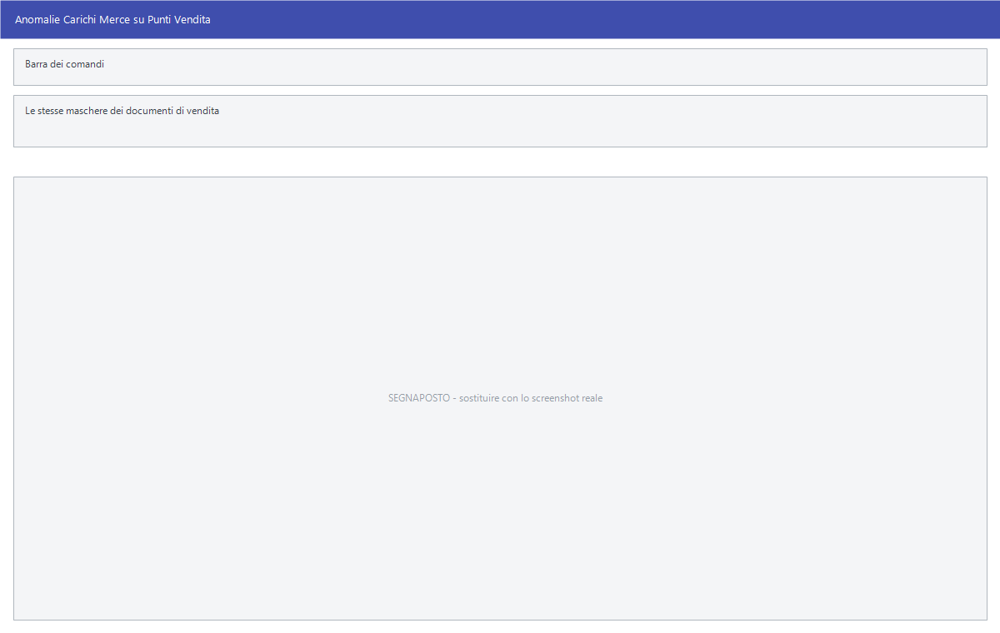

# Anomalie carichi e promozioni sellin

Due sottomenu che riguardano il rapporto con il fornitore: le **anomalie** che
si trovano sulla merce in arrivo ai punti vendita, e le **promozioni sellin**,
cioè le condizioni promozionali che il fornitore concede a chi compra.

!!! info "In sintesi"

    - **Percorso:**
        - Menu ▸ Magazzino ▸ Anomalie Carichi Merci ▸ Gestione *(oppure* Inserimento*,* Modifica*,* Riepilogo *o* Contabilizza*)*
        - Menu ▸ Magazzino ▸ Promozioni Sellin ▸ Inserimento *(oppure* Modifica*)*
    - **Scorciatoia:** ++f2++ salva o avvia, ++esc++ esce
    - **Permessi richiesti:** nessun profilo predefinito; le singole voci di menu si abilitano per ogni utente da [Archivi ▸ Utenti](../anagrafiche/utenti.md)

---

## A cosa serve

**Anomalie Carichi Merci** registra quello che non torna sulla merce arrivata a
un punto vendita: quantità mancanti, merce danneggiata, prezzi diversi da
quelli concordati. È un documento a tutti gli effetti, che si può riepilogare e
contabilizzare.

**Promozioni Sellin** sono le promozioni **in acquisto**: lo sconto o il
contributo che il fornitore riconosce su un periodo. Da non confondere con le
[promozioni](../vendite/promozioni.md) del menu Vendite, che sono i prezzi
promozionali **in vendita**.

## Prerequisiti

Prima di usare queste maschere occorre avere i
[fornitori](../anagrafiche/anagrafica-fornitori.md), gli
[articoli](../anagrafiche/anagrafica-articoli.md) e — per le anomalie — i
[carichi](carico-merci.md) su cui l'anomalia è stata riscontrata.

## La maschera

Le **Anomalie Carichi Merci** usano le stesse maschere dei documenti di
vendita: la [griglia di gestione](../vendite/gestione-documenti.md) con il
titolo *Anomalie Carichi Merce su Punti Vendita*, e la
[maschera del documento](../vendite/documento-di-vendita.md) per inserimento e
modifica. **Riepilogo** e **Contabilizza** sono quelli descritti in
[Riepiloghi](../vendite/riepiloghi-e-statistiche.md) e
[Contabilizzazione](../vendite/contabilizzazione-documenti.md).

Le **Promozioni Sellin** hanno una maschera propria.

<!-- DA VERIFICARE: la struttura della maschera delle promozioni sellin e i suoi campi. -->

## Campi

<!-- DA VERIFICARE: i campi delle promozioni sellin. -->

Per le anomalie valgono i campi del
[documento di vendita](../vendite/documento-di-vendita.md).

## Pulsanti e comandi

| Comando | Scorciatoia | Effetto |
|---|---|---|
| **F2 - Salva** | ++f2++ | Registra. |
| **F5 - Cerca** | ++f5++ | Apre l'elenco. |
| **F6 - Elimina** | ++f6++ | Cancella, previa conferma. |
| **Esci** | ++esc++ | Chiude senza salvare. |

<!-- DA VERIFICARE: i comandi effettivi della maschera delle promozioni sellin. -->

## Come si fa

### Registrare un'anomalia su un carico

1. Apri **Menu ▸ Magazzino ▸ Anomalie Carichi Merci ▸ Inserimento**.
2. Indica il fornitore e il carico a cui l'anomalia si riferisce.
3. Inserisci le righe con quello che non torna.
4. Salva, e usa **Riepilogo** per il quadro del periodo.

### Registrare una promozione concordata con il fornitore

1. Apri **Menu ▸ Magazzino ▸ Promozioni Sellin ▸ Inserimento**.
2. Indica fornitore, articoli e condizioni concordate.
3. Salva.

## Controlli e messaggi

<!-- DA VERIFICARE: i messaggi di queste maschere. -->

Non applicabile.

## Note

!!! note "Sellin e sell-out"

    Le **promozioni sellin** riguardano quello che si compra; le
    [promozioni](../vendite/promozioni.md) del menu Vendite quello che si
    vende. Il rapporto fra le due si misura con la **Stampa Percentuale
    Sell-Out**, vedi
    [Stampe dei movimenti di magazzino](stampe-movimenti-magazzino.md).

<!-- DA VERIFICARE: come l'anomalia si collega al carico su cui è stata riscontrata. -->

<!-- DA VERIFICARE: cosa produce la contabilizzazione di un'anomalia. -->

<!-- DA VERIFICARE: come le promozioni sellin entrano nel calcolo dei costi e dei margini. -->

## Vedi anche

- [Carico merci](carico-merci.md)
- [Promozioni](../vendite/promozioni.md)
- [Gestione documenti](../vendite/gestione-documenti.md)
