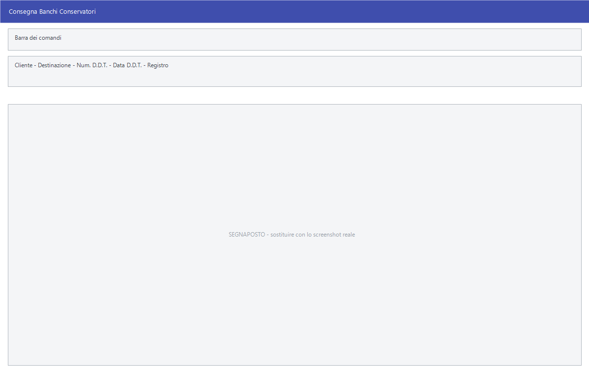

# Movimenti dei banchi conservatori

Le attrezzature registrate in
[Banchi conservatori](../anagrafiche/banchi-conservatori.md) si muovono: vanno
dal cliente, tornano, si rompono, si rottamano. Ogni movimento si registra qui,
e le cinque voci di consegna aprono **la stessa maschera** con un verso diverso.

!!! info "In sintesi"

    - **Percorso:** Menu ▸ Magazzino ▸ Banchi Conservatori ▸ Consegna in Comodato Gratuito *(oppure* Consegna in Conto Vendita*,* Consegna per Riparazione*,* Ritiro Comodato Gratuito / Riparazione*,* Rottamazione*,* Modifica Movimenti *o* Stampa Movimenti*)*
    - **Scorciatoia:** ++f2++ salva, ++esc++ esce
    - **Permessi richiesti:** nessun profilo predefinito; le singole voci di menu si abilitano per ogni utente da [Archivi ▸ Utenti](../anagrafiche/utenti.md)

---

## A cosa serve

| Voce di menu | Cosa registra |
|---|---|
| **Consegna in Comodato Gratuito** | L'attrezzatura va dal cliente, in comodato. |
| **Consegna in Conto Vendita** | Va dal cliente in conto vendita. |
| **Consegna per Riparazione** | Esce per essere riparata. |
| **Ritiro Comodato Gratuito / Riparazione** | Torna indietro. |
| **Rottamazione** | Esce definitivamente perché rottamata. |
| **Modifica Movimenti** | Corregge un movimento già registrato. |
| **Stampa Movimenti** | Stampa i movimenti di un periodo. |

## Prerequisiti

Prima di registrare un movimento occorre:

- avere l'attrezzatura registrata in
  [Banchi conservatori](../anagrafiche/banchi-conservatori.md);
- avere in archivio il [cliente](../anagrafiche/anagrafica-clienti.md) presso
  cui va.

## La maschera

Una finestra sola per tutte e cinque le consegne: chi riceve, con quale
documento, e a che titolo.

## Campi

| Campo | Obbl. | Descrizione | Valori ammessi |
|---|:---:|---|---|
| **Cliente** | ● | Il [cliente](../anagrafiche/anagrafica-clienti.md) presso cui l'attrezzatura va o da cui torna. | codice |
| **Destinazione** | | La destinazione merce del cliente. | codice |
| **Num. D.D.T.**, **Data. D.D.T.** | | Gli estremi del documento di trasporto che accompagna l'attrezzatura. | numero e data |
| **Registro** | | Il registro del documento. | voce dell'elenco |

## Pulsanti e comandi

| Comando | Scorciatoia | Effetto |
|---|---|---|
| **F2 - Salva** | ++f2++ | Registra il movimento e aggiorna lo stato dell'attrezzatura. |
| **Esci** | ++esc++ | Chiude senza salvare. |
| Elenco di scelta | ++f10++ o ++space++ | Sul campo con il codice, apre l'elenco da cui scegliere. |
| **Calcolatrice** | ++f12++ | Apre la calcolatrice. |

## Come si fa

### Consegnare un frigorifero a un cliente

1. Apri **Menu ▸ Magazzino ▸ Banchi Conservatori ▸ Consegna in Comodato
   Gratuito**.
2. Indica il **Cliente** e la **Destinazione**.
3. Compila gli estremi del **D.D.T.** con cui l'attrezzatura viaggia.
4. Premi **F2 - Salva**.

### Ritirare un'attrezzatura

1. Apri **Ritiro Comodato Gratuito / Riparazione**.
2. Indica il cliente da cui l'attrezzatura torna e il documento di rientro.
3. Salva, poi aggiorna lo **Stato** nella
  [scheda dell'attrezzatura](../anagrafiche/banchi-conservatori.md).

### Controllare cosa è in giro

Apri **Stampa Movimenti** e stampa il periodo: la stampa dice cosa è uscito e
cosa è tornato.

## Controlli e messaggi

| Messaggio | Causa | Cosa fare |
|---|---|---|
| *Non è stato selezionato nessun Banco !* | Si è confermato senza aver spuntato nessuna riga nell'elenco. | Spunta le attrezzature da muovere. |
| *Non possono essere mischiate operazioni di Ritiro da Comodati con Ritiro da Riparazioni!* | Fra le righe spuntate ce ne sono alcune in comodato e alcune in riparazione. | Fai due giri separati: prima le une, poi le altre. |
| *È stato generato il D.D.T. N. … Vuoi stampare il documento ?* | Il movimento ha prodotto un documento di trasporto. | **Sì** lo manda in stampa; **No** lo lascia in archivio, da ristampare quando serve. |
| *Vuoi stampare il contratto ?* — *Vuoi stampare i contratti ?* | Chiesto dopo una consegna. | **Sì** stampa il contratto di comodato di ogni attrezzatura consegnata. |

| Messaggio | Causa | Cosa fare |
|---|---|---|
| *(nessun messaggio, solo un segnale acustico)* | Manca un campo obbligatorio. | Compila il campo su cui si è posizionato il cursore. |

## Note

!!! note "Cinque voci, una maschera"

    Le cinque voci di consegna e ritiro aprono la stessa finestra: cambia il
    tipo di movimento registrato, non i campi da compilare. Il titolo della
    finestra e la voce da cui si è entrati sono l'unico modo per sapere cosa si
    sta registrando.

!!! info "L'attrezzatura non si digita: si spunta da un elenco"

    Non c'è un campo in cui scrivere la matricola. La finestra mostra
    l'**elenco delle attrezzature che possono fare quell'operazione**, e si
    spuntano le righe.

    Quali compaiano dipende dall'operazione:

    - alla **consegna**, quelle **libere**: senza cliente e non ancora
      consegnate;
    - al **ritiro**, quelle che risultano presso **il cliente e la
      destinazione** che hai indicato.

    È il motivo per cui il cliente si indica **prima**: senza, l'elenco del
    ritiro resta vuoto.

!!! info "La scheda dell'attrezzatura si aggiorna da sé"

    Non c'è niente da riportare a mano. Registrando il movimento il
    programma riscrive la scheda dell'attrezzatura:

    - alla **consegna** vi scrive il **cliente** e la **destinazione**, e
      porta lo **stato** a consegnato — o a *conto vendita*, *riparazione*,
      *rottamazione* secondo il tipo di movimento;
    - al **ritiro** azzera cliente e destinazione e riporta lo stato a
      disponibile.

    La scheda dell'attrezzatura resta quindi sempre la fotografia di dove
    si trova adesso; lo storico dei passaggi sta nei movimenti.

!!! info "Il documento di trasporto viene generato davvero"

    Dipende da come compili i due campi del documento:

    - **lasciandoli vuoti**, il programma **crea un DDT vero** — intestato
      al cliente e alla destinazione, con la causale di trasporto scelta,
      il porto **FRANCO**, data e ora del trasporto, e una riga per ogni
      attrezzatura, con il richiamo al DDT con cui era stata consegnata. Il
      numero viene assegnato sul registro indicato, e alla fine il
      programma chiede se stamparlo;
    - **compilandoli**, il programma si limita a **prendere nota** degli
      estremi di un documento fatto altrove, e non crea niente.

    Il DDT non viene creato nemmeno quando la selezione non è omogenea —
    per esempio ritirando insieme comodati e riparazioni.

## Vedi anche

- [Banchi conservatori e attrezzature in comodato](../anagrafiche/banchi-conservatori.md)
- [Anagrafica clienti](../anagrafiche/anagrafica-clienti.md)
