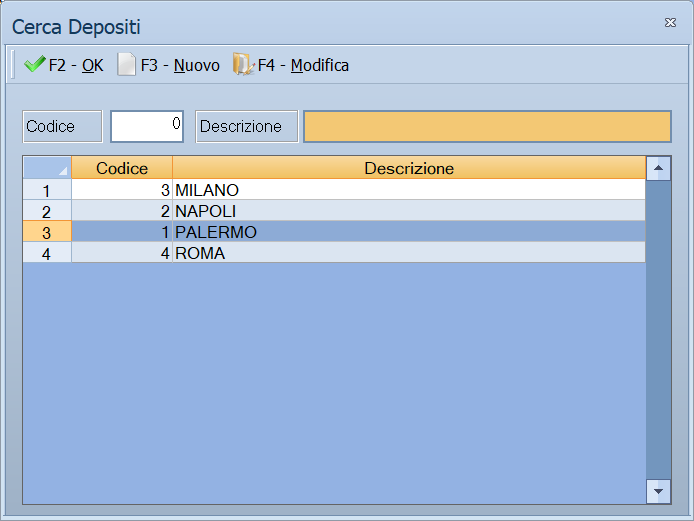

# Carico merci

La merce che arriva dal fornitore entra in magazzino da qui. Il carico porta
con sé gli estremi del documento del fornitore, i prezzi pagati e lo stato in
cui la merce è stata accettata.

!!! info "In sintesi"

    - **Percorso:** Menu ▸ Magazzino ▸ Nuovo Carico Merci *(oppure* Modifica Carico Merci*,* Modifica Carichi Fiscali*,* Controllo Merci in Entrata*,* Stampa Riepilogo Carichi*,* Generazione e Carico Buoni Regalo *o* Stampa Giornale Carichi Prodotti Fiscali*)*
    - **Scorciatoia:** ++f2++ salva, ++f5++ cerca
    - **Permessi richiesti:** nessun profilo predefinito; le singole voci di menu si abilitano per ogni utente da [Archivi ▸ Utenti](../anagrafiche/utenti.md)

---

## A cosa serve

Il carico è il gesto con cui la merce diventa esistenza: aggiorna le giacenze,
scrive l'ultimo prezzo di acquisto sull'articolo — quello che poi la
[gestione listini](../listini-vendita/gestione-listini.md) usa come termine di
paragone — e lascia traccia di cosa il fornitore ha consegnato.

| Voce di menu | A cosa serve |
|---|---|
| **Nuovo Carico Merci**, **Modifica Carico Merci** | Registrano e correggono il carico. |
| **Modifica Carichi Fiscali** | Corregge i carichi dei prodotti soggetti ad accisa. |
| **Controllo Merci in Entrata** | Verifica quello che è arrivato rispetto a quello che era stato ordinato. |
| **Stampa Riepilogo Carichi** | L'elenco dei carichi di un periodo. |
| **Generazione e Carico Buoni Regalo** | Genera i buoni regalo e li carica a magazzino. |
| **Stampa Giornale Carichi Prodotti Fiscali** | Il giornale dei carichi dei prodotti soggetti ad accisa. |

## Prerequisiti

Prima di usare questa maschera occorre:

- avere gli [articoli](../anagrafiche/anagrafica-articoli.md) e i
  [fornitori](../anagrafiche/anagrafica-fornitori.md) in archivio;
- avere i [depositi](depositi.md) e le
  [causali di magazzino](causali-magazzino.md) impostate;
- avere le [aliquote IVA](../contabilita/aliquote-iva.md).

## La maschera

In alto la testata — chi ha consegnato, con quali documenti, a quali condizioni
—, sotto le righe della merce.

## Campi

| Campo | Obbl. | Descrizione | Valori ammessi |
|---|:---:|---|---|
| **Numero** | | Numero del carico. Lo assegna il programma. | numero |
| **Data** | ● | Data del carico. | data |
| **Operatore** | | Chi ha registrato il carico. | codice |
| **Fornitore** | ● | Da chi arriva la merce. | codice |
| **Prima Nota. N.** | | Il riferimento alla registrazione contabile, quando c'è. | numero |
| **INS** | | Segnala che il carico è in inserimento. | — |
| **Fattura** | | Gli estremi della fattura del fornitore. | numero e data |
| **DDT / Bolla** | | Gli estremi del documento di trasporto. | numero e data |
| **Ordine** | | Il riferimento all'ordine a fornitore. | numero |
| **Sezione** | | La [sezione](../contabilita/sezioni.md) contabile. | codice |
| **% Sconto** | | Lo sconto generale sul carico. | percentuale |
| **% Spese** | | Le spese da ripartire sulla merce. | percentuale |
| **Stato** | | In che condizioni la merce è stata accettata. | `NORMALE`, `PREZZI DA CONTROLLARE`, `MERCE ACCETTATA CON RISERVA`, `PREZZI NON CONFORMI ALL' ORDINE` |

{: .campi }

## Pulsanti e comandi

| Comando | Scorciatoia | Effetto |
|---|---|---|
| **F2 - Salva** | ++f2++ | Registra il carico e aggiorna le esistenze. |
| **F3 - Prec.**, **F4 - Succ.** | ++f3++, ++f4++ | Passano al carico precedente o successivo. |
| **F5 - Cerca** | ++f5++ | Apre l'elenco dei carichi. |
| **F6 - Elimina** | ++f6++ | Cancella il carico, previa conferma. |
| **F7 - Stampa** | ++f7++ | Stampa il carico. |
| **Calcolatrice** | ++f12++ | Apre la calcolatrice. |
| **Consultazione** | ++f11++ | Apre la consultazione. |

## Come si fa

### Caricare una fornitura

1. Apri **Menu ▸ Magazzino ▸ Nuovo Carico Merci**.
2. Indica il **Fornitore** e gli estremi di **Fattura** e **DDT / Bolla**.
3. Se i prezzi non sono quelli concordati, metti **Stato** su `PREZZI NON
   CONFORMI ALL' ORDINE`: te lo ritroverai nel **Controllo Merci in Entrata**.
4. Inserisci le righe con articolo, quantità e prezzo pagato.
5. Premi **F2 - Salva**: le esistenze si aggiornano e l'ultimo prezzo di
   acquisto degli articoli viene riscritto.

### Rivedere i prezzi di vendita dopo il carico

Apri [Conferma Listini](../listini-vendita/controllo-listini.md), scegli
**Stato** `DA VERIFICARE` e **Tipo** `CARICHI`: escono gli articoli il cui
costo si è mosso, con il prezzo che servirebbe per tenere il margine.

### Controllare cosa è arrivato rispetto all'ordine

1. Apri **Menu ▸ Magazzino ▸ Controllo Merci in Entrata**.
2. Confronta quantità e prezzi con l'ordine.

## Controlli e messaggi

| Messaggio | Causa | Cosa fare |
|---|---|---|
| *Troppe aliquote IVA. Il Max Consentito è 7 !* | Il documento ha più di sette aliquote diverse. | Spezzare il carico in due documenti. |
| *Vuoi chiudere le partite aperte ?* | Chiesto al salvataggio quando restano partite aperte. | Rispondere **Sì** se il fornitore ha finito di consegnare. |
| *Vuoi applicare il costo degli imballaggi?* | Il fornitore ha imballaggi a costo. | **Sì** li somma al costo della merce. |
| *Stampante Etichette colli non impostata!* | Manca la stampante delle etichette. | Impostarla nelle [impostazioni della postazione](../utility/impostazioni-postazione.md). |
| *Vuoi Stampare solo la Rimanenza?* | Chiesto stampando. | Sceglie fra il documento intero e la sola rimanenza. |

!!! note "I messaggi sono tanti e quasi tutti domande"

    È la maschera più grande del programma e la maggior parte dei suoi avvisi
    sono richieste di conferma, non errori: la regola è che **rispondere Sì
    prosegue e rispondere No riporta al campo**. Quelli che bloccano davvero
    sono pochi, e sono in tabella.

| Messaggio | Causa | Cosa fare |
|---|---|---|
| *(nessun messaggio, solo un segnale acustico)* | Manca un campo obbligatorio. | Compila il campo su cui si è posizionato il cursore. |
| *Cancellazioni non abilitate per l' utente !* | L'utente ha il **Blocco Cancellazioni Dati**. | Serve un utente abilitato, o va tolto il blocco da [Archivi ▸ Utenti](../anagrafiche/utenti.md). |

## Note

!!! warning "Il carico riscrive l'ultimo prezzo di acquisto"

    Salvando il carico, l'ultimo prezzo di acquisto degli articoli caricati
    viene aggiornato. È il valore su cui poggiano margini, ricarichi e la
    [conferma dei listini](../listini-vendita/controllo-listini.md): un prezzo
    sbagliato sul carico si propaga.

!!! info "La % Spese va sul valore netto, riga per riga"

    Non è una ripartizione di un totale: è una **percentuale applicata al
    prezzo netto di ogni riga**, cioè al prezzo dopo lo sconto di testata e i
    sette sconti di riga. Il risultato finisce nella colonna **Spese** della
    riga, come importo unitario, e da lì entra nel costo.

    Quindi **non c'entrano né il peso né la quantità**: due righe di pari valore
    prendono la stessa quota di spese anche se una pesa il doppio.

    Cambiando lo **sconto di testata** le spese si ricalcolano da sole, perché
    cambia la base su cui la percentuale si applica.

!!! info "Lo Stato è una nota, non un comando"

    Lo **Stato** non cambia quello che il programma fa: non blocca il
    salvataggio, non altera i calcoli, non impedisce la contabilizzazione. È
    un'**etichetta per chi legge dopo**, e si ritrova nella colonna *Stato* del
    [Controllo Carichi](stampe-magazzino-fornitori.md).

    Le voci sono dodici: `NORMALE`, `PREZZI DA CONTROLLARE`, `MERCE ACCETTATA
    CON RISERVA`, `PREZZI NON CONFORMI ALL' ORDINE`, `PREZZI NON CONFORMI AI
    LISTINI`, `SCONTISTICA PATTUITA NON RISPETTATA`, `CONFEZIONI DANNEGGIATE`,
    `QUANTITA' NON CONFORMI ALL' ORDINE`, `PAGATO ALLA CONSEGNA`, `PARZIALMENTE
    PAGATO ALLA CONSEGNA`, `RESO RIPARAZIONE` e `SOSTITUZIONE`.

    Serve a segnalare al collega, o a sé stessi fra un mese, perché quel carico
    va guardato: il posto dove lo si rilegge è il Controllo Carichi, non questa
    maschera.

!!! tip "Prima Nota. N. è il collegamento, non una copia"

    Il campo tiene il **numero della registrazione** nata da questo carico:
    finché è vuoto il documento non è stato contabilizzato.

    Il carico e la registrazione restano **due cose distinte**: correggere il
    carico non corregge la prima nota, e viceversa. Se cambiano gli importi
    dopo la contabilizzazione, la registrazione va sistemata a parte.

!!! warning "Modifica Carichi Fiscali non c'è in tutte le installazioni"

    È una maschera **diversa** da questa e vive solo nella versione allestita
    per la gestione fiscale: dove quella versione non c'è, la voce di menu non
    fa niente.

    Dove c'è, **chiede una password prima di aprirsi**: è il segno di che cosa
    serve — intervenire sui movimenti già fiscalmente rilevanti, cosa che non si
    fa nel lavoro di tutti i giorni. Il carico merci normale resta questo.

## Vedi anche

- [Movimenti di magazzino](movimenti-magazzino.md)
- [Causali magazzino](causali-magazzino.md)
- [Conferma e confronto dei listini](../listini-vendita/controllo-listini.md)
- [Anagrafica fornitori](../anagrafiche/anagrafica-fornitori.md)
