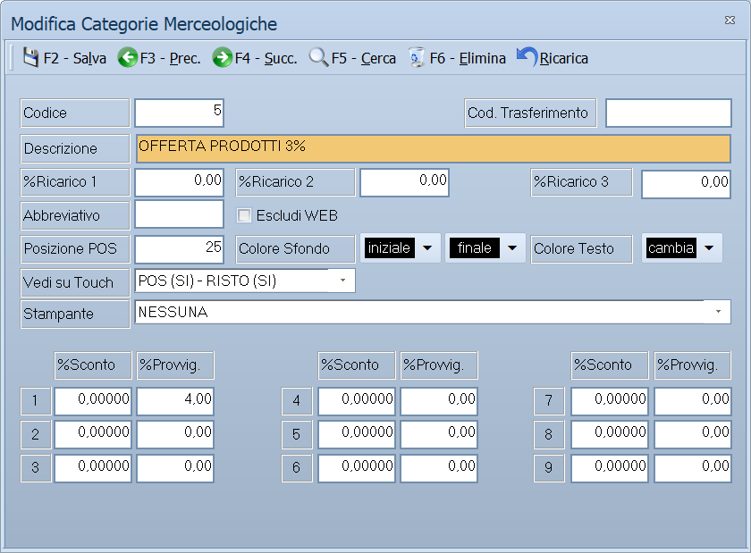

# Categorie merceologiche

Da questa maschera si definiscono le categorie merceologiche: la
classificazione principale degli articoli, quella da cui dipendono i ricarichi
proposti sui prezzi, gli sconti e le provvigioni per scaglione, e l'aspetto
della categoria sul touch della cassa.

!!! info "In sintesi"

    - **Percorso:** Menu ▸ Archivi ▸ Magazzino ▸ Categorie Merceologiche ▸ Inserimento *(oppure* Modifica*)*
    - **Scorciatoia:** nessuna; la maschera si apre dal menu
    - **Permessi richiesti:** nessun profilo predefinito; **Inserimento** e **Modifica** si abilitano separatamente per ogni utente da [Archivi ▸ Utenti](../anagrafiche/utenti.md)

---

## A cosa serve

La categoria merceologica è la classificazione che fa più lavoro di tutte:
l'anagrafica articoli la richiama nel campo **Cat. Merc.**, e le stampe di
magazzino e le statistiche si leggono per categoria.

Da qui dipende anche la **provvigione dell'agente**, quando l'agente è
impostato per prenderla dalla categoria: il riquadro degli scaglioni in basso
dice quanta provvigione spetta a fronte dello sconto concesso.

Le percentuali di **ricarico** e i due campi per la generazione dei codici
sono invece rimasti indietro: vedi le note in fondo.

Sulle installazioni con cassa touch, da qui dipendono anche il colore del tasto
e la stampante su cui la comanda viene inviata.

## Prerequisiti

*Nessuno.* È una delle prime tabelle da compilare, perché l'anagrafica articoli
la richiama.

## La maschera

È una maschera a finestra unica, senza schede, divisa in tre zone: in alto i
dati della categoria e i ricarichi, al centro le impostazioni per la vendita al
banco, in basso il riquadro degli sconti e delle provvigioni per scaglione.

## Campi

### Dati della categoria

| Campo | Obbl. | Descrizione | Valori ammessi |
|---|:---:|---|---|
| Codice | ● | Identificativo della categoria. In modifica non è modificabile. | Numero |
| Descrizione | ● | Nome della categoria, come compare in anagrafica articoli e nelle stampe. | Fino a 30 caratteri |
| Cod. Trasferimento | | Codice con cui la categoria viene riconosciuta nei trasferimenti verso altre sedi. | Testo |
| %Ricarico 1, %Ricarico 2, %Ricarico 3 | | Tre percentuali di ricarico. Il programma le registra ma **non le usa in nessun calcolo**. | Percentuali |
| Abbreviativo | | Sigla breve della categoria, per le stampe strette. | Testo breve |
| Escludi WEB | | La categoria non compare sul sito. | Casella |
| Articoli Monopolio | | Segnala che la categoria raccoglie articoli di monopolio. | Casella |
| Cod. Articolo | | Registrato e **non usato**: nessuna generazione di codice lo consulta. | Testo |
| Suffisso | | Registrato e **non usato**, come il precedente. | Testo |

### Vendita al banco

| Campo | Obbl. | Descrizione | Valori ammessi |
|---|:---:|---|---|
| Posizione POS | | Posizione del tasto della categoria sul touch della cassa. | Numero |
| Colore Sfondo, Colore Testo | | I colori del tasto. Si scelgono con i pulsanti **iniziale**, **finale** e **cambia**. | Colori |
| Vedi su Touch | | Dove la categoria deve comparire. | POS (SI) - RISTO (SI), POS (SI) - RISTO (NO), POS (NO) - RISTO (SI), POS (NO) - RISTO (NO) |
| Consumabili | | Segnala che la categoria raccoglie articoli di consumo. | Casella |
| Turno | | Turno di servizio a cui la categoria appartiene. | Numero |
| Stampante | | Dove inviare la comanda degli articoli della categoria. | NESSUNA, CASSA, CUCINA, BAR, PIZZERIA, PASTICCERIA, OPZIONALE - 1 … OPZIONALE - 5, TUTTE |

### Sconti e provvigioni

Il riquadro in basso contiene le coppie **%Sconto** e **%Provvig.**: sono
**scaglioni di sconto**, non scaglioni del cliente o dell'agente. Si leggono
così: *fino a questo sconto, questa provvigione*.

Contano solo per gli agenti impostati su **Calcolo Provvigione Da =
CATEG. MERCEOLOGICA**, e solo sulle righe senza sconto merce e senza sconto
a valore.

## Pulsanti e comandi

| Comando | Scorciatoia | Effetto |
|---|---|---|
| **F2 - Salva** | ++f2++ | Registra la categoria. In inserimento la maschera si svuota per la successiva. |
| **F3 - Prec.** | ++f3++ | Passa alla categoria precedente. |
| **F4 - Succ.** | ++f4++ | Passa alla categoria successiva. |
| **F5 - Cerca** | ++f5++ | Apre l'elenco delle categorie. |
| **F6 - Elimina** | ++f6++ | Cancella la categoria, previa conferma. |
| **Ricarica** | | Rilegge la categoria dall'archivio, abbandonando le modifiche non salvate. |
| **iniziale**, **finale**, **cambia** | | Scelgono i colori del tasto sul touch. |

Valgono inoltre:

| Comando | Scorciatoia | Effetto |
|---|---|---|
| Consultazione | ++f11++ | Apre la finestra **Consultazione**. |
| Calcolatrice | ++f12++ | Apre la calcolatrice. |
| Campo successivo | ++enter++ | Sposta il cursore sul campo seguente. |
| Chiusura | ++esc++ | Chiude la maschera. |

## Come si fa

### Creare una categoria

1. Apri **Menu ▸ Archivi ▸ Magazzino ▸ Categorie Merceologiche ▸
   Inserimento**.
2. Digita il **Codice** e la **Descrizione**: sono i due dati obbligatori.
3. Compila gli scaglioni di **%Sconto** e **%Provvig.** se gli agenti
   prendono la provvigione dalla categoria.
4. Se usi la cassa touch, imposta **Posizione POS**, i colori e la
   **Stampante**.
5. Premi **F2 - Salva**.

### Impostare sconti e provvigioni per scaglione

1. Carica la categoria.
2. Nel riquadro in basso compila le coppie **%Sconto** e **%Provvig.** degli
   scaglioni che usi, lasciando a zero gli altri.
3. Premi **F2 - Salva**.

### Assegnare la categoria a un articolo

1. Apri l'[anagrafica dell'articolo](../anagrafiche/anagrafica-articoli.md).
2. Nella scheda *Generale*, sul campo **Cat. Merc.**, premi ++f10++ e scegli la
   categoria.
3. Premi **F2 - Salva**.

## Controlli e messaggi

| Messaggio | Causa | Cosa fare |
|---|---|---|
| *(nessun messaggio, solo un segnale acustico)* | Manca il **Codice** o la **Descrizione**. | Guarda dove si è posizionato il cursore: è il campo da compilare. |
| *In archivio è già presente un record con lo stesso codice.* | Il codice digitato è già di un'altra categoria. | Cambia codice. |
| *Confermi la Cancellazione....* | Conferma richiesta da **F6 - Elimina**. | Rispondi **Sì** per eliminare la categoria. |
| *Non è possibile eliminare il record poiché utilizzato in alcuni record del database.* | La categoria è assegnata ad articoli, a contratti, a promozioni o a un calcolo scorte. | Non è eliminabile: prima cambia categoria agli articoli che la usano. |
| *Il record è stato modificato da un altro nodo della rete.* | Un altro utente ha salvato la stessa categoria mentre la modificavi. | Premi **Ricarica**, verifica cosa è cambiato e rifai le tue modifiche. |
| *Il record è stato cancellato da un altro nodo della rete.* | Un altro utente ha eliminato la categoria mentre la modificavi. | La maschera si chiude: non c'è più nulla da salvare. |

## Note

!!! info "Come si legge la scala sconto-provvigione"

    Emettendo un documento, il programma somma **tutti gli sconti della
    riga** — quello di testata e i sette di riga — e cerca nella scala il
    primo scaglione che non viene superato: la provvigione è quella.

    Con un esempio. Scaglioni `5 → 4%`, `10 → 3%`, `15 → 1%`:

    | Sconto applicato | Provvigione |
    |---:|---:|
    | nessuno | quella del **primo** scaglione |
    | 3% | 4% |
    | 10% | 3% |
    | 12% | 1% |
    | 20% | **zero** |

    Due cose da tenere a mente: senza sconto vale sempre la provvigione del
    primo scaglione, e **oltre l'ultimo scaglione la provvigione è zero**.
    Se non vuoi quel comportamento, l'ultimo scaglione va messo abbastanza
    alto da coprire lo sconto massimo che concedi.

!!! warning "Tre campi che non servono a niente"

    I tre **%Ricarico** e i due campi **Cod. Articolo** e **Suffisso**
    vengono registrati e riletti quando riapri la categoria, ma **nessuna
    parte del programma li consulta**: non propongono nessun prezzo di
    vendita e non generano nessun codice articolo.

    Compilarli non fa danno e non fa niente.

!!! warning "Attenzione"

    ++esc++ chiude la maschera senza chiedere conferma e senza salvare: le
    modifiche fatte dopo l'ultimo **F2 - Salva** vanno perse.

## Vedi anche

- [Anagrafica articoli](../anagrafiche/anagrafica-articoli.md)
- [Tabelle di classificazione](tabelle-di-classificazione.md)
