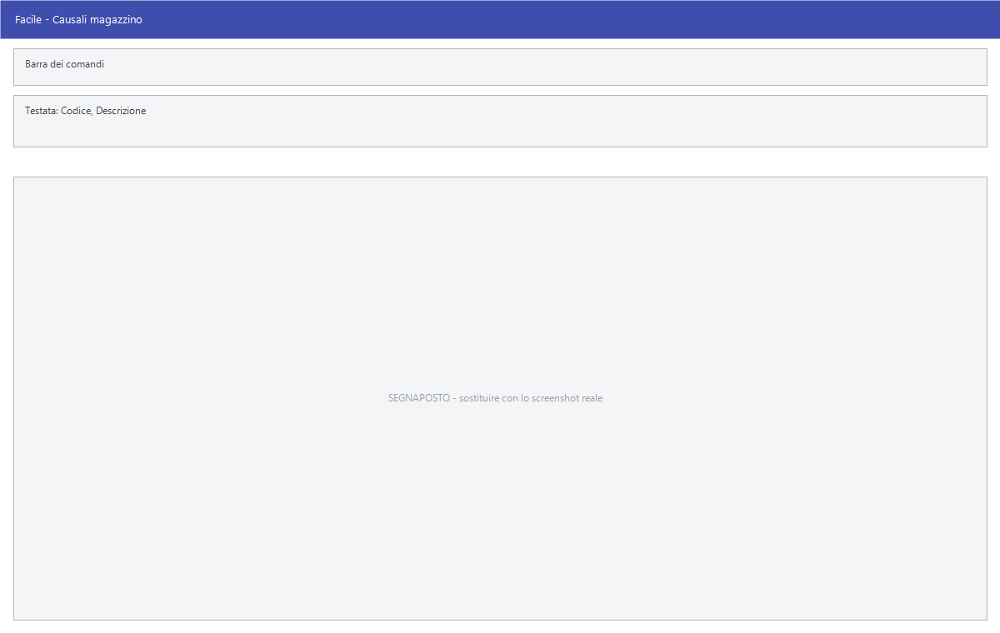

# Causali magazzino

Da questa maschera si definiscono le causali di magazzino: per ciascuna si
stabilisce se il movimento è un carico o uno scarico, se riguarda un cliente o
un fornitore e, contatore per contatore, se la quantità e il valore vanno
lasciati stare, sommati o sottratti.

!!! info "In sintesi"

    - **Percorso:** Menu ▸ Archivi ▸ Magazzino ▸ Causali Magazzino ▸ Inserimento *(oppure* Modifica*)*
    - **Scorciatoia:** nessuna; la maschera si apre dal menu
    - **Permessi richiesti:** nessun profilo predefinito; **Inserimento** e **Modifica** si abilitano separatamente per ogni utente da [Archivi ▸ Utenti](../anagrafiche/utenti.md)

---

## A cosa serve

La causale è la regola con cui un movimento di magazzino tocca i contatori
dell'articolo. Ogni carico, scarico, reso, trasferimento e rettifica ne
richiama una, e da lì il programma sa cosa aggiornare.

Esempio: la causale di una vendita al banco è di tipo *SCARICO*, in relazione
con il *CLIENTE*, e mette **--** sull'esistenza e su *Venduta* mette **+**: la
merce cala di magazzino e il venduto sale.

È una maschera che si compila una volta, all'avvio dell'installazione, e poi si
tocca di rado. Sbagliarla però si paga caro: i movimenti già registrati non si
correggono da soli.

## Prerequisiti

Prima di definire le causali occorre aver creato i **depositi**: ogni causale
ne indica uno, e il codice deve esistere.

## La maschera

È una maschera a finestra unica, senza schede. Dall'alto in basso:

- la **barra dei comandi**;
- l'**intestazione** con codice e descrizione della causale;
- il blocco delle **regole generali**: relazione, tipo di movimento, deposito,
  causale collegata e come trattare centro di costo, commessa, dettaglio e
  matricole;
- la griglia dei **contatori**, divisa in **Q U A N T I T A'** — due colonne —
  e **V A L O R E** — una colonna;
- in fondo, quattro caselle di opzione.

## Campi

### Intestazione e regole generali

| Campo | Obbl. | Descrizione | Valori ammessi |
|---|:---:|---|---|
| Codice | ● | Identificativo della causale. In inserimento il programma propone il primo codice libero. | Numero |
| Descrizione | ● | Denominazione della causale, come compare nella scelta dei movimenti e nelle stampe. | Testo |
| Relazione | | Con chi ha a che fare il movimento. Determina se il programma chiede un cliente, un fornitore o nessuno dei due. | CLIENTE, FORNITORE, NIENTE |
| Tipo Movimento | | Verso del movimento. | CARICO, SCARICO |
| Al Deposito | | Deposito su cui la causale agisce. Accanto compare la descrizione. Il codice deve esistere. | Codice dall'archivio depositi |
| Causale | | Causale collegata, usata come contropartita nei movimenti fra depositi. Lasciandola a zero non c'è contropartita. | Codice di un'altra causale di magazzino |
| Centro di Costo | | Se il centro di costo va chiesto sul movimento. | INVISIBILE, FACOLTATIVO, OBBLIGATORIO |
| Commessa | | Se la commessa va chiesta sul movimento. | INVISIBILE, FACOLTATIVO, OBBLIGATORIO |
| Dettaglio | | Se il dettaglio va chiesto sul movimento. | INVISIBILE, FACOLTATIVO, OBBLIGATORIO |
| Matricole | | Se il movimento gestisce le matricole. | NON GESTITE, FACOLTATIVE, OBBLIGATORIE |

{: .campi }

### Contatori

Ogni contatore ha tre valori possibili, sempre gli stessi:

| Valore | Significato |
|---|---|
| **=** | Il contatore non viene toccato. |
| **+** | La quantità o il valore del movimento vengono sommati. |
| **--** | La quantità o il valore del movimento vengono sottratti. |

I contatori sono questi:

| Gruppo | Contatori |
|---|---|
| **Q U A N T I T A'**, prima colonna | **Esistenza**, **Lavorazione**, **Cali e Scarti**, **Altri Car. Clienti**, **Altri Car. Fornitori**, **Altri Scar. Clienti**, **Altri Scar. Fornitori** |
| **Q U A N T I T A'**, seconda colonna | **Impegnata**, **Acquistata**, **Venduta**, **Resa da Clienti**, **Resa a Fornitori**, **Rimanenza Iniziale**, **Venduto Periodo** |
| **V A L O R E** | **Impegnato**, **Acquistato**, **Venduto**, **Reso da Clienti**, **Reso a Fornitori**, **Rimanenza Iniziale** |

### Opzioni

| Campo | Obbl. | Descrizione | Valori ammessi |
|---|:---:|---|---|
| Aggiorna Data Inventario | | Il movimento aggiorna la data d'inventario dell'articolo. | Casella |
| Movimentazione Interna | | Il movimento è un giro interno fra depositi, non un acquisto né una vendita. | Casella |
| Gestione Merce In Transito | | La merce movimentata resta in transito finché non arriva a destinazione. | Casella |
| Escludi da Statistiche WEB | | I movimenti con questa causale non entrano nelle statistiche del sito. | Casella |

{: .campi }

## Pulsanti e comandi

| Comando | Scorciatoia | Effetto |
|---|---|---|
| **F2 - Salva** | ++f2++ | Registra la causale. In inserimento la maschera si svuota per la successiva. |
| **F3 - Prec.** | ++f3++ | Passa alla causale precedente. |
| **F4 - Succ.** | ++f4++ | Passa alla causale successiva. |
| **F5 - Cerca** | ++f5++ | Apre l'elenco delle causali. |
| **F6 - Elimina** | ++f6++ | Cancella la causale, previa conferma. |
| **Ricarica** | | Rilegge la causale dall'archivio, abbandonando le modifiche non salvate. |

Valgono inoltre:

| Comando | Scorciatoia | Effetto |
|---|---|---|
| Guida | ++f1++ | Apre la pagina di guida dell'operazione in corso. |
| Elenco valori | ++f10++, ++space++ o doppio clic | Su **Al Deposito**, apre l'elenco dei depositi. |
| Consultazione | ++f11++ | Apre la finestra **Consultazione**. |
| Calcolatrice | ++f12++ | Apre la calcolatrice. |
| Campo successivo | ++enter++ o ++down++ | Sposta il cursore sul campo seguente. |
| Campo precedente | ++up++ | Sposta il cursore sul campo precedente. |
| Chiusura | ++esc++ | Chiude la maschera. |

## Come si fa

### Creare una causale di carico da fornitore

1. Apri **Menu ▸ Archivi ▸ Magazzino ▸ Causali Magazzino ▸ Inserimento**.
2. Lascia il **Codice** proposto e scrivi la **Descrizione**, per esempio
   *CARICO DA FORNITORE*.
3. Imposta **Relazione** = *FORNITORE* e **Tipo Movimento** = *CARICO*.
4. Indica **Al Deposito** con ++f10++.
5. Nella colonna delle quantità metti **+** su **Esistenza** e su
   **Acquistata**; nella colonna dei valori metti **+** su **Acquistato**.
6. Lascia **=** su tutto il resto.
7. Premi **F2 - Salva**.

### Creare una coppia di causali per il trasferimento fra depositi

1. Crea la causale di **scarico** dal deposito di partenza: **Tipo Movimento**
   = *SCARICO*, **Relazione** = *NIENTE*, **--** su **Esistenza**, e spunta
   **Movimentazione Interna**.
2. Salvala e prendi nota del suo codice.
3. Crea la causale di **carico** sul deposito di arrivo, con **+** su
   **Esistenza** e la stessa spunta.
4. Nel campo **Causale** di ciascuna delle due indica il codice dell'altra:
   è così che il programma sa qual è la contropartita.
5. Premi **F2 - Salva**.

### Chiedere la commessa su una causale

1. Carica la causale.
2. Porta **Commessa** su *FACOLTATIVO*, oppure su *OBBLIGATORIO* se il
   movimento non deve poter essere registrato senza.
3. Premi **F2 - Salva**.

## Controlli e messaggi

| Messaggio | Causa | Cosa fare |
|---|---|---|
| *(nessun messaggio, solo un segnale acustico)* | Manca il **Codice** o la **Descrizione**. | Guarda dove si è posizionato il cursore: è il campo da compilare. |
| *Il codice del Deposito non è valido o disponibile.* | Il codice digitato in **Al Deposito** non esiste. | Premi ++f10++ sul campo e scegli dall'elenco. |
| *Il codice della Causale di Magazzino richiesto non è valido o disponibile.* | La causale indicata nel campo **Causale** non esiste. | Correggila, oppure lascia il campo a zero. |
| *In archivio è già presente un record con lo stesso codice.* | Il codice digitato è già di un'altra causale. | Cambia codice. |
| *Confermi la Cancellazione....* | Conferma richiesta da **F6 - Elimina**. | Rispondi **Sì** per eliminare la causale. |
| *Non è possibile eliminare il record pochè utilizzato in alcuni record del database.* | La causale è usata in movimenti, documenti, scontrini, o è indicata in un cliente o in un'altra causale. | Non è eliminabile: lasciala in archivio. |
| *Il record è stato modificato da un altro nodo della rete.* | Un altro utente ha salvato la stessa causale mentre la modificavi. | Premi **Ricarica**, verifica cosa è cambiato e rifai le tue modifiche. |
| *Il record è stato cancellato da un altro nodo della rete.* | Un altro utente ha eliminato la causale mentre la modificavi. | La maschera si chiude: non c'è più nulla da salvare. |

## Note

!!! warning "Attenzione"

    Modificare i contatori di una causale **non ricalcola i movimenti già
    registrati**: la nuova regola vale solo da lì in avanti. Se una causale è
    stata usata con impostazioni sbagliate, le esistenze vanno ripristinate a
    parte.

    Il programma non impedisce combinazioni prive di senso — per esempio una
    causale di *CARICO* che sottrae dall'esistenza. Rileggi le tre colonne
    prima di salvare.

    ++esc++ chiude la maschera senza chiedere conferma e senza salvare: le
    modifiche fatte dopo l'ultimo **F2 - Salva** vanno perse.

<!-- DA VERIFICARE: il rapporto fra il campo Causale (contropartita) e la casella Movimentazione Interna. Vanno impostati sempre insieme, o esistono casi in cui si usa l'uno senza l'altra? -->

<!-- DA VERIFICARE: la differenza operativa fra i contatori Venduta e Venduto Periodo, e a quale periodo si riferisce il secondo. -->

<!-- DA VERIFICARE: conviene pubblicare l'elenco delle causali standard fornite con l'installazione, come riferimento? -->

## Vedi anche

- [Anagrafica articoli](../anagrafiche/anagrafica-articoli.md)
