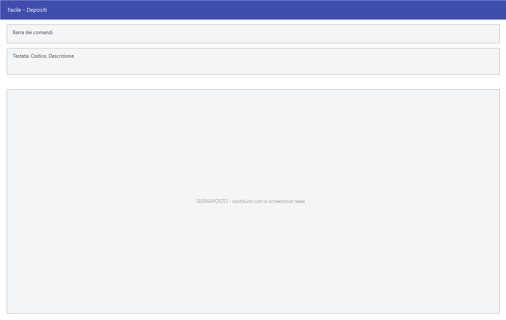

# Depositi

Da questa maschera si definiscono i depositi: i magazzini fisici o logici su
cui l'azienda tiene la merce. Ogni movimento, ogni giacenza e ogni riga di
documento appartiene a un deposito.

!!! info "In sintesi"

    **Percorso:** Menu ▸ Archivi ▸ Magazzino ▸ Depositi ▸ Inserimento *(oppure* Modifica*)*
    **Scorciatoia:** nessuna; la maschera si apre dal menu
    **Permessi richiesti:** nessun profilo predefinito; **Inserimento** e **Modifica** si abilitano separatamente per ogni utente da [Archivi ▸ Utenti](../anagrafiche/utenti.md)

---

## A cosa serve

Il deposito è il contenitore delle giacenze. L'anagrafica articoli mostra
esistenza, disponibilità e progressivi **di un deposito alla volta**, le
causali di magazzino ne indicano uno, e i trasferimenti fra magazzini sono
movimenti da un deposito a un altro.

Anche chi ha un magazzino solo ne ha bisogno: Facile lavora sempre su un
deposito, e almeno uno deve esistere perché l'utente possa aprire gli articoli.

Esempio: un'azienda con negozio e magazzino centrale crea due depositi e
spunta **Escludi da Inventario** su quello che non viene contato.

## Prerequisiti

*Nessuno.* Il deposito è una delle prime tabelle da compilare: gli articoli, le
causali di magazzino e i documenti lo richiamano.

## La maschera

È una maschera a finestra unica, senza schede: in alto la **barra dei
comandi**, sotto i campi su quattro righe e, in fondo, le caselle che
stabiliscono dove il deposito deve comparire e dove no.

## Campi

| Campo | Obbl. | Descrizione | Valori ammessi |
|---|:---:|---|---|
| Codice | ● | Identificativo del deposito. In inserimento il programma propone il primo codice libero. | Da 1 a 255 |
| Descrizione | ● | Denominazione del deposito, come compare nell'anagrafica articoli e nelle stampe. | Fino a 30 caratteri |
| Telefono 1 | | Recapito del deposito. | Fino a 14 cifre |
| Telefono 2 | | Secondo recapito. Nella versione Killin accetta anche lettere e segni di punteggiatura, non solo cifre. | Fino a 14 cifre |
| Registro Doc. | | Registro su cui numerare i documenti emessi da questo deposito. Lasciandolo vuoto vale il registro generale. | (vuoto) o un registro definito in azienda |
| Fornitore | | Fornitore associato al deposito, per i magazzini in conto deposito. | Codice dall'archivio fornitori |
| Cod. Destinazione | | Destinazione di consegna associata al deposito. | Numero della destinazione |
| Escludi Visibilità Web | | Il deposito non compare sul sito. Su un deposito nuovo è già spuntata. | Casella |
| Escludi Interrogazione da Web | | Le giacenze del deposito non sono interrogabili dal sito. | Casella |
| Escludi da Esportazione P.V. | | Il deposito resta fuori dall'esportazione verso i punti vendita. | Casella |
| Escludi da Inventario | | Il deposito non entra nelle stampe e nelle rilevazioni d'inventario. | Casella |
| Escludi da Magazzino | | Il deposito non entra nelle stampe di magazzino. | Casella |
| Cod. P.Vendita | | **Solo Megastore.** Codice con cui il punto vendita è identificato negli scambi con la centrale. | Fino a 7 caratteri |
| Importa solo Articoli SMA | | **Solo Megastore.** L'importazione carica sul deposito i soli articoli previsti dalla centrale. Nella versione Killin la stessa casella si chiama **Non Esportare Sconto Clienti**. | Casella |

{: .campi }

!!! note "Nota"

    Su un deposito appena creato **Escludi Visibilità Web** è già spuntata: se
    il deposito deve comparire sul sito, va tolta a mano.

## Pulsanti e comandi

| Comando | Scorciatoia | Effetto |
|---|---|---|
| **F2 - Salva** | ++f2++ | Registra il deposito. In inserimento la maschera si svuota per il successivo. |
| **F3 - Prec.** | ++f3++ | Passa al deposito precedente. |
| **F4 - Succ.** | ++f4++ | Passa al deposito successivo. |
| **F5 - Cerca** | ++f5++ | Apre la finestra **Cerca Depositi**, che elenca codice e descrizione. |
| **F6 - Elimina** | ++f6++ | Cancella il deposito, previa conferma. |
| **Ricarica** | | Rilegge il deposito dall'archivio, abbandonando le modifiche non salvate. |

Valgono inoltre:

| Comando | Scorciatoia | Effetto |
|---|---|---|
| Guida | ++f1++ | Apre la pagina di guida dell'operazione in corso. |
| Consultazione | ++f11++ | Apre la finestra **Consultazione**. |
| Calcolatrice | ++f12++ | Apre la calcolatrice. |
| Campo successivo | ++enter++ | Sposta il cursore sul campo seguente. |
| Chiusura | ++esc++ | Chiude la maschera. |

## Come si fa

### Creare un nuovo deposito

1. Apri **Menu ▸ Archivi ▸ Magazzino ▸ Depositi ▸ Inserimento**.
2. Lascia il **Codice** proposto, oppure digitane uno diverso, fino a 255.
3. Scrivi la **Descrizione**: è l'unico altro dato che il programma pretende.
4. Se il deposito numera i documenti su un registro suo, scegli il
   **Registro Doc.**
5. Decidi le esclusioni con le caselle in fondo: togli **Escludi Visibilità
   Web** se il deposito deve comparire sul sito.
6. Premi **F2 - Salva**. La maschera si svuota per il deposito successivo.

### Escludere un deposito dall'inventario

1. Carica il deposito.
2. Spunta **Escludi da Inventario**.
3. Premi **F2 - Salva**. Le giacenze restano, ma il deposito non compare più
   nelle rilevazioni.

### Ritrovare un deposito

1. Premi **F5 - Cerca**.
2. Nella finestra **Cerca Depositi** scorri l'elenco, che mostra codice e
   descrizione, oppure digita il codice o la descrizione da cercare.
3. Scegli la riga e conferma.

## Controlli e messaggi

| Messaggio | Causa | Cosa fare |
|---|---|---|
| *(nessun messaggio, solo un segnale acustico)* | Manca il **Codice** o la **Descrizione**. | Guarda dove si è posizionato il cursore: è il campo da compilare. |
| *In archivio è già presente un record con lo stesso codice.* | Il codice digitato è già di un altro deposito. | Cambia codice. |
| *Confermi la Cancellazione....* | Conferma richiesta da **F6 - Elimina**. | Rispondi **Sì** per eliminare il deposito. |
| *Non è possibile eliminare il record pochè utilizzato in alcuni record del database.* | Il deposito compare in movimenti, righe di documento, causali di magazzino, contratti o promozioni. | Non è eliminabile: lascialo in archivio. |
| *Il record è stato modificato da un altro nodo della rete.* | Un altro utente ha salvato lo stesso deposito mentre lo modificavi. | Premi **Ricarica**, verifica cosa è cambiato e rifai le tue modifiche. |
| *Il record è stato cancellato da un altro nodo della rete.* | Un altro utente ha eliminato il deposito mentre lo modificavi. | La maschera si chiude: non c'è più nulla da salvare. |

## Note

!!! warning "Attenzione"

    Il **Codice** non è modificabile dopo il salvataggio: per cambiarlo occorre
    creare un nuovo deposito e spostarci la merce.

    Eliminare un deposito è possibile solo finché non lo ha toccato nessun
    movimento. Un deposito che non serve più si lascia in archivio, spuntando
    le esclusioni che lo tolgono da inventario, magazzino e web.

    ++esc++ chiude la maschera senza chiedere conferma e senza salvare: le
    modifiche fatte dopo l'ultimo **F2 - Salva** vanno perse.

<!-- DA VERIFICARE: i campi Fornitore e Cod. Destinazione. Si scrivono a mano, senza elenco da cui scegliere: in quale scenario operativo si compilano (conto deposito? magazzini di terzi?). -->

<!-- DA VERIFICARE: la differenza pratica fra Escludi Visibilità Web e Escludi Interrogazione da Web. -->

## Vedi anche

- [Causali magazzino](causali-magazzino.md)
- [Anagrafica articoli](../anagrafiche/anagrafica-articoli.md)
