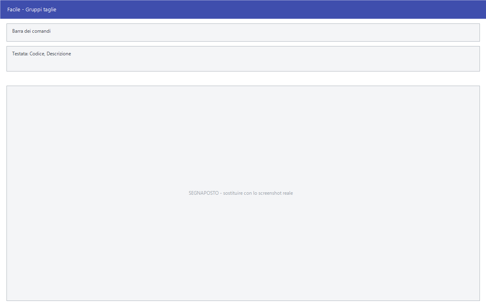

# Gruppi taglie

Da questa maschera si definiscono i gruppi di taglie: gli insiemi di misure con
cui si articola un modello. Ogni gruppo contiene fino a cinquanta taglie.

!!! info "In sintesi"

    - **Percorso:** Menu ▸ Archivi ▸ Magazzino ▸ Gruppi Taglie ▸ Inserimento *(oppure* Modifica*)*
    - **Scorciatoia:** nessuna; la maschera si apre dal menu
    - **Permessi richiesti:** nessun profilo predefinito; **Inserimento** e **Modifica** si abilitano separatamente per ogni utente da [Archivi ▸ Utenti](../anagrafiche/utenti.md)

---

## A cosa serve

Nel commercio di abbigliamento e calzature lo stesso articolo esiste in più
taglie, e la giacenza va tenuta taglia per taglia. Il gruppo taglie è l'elenco
delle misure che quell'articolo può avere.

Esempio: un gruppo *SCARPE UOMO* con le taglie da 39 a 46, e un gruppo
*MAGLIERIA* con S, M, L, XL. In anagrafica articoli si assegna il gruppo giusto
e da lì il magazzino tiene una giacenza per ciascuna taglia.

!!! note "Nota"

    Nella versione Taglie e Colori il gruppo taglie si assegna dal campo della
    scheda *Generale* dell'articolo che in quella versione si chiama
    **Gru. Taglie**.

## Prerequisiti

*Nessuno.*

## La maschera

È una maschera a finestra unica, senza schede: in alto la **barra dei
comandi**, poi codice e descrizione del gruppo, e sotto una griglia di
cinquanta righe numerate da **01** a **50**, disposte su cinque colonne da
dieci. Ogni riga ha tre caselle.

## Campi

| Campo | Obbl. | Descrizione | Valori ammessi |
|---|:---:|---|---|
| Codice | ● | Identificativo del gruppo. In modifica non è modificabile. | Numero |
| Descrizione | ● | Nome del gruppo, come compare in anagrafica articoli. | Fino a 30 caratteri |
| Mis. | | La taglia come si scrive: *39*, *M*, *XL*. È quella che compare sui documenti e sulle etichette. | Testo breve |
| Rifer. | | Riferimento interno della taglia, per allinearla a una codifica propria o del fornitore. | Testo breve |
| Web | | La taglia come deve comparire sul sito. | Testo breve |

{: .campi }

Si compilano solo le righe che servono: un gruppo di otto taglie occupa le
prime otto righe e lascia vuote le altre quarantadue.

## Pulsanti e comandi

| Comando | Scorciatoia | Effetto |
|---|---|---|
| **F2 - Salva** | ++f2++ | Registra il gruppo con tutte le sue taglie. |
| **F3 - Prec.** | ++f3++ | Passa al gruppo precedente. |
| **F4 - Succ.** | ++f4++ | Passa al gruppo successivo. |
| **F5 - Cerca** | ++f5++ | Apre l'elenco dei gruppi taglie. |
| **F6 - Elimina** | ++f6++ | Cancella il gruppo, previa conferma. |
| **Ricarica** | | Rilegge il gruppo dall'archivio, abbandonando le modifiche non salvate. |

Valgono inoltre:

| Comando | Scorciatoia | Effetto |
|---|---|---|
| Consultazione | ++f11++ | Apre la finestra **Consultazione**. |
| Calcolatrice | ++f12++ | Apre la calcolatrice. |
| Campo successivo | ++enter++ | Sposta il cursore sulla casella seguente. |
| Chiusura | ++esc++ | Chiude la maschera. |

## Come si fa

### Creare un gruppo di taglie

1. Apri **Menu ▸ Archivi ▸ Magazzino ▸ Gruppi Taglie ▸ Inserimento**.
2. Digita il **Codice** e la **Descrizione** del gruppo.
3. Nella prima riga scrivi la prima taglia in **Mis.**, e prosegui riga per
   riga nell'ordine in cui vuoi vederle.
4. Compila **Web** se le taglie devono comparire sul sito con una scrittura
   diversa.
5. Premi **F2 - Salva**.

### Assegnare il gruppo a un articolo

1. Apri l'[anagrafica dell'articolo](../anagrafiche/anagrafica-articoli.md).
2. Nella scheda *Generale* indica il gruppo taglie.
3. Premi **F2 - Salva**. Da quel momento la giacenza dell'articolo si tiene
   taglia per taglia.

## Controlli e messaggi

| Messaggio | Causa | Cosa fare |
|---|---|---|
| *(nessun messaggio, solo un segnale acustico)* | Manca il **Codice** o la **Descrizione**. | Guarda dove si è posizionato il cursore: è il campo da compilare. |
| *In archivio è già presente un record con lo stesso codice.* | Il codice digitato è già di un altro gruppo. | Cambia codice. |
| *Confermi la Cancellazione....* | Conferma richiesta da **F6 - Elimina**. | Rispondi **Sì** per eliminare il gruppo. |
| *Non è possibile eliminare il record pochè utilizzato in alcuni record del database.* | Il gruppo è assegnato a degli articoli o ha delle giacenze per taglia. | Non è eliminabile: lascialo in archivio. |
| *Il record è stato modificato da un altro nodo della rete.* | Un altro utente ha salvato lo stesso gruppo mentre lo modificavi. | Premi **Ricarica**, verifica cosa è cambiato e rifai le tue modifiche. |
| *Il record è stato cancellato da un altro nodo della rete.* | Un altro utente ha eliminato il gruppo mentre lo modificavi. | La maschera si chiude: non c'è più nulla da salvare. |

## Note

!!! warning "Attenzione"

    **L'ordine delle righe conta**: la giacenza di ogni taglia è legata alla
    posizione nella griglia, non a quello che c'è scritto. Cambiare una taglia
    su un gruppo già in uso sposta la giacenza da una misura all'altra.
    Su un gruppo già usato si aggiungono taglie in fondo; non si riordinano
    quelle esistenti.

    ++esc++ chiude la maschera senza chiedere conferma e senza salvare: le
    modifiche fatte dopo l'ultimo **F2 - Salva** vanno perse.

<!-- DA VERIFICARE: l'avvertenza sull'ordine delle righe è dedotta da come le giacenze per taglia sono organizzate. Va confermata con una prova prima di pubblicarla. -->

<!-- DA VERIFICARE: il campo Rifer. a che cosa serve nell'uso quotidiano — è il codice taglia del fornitore, o un riferimento interno? -->

## Vedi anche

- [Anagrafica articoli](../anagrafiche/anagrafica-articoli.md)
- [Tabelle di classificazione](tabelle-di-classificazione.md)
