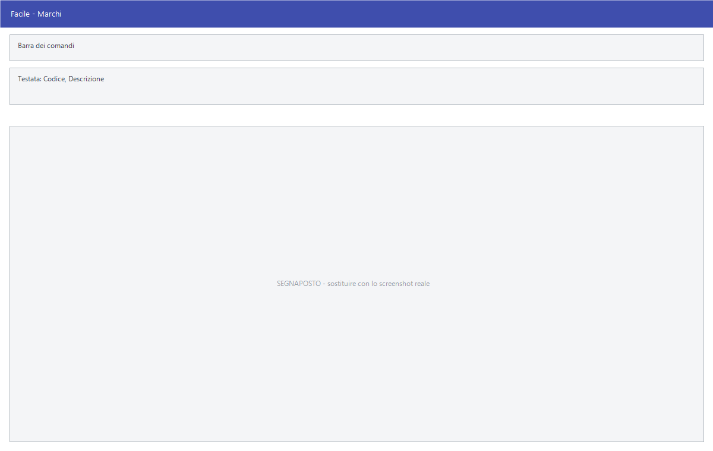

# Marchi

Da questa maschera si definiscono i marchi: le marche degli articoli trattati.

!!! info "In sintesi"

    **Percorso:** Menu ▸ Archivi ▸ Magazzino ▸ Marchi ▸ Inserimento *(oppure* Modifica*)*
    **Scorciatoia:** nessuna; la maschera si apre dal menu
    **Permessi richiesti:** nessun profilo predefinito; **Inserimento** e **Modifica** si abilitano separatamente per ogni utente da [Archivi ▸ Utenti](../anagrafiche/utenti.md)

---

## A cosa serve

Il marchio è la classificazione per marca: l'anagrafica articoli lo richiama
nel campo **Marchio**, e le statistiche di vendita si possono leggere per
marchio, per capire quali marche girano e quali no.

Chi vende on line lo usa anche per decidere se le giacenze degli articoli di
una marca debbano essere esposte sul sito.

## Prerequisiti

*Nessuno.*

## La maschera

È una maschera a finestra unica, senza schede: la **barra dei comandi** e tre
campi.

## Campi

| Campo | Obbl. | Descrizione | Valori ammessi |
|---|:---:|---|---|
| Codice | ● | Identificativo del marchio. In modifica non è modificabile. | Numero |
| Descrizione | ● | Nome del marchio, come compare in anagrafica articoli e nelle stampe. | Fino a 30 caratteri |
| Stock Ecommerce | | Se le giacenze degli articoli di questo marchio vanno esposte sul sito. | Da elenco a due valori |

{: .campi }

## Pulsanti e comandi

| Comando | Scorciatoia | Effetto |
|---|---|---|
| **F2 - Salva** | ++f2++ | Registra il marchio. In inserimento la maschera si svuota per il successivo. |
| **F3 - Prec.** | ++f3++ | Passa al marchio precedente. |
| **F4 - Succ.** | ++f4++ | Passa al marchio successivo. |
| **F5 - Cerca** | ++f5++ | Apre l'elenco dei marchi. |
| **F6 - Elimina** | ++f6++ | Cancella il marchio, previa conferma. |
| **Ricarica** | | Rilegge il marchio dall'archivio, abbandonando le modifiche non salvate. |

Valgono inoltre:

| Comando | Scorciatoia | Effetto |
|---|---|---|
| Consultazione | ++f11++ | Apre la finestra **Consultazione**. |
| Calcolatrice | ++f12++ | Apre la calcolatrice. |
| Campo successivo | ++enter++ | Sposta il cursore sul campo seguente. |
| Chiusura | ++esc++ | Chiude la maschera. |

## Come si fa

### Creare un marchio

1. Apri **Menu ▸ Archivi ▸ Magazzino ▸ Marchi ▸ Inserimento**.
2. Digita il **Codice** e la **Descrizione**.
3. Se vendi on line, imposta **Stock Ecommerce**.
4. Premi **F2 - Salva**.

### Assegnare il marchio a un articolo

1. Apri l'[anagrafica dell'articolo](../anagrafiche/anagrafica-articoli.md).
2. Nella scheda *Generale*, sul campo **Marchio**, premi ++f10++ e scegli il
   marchio.
3. Premi **F2 - Salva**.

## Controlli e messaggi

| Messaggio | Causa | Cosa fare |
|---|---|---|
| *(nessun messaggio, solo un segnale acustico)* | Manca il **Codice** o la **Descrizione**. | Guarda dove si è posizionato il cursore: è il campo da compilare. |
| *In archivio è già presente un record con lo stesso codice.* | Il codice digitato è già di un altro marchio. | Cambia codice. |
| *Confermi la Cancellazione....* | Conferma richiesta da **F6 - Elimina**. | Rispondi **Sì** per eliminare il marchio. |
| *Non è possibile eliminare il record pochè utilizzato in alcuni record del database.* | Il marchio è assegnato a degli articoli, a contratti, a promozioni o a un calcolo scorte. | Non è eliminabile: prima cambia marchio agli articoli che lo usano. |
| *Il record è stato modificato da un altro nodo della rete.* | Un altro utente ha salvato lo stesso marchio mentre lo modificavi. | Premi **Ricarica**, verifica cosa è cambiato e rifai le tue modifiche. |
| *Il record è stato cancellato da un altro nodo della rete.* | Un altro utente ha eliminato il marchio mentre lo modificavi. | La maschera si chiude: non c'è più nulla da salvare. |

## Note

!!! warning "Attenzione"

    ++esc++ chiude la maschera senza chiedere conferma e senza salvare: le
    modifiche fatte dopo l'ultimo **F2 - Salva** vanno perse.

<!-- DA VERIFICARE: le due voci dell'elenco Stock Ecommerce non hanno un'etichetta leggibile nel disegno della maschera. Quali sono, e quale delle due espone le giacenze sul sito? -->

## Vedi anche

- [Anagrafica articoli](../anagrafiche/anagrafica-articoli.md)
- [Tabelle di classificazione](tabelle-di-classificazione.md)
