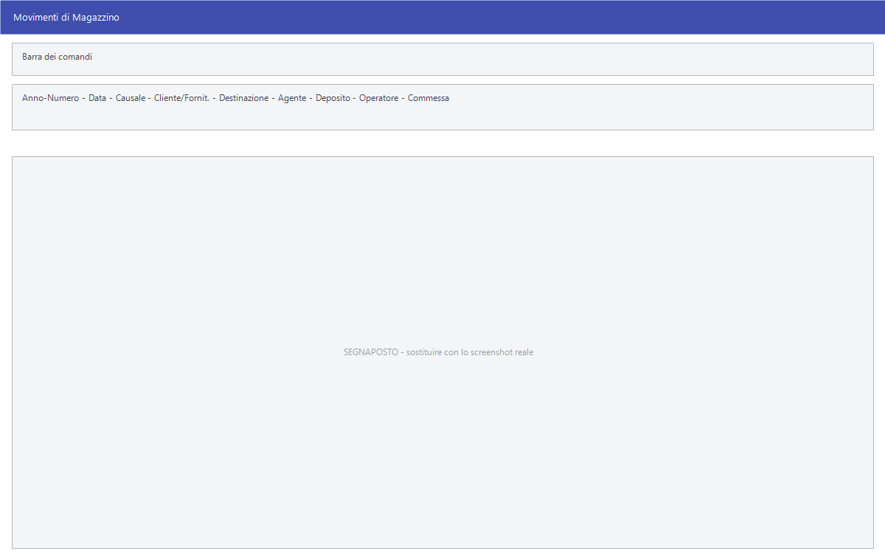

# Movimenti di magazzino

Non tutto quello che muove il magazzino passa da un documento: le rettifiche di
inventario, i trasferimenti fra depositi, i cali, gli autoconsumi si registrano
direttamente qui.

!!! info "In sintesi"

    - **Percorso:** Menu ▸ Magazzino ▸ Inserimento Movimenti *(oppure* Modifica Movimenti*)*
    - **Scorciatoia:** ++f2++ salva, ++f5++ cerca
    - **Permessi richiesti:** nessun profilo predefinito; **Inserimento Movimenti** e **Modifica Movimenti** si abilitano separatamente per ogni utente da [Archivi ▸ Utenti](../anagrafiche/utenti.md)

---

## A cosa serve

È il movimento di magazzino nella sua forma pura: una causale, un deposito, un
articolo, una quantità. La [causale](causali-magazzino.md) decide se la merce
entra o esce e quali contatori dell'articolo si muovono.

Serve per le rettifiche dopo l'inventario, per spostare merce da un
[deposito](depositi.md) all'altro, per registrare rotture e cali, e per tutto
quello che non nasce da una vendita o da un acquisto.

## Prerequisiti

Prima di usare questa maschera occorre:

- avere le [causali di magazzino](causali-magazzino.md) impostate: sono loro a
  governare il movimento;
- avere i [depositi](depositi.md) e gli
  [articoli](../anagrafiche/anagrafica-articoli.md).

## La maschera

In alto la testata del movimento, sotto le righe della merce.

## Campi

| Campo | Obbl. | Descrizione | Valori ammessi |
|---|:---:|---|---|
| **Anno-Numero** | | Identificativo del movimento. Lo assegna il programma. | numero |
| **Data** | ● | Data del movimento. | data |
| **Num. e Data Doc.** | | Gli estremi del documento che giustifica il movimento. | numero e data |
| **Numero Fattura**, **Data Fattura** | | Gli estremi della fattura, quando c'è. | numero e data |
| **Gruppo** | | Il gruppo del soggetto. | codice |
| **Causale** | ● | La [causale di magazzino](causali-magazzino.md): decide entrata o uscita e i contatori aggiornati. | codice |
| **Cliente/Fornit.** | | Il soggetto del movimento. L'etichetta cambia secondo la causale. | codice |
| **Destinazione** | | La destinazione merce. | codice |
| **Agente** | | L'[agente](../anagrafiche/anagrafica-agenti.md) del movimento. | codice |
| **Deposito** | ● | Il [deposito](depositi.md) movimentato. | codice |
| **Operatore** | | Chi ha registrato il movimento. | codice |
| **Commessa** | | La [commessa](../contabilita/commesse.md) a cui imputare. | codice |

{: .campi }

## Pulsanti e comandi

| Comando | Scorciatoia | Effetto |
|---|---|---|
| **F2 - Salva** | ++f2++ | Registra il movimento e aggiorna le esistenze. |
| **F3 - Prec.**, **F4 - Succ.** | ++f3++, ++f4++ | Passano al movimento precedente o successivo. |
| **F5 - Cerca** | ++f5++ | Apre l'elenco dei movimenti. |
| **F6 - Elimina** | ++f6++ | Cancella il movimento, previa conferma. |
| **F7 - Stampa** | ++f7++ | Stampa il movimento. |
| **Calcolatrice** | ++f12++ | Apre la calcolatrice. |
| **Consultazione** | ++f11++ | Apre la consultazione. |

## Come si fa

### Trasferire merce fra due depositi

1. Apri **Menu ▸ Magazzino ▸ Inserimento Movimenti**.
2. Indica la **Causale** di scarico per trasferimento e il **Deposito** di
   partenza.
3. Inserisci le righe della merce e salva.
4. Ripeti con la causale di carico e il deposito di arrivo.

### Registrare una rottura

1. Apri **Inserimento Movimenti**.
2. Indica la **Causale** che scarica per rottura e il **Deposito**.
3. Inserisci l'articolo e la quantità, poi salva.

## Controlli e messaggi

<!-- DA VERIFICARE: i messaggi di questa maschera. -->

| Messaggio | Causa | Cosa fare |
|---|---|---|
| *(nessun messaggio, solo un segnale acustico)* | Manca un campo obbligatorio. | Compila il campo su cui si è posizionato il cursore. |

## Note

!!! warning "La causale decide tutto"

    Una causale sbagliata muove i contatori nel verso sbagliato, e in Facile
    **non c'è un controllo di coerenza**: una causale di carico può sottrarre
    dall'esistenza, se è stata impostata così. Prima di usare una causale nuova,
    controlla come è fatta.

<!-- DA VERIFICARE: se esista una causale di trasferimento che muove entrambi i depositi in un colpo solo. -->

<!-- DA VERIFICARE: se il movimento generi una registrazione contabile. -->

## Vedi anche

- [Causali magazzino](causali-magazzino.md)
- [Depositi](depositi.md)
- [Carico merci](carico-merci.md)
- [Stampe dei movimenti di magazzino](stampe-movimenti-magazzino.md)
